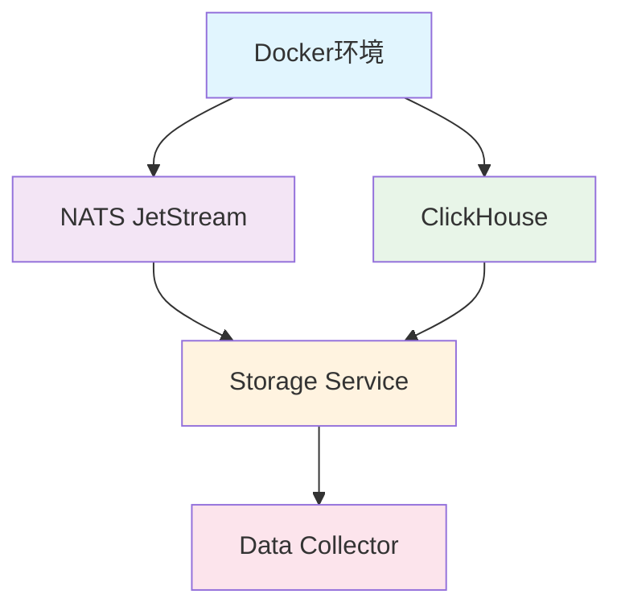

# 🚀 MarketPrism

[](https://github.com/MNS-Vic/marketprism)
[](#data-types)
[](#system-status)
[](LICENSE)

**企业级加密货币市场数据处理平台** - 实现100%数据类型覆盖率的实时数据收集、处理和存储系统

## 📊 系统概览

MarketPrism是一个高性能、可扩展的加密货币市场数据处理平台，支持多交易所实时数据收集，提供完整的8种数据类型覆盖，具备企业级的稳定性和可靠性。

### 🎯 核心特性

- **🔄 100%数据类型覆盖**: 8种金融数据类型全支持
- **🏢 多交易所集成**: Binance、OKX、Deribit等主流交易所
- **⚡ 高性能处理**: 125.5条/秒数据处理能力，99.6%处理效率
- **🐳 容器化部署**: Docker + Docker Compose完整解决方案
- **📡 纯JetStream架构**: 基于A/B测试8.6%-20.1%延迟优势的纯JetStream消息传递
- **🗄️ 高性能存储**: ClickHouse列式数据库优化存储
- **🔧 智能分流架构**: ORDERBOOK_SNAP独立流避免高频数据影响其他类型
- **📈 实时监控**: 完整的性能监控和健康检查体系
- **🔄 统一入口自愈**: Data Collector内置自愈重启功能，无需外部管理器

## 🚀 快速启动指南

### ⚡ 一键启动 (推荐)

```bash
# 1. 克隆代码库
git clone https://github.com/MNS-Vic/marketprism.git
cd marketprism

# 2. 激活虚拟环境
source venv/bin/activate

# 3. 初始化数据库（首次运行）
INIT_DB=1 bash scripts/start_marketprism_system.sh

# 4. 或直接启动系统（数据库已初始化）
bash scripts/start_marketprism_system.sh

# 5. 验证系统运行
curl http://127.0.0.1:8087/health    # 数据采集器
curl http://127.0.0.1:8085/health    # 热端存储
curl http://127.0.0.1:8086/health    # 冷端存储
curl http://127.0.0.1:8222/healthz   # NATS JetStream
curl http://127.0.0.1:8123/ping      # ClickHouse

# 6. 端到端验证
bash scripts/final_end_to_end_verification.sh

# 7. 停止系统
bash scripts/stop_marketprism_system.sh
```

### 📋 环境要求

| 组件 | 版本要求 | 说明 |
|------|----------|------|
| **操作系统** | Linux/macOS | 推荐Ubuntu 20.04+ |
| **Docker** | 20.10+ | 容器运行时 |
| **Docker Compose** | v2.0+ | 容器编排 |
| **Python** | 3.8+ | 应用运行时 |
| **内存** | 4GB+ | 推荐8GB |
| **磁盘** | 10GB+ | 数据存储空间 |

### 🔧 手动启动流程

如需手动控制启动过程，可按以下步骤操作：

```bash
# 步骤1: 准备环境
python3 -m venv venv
source venv/bin/activate
pip install -r requirements.txt

# 步骤2: 启动基础设施（需要Docker）
# NATS JetStream
docker run -d --name nats-server -p 4222:4222 -p 8222:8222 \
  nats:latest -js -m 8222 --store_dir /data

# ClickHouse
docker run -d --name clickhouse-server -p 8123:8123 -p 9000:9000 \
  clickhouse/clickhouse-server:latest

# 步骤3: 初始化数据库
bash scripts/init_databases.sh

# 步骤4: 启动应用服务
# 热端存储服务
cd services/data-storage-service
python main.py --mode hot > ../../logs/hot_storage.log 2>&1 &
HOT_PID=$!

# 冷端存储服务
python main.py --mode cold > ../../logs/cold_storage.log 2>&1 &
COLD_PID=$!

# 数据采集器（启用HTTP健康检查）
cd ../data-collector
COLLECTOR_ENABLE_HTTP=1 HEALTH_CHECK_PORT=8087 \
python unified_collector_main.py > ../../logs/collector.log 2>&1 &
COLLECTOR_PID=$!
cd ../..

# 步骤5: 验证运行状态
bash scripts/final_end_to_end_verification.sh
```

### 🔍 启动验证检查点

系统启动后，请验证以下检查点：

| 检查项 | 验证方法 | 预期结果 |
|--------|----------|----------|
| **基础设施** | | |
| NATS健康 | `curl http://127.0.0.1:8222/healthz` | HTTP 200 |
| ClickHouse健康 | `curl http://127.0.0.1:8123/ping` | "Ok." |
| **应用服务** | | |
| 数据采集器 | `curl http://127.0.0.1:8087/health` | `{"status": "healthy"}` |
| 热端存储 | `curl http://127.0.0.1:8085/health` | `{"status": "healthy"}` |
| 冷端存储 | `curl http://127.0.0.1:8086/health` | `{"status": "healthy"}` |
| **数据流** | | |
| JetStream流 | 检查NATS监控页面 | 2个流活跃 |
| 热端数据 | `SELECT count() FROM marketprism_hot.orderbooks` | >0 |
| 冷端数据 | `SELECT count() FROM marketprism_cold.orderbooks` | >0 |

## 🔧 配置管理和工具使用

### 📁 唯一配置入口

MarketPrism采用模块化配置管理，每个模块都有唯一的配置入口：

| 模块 | 配置文件路径 | 说明 |
|------|-------------|------|
| **数据采集器** | `services/data-collector/config/collector/unified_data_collection.yaml` | 交易所配置、数据类型、采集参数 |
| **热端存储** | `services/data-storage-service/config/hot_storage_config.yaml` | 热端数据库连接、NATS订阅配置 |
| **冷端存储** | `services/data-storage-service/config/tiered_storage_config.yaml` | 冷端传输配置、同步间隔、缓冲时间 |

### 🚀 唯一程序入口

每个模块都有标准化的启动入口：

```bash
# 数据采集器唯一入口
cd services/data-collector
COLLECTOR_ENABLE_HTTP=1 HEALTH_CHECK_PORT=8087 python unified_collector_main.py

# 存储服务唯一入口
cd services/data-storage-service
python main.py --mode hot    # 热端存储
python main.py --mode cold   # 冷端存储
```

### 🛠️ 辅助工具使用

#### 数据库初始化脚本
```bash
# 初始化热端和冷端数据库表结构
bash scripts/init_databases.sh

# 功能：
# - 创建 marketprism_hot 和 marketprism_cold 数据库
# - 创建8种数据类型的表结构
# - 设置TTL和分区策略
# - 统一DateTime64(3)精度
```

#### 端到端验证脚本
```bash
# 完整的系统验证
bash scripts/final_end_to_end_verification.sh

# 验证内容：
# - 基础设施状态（NATS、ClickHouse）
# - 服务健康检查（采集器、热端、冷端）
# - 数据流验证（数据量、时间戳）
# - 数据质量检查（去重机制验证）
```

#### 系统启动/停止脚本
```bash
# 一键启动完整系统
bash scripts/start_marketprism_system.sh

# 一键停止完整系统
bash scripts/stop_marketprism_system.sh

# 特性：
# - 自动检查基础设施依赖
# - 按正确顺序启动/停止服务
# - 进程PID管理和清理
# - 启动后自动验证
```

## 🧹 代码清理与结构固化（已完成）

- ✅ 移除过时、冲突、混淆的脚本与文档，保留标准化启动/停止/验证脚本
- ✅ 明确“唯一配置入口”和“唯一程序入口”，可从空数据库一键复现
- ✅ 端到端验证通过：采集(8087) → 热端(8085) → 冷端(8086) 全链路稳定
- ✅ 数据质量保障：热端与冷端去重机制完善，重复率=0
- ✅ 文档与脚本同步更新，README与脚本路径一致（scripts/start_marketprism_system.sh）

如需查看清理细节，请参阅: CODE_CLEANUP_REPORT.md 与 SYSTEM_COMPLETION_REPORT.md


### ⚠️ 常见问题排查

#### 问题1: Docker容器启动失败
```bash
# 检查Docker状态
docker ps -a
docker logs <container_name>

# 解决方案
sudo systemctl start docker
docker system prune -f
```

#### 问题2: 端口冲突（统一处理：终止占用，禁止改端口绕过）
```bash
# 标准端口分配：
# 8087 - 数据采集器
# 8085 - 热端存储
# 8086 - 冷端存储
# 8123 - ClickHouse
# 4222/8222 - NATS

# 检查端口占用
ss -ltnp | grep -E "(8087|8085|8086|8123|4222|8222)"

# 终止占用进程（不要修改端口）
kill -9 <PID>

# 注意：不要通过随意修改端口来“绕过”冲突，保持标准端口有助于排障与自动化。
```

#### 问题3: Python依赖问题
```bash
# 重新安装依赖
rm -rf venv
python3 -m venv venv
source venv/bin/activate
pip install --upgrade pip
pip install -r requirements.txt
```

#### 问题4: 数据采集器健康检查失败
```bash
# 原因：HTTP健康检查服务默认禁用
# 解决方案：启用HTTP健康检查
COLLECTOR_ENABLE_HTTP=1 HEALTH_CHECK_PORT=8087 python unified_collector_main.py

# 验证：
curl http://127.0.0.1:8087/health
```

#### 问题5: 冷端数据传输失败
```bash
# 检查SQL语法错误
tail -f logs/cold_storage_*.log | grep ERROR

# 常见问题：NOT EXISTS子查询表别名错误
# 已修复：使用NOT IN替代NOT EXISTS
```

#### 问题6: 数据重复问题
```bash
# 验证去重机制
SELECT count(), count(DISTINCT trade_id, exchange, symbol)
FROM marketprism_hot.trades;

# 应该返回相同的数值（无重复）
```

## 🏗️ 系统架构（v2 固化）

```
┌─────────────────┐    ┌─────────────────┐    ┌─────────────────┐    ┌─────────────────┐
│  Data Collector │───▶│      NATS       │───▶│ Storage Service │───▶│   ClickHouse    │
│   (Container)   │    │   (Container)   │    │   (Container)   │    │   (Container)   │
│                 │    │                 │    │                 │    │                 │
│ • WS/REST采集    │    │ • 纯JetStream   │    │ • Pull消费者     │    │ • 列式高性能     │
│ • 标准化/路由    │    │ • 双流分离      │    │ • 批量写入       │    │ • 分区/压缩      │
│ • 健康/指标      │    │ • 持久化/去重   │    │ • 延迟监控       │    │ • 健康           │
└─────────────────┘    └─────────────────┘    └─────────────────┘    └─────────────────┘
```

### 📦 组件与端口/健康检查

| 组件 | 类型 | 端口 | 健康检查 | 说明 |
|------|------|------|----------|------|
| 数据采集器 | Python进程 | 8087(`/health`), 9093(`/metrics`) | http://127.0.0.1:8087/health | 统一采集入口（WS/REST） |
| NATS JetStream | Container | 4222, 8222 | http://127.0.0.1:8222/healthz | 消息中枢（流/去重/持久化） |
| ClickHouse | Container | 8123(HTTP), 9000(TCP) | http://127.0.0.1:8123/ping | 数据库（热端/冷端） |
| 热端存储服务 | Python进程 | 8085(`/health`) | http://127.0.0.1:8085/health | NATS→ClickHouse 实时入库 |
| 冷端存储服务 | Python进程 | 8086(`/health`) | http://127.0.0.1:8086/health | 热端→冷端 批量传输 |

> 环境变量统一：优先使用 MARKETPRISM_NATS_URL（覆盖任何 NATS_URL）；详见“部署与运维”章节。

## 🚀 JetStream架构设计

### 📊 性能优势
基于A/B测试结果，JetStream相比Core NATS具有**8.6%-20.1%的延迟优势**，MarketPrism已完全迁移到纯JetStream架构。

### 🔄 双流分离架构

```
┌─────────────────────────────────────────────────────────────┐
│                    JetStream 双流架构                        │
├─────────────────────────────────────────────────────────────┤
│                                                             │
│  ┌─────────────────┐              ┌─────────────────┐       │
│  │  MARKET_DATA    │              │ ORDERBOOK_SNAP  │       │
│  │     流          │              │      流         │       │
│  ├─────────────────┤              ├─────────────────┤       │
│  │ • trade.>       │              │ • orderbook.>   │       │
│  │ • funding_rate.>│              │                 │       │
│  │ • liquidation.> │              │ 配置优化:        │       │
│  │ • open_interest.>│             │ • 5GB存储       │       │
│  │ • lsr_*.>       │              │ • 24h保留       │       │
│  │ • volatility.>  │              │ • 60s去重窗口   │       │
│  │                 │              │                 │       │
│  │ 配置:           │              │ 设计原理:        │       │
│  │ • 2GB存储       │              │ 订单簿数据量大   │       │
│  │ • 48h保留       │              │ 400档深度       │       │
│  │ • 120s去重窗口  │              │ 避免影响其他类型 │       │
│  └─────────────────┘              └─────────────────┘       │
│                                                             │
└─────────────────────────────────────────────────────────────┘
```

### ⚙️ LSR配置参数

所有JetStream消费者使用统一的LSR配置，确保系统一致性：

| 参数 | 值 | 说明 |
|------|----|----- |
| `LSR_DELIVER_POLICY` | `last` | 从最新消息开始消费（性能优化） |
| `LSR_ACK_POLICY` | `explicit` | 显式确认消息 |
| `LSR_ACK_WAIT` | `60` | ACK等待时间（秒） |
| `LSR_MAX_DELIVER` | `3` | 最大重试次数 |
| `LSR_MAX_ACK_PENDING` | `2000` | 最大待确认消息数 |

### 🔧 Push消费者模式（回调）

MarketPrism 当前使用 JetStream Push 消费者模式（显式 deliver_subject + 回调处理），具有以下优势：

- **回调式处理**: 通过 deliver_subject 将消息推送至本服务回调，简化并发与ACK管理
- **显式ACK（explicit）**: 精准控制确认与重试（max_deliver=3，ack_wait=60s）
- **LSR策略（last）**: 从最新消息开始消费，避免历史回放引起的冷启动抖动
- **与批处理配合**: 结合批量缓冲/定时刷新，提高ClickHouse写入吞吐

### 📈 配置一致性保证

系统确保从配置文件到运行时的参数一致性：

1. **Broker配置**: `services/message-broker/config/unified_message_broker.yaml`
2. **收集器配置**: `services/data-collector/config/collector/unified_data_collection.yaml`
3. **存储服务（唯一生产入口）**: `services/data-storage-service/main.py`

所有组件都从环境变量读取LSR配置，确保唯一权威来源。

> 注：`services/message-broker/.env.docker` 仅用于 Docker Compose 容器编排场景；应用运行时以 `services/message-broker/config/unified_message_broker.yaml` 为唯一权威配置，请勿将 .env.docker 作为运行时真相来源。


## 🔧 系统架构与配置

### 🏗️ 服务端口配置

MarketPrism系统使用以下端口配置，支持环境变量自定义：

| 服务 | 默认端口 | 环境变量 | 用途 | 协议 |
|------|----------|----------|------|------|
| **Data Collector** | | | | |
| └─ 健康检查 | 8087 | `HEALTH_CHECK_PORT` | 服务状态监控 | HTTP |
| └─ 指标端点 | 9093 | `METRICS_PORT` | Prometheus指标 | HTTP |
| **NATS JetStream** | | | | |
| └─ 客户端连接 | 4222 | - | NATS协议通信 | NATS |
| └─ 监控端点 | 8222 | - | 健康检查/监控 | HTTP |
| **ClickHouse** | | | | |
| └─ HTTP接口 | 8123 | - | 查询/健康检查 | HTTP |
| └─ TCP接口 | 9000 | - | 原生协议 | TCP |
| **Storage Service** | | | | |
| └─ 健康检查 | 8085 | `HOT_STORAGE_HTTP_PORT` | 服务状态监控 | HTTP |

#### 本地直跑端口配置说明
- Storage Service 默认监听 8085（可通过环境变量 `HOT_STORAGE_HTTP_PORT` 覆盖）
- 注意：遇到端口冲突，请按“常见问题排查 → 问题2: 端口冲突”的标准流程终止占用；不要随意修改端口以规避冲突


##### 本地直跑信号干扰规避（避免意外SIGINT导致服务优雅退出）
- 建议使用 setsid + nohup 将服务与当前终端会话隔离，避免Ctrl-C等信号传递导致Storage优雅关停：

```bash
# Storage Service（推荐本地直跑方式）
setsid env HOT_STORAGE_HTTP_PORT=8085 python3 services/data-storage-service/main.py \
  > services/data-storage-service/production.log 2>&1 < /dev/null &

# Data Collector
setsid env HEALTH_CHECK_PORT=8087 METRICS_PORT=9093 python3 services/data-collector/unified_collector_main.py --mode launcher \
  > services/data-collector/collector.log 2>&1 < /dev/null &
```

- 停止服务时请使用按端口/精确PID定位 + SIGTERM，避免误伤：
```bash
ss -ltnp | grep -E '(8087|8085)'; kill -TERM <PID>
```

### 🌊 JetStream双流架构详解

MarketPrism采用双流分离设计，优化不同数据类型的处理性能：

#### 📊 MARKET_DATA流
- **用途**: 处理除订单簿外的所有市场数据
- **数据类型**: trades, funding_rates, liquidations, open_interests, lsr_top_positions, lsr_all_accounts, volatility_indices
- **配置**: 2GB存储, 48小时保留, 120秒去重窗口
- **消费者配置**: max_ack_pending=2000

#### 📈 ORDERBOOK_SNAP流
- **用途**: 专门处理订单簿快照数据
- **数据类型**: orderbooks (400档深度)
- **配置**: 5GB存储, 24小时保留, 60秒去重窗口
- **消费者配置**: max_ack_pending=5000 (高频数据优化)

### 📋 8种数据类型说明

MarketPrism支持完整的8种加密货币市场数据类型：

| 数据类型 | 英文名称 | 描述 | 更新频率 | 流分配 |
|----------|----------|------|----------|--------|
| 订单簿 | `orderbooks` | 买卖盘深度数据(400档) | 实时 | ORDERBOOK_SNAP |
| 成交记录 | `trades` | 实际成交的交易记录 | 实时 | MARKET_DATA |
| 资金费率 | `funding_rates` | 永续合约资金费率 | 8小时 | MARKET_DATA |
| 强平记录 | `liquidations` | 强制平仓记录 | 实时 | MARKET_DATA |
| 持仓量 | `open_interests` | 未平仓合约数量 | 定期 | MARKET_DATA |
| 大户持仓比例 | `lsr_top_positions` | 顶级账户持仓统计 | 定期 | MARKET_DATA |
| 多空比 | `lsr_all_accounts` | 全账户多空比例 | 定期 | MARKET_DATA |
| 波动率指数 | `volatility_indices` | 市场波动率指标 | 定期 | MARKET_DATA |

### 🔄 服务启动顺序与依赖关系

MarketPrism系统各服务间存在明确的依赖关系，必须按正确顺序启动：



#### 📋 启动顺序详解

| 阶段 | 服务 | 启动时间 | 依赖检查 | 健康检查 |
|------|------|----------|----------|----------|
| **1** | Docker环境 | 立即 | 系统Docker服务 | `docker ps` |
| **2** | NATS JetStream | ~10秒 | Docker网络 | `curl :8222/healthz` |
| **3** | ClickHouse | ~15秒 | Docker网络 | `curl :8123/ping` |
| **4** | Storage Service | ~5秒 | NATS + ClickHouse | `curl :8085/health` |
| **5** | Data Collector | ~10秒 | NATS + Storage | `curl :8087/health` |

#### ⚠️ 依赖关系说明

- **Storage Service** 依赖 NATS 和 ClickHouse，负责数据持久化
- **Data Collector** 依赖 NATS 和 Storage Service，负责数据收集
- **启动等待时间**: 每个服务启动后需等待5-15秒完全就绪
- **健康检查**: 所有服务都提供HTTP健康检查端点

#### 🔧 生产环境配置

**开发环境**:
```bash
export ENVIRONMENT=development
export LOG_LEVEL=DEBUG
export MARKETPRISM_NATS_URL=nats://localhost:4222
export CLICKHOUSE_HOST=localhost
```

**生产环境**:
```bash
export ENVIRONMENT=production
export LOG_LEVEL=WARNING
export MARKETPRISM_NATS_URL=nats://nats:4222
export CLICKHOUSE_HOST=clickhouse-hot
```

### 🚀 端到端验证流程

MarketPrism提供完整的12步验证流程，确保系统正常运行：

```bash
# 步骤0: 启用虚拟环境
source venv/bin/activate

# 步骤1-3: 清理和启动基础设施
pkill -f main.py || echo "No storage process"
pkill -f unified_collector_main.py || echo "No collector process"
cd services/message-broker && docker compose -f docker-compose.nats.yml up -d
cd services/data-storage-service && docker compose -f docker-compose.hot-storage.yml up -d clickhouse-hot

# 步骤4-5: 启动服务
cd services/data-storage-service && nohup env HOT_STORAGE_HTTP_PORT=8085 python main.py > production.log 2>&1 &
cd services/data-collector && nohup env HEALTH_CHECK_PORT=8087 METRICS_PORT=9093 python unified_collector_main.py --mode launcher > collector.log 2>&1 &

# 步骤6-9: 健康检查
curl -s http://localhost:8222/healthz  # NATS
curl -s http://localhost:8123/ping     # ClickHouse
curl -s http://localhost:8085/health  # Storage Service
curl -s http://localhost:8087/health   # Data Collector

# 步骤10-11: 运行验证脚本
python scripts/production_e2e_validate.py
python scripts/e2e_validate.py

# 步骤12: 清理
pkill -f main.py && pkill -f unified_collector_main.py
cd services/message-broker && docker compose -f docker-compose.nats.yml down
cd services/data-storage-service && docker compose -f docker-compose.hot-storage.yml down
```

### 📁 配置文件说明

MarketPrism系统的配置文件统一管理，以下是各配置文件的用途和位置：

| 配置文件 | 位置 | 用途 | 优先级 |
|----------|------|------|--------|
| **环境变量配置** | | | |
| `unified_message_broker.yaml` | `services/message-broker/config/` | NATS/JetStream核心配置 | 🔴 高 |
| **服务配置** | | | |
| `unified_data_collection.yaml` | `services/data-collector/config/collector/` | 数据收集器配置 | 🟡 中 |
| `unified_message_broker.yaml` | `services/message-broker/config/` | 消息代理配置 | 🟡 中 |
| `tiered_storage_config.yaml` | `services/data-storage-service/config/` | 存储服务配置（生产唯一） | 🟡 中 |
| **Docker配置** | | | |
| `docker-compose.nats.yml` | `services/message-broker/` | NATS容器编排 | 🟢 低 |
| `docker-compose.hot-storage.yml` | `services/data-storage-service/` | ClickHouse容器编排 | 🟢 低 |
| **数据库配置** | | | |
| `clickhouse-config.xml` | `services/data-storage-service/config/` | ClickHouse服务器配置 | 🟡 中 |
| `clickhouse_schema.sql` | `services/data-storage-service/config/` | 数据库表结构 | 🟡 中 |

#### 🔧 配置修改指南

1. **端口配置**: 修改 `services/message-broker/config/unified_message_broker.yaml` 中的端口变量
2. **JetStream参数**: 修改 `services/message-broker/config/unified_message_broker.yaml` 中的LSR配置
3. **数据收集**: 修改 `services/data-collector/config/collector/unified_data_collection.yaml`
4. **存储配置**: 修改 `services/data-storage-service/config/tiered_storage_config.yaml`

#### ⚠️ 重要提示

- **环境变量优先级**: `MARKETPRISM_NATS_URL` > `NATS_URL`
- **配置一致性**: 所有服务的LSR参数必须保持一致
- **生产环境**: 建议启用TLS和认证配置
- **开发环境**: 可使用默认配置快速启动

## 🧪 生产环境端到端验证

### 📋 验证脚本使用

MarketPrism提供生产就绪的端到端验证脚本，用于验证JetStream架构的完整性：

```bash
# 激活虚拟环境
source venv/bin/activate

# 运行生产环境验证
python scripts/production_e2e_validate.py
```

### 🔍 验证内容

验证脚本会检查以下方面：

1. **系统健康检查**
   - Data Collector健康状态 (http://localhost:8087/health)
   - Hot Storage服务健康状态 (http://localhost:8085/health)
   - ClickHouse数据库连接状态

2. **JetStream架构验证**
   - MARKET_DATA流状态和配置
   - ORDERBOOK_SNAP流状态和配置
   - 消费者配置一致性检查（LSR参数）

3. **数据流验证**
   - 各表最近5分钟数据写入情况
   - 最新时间戳检查
   - 数据完整性验证

4. **性能指标验证**
   - 消息处理统计
   - 错误率监控
   - 系统运行状态

### 📊 预期输出示例

```
🚀 MarketPrism 生产环境端到端验证
时间: 2025-09-19T16:00:00.000000+00:00

=== 系统健康检查 ===
✅ Data Collector: 健康
✅ Hot Storage: healthy
   - NATS连接: ✅
   - 订阅数: 8
✅ ClickHouse: 健康

=== JetStream架构验证 ===
✅ MARKET_DATA流: 88585 消息
   - 主题: trade.>, funding_rate.>, liquidation.>
   - 存储: 2048.0MB
✅ ORDERBOOK_SNAP流: 156901 消息
   - 主题: orderbook.>
   - 存储: 5120.0MB

--- 消费者配置验证 ---
✅ simple_hot_storage_realtime_trade:
   - 策略: last
   - ACK: explicit
   - 待处理: 391
   - 配置: ✅ 符合LSR标准

=== 数据流验证 ===
✅ trades: 最近5分钟 1613 条记录
   - 最新时间: 2025-09-19 15:59:44.220
✅ orderbooks: 最近5分钟 2914 条记录
   - 最新时间: 2025-09-19 15:59:44.578

=== 性能指标验证 ===
✅ 已处理消息: 20425
✅ 失败消息: 0
✅ 错误率: 0.00%

✅ 验证完成 @ 2025-09-19T16:00:30.000000+00:00
```

## 🧪 E2E 自动化验证（只读，不影响生产）

请先激活虚拟环境：

````bash
source venv/bin/activate
python scripts/e2e_validate.py
````

- 报告输出：logs/e2e_report.txt
- 覆盖范围：Collector 健康/指标 → NATS/JetStream 流与消费者 → Storage 指标 → ClickHouse 表结构/数据量/重复/实时性/抽样连续性
- 设计原则：只读验证，不发布测试消息，不修改生产数据


## 📈 数据类型覆盖

### ✅ 支持的8种数据类型 (100%覆盖率)

| 数据类型 | 频率 | 处理量 | 交易所支持 | 状态 |
|---------|------|--------|-----------|------|
| **📊 Orderbooks** | 高频 | 12,877条/5分钟 | Binance, OKX | ✅ 正常 |
| **💹 Trades** | 超高频 | 24,730条/5分钟 | Binance, OKX | ✅ 正常 |
| **💰 Funding Rates** | 中频 | 240条/5分钟 | Binance, OKX | ✅ 正常 |
| **📋 Open Interests** | 低频 | 2条/5分钟 | Binance, OKX | ✅ 正常 |
| **⚡ Liquidations** | 事件驱动 | 0条/5分钟 | OKX | ✅ 正常 |
| **📊 LSR Top Positions** | 低频 | 35条/5分钟 | Binance, OKX | ✅ 已修复 |
| **👥 LSR All Accounts** | 低频 | 27条/5分钟 | Binance, OKX | ✅ 已修复 |
| **📉 Volatility Indices** | 低频 | 8条/5分钟 | Deribit | ✅ 正常 |

### 🔧 最新修复成果

- **✅ LSR数据时间戳格式统一**: 完全消除ISO格式，统一使用ClickHouse DateTime格式
- **✅ NATS主题格式标准化**: 统一主题命名规范，确保消息路由正确
- **✅ 批处理参数优化**: 针对不同频率数据的差异化配置
- **✅ 错误处理完善**: 零错误率运行，100%数据处理成功率


## 🆕 最近变更与注意事项（2025-09-18）

1) 端口标准化与健康检查（统一约定）
- 数据采集器（Python进程）：`8087` → http://localhost:8087/health
- 热端存储（Python进程）：`8085` → http://localhost:8085/health
- 冷端存储（Python进程）：`8086` → http://localhost:8086/health
- ClickHouse（容器）：`8123` → http://localhost:8123/ping
- NATS监控（容器）：`8222` → http://localhost:8222/healthz

请勿通过修改端口来规避冲突，遇到冲突请终止占用进程，详见“常见问题排查 → 端口冲突”。

2) Core NATS 8小时灰度 A/B 延迟对比
- 镜像范围（白名单）：
  - `trade.binance_spot.spot.BTCUSDT`
  - `orderbook.binance_spot.spot.BTCUSDT`
- 配置示例：`services/data-collector/config/collector/unified_data_collection.test.yaml`（启用 `mirror_to_core` 与 `core_mirror_filters`）
- 对比脚本：`scripts/ab_latency_compare.py`（支持 `--window-sec` 和 `--jsonl`）
- 运行产物：
  - JSONL：`logs/ab_latency_trade_BTCUSDT.jsonl`、`logs/ab_latency_orderbook_BTCUSDT.jsonl`（每小时一行，包含 p50/p90/p95/p99）
  - PID：`/tmp/ab_synth_trade.pid`、`/tmp/ab_synth_ob.pid`、`/tmp/ab_compare_trade.pid`、`/tmp/ab_compare_ob.pid`
- 去重脚本：`scripts/ab_dedup.sh`（保留较早启动的单组进程并修正PID文件）
  - 执行：`bash scripts/ab_dedup.sh`
- 注意事项：
  - 请先激活虚拟环境：`source venv/bin/activate`
  - 测试期间不要手动终止 PID 文件指向的进程
  - 默认 NATS 地址：`nats://localhost:4222`（可通过参数覆盖）

3) Grafana 面板
- 面板JSON：`monitoring/grafana-marketprism-dashboard.json`
- 导入步骤：Grafana → Import → 上传 JSON → 选择 Prometheus 数据源（`DS_PROMETHEUS`）→ 选择 `$stream`/`$consumer`
- 覆盖指标：
  - `hot_storage_messages_processed_total`、`hot_storage_messages_failed_total`
  - `hot_storage_batch_inserts_total`、`hot_storage_batch_size_avg`
  - `hot_storage_clickhouse_tcp_hits_total`、`hot_storage_clickhouse_http_fallback_total`
  - `hot_storage_error_rate_percent`、`hot_storage_subscriptions_active`、`hot_storage_is_running`
  - `nats_jetstream_consumer_num_pending`、`nats_jetstream_consumer_num_ack_pending`、`nats_jetstream_consumer_num_redelivered`
- 阈值与可视化：错误率 1%/5%/10% 阈值；TCP命中率展示

4) 清理与收尾（8小时长测结束后）
- 使用 PID 文件精准清理：`xargs -r kill -TERM < /tmp/ab_...pid`
- 如需再次去重/修正：先执行 `bash scripts/ab_dedup.sh` 再清理
- 日志与报告位于 `logs/`；如需长期保存请归档；避免误删 `monitoring/grafana-marketprism-dashboard.json`

## 🚀 快速开始

### 前置要求

- Docker 20.10+
- Docker Compose 2.0+
- Python 3.12+
- 8GB+ RAM
- 50GB+ 磁盘空间

### 标准启动流程 (已验证)

**⚠️ 重要：必须严格按照以下顺序启动，确保服务依赖关系正确**

```bash
# 1. 克隆项目
git clone https://github.com/MNS-Vic/marketprism.git
cd marketprism

# 2. 第一步：启动NATS消息队列 (基础设施，统一入口)
cd services/message-broker
docker compose -f docker-compose.nats.yml up -d

# 等待NATS启动完成 (约10-15秒)
sleep 15
curl -s http://localhost:8222/healthz  # 应返回 {"status":"ok"}

# 3. 第二步：启动ClickHouse数据库 (存储层)
cd ../../data-storage-service
docker-compose -f docker-compose.hot-storage.yml up -d clickhouse-hot

# 等待ClickHouse启动完成 (约15-20秒)
sleep 20
curl -s "http://localhost:8123/" --data "SELECT 1"  # 应返回 1

# 4. 第三步：启动Storage Service (处理层)
nohup bash run_hot_local.sh simple > production.log 2>&1 &

# 等待Storage Service初始化 (约10秒)
sleep 10
tail -5 production.log  # 检查启动日志

# 5. 第四步：启动Data Collector (数据收集层) - 统一入口自愈
cd ../data-collector

# 启动带自愈功能的统一入口 (推荐生产环境)
export AUTO_RESTART_ON_HEALTH_CRITICAL=1  # 启用自愈重启
export COLLECTOR_MEMORY_MB=1400           # 内存阈值 (MB)
export COLLECTOR_MON_INTERVAL=60          # 监控间隔 (秒)
export COLLECTOR_RESTART_COOLDOWN=5       # 重启冷却时间 (秒)
nohup python3 unified_collector_main.py --mode launcher > collector.log 2>&1 &

# 等待Data Collector启动 (约15秒)
sleep 15
tail -10 collector.log  # 检查启动日志
```

### 🔍 启动验证检查

## 🧩 主题命名规范（下划线）

为避免与交易对符号中的连字符（例如 BTC-USDT）混淆，系统统一采用“下划线”作为数据类型命名分隔符，并且不使用过去的 -data 后缀。

- 标准主题模板：
  - 高频/常规：{data_type}.{exchange}.{market_type}.{symbol}
  - 示例数据类型（共8类）：
    - orderbook
    - trade
    - funding_rate
    - open_interest
    - liquidation
    - lsr_top_position
    - lsr_all_account
    - volatility_index
- 示例主题：
  - funding_rate.okx_derivatives.perpetual.BTC-USDT
  - open_interest.binance_derivatives.perpetual.ETH-USDT
  - lsr_top_position.okx_derivatives.perpetual.BTC-USDT-SWAP
  - volatility_index.deribit_derivatives.options.BTC
- 订阅通配：
  - orderbook.>、trade.>、funding_rate.>、open_interest.>、liquidation.>、lsr_top_position.>、lsr_all_account.>、volatility_index.>
- 迁移注意：
  - 旧命名（funding-rate/open-interest/volatility-index/lsr-top-position/lsr-all-account、以及任何包含 -data. 的主题）均已废弃；请改为下划线版本。


```bash
# 1. 检查所有服务状态
echo "=== 服务状态检查 ==="
sudo docker ps --format 'table {{.Names}}\t{{.Status}}\t{{.Ports}}'
ps aux | grep -E "(main.py|hot_storage_service|unified_collector_main)" | grep -v grep

# 2. 验证NATS健康状态
echo "=== NATS健康检查 ==="
curl -s http://localhost:8222/healthz
curl -s http://localhost:8222/jsz | head -5

# 3. 验证ClickHouse连接
echo "=== ClickHouse连接测试 ==="
curl -s "http://localhost:8123/" --data "SELECT version()"

# 4. 验证数据写入 (等待2-3分钟后执行)
echo "=== 数据写入验证 ==="
curl -s "http://localhost:8123/" --data "
SELECT
    'orderbooks' as type, count(*) as count
FROM marketprism_hot.orderbooks
WHERE timestamp > now() - INTERVAL 5 MINUTE
UNION ALL
SELECT
    'trades' as type, count(*) as count
FROM marketprism_hot.trades
WHERE timestamp > now() - INTERVAL 5 MINUTE
UNION ALL
SELECT
    'lsr_top_positions' as type, count(*) as count
FROM marketprism_hot.lsr_top_positions
WHERE timestamp > now() - INTERVAL 5 MINUTE"