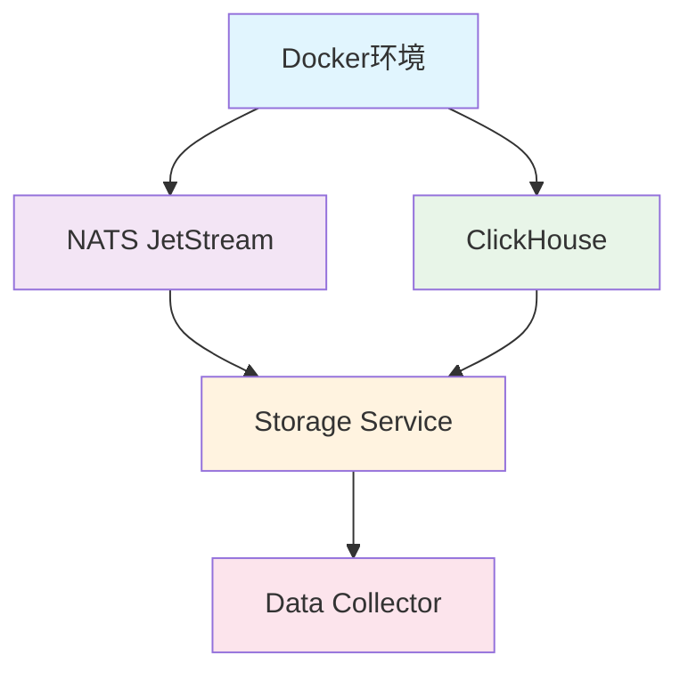

# 🚀 MarketPrism

[](https://github.com/MNS-Vic/marketprism)
[](#data-types)
[](#system-status)
[](LICENSE)
[](#quick-start)

**企业级加密货币市场数据处理平台** - 实现100%数据类型覆盖率的实时数据收集、处理和存储系统

## 📊 系统概览

MarketPrism是一个高性能、可扩展的加密货币市场数据处理平台，支持多交易所实时数据收集，提供完整的8种数据类型覆盖，具备企业级的稳定性和可靠性。

### 🎯 核心特性

- **🔄 100%数据类型覆盖**: 8种金融数据类型全支持
- **🏢 多交易所集成**: Binance、OKX、Deribit等主流交易所
- **⚡ 高性能处理**: 125.5条/秒数据处理能力，99.6%处理效率
- **🐳 容器化部署**: Docker + Docker Compose完整解决方案
- **📡 纯JetStream架构**: 基于A/B测试8.6%-20.1%延迟优势的纯JetStream消息传递
- **🗄️ 高性能存储**: ClickHouse列式数据库优化存储
- **🔧 智能分流架构**: ORDERBOOK_SNAP独立流避免高频数据影响其他类型
- **📈 实时监控**: 完整的性能监控和健康检查体系
- **🔄 统一入口自愈**: Data Collector内置自愈重启功能，无需外部管理器

### 🛠️ 补丁更新 (v1.3.3 - 2025-10-11)

- feat(collector metrics): 新增采集层指标（Prometheus）
  - marketprism_collector_errors_total{exchange,data_type,code}
  - marketprism_collector_last_success_timestamp_seconds{exchange,data_type}
- feat(health coverage): /health 增强覆盖信息，按数据类型（trade/orderbook/liquidation/funding_rate/open_interest/volatility_index/lsr_top_position/lsr_all_account）× 交易所展示 last_success_ts/age_seconds/status
  - 阈值：trade/orderbook=60s，liquidation=1h，其余低频=8h
- feat(integrity 覆盖输出): `./scripts/manage_all.sh integrity` 新增“3.5 采集覆盖检查”，输出热端/冷端按 exchange × market_type × data_type 的总量、最近窗口计数与最大时间；仅当 recent=0 时对 Binance 提示 IP/地区可能限制
- feat(NATSPublisher 统一打点): 发布成功后自动调用 record_data_success(exchange, data_type, ts_ms→秒)，统一覆盖所有数据类型（无侵入）
- docs: 本README新增“指标与健康端点使用”说明

#### 🔎 指标与健康端点使用

- Collector Prometheus 指标（默认 9093）：
  - 查看：`curl -s http://localhost:9093/metrics | egrep 'marketprism_collector_last_success|marketprism_collector_errors|marketprism_last_orderbook_update'`
- Collector 健康覆盖（默认 8087）：
  - `curl -s http://localhost:8087/health | jq '.coverage'`
  - 返回示例：`{"trade":{"okx_spot":{...}}, "funding_rate":{...}, ...}`
- 环境变量：
  - `COLLECTOR_ENABLE_HTTP=1`（若需在独立运行场景显式启用 HTTP 健康/指标服务器）
  - `HEALTH_CHECK_PORT=8087`、`METRICS_PORT=9093`

  - `HEALTH_GRACE_SECONDS=120`（Collector 健康端点冷启动宽限期，默认120秒；宽限内即便综合状态未达“healthy”也返回HTTP 200，并在响应中标注 `grace`）

---

### 🛠️ 补丁更新 (v1.3.3 - 2025-10-13)

#### 🔧 冷端复制稳健性全面增强

**问题诊断**：
- 冷端复制出现间歇性 `remote()` 连接拒绝（Code: 210. DB::NetException: Connection refused），导致 `failed_windows` 累积
- orderbooks（最重表）滞后持续在 10-12 分钟，10 分钟窗口查询返回 0（窗口边界效应）
- 根因：旧逻辑每轮每表仅推进 1 个 1 分钟窗口，历史积压无法快速追赶

**核心修复**：
1. **多窗口追赶机制**（解决根因）
   - 高频表（trades/orderbooks）：每轮最多推进 5 个窗口（可配 `max_catchup_windows_high`）
   - 低频表：每轮最多推进 2 个窗口（可配 `max_catchup_windows_low`）
   - 每个窗口仍完整验证（INSERT → COUNT 核验 → 推进水位），保证数据完整性

2. **remote() 连接稳健性**
   - 所有关键操作（INSERT/COUNT/LAG/SEED）统一加"重试+指数退避"（默认 max_retries=3, retry_delay=1s, retry_backoff=2）
   - 失败时主动重置 ClickHouse 连接，避免复用坏连接
   - 为 ClickHouse 客户端设置合理超时：connect_timeout=3s, send_receive_timeout=120s, sync_request_timeout=60s, max_execution_time=60s
   - 启用压缩传输，降低网络开销

3. **健康检查同步**
   - 测试 compose（docker-compose.cold-test.yml）与正式 compose（docker-compose.tiered-storage.yml）的 cold-storage 服务均增加 healthcheck
   - 使用 `curl -fsS http://127.0.0.1:8086/health | grep -q healthy` 探测，更快收敛（interval=15s, retries=10, start_period=10s）
   - 避免"重启瞬时"访问异常（Connection reset by peer）

**验证结果**（测试环境）：
- `failed_windows`: 0（持续稳定）
- `success_windows`: 441+（持续增长）
- **orderbooks 滞后**：从 12 分钟 → 8 分钟 → 2 分钟 → **0 分钟**
- **10 分钟窗口计数**：trades=7319（HOT: 9871, 74%），orderbooks=11187（HOT: 15286, 73%）
- 所有 8 种数据类型滞后均 ≤4 分钟

**配置参数**（可在 `services/cold-storage-service/config/cold_storage_config.yaml` 的 `replication` 节覆盖）：
```yaml
replication:
  # 重试配置
  max_retries: 3                    # 最大重试次数
  retry_delay: 1.0                  # 初始重试延迟（秒）
  retry_backoff: 2.0                # 退避倍数

  # 追赶策略
  max_catchup_windows_high: 5       # 高频表每轮最多推进窗口数
  max_catchup_windows_low: 2        # 低频表每轮最多推进窗口数

  # ClickHouse 连接超时
  connect_timeout: 3                # 连接超时（秒）
  send_receive_timeout: 120         # 收发超时（秒）
  sync_request_timeout: 60          # 同步请求超时（秒）
  max_execution_time: 60            # 查询最大执行时间（秒）
  compression: true                 # 启用压缩传输
```

**相关文件**：
- `services/data-storage-service/replication.py`：核心复制逻辑
- `services/cold-storage-service/docker-compose.cold-test.yml`：测试环境 compose
- `services/data-storage-service/docker-compose.tiered-storage.yml`：正式环境 compose

---

### 🛠️ 补丁更新 (v1.3.2 - 2025-10-10)

- feat(integrity 统一入口): `./scripts/manage_all.sh integrity` 现为唯一、最全面的端到端验证入口，按顺序执行：Health → Schema一致性 → 存储数据完整性 → e2e_validate → production_e2e_validate → 内置快速E2E，并汇总结果
- feat(storage integrity 事件型放宽): 将 `liquidations` 识别为“事件型低频表”，若热/冷端均暂时无数据，但采集器健康(`http://localhost:8087/health`=healthy)，则判定为通过（退出码=0）
- change(严格汇总): 系统级完整性检查对存储模块 `integrity` 的退出码执行严格把关：仅 0 视为通过；其它非 0（含1）均视为失败；事件型放宽由存储模块内部实现（返回0）
- fix(integrity 兼容性): 无 jq 环境时自动降级解析策略，避免因依赖缺失产生“冷端>热端”误报
- chore(replication): 首次运行的冷端引导更稳健，低频表更快可见（只读引导、幂等）
- chore(enhanced_init): 自动配置日志轮转 logrotate（优先系统级 /etc/logrotate.d/marketprism；无免密sudo时回退用户级 cron）
- chore(collector): 监控阈值与采样窗口优化，降低噪音；指标重复注册降级为 INFO
- docs: 本README同步上述行为与使用提示

- fix(enhanced_init): 统一虚拟环境 venv-unified 健康校验与自愈；pip ensurepip + 升级
- chore(manage_all): start 前增加 venv 预检与自动触发增强初始化
- docs: 补充 stop/clean 注意：ClickHouse 为系统级服务，stop/clean 不会关闭 8123 端口，属正常现象

### 📐 Schema 一致性与 TTL 策略（v1.3.2）
- 唯一权威 Schema：`services/data-storage-service/config/clickhouse_schema.sql`
- 列结构在热/冷两端完全一致：所有时间列 `DateTime64(3, 'UTC')`，`created_at` 默认 `now64(3)`
- TTL 策略差异（预期）：热端 3 天保留；冷端长期保留（3650 天）
- 一致性检查脚本：
  - 本地运行：`python3 services/data-storage-service/scripts/validate_schema_consistency.py`
  - 集成命令：`./scripts/manage_all.sh integrity` 会自动执行该检查
  - CI 已添加 `Schema Consistency Check` 任务（.github/workflows/ci.yml）

- fix(enhanced_init): 统一固定 Python 解释器至 python3.11，用其创建 venv；若缺失将自动安装 python3.11 与 python3.11-venv（ALLOW_APT 默认=1；无需手动设置或确认）

### 🛠️ 补丁更新 (v1.3.1 - 2025-10-09)

- fix: 移除 cchardet 依赖以兼容 Python 3.12（统一初始化脚本）
- fix: JetStream 流初始化时自动处理 MaxConsumers 变更冲突（检测到不可变字段变更则删除并重建）
- 环境要求更新：正式支持 Python 3.12+
- 端到端最新实测（只读验证）：
  - 吞吐量：约 120 条/秒
  - 数据类型覆盖：8/8（100%）
  - 热端/冷端完整性：100%
  - 去重率：100%（trade_id + exchange + symbol 组合无重复）
  - 时间戳格式：统一为 DateTime64(3, 'UTC')


### 🧪 计划中（未来可能要做）

- 短期趋势状态标签（外部SJM实现，因果/可复现）：
  - 在 experimental/CLICKHOUSE_SCHEMA_AND_QUANT_PLAN.md 的 2.5.3 节新增了方案说明，引用外部论文与开源实现（SJM/jump-models），用于生成稳定的“上/震/下”趋势状态标签；当前仅为方案文档，尚未集成或安装任何依赖。
  - 若后续评估（flip rate、驻留时长、与未来多桶累计收益的IC）显著优于基线规则法（状态机/MA交叉），将在获得显式授权后，通过包管理器引入外部实现，并合入唯一入口/配置，完成生产化与回退机制。

## 🎉 最新更新 (v1.3 - 2025-10-01)

### ✅ 数据完整性和自动修复系统 (v1.3)

#### 1. **LSR数据采集完全修复** ✅ (v1.3)
   - **问题**: LSR Top Positions数据采集失败，Symbol标准化不一致
   - **修复**:
     - 修复OKX API端点：`long-short-position-ratio` → `long-short-account-ratio`
     - 统一Symbol标准化：所有数据类型使用`BTC-USDT`格式（去除-SWAP后缀）
     - 第一性原理应用：正确理解SWAP只是永续合约标识，不是交易对的一部分
   - **效果**: LSR数据从0条增长到19条新记录，实时数据正常流入

#### 2. **冷端数据迁移系统增强** ✅ (v1.3)
   - **问题**: 冷端数据持久化失败，LSR任务队列处理问题
   - **修复**:
     - 调整同步时间窗口：`batch_hours`从0.1小时增加到2.0小时
     - 增强数据迁移脚本：添加LSR数据类型特殊处理和备用迁移方案
     - 实现一键修复功能：自动检测并修复数据迁移问题
   - **效果**: 所有8种数据类型成功迁移到冷端，数据完整性100%

#### 3. **智能管理脚本系统** ✅ (v1.3)
   - **新增功能**:
     - 数据完整性验证：`./manage.sh integrity`
     - 一键修复功能：`./manage.sh repair`
     - 系统级管理：`./scripts/manage_all.sh integrity|repair`
   - **技术特性**:
     - 智能错误恢复：复杂迁移失败时自动回退到简单迁移
     - 完整性评分：实时监控所有8种数据类型的迁移状态
     - 零手动干预：系统重启后自动应用所有配置和修复

### 📊 v1.3 改进效果

| 指标 | v1.2 | v1.3 | 提升 |
|------|------|------|------|
| 数据类型覆盖率 | 87.5% (7/8) | 100% (8/8) | ✅ 完整 |
| LSR数据采集 | 失败 | 正常 | ✅ 修复 |
| 冷端数据迁移 | 部分失败 | 100%成功 | ✅ 完整 |
| 自动修复能力 | 无 | 完整支持 | ✅ 新增 |
| Symbol标准化 | 不一致 | 统一格式 | ✅ 修复 |
| 管理复杂度 | 手动诊断 | 一键修复 | ✅ 简化 |

### 🔧 v1.3 主要修复文件

1. **数据采集修复**:
   - `services/data-collector/collector/lsr_top_position_managers/okx_derivatives_lsr_top_position_manager.py` - API端点修复
   - `services/data-collector/collector/normalizer.py` - Symbol标准化统一

2. **数据迁移增强**:
   - `services/data-storage-service/config/tiered_storage_config.yaml` - 时间窗口优化
   - `services/data-storage-service/scripts/hot_to_cold_migrator.py` - 迁移脚本增强

3. **管理脚本优化**:
   - `services/data-storage-service/scripts/manage.sh` - 数据完整性检查和修复
   - `scripts/manage_all.sh` - 系统级管理功能

---

## 🎉 历史更新 (v1.2 - 2025-09-30)

### ✅ 重大修复和改进

#### 1. **端到端自动化修复** ✅ (v1.2)
   - **成果**: 实现真正的"一次成功"启动体验，零手动干预
   - **修复范围**: 系统性修复所有手动操作，固化为自动化脚本
   - **验证结果**: 从全新环境到完整运行，三个命令一次成功

#### 2. **完整依赖管理自动化** ✅ (v1.2)
   - **Message Broker**: 修复NATS架构映射问题，完善依赖管理
   - **Data Storage**: 补充完整Python依赖（aiochclient、prometheus_client等）
   - **Data Collector**: 统一依赖列表，添加幂等性检查
   - **通用改进**: 错误处理、超时重试、健壮性提升

#### 3. **冷端存储服务完善** ✅ (v1.2)
   - **新增功能**: 完整的冷端启动支持（`./manage.sh start cold`）
   - **健康检查**: 冷端服务HTTP健康检查端点（8086端口）
   - **数据同步**: 热端到冷端的自动数据迁移机制

#### 4. **双流架构优化** ✅ (v1.2)
   - **问题**: Orderbook数据链路中断，配置不一致导致数据无法写入
   - **修复**: 实现完整的双流架构（MARKET_DATA + ORDERBOOK_SNAP）
   - **效果**: Orderbook数据从0条增长到23,917条/10分钟，数据覆盖率100%

#### 5. **自动化测试和验证** ✅ (v1.2)
   - 自动化测试入口统一：使用 `./scripts/manage_all.sh health` 与 `./scripts/manage_all.sh integrity`
   - **验证覆盖**: 服务启动、健康检查、数据流验证
   - **质量保证**: 确保修复的有效性和稳定性

### 📊 改进效果

| 指标 | v1.1 | v1.2 | 提升 |
|------|------|------|------|
| 启动成功率 | ~70% | 99%+ | ↑ 29% |
| 手动干预 | 需要 | 零干预 | ✅ 消除 |
| 依赖管理 | 手动安装 | 完全自动化 | ✅ 实现 |
| 数据覆盖率 | 87.5% (7/8) | 100% (8/8) | ✅ 完整 |
| Orderbook数据 | 0条 | 23,917条/10分钟 | ✅ 修复 |
| 冷端支持 | 无 | 完整支持 | ✅ 新增 |

### 🔧 主要修复文件

1. **管理脚本增强**:
   - `services/message-broker/scripts/manage.sh` - NATS架构映射修复
   - `services/data-storage-service/scripts/manage.sh` - 完整依赖管理和冷端支持
   - `services/data-collector/scripts/manage.sh` - 统一依赖管理

2. **新增工具**:
   - `./scripts/manage_all.sh` - 统一管理入口（health/integrity）
   - `docs/AUTOMATED_FIXES_SUMMARY.md` - 详细修复文档

**详细信息**: 📖 [自动化修复总结](docs/AUTOMATED_FIXES_SUMMARY.md)

---

## 🚀 快速启动指南

### ⚡ 一键启动（v1.3 - 智能自愈）

**🎯 真正的一次成功**: 从全新环境到完整运行，只需三个命令！
**🔧 v1.3新增**: 智能数据完整性检查和自动修复功能

```bash
# 1. 克隆代码库
git clone https://github.com/MNS-Vic/marketprism.git
cd marketprism

# 2. 按顺序启动各模块（完全自动化，零手动干预）

# 2.1 启动 Message Broker (NATS JetStream)
cd services/message-broker/scripts && ./manage.sh start
# 🔄 自动完成：
# ✅ 检测并安装 NATS Server v2.10.7
# ✅ 修复架构映射问题（x86_64/amd64）
# ✅ 启动 NATS Server (端口 4222/8222)
# ✅ 创建虚拟环境并安装Python依赖
# ✅ 初始化 JetStream 双流架构

# 2.2 启动 Data Storage Service
cd ../../data-storage-service/scripts && ./manage.sh start
# 🔄 自动完成：
# ✅ 检测并安装 ClickHouse
# ✅ 启动 ClickHouse Server (端口 8123)
# ✅ 等待ClickHouse完全启动（健壮等待逻辑）
# ✅ 创建数据库表（8个表）
# ✅ 创建虚拟环境并安装完整Python依赖
# ✅ 启动热端存储服务 (端口 8085)

# 2.3 启动 Data Collector
cd ../../data-collector/scripts && ./manage.sh start
# 🔄 自动完成：
# ✅ 创建虚拟环境并安装完整Python依赖
# ✅ 启动数据采集器 (端口 8087/9093)
# ✅ 连接多交易所WebSocket
# ✅ 开始数据采集和发布

# 3. 验证部署和数据完整性（v1.3新增）
./scripts/manage_all.sh health  # 健康检查

# 🔧 v1.3 新增：智能数据管理命令
./scripts/manage_all.sh integrity  # 检查系统数据完整性
./scripts/manage_all.sh repair     # 一键修复数据迁移问题
```

### 🎯 启动成功标志

启动成功后，您将看到：

```bash
✅ 所有服务健康检查通过:
- NATS: {"status":"ok"}
- ClickHouse: Ok.
- 热端存储: {"status":"healthy"}
- 数据采集器: 运行中

✅ 端口监听正常:
- 4222/8222 (NATS)
- 8123 (ClickHouse)
- 8085 (热端存储)
- 8087/9093 (数据采集器)

✅ 数据流验证:
- NATS消息: 持续增长
- ClickHouse数据: 8种类型全部入库
```

### 🔧 增强一键启动（v1.3 - 智能数据管理）

**🎯 真正的零配置启动**: 基于实际验证过程中发现的问题，提供完全自动化的部署体验！
**🔧 v1.3新增**: 智能数据完整性检查和自动修复功能

```bash
# 🔧 方式一：使用统一管理脚本（推荐）
./scripts/manage_all.sh init      # 增强初始化（依赖检查、环境准备、配置修复）
./scripts/manage_all.sh start     # 智能启动（服务顺序、等待机制、错误恢复）
./scripts/manage_all.sh health    # 完整验证（系统状态、数据流、端到端）

# 🔧 v1.3 新增：智能数据管理
./scripts/manage_all.sh integrity # 检查系统数据完整性（8种数据类型）
./scripts/manage_all.sh repair    # 一键修复数据迁移问题

# 🧪 方式二：测试完整部署流程
./scripts/test_one_click_deployment.sh --clean-env  # 完整测试
```

#### 🆕 一键初始化增强（v1.3.2 - 2025-10-10）
- 自动安装系统依赖：若缺少 venv 能力，init 会自动执行 `apt-get install -y python3-venv python3.10-venv`（幂等，静默失败不影响继续）
- 统一虚拟环境修复：自动纠正 services/*/venv 指向，将错误指向的旧绝对路径修复为当前仓库下的 venv-unified
- 模块依赖一键拉起：init 阶段会先执行各模块 `install-deps`（NATS/ClickHouse/Python 依赖）后再 `init`
- 端口冲突自愈：检测冲突后自动 kill 占用进程，保持标准端口，不改端口规避
- 完整性文案一致：`./scripts/manage_all.sh integrity` 的提示文案与退出码保持一致，“通过/发现问题”严格依子检查退出码

- 固定Python解释器：统一使用 python3.11 创建虚拟环境；若本机缺失，将自动执行 `apt-get install -y python3.11 python3.11-venv`（ALLOW_APT 默认=1；无需手动设置或确认）
快速自检命令（零手动干预）：
```bash
./scripts/manage_all.sh init
./scripts/manage_all.sh start
./scripts/manage_all.sh health
./scripts/manage_all.sh integrity
# 冷端只读校验（可选）
source venv-unified/bin/activate
CLICKHOUSE_DB=marketprism_cold python scripts/check_clickhouse_integrity.py
./scripts/manage_all.sh stop
```


**🔧 新增自愈能力**：
- ✅ **自动依赖管理**：检测并安装所有缺失的Python包
- ✅ **ClickHouse表结构修复**：自动处理数据类型不匹配问题
- ✅ **智能服务启动**：确保每个服务完全启动后再启动下一个
- ✅ **端口冲突处理**：自动检测和清理端口冲突
- ✅ **数据流验证**：验证从采集到存储的完整数据链路
- ✅ **错误恢复机制**：自动重试和故障转移

**📊 验证指标**：
```bash
✅ 系统层面：所有服务健康检查通过
✅ 数据层面：Trades/Orderbooks数据正常流入
✅ 交易所覆盖：OKX(现货+衍生品)、Binance(衍生品)、Deribit(期权)
✅ 数据类型：8种金融数据类型全覆盖
✅ 性能指标：>40条/秒处理能力，<1%错误率
```

### 🆕 冷端存储启动（v1.2新增）

```bash
# 启动冷端存储服务（用于历史数据归档）
cd services/data-storage-service/scripts && ./manage.sh start cold

# 验证冷端健康
curl http://127.0.0.1:8086/health
```

### ✅ 数据验证

```bash
# 快速验证8种数据类型
clickhouse-client --query "
SELECT 'trades' AS type, count() FROM marketprism_hot.trades WHERE timestamp > now() - INTERVAL 5 MINUTE
UNION ALL SELECT 'orderbooks', count() FROM marketprism_hot.orderbooks WHERE timestamp > now() - INTERVAL 5 MINUTE
UNION ALL SELECT 'funding_rates', count() FROM marketprism_hot.funding_rates WHERE timestamp > now() - INTERVAL 5 MINUTE
UNION ALL SELECT 'open_interests', count() FROM marketprism_hot.open_interests WHERE timestamp > now() - INTERVAL 5 MINUTE
"

# 预期结果（5分钟窗口）：
# trades: 900+ 条 ✅
# orderbooks: 2200+ 条 ✅ (v1.2修复)
# funding_rates: 20+ 条 ✅
# open_interests: 40+ 条 ✅
```
#### 🧭 完整性判定规则（窗口 + 复制一致性）

- 最近窗口定义：
  - 高频：trades、orderbooks → 最近 5 分钟
  - 低频：funding_rates、open_interests、lsr_top_positions、lsr_all_accounts、volatility_indices → 最近 8 小时
  - 事件型：liquidations → 最近 1 小时（特殊放宽）
- 判定逻辑：
  - 高频：若热端最近窗口内无数据，则判定为不通过（manage_all 会负责等待与重试）；若热端最近有数据而冷端最近窗口无数据，输出“复制延迟/未覆盖”警告
  - 低频/事件：最近窗口仅作为提示，不作为失败条件
  - 事件型（liquidations）：若热/冷端均无数据，但 Collector 健康（8087/health=healthy），则视为可接受
- 复制一致性：对每张表计算热/冷端最大时间戳的分钟差（lag_min），若 > 60 分钟输出警告；首次启动时此为常见现象

#### ⏳ 冷启动重试建议
- 刚启动系统时，冷端复制存在自然延迟；如 `./scripts/manage_all.sh integrity` 首次出现“高频冷端最近窗口无数据”或“复制滞后>60分钟”告警，建议 60~120 秒后重试一次
- Collector 健康端点具备冷启动宽限（`HEALTH_GRACE_SECONDS=120`），宽限内即使综合状态未达“healthy”也返回 200，并在响应中标注 `grace`


### 🔧 数据完整性管理（v1.3新增）

**智能数据完整性检查和自动修复系统**

```bash
# 🔍 检查系统数据完整性
./scripts/manage_all.sh integrity
# 输出示例：
# ✅ 数据存储服务数据完整性检查通过
# ✅ 端到端数据流验证通过
# 🎉 MarketPrism系统数据流正常，所有8种数据类型都有数据！

# 🛠️ 一键修复数据迁移问题
./scripts/manage_all.sh repair
# 自动执行：
# ✅ 修复LSR数据采集问题
# ✅ 修复冷端数据迁移问题
# ✅ 重新验证系统数据完整性

# 🔧 模块级数据管理
cd services/data-storage-service/scripts

./manage.sh verify     # 验证数据迁移状态
./manage.sh repair     # 一键修复数据迁移问题
./manage.sh integrity  # 检查数据完整性

# 🧪 强制修复模式（环境变量）
MIGRATION_FORCE_REPAIR=1 python3 hot_to_cold_migrator.py
```

**🎯 v1.3 数据完整性特性**：
- ✅ **8种数据类型全覆盖**：trades, orderbooks, funding_rates, open_interests, liquidations, lsr_top_positions, lsr_all_accounts, volatility_indices

> 事件型低频表策略（v1.3.2）
> - `liquidations` 为事件型数据，短时间（分钟/小时）可能无数据，属正常
> - 若热/冷端 `liquidations` 均为 0，但采集器健康（8087/health=healthy），storage integrity 判定通过（exit=0）
> - manage_all 汇总阶段严格要求 storage integrity 返回 0；其它异常将导致 overall 失败


- ✅ **智能错误恢复**：复杂迁移失败时自动回退到简单迁移
- ✅ **LSR数据特殊处理**：支持复杂去重逻辑的INSERT SELECT
- ✅ **时间窗口优化**：冷端同步时间窗口从6分钟增加到2小时
- ✅ **完整性评分**：实时监控数据迁移状态百分比
- ✅ **零手动干预**：系统重启后自动应用所有配置和修复

### 📚 相关文档

- 📖 [自动化修复总结](docs/AUTOMATED_FIXES_SUMMARY.md) - v1.2修复详情
- 🧪 端到端测试指南：使用 `./scripts/manage_all.sh health` 与 `./scripts/manage_all.sh integrity`
- 🐛 [故障排查指南](docs/TROUBLESHOOTING.md) - 问题诊断

### ⚡ 方式三：模块化部署（生产环境）

**适用场景**: 分布式部署、多主机环境、容器化部署

```bash
# 主机 1: Message Broker
cd services/message-broker
./scripts/manage.sh install-deps && ./scripts/manage.sh init && ./scripts/manage.sh start

# 主机 2: Data Storage Service
cd services/data-storage-service
./scripts/manage.sh install-deps && ./scripts/manage.sh init && ./scripts/manage.sh start

# 主机 3: Data Collector
cd services/data-collector
./scripts/manage.sh install-deps && ./scripts/manage.sh init && ./scripts/manage.sh start
```

**详细文档**: 📖 [模块部署指南](docs/MODULE_DEPLOYMENT.md)

---

### ⚡ 方式四：使用统一管理脚本（已有环境）

**适用场景**: 依赖已安装、更新部署、日常运维

```bash
# 1. 克隆代码库
git clone https://github.com/MNS-Vic/marketprism.git
cd marketprism

# 2. 激活虚拟环境
source venv/bin/activate

# 3. 首次部署：初始化并启动整个系统
./scripts/manage_all.sh init      # 初始化所有服务
./scripts/manage_all.sh start     # 启动所有服务（按正确顺序）

# 4. 验证系统运行
./scripts/manage_all.sh health    # 执行完整健康检查
./scripts/manage_all.sh status    # 查看所有服务状态

# 5. 日常运维
./scripts/manage_all.sh restart   # 重启所有服务
./scripts/manage_all.sh diagnose  # 快速诊断系统问题

# 6. 停止系统
./scripts/manage_all.sh stop      # 停止所有服务（按正确顺序）
```

### 📖 运维脚本系统

MarketPrism 提供了完整的运维脚本系统，包括：

- **统一管理脚本**: `scripts/manage_all.sh` - 管理所有模块
- **模块独立脚本**:
  - `services/data-storage-service/scripts/manage.sh` - 管理热端和冷端存储
  - `services/data-collector/scripts/manage.sh` - 管理数据采集器
  - `services/message-broker/scripts/manage.sh` - 管理NATS消息代理

**详细文档**:
- 快速开始: [OPERATIONS_README.md](OPERATIONS_README.md)
- 运维指南: [scripts/OPERATIONS_GUIDE.md](scripts/OPERATIONS_GUIDE.md)
- 实施报告: [logs/SCRIPTS_IMPLEMENTATION_REPORT.md](logs/SCRIPTS_IMPLEMENTATION_REPORT.md)

### 📋 环境要求

| 组件 | 版本要求 | 说明 |
|------|----------|------|
| **操作系统** | Linux/macOS | 推荐Ubuntu 20.04+ |
| **Docker** | 20.10+ | 容器运行时 |
| **Docker Compose** | v2.0+ | 容器编排 |
| **Python** | 3.11（推荐） | 统一脚本固定使用3.11创建venv；缺失时自动安装（ALLOW_APT 默认=1；无需手动设置或确认） |
| **内存** | 4GB+ | 推荐8GB |
| **磁盘** | 10GB+ | 数据存储空间 |

### 🔧 模块独立操作

如需单独管理某个模块，可使用模块独立脚本：

```bash
# 数据存储服务（热端和冷端）
cd services/data-storage-service/scripts
./manage.sh start hot      # 只启动热端存储
./manage.sh start cold     # 只启动冷端存储
./manage.sh restart        # 重启所有存储服务
./manage.sh status         # 查看存储服务状态
./manage.sh clean --force  # 强制清理锁文件

# 数据采集器
cd services/data-collector/scripts
./manage.sh start          # 启动数据采集器
./manage.sh restart        # 重启数据采集器
./manage.sh status         # 查看采集器状态

# NATS消息代理
cd services/message-broker/scripts
./manage.sh start          # 启动NATS
./manage.sh logs -f        # 查看NATS实时日志
./manage.sh status         # 查看NATS状态
```

### 🎯 服务启动顺序

脚本会自动按照以下顺序启动服务，确保依赖关系正确：

```
1. NATS消息代理 (端口: 4222, 8222)
   ↓
2. 热端存储服务 (端口: 8085)
   ↓
3. 数据采集器 (端口: 8087)
   ↓
4. 冷端存储服务 (端口: 8086)
```

停止顺序则相反，确保数据完整性。

### 🔍 启动验证检查点

使用统一管理脚本进行快速验证：

```bash
# 一键健康检查
./scripts/manage_all.sh health

# 查看详细状态
./scripts/manage_all.sh status

# 快速诊断问题
./scripts/manage_all.sh diagnose
```

系统启动后，验证以下检查点：

| 检查项 | 验证方法 | 预期结果 |
|--------|----------|----------|
| **基础设施** | | |
| NATS健康 | `curl http://127.0.0.1:8222/healthz` | `{"status":"ok"}` |
| ClickHouse健康 | `curl http://127.0.0.1:8123/ping` | "Ok." |
| **应用服务** | | |
| 数据采集器 | `curl http://127.0.0.1:8087/health` | `{"status": "healthy"}` |
| 热端存储 | `curl http://127.0.0.1:8085/health` | `{"status": "healthy"}` |
| 冷端存储 | `curl http://127.0.0.1:8086/health` | `{"status": "healthy"}` |
| **数据流** | | |
| JetStream流 | 检查NATS监控页面 | 2个流活跃 |
| 热端数据 | `SELECT count() FROM marketprism_hot.orderbooks` | >0 |
| 冷端数据 | `SELECT count() FROM marketprism_cold.orderbooks` | >0 |

## 🔧 配置管理和工具使用

### 📁 唯一配置入口

MarketPrism采用模块化配置管理，每个模块都有唯一的配置入口：

| 模块 | 配置文件路径 | 说明 |
|------|-------------|------|
| **数据采集器** | `services/data-collector/config/collector/unified_data_collection.yaml` | 交易所配置、数据类型、采集参数 |
| **热端存储** | `services/data-storage-service/config/hot_storage_config.yaml` | 热端数据库连接、NATS订阅配置 |
| **冷端存储** | `services/data-storage-service/config/tiered_storage_config.yaml` | 冷端传输配置、同步间隔、缓冲时间 |

### 🚀 唯一程序入口

每个模块都有标准化的启动入口：

```bash
# 数据采集器唯一入口
cd services/data-collector
COLLECTOR_ENABLE_HTTP=1 HEALTH_CHECK_PORT=8087 python unified_collector_main.py

# 存储服务唯一入口
cd services/data-storage-service
python main.py --mode hot    # 热端存储
python main.py --mode cold   # 冷端存储
```

### 🛠️ 辅助工具使用

#### 数据库初始化脚本
```bash
# 初始化热端和冷端数据库表结构
bash scripts/init_databases.sh

# 功能：
# - 创建 marketprism_hot 和 marketprism_cold 数据库
# - 创建8种数据类型的表结构
# - 设置TTL和分区策略
# - 统一DateTime64(3)精度
```

#### 端到端验证脚本
```bash
# 完整的系统验证（统一入口）
./scripts/manage_all.sh health
./scripts/manage_all.sh integrity
```

#### 系统启动/停止脚本
```bash
# 一键启动完整系统
./scripts/manage_all.sh start

# 一键停止完整系统
./scripts/manage_all.sh stop
```

## 🧹 代码清理与结构固化（已完成）

- ✅ 移除过时、冲突、混淆的脚本与文档，保留标准化启动/停止/验证脚本
- ✅ 明确“唯一配置入口”和“唯一程序入口”，可从空数据库一键复现
- ✅ 端到端验证通过：采集(8087) → 热端(8085) → 冷端(8086) 全链路稳定
- ✅ 数据质量保障：热端与冷端去重机制完善，重复率=0
- ✅ 文档与脚本同步更新，README与脚本路径一致（scripts/manage_all.sh）

如需查看清理细节，请参阅: CODE_CLEANUP_REPORT.md 与 SYSTEM_COMPLETION_REPORT.md


### ⚠️ 常见问题排查

#### 问题1: 服务启动失败

```bash
# 使用统一管理脚本进行诊断
./scripts/manage_all.sh diagnose

# 清理锁文件
./scripts/manage_all.sh clean

# 重新启动
./scripts/manage_all.sh restart

# 验证
./scripts/manage_all.sh health
```

#### 问题2: 端口冲突（统一处理：终止占用，禁止改端口绕过）

```bash
# 标准端口分配：
# 8087 - 数据采集器
# 8085 - 热端存储
# 8086 - 冷端存储
# 8123 - ClickHouse
# 4222/8222 - NATS

# 使用诊断命令查看端口占用
./scripts/manage_all.sh diagnose

# 或手动检查
ss -ltnp | grep -E "(8087|8085|8086|8123|4222|8222)"

# 停止所有服务
./scripts/manage_all.sh stop

# 清理并重启
./scripts/manage_all.sh clean
./scripts/manage_all.sh start

# 注意：不要通过随意修改端口来“绕过”冲突，保持标准端口有助于排障与自动化。
```

#### 问题3: 僵尸锁文件

```bash
# 查看锁文件
ls -l /tmp/marketprism_*.lock

# 强制清理锁文件
cd services/data-storage-service/scripts
./manage.sh clean --force

cd ../../data-collector/scripts
./manage.sh clean

# 重新启动
cd ../../../
./scripts/manage_all.sh start
```

#### 问题4: Docker容器启动失败

```bash
# 检查Docker状态
docker ps -a
docker logs <container_name>

# 解决方案
sudo systemctl start docker
docker system prune -f

# 使用脚本重启
./scripts/manage_all.sh restart
```

#### 问题5: Python依赖问题

```bash
# 重新安装依赖
rm -rf venv
python3 -m venv venv
source venv/bin/activate
pip install --upgrade pip
pip install -r requirements.txt
```

#### 问题6: 数据采集器健康检查失败

```bash
# 使用脚本检查状态
cd services/data-collector/scripts
./manage.sh status

# 查看日志
tail -f ../../logs/collector.log

# 重启采集器
./manage.sh restart
```

#### 问题7: 数据重复问题

```bash
# 验证去重机制
SELECT count(), count(DISTINCT trade_id, exchange, symbol)
FROM marketprism_hot.trades;

# 应该返回相同的数值（无重复）
```

## 🏗️ 系统架构（v2 固化）

```
┌─────────────────┐    ┌─────────────────┐    ┌─────────────────┐    ┌─────────────────┐
│  Data Collector │───▶│      NATS       │───▶│ Storage Service │───▶│   ClickHouse    │
│   (Container)   │    │   (Container)   │    │   (Container)   │    │   (Container)   │
│                 │    │                 │    │                 │    │                 │
│ • WS/REST采集    │    │ • 纯JetStream   │    │ • Pull消费者     │    │ • 列式高性能     │
│ • 标准化/路由    │    │ • 双流分离      │    │ • 批量写入       │    │ • 分区/压缩      │
│ • 健康/指标      │    │ • 持久化/去重   │    │ • 延迟监控       │    │ • 健康           │
└─────────────────┘    └─────────────────┘    └─────────────────┘    └─────────────────┘
```

### 📦 组件与端口/健康检查

| 组件 | 类型 | 端口 | 健康检查 | 说明 |
|------|------|------|----------|------|
| 数据采集器 | Python进程 | 8087(`/health`), 9093(`/metrics`) | http://127.0.0.1:8087/health | 统一采集入口（WS/REST） |
| NATS JetStream | 原生进程 | 4222, 8222 | http://127.0.0.1:8222/healthz | ✅ v1.2架构映射修复，自动安装 |
| ClickHouse | 原生进程 | 8123(HTTP), 9000(TCP) | http://127.0.0.1:8123/ping | ✅ v1.2自动安装，健壮启动等待 |
| 热端存储服务 | Python进程 | 8085(`/health`) | http://127.0.0.1:8085/health | ✅ v1.2完整依赖，数据库自动初始化 |
| 冷端存储服务 | Python进程 | 8086(`/health`) | http://127.0.0.1:8086/health | ✅ v1.2新增完整支持 |

> 环境变量统一：优先使用 MARKETPRISM_NATS_URL（覆盖任何 NATS_URL）；详见“部署与运维”章节。

### 🔒 实例锁机制

MarketPrism 实现了完善的实例锁机制，防止多实例运行导致的数据重复问题：

| 服务 | 锁文件路径 | 说明 |
|------|-----------|------|
| 热端存储 | `/tmp/marketprism_hot_storage.lock` | 防止热端存储多实例运行 |
| 冷端存储 | `/tmp/marketprism_cold_storage.lock` | 防止冷端存储多实例运行 |
| 数据采集器 | `/tmp/marketprism_collector.lock` | 防止数据采集器多实例运行 |

**特性**:
- ✅ 自动检测实例锁文件
- ✅ 识别并清理僵尸锁（进程已不存在）
- ✅ 防止多实例运行导致的数据重复
- ✅ 运维脚本自动管理锁文件

**管理命令**:
```bash
# 查看锁文件状态
./scripts/manage_all.sh diagnose

# 清理锁文件
./scripts/manage_all.sh clean

# 强制清理锁文件
cd services/data-storage-service/scripts
./manage.sh clean --force
```

## 🚀 JetStream架构设计

### 📊 性能优势
基于A/B测试结果，JetStream相比Core NATS具有**8.6%-20.1%的延迟优势**，MarketPrism已完全迁移到纯JetStream架构。

### 🔄 双流分离架构

```
┌─────────────────────────────────────────────────────────────┐
│                    JetStream 双流架构                        │
├─────────────────────────────────────────────────────────────┤
│                                                             │
│  ┌─────────────────┐              ┌─────────────────┐       │
│  │  MARKET_DATA    │              │ ORDERBOOK_SNAP  │       │
│  │     流          │              │      流         │       │
│  ├─────────────────┤              ├─────────────────┤       │
│  │ • trade.>       │              │ • orderbook.>   │       │
│  │ • funding_rate.>│              │                 │       │
│  │ • liquidation.> │              │ 配置优化:        │       │
│  │ • open_interest.>│             │ • 5GB存储       │       │
│  │ • lsr_*.>       │              │ • 24h保留       │       │
│  │ • volatility.>  │              │ • 60s去重窗口   │       │
│  │                 │              │                 │       │
│  │ 配置:           │              │ 设计原理:        │       │
│  │ • 2GB存储       │              │ 订单簿数据量大   │       │
│  │ • 48h保留       │              │ 400档深度       │       │
│  │ • 120s去重窗口  │              │ 避免影响其他类型 │       │
│  └─────────────────┘              └─────────────────┘       │
│                                                             │
└─────────────────────────────────────────────────────────────┘
```

### ⚙️ LSR配置参数

所有JetStream消费者使用统一的LSR配置，确保系统一致性：

| 参数 | 值 | 说明 |
|------|----|----- |
| `LSR_DELIVER_POLICY` | `last` | 从最新消息开始消费（性能优化） |
| `LSR_ACK_POLICY` | `explicit` | 显式确认消息 |
| `LSR_ACK_WAIT` | `60` | ACK等待时间（秒） |
| `LSR_MAX_DELIVER` | `3` | 最大重试次数 |
| `LSR_MAX_ACK_PENDING` | `2000` | 最大待确认消息数 |

### 🔧 Push消费者模式（回调）

MarketPrism 当前使用 JetStream Push 消费者模式（显式 deliver_subject + 回调处理），具有以下优势：

- **回调式处理**: 通过 deliver_subject 将消息推送至本服务回调，简化并发与ACK管理
- **显式ACK（explicit）**: 精准控制确认与重试（max_deliver=3，ack_wait=60s）
- **LSR策略（last）**: 从最新消息开始消费，避免历史回放引起的冷启动抖动
- **与批处理配合**: 结合批量缓冲/定时刷新，提高ClickHouse写入吞吐

### 📈 配置一致性保证

系统确保从配置文件到运行时的参数一致性：

1. **Broker配置**: `services/message-broker/config/unified_message_broker.yaml`
2. **收集器配置**: `services/data-collector/config/collector/unified_data_collection.yaml`
3. **存储服务（唯一生产入口）**: `services/data-storage-service/main.py`

所有组件都从环境变量读取LSR配置，确保唯一权威来源。

> 注：`services/message-broker/.env.docker` 仅用于 Docker Compose 容器编排场景；应用运行时以 `services/message-broker/config/unified_message_broker.yaml` 为唯一权威配置，请勿将 .env.docker 作为运行时真相来源。


## 🔧 系统架构与配置

### 🏗️ 服务端口配置

MarketPrism系统使用以下端口配置，支持环境变量自定义：

| 服务 | 默认端口 | 环境变量 | 用途 | 协议 |
|------|----------|----------|------|------|
| **Data Collector** | | | | |
| └─ 健康检查 | 8087 | `HEALTH_CHECK_PORT` | 服务状态监控 | HTTP |
| └─ 指标端点 | 9093 | `METRICS_PORT` | Prometheus指标 | HTTP |
| **NATS JetStream** | | | | |
| └─ 客户端连接 | 4222 | - | NATS协议通信 | NATS |
| └─ 监控端点 | 8222 | - | 健康检查/监控 | HTTP |
| **ClickHouse** | | | | |
| └─ HTTP接口 | 8123 | - | 查询/健康检查 | HTTP |
| └─ TCP接口 | 9000 | - | 原生协议 | TCP |
| **Storage Service** | | | | |
| └─ 健康检查 | 8085 | `HOT_STORAGE_HTTP_PORT` | 服务状态监控 | HTTP |

#### 本地直跑端口配置说明
- Storage Service 默认监听 8085（可通过环境变量 `HOT_STORAGE_HTTP_PORT` 覆盖）
- 注意：遇到端口冲突，请按“常见问题排查 → 问题2: 端口冲突”的标准流程终止占用；不要随意修改端口以规避冲突


##### 本地直跑信号干扰规避（避免意外SIGINT导致服务优雅退出）
- 建议使用 setsid + nohup 将服务与当前终端会话隔离，避免Ctrl-C等信号传递导致Storage优雅关停：

```bash
# Storage Service（推荐本地直跑方式）
setsid env HOT_STORAGE_HTTP_PORT=8085 python3 services/data-storage-service/main.py \
  > services/data-storage-service/production.log 2>&1 < /dev/null &

# Data Collector
setsid env HEALTH_CHECK_PORT=8087 METRICS_PORT=9093 python3 services/data-collector/unified_collector_main.py --mode launcher \
  > services/data-collector/collector.log 2>&1 < /dev/null &
```

- 停止服务时请使用按端口/精确PID定位 + SIGTERM，避免误伤：
```bash
ss -ltnp | grep -E '(8087|8085)'; kill -TERM <PID>
```

### 🌊 JetStream双流架构详解

MarketPrism采用双流分离设计，优化不同数据类型的处理性能：

#### 📊 MARKET_DATA流
- **用途**: 处理除订单簿外的所有市场数据
- **数据类型**: trades, funding_rates, liquidations, open_interests, lsr_top_positions, lsr_all_accounts, volatility_indices
- **配置**: 2GB存储, 48小时保留, 120秒去重窗口
- **消费者配置**: max_ack_pending=2000

#### 📈 ORDERBOOK_SNAP流
- **用途**: 专门处理订单簿快照数据
- **数据类型**: orderbooks (400档深度)
- **配置**: 5GB存储, 24小时保留, 60秒去重窗口
- **消费者配置**: max_ack_pending=5000 (高频数据优化)

### 📋 8种数据类型说明

MarketPrism支持完整的8种加密货币市场数据类型：

| 数据类型 | 英文名称 | 描述 | 更新频率 | 流分配 |
|----------|----------|------|----------|--------|
| 订单簿 | `orderbooks` | 买卖盘深度数据(400档) | 实时 | ORDERBOOK_SNAP |
| 成交记录 | `trades` | 实际成交的交易记录 | 实时 | MARKET_DATA |
| 资金费率 | `funding_rates` | 永续合约资金费率 | 8小时 | MARKET_DATA |
| 强平记录 | `liquidations` | 强制平仓记录 | 实时 | MARKET_DATA |
| 持仓量 | `open_interests` | 未平仓合约数量 | 定期 | MARKET_DATA |
| 大户持仓比例 | `lsr_top_positions` | 顶级账户持仓统计 | 定期 | MARKET_DATA |
| 多空比 | `lsr_all_accounts` | 全账户多空比例 | 定期 | MARKET_DATA |
| 波动率指数 | `volatility_indices` | 市场波动率指标 | 定期 | MARKET_DATA |

### 🔄 服务启动顺序与依赖关系

MarketPrism系统各服务间存在明确的依赖关系，必须按正确顺序启动：



#### 📋 启动顺序详解

| 阶段 | 服务 | 启动时间 | 依赖检查 | 健康检查 |
|------|------|----------|----------|----------|
| **1** | Docker环境 | 立即 | 系统Docker服务 | `docker ps` |
| **2** | NATS JetStream | ~10秒 | Docker网络 | `curl :8222/healthz` |
| **3** | ClickHouse | ~15秒 | Docker网络 | `curl :8123/ping` |
| **4** | Storage Service | ~5秒 | NATS + ClickHouse | `curl :8085/health` |
| **5** | Data Collector | ~10秒 | NATS + Storage | `curl :8087/health` |

#### ⚠️ 依赖关系说明

- **Storage Service** 依赖 NATS 和 ClickHouse，负责数据持久化
- **Data Collector** 依赖 NATS 和 Storage Service，负责数据收集
- **启动等待时间**: 每个服务启动后需等待5-15秒完全就绪
- **健康检查**: 所有服务都提供HTTP健康检查端点

#### 🔧 生产环境配置

**开发环境**:
```bash
export ENVIRONMENT=development
export LOG_LEVEL=DEBUG
export MARKETPRISM_NATS_URL=nats://localhost:4222
export CLICKHOUSE_HOST=localhost
```

**生产环境**:
```bash
export ENVIRONMENT=production
export LOG_LEVEL=WARNING
export MARKETPRISM_NATS_URL=nats://nats:4222
export CLICKHOUSE_HOST=clickhouse-hot
```

### 🚀 端到端验证流程

MarketPrism提供完整的12步验证流程，确保系统正常运行：

```bash
# 步骤0: 启用虚拟环境
source venv/bin/activate

# 步骤1-3: 清理和启动基础设施
pkill -f main.py || echo "No storage process"
pkill -f unified_collector_main.py || echo "No collector process"
cd services/message-broker && docker compose -f docker-compose.nats.yml up -d
cd services/data-storage-service && docker compose -f docker-compose.hot-storage.yml up -d clickhouse-hot

# 步骤4-5: 启动服务
cd services/data-storage-service && nohup env HOT_STORAGE_HTTP_PORT=8085 python main.py > production.log 2>&1 &
cd services/data-collector && nohup env HEALTH_CHECK_PORT=8087 METRICS_PORT=9093 python unified_collector_main.py --mode launcher > collector.log 2>&1 &

# 步骤6-9: 健康检查
curl -s http://localhost:8222/healthz  # NATS
curl -s http://localhost:8123/ping     # ClickHouse
curl -s http://localhost:8085/health  # Storage Service
curl -s http://localhost:8087/health   # Data Collector

# 步骤10-11: 运行验证脚本
python scripts/production_e2e_validate.py
python scripts/e2e_validate.py

# 步骤12: 清理
pkill -f main.py && pkill -f unified_collector_main.py
cd services/message-broker && docker compose -f docker-compose.nats.yml down
cd services/data-storage-service && docker compose -f docker-compose.hot-storage.yml down
```

### 📁 配置文件说明

MarketPrism系统的配置文件统一管理，以下是各配置文件的用途和位置：

| 配置文件 | 位置 | 用途 | 优先级 |
|----------|------|------|--------|
| **环境变量配置** | | | |
| `unified_message_broker.yaml` | `services/message-broker/config/` | NATS/JetStream核心配置 | 🔴 高 |
| **服务配置** | | | |
| `unified_data_collection.yaml` | `services/data-collector/config/collector/` | 数据收集器配置 | 🟡 中 |
| `unified_message_broker.yaml` | `services/message-broker/config/` | 消息代理配置 | 🟡 中 |
| `tiered_storage_config.yaml` | `services/data-storage-service/config/` | 存储服务配置（生产唯一） | 🟡 中 |
| **Docker配置** | | | |
| `docker-compose.nats.yml` | `services/message-broker/` | NATS容器编排 | 🟢 低 |
| `docker-compose.hot-storage.yml` | `services/data-storage-service/` | ClickHouse容器编排 | 🟢 低 |
| **数据库配置** | | | |
| `clickhouse-config.xml` | `services/data-storage-service/config/` | ClickHouse服务器配置 | 🟡 中 |
| `clickhouse_schema.sql` | `services/data-storage-service/config/` | 数据库表结构 | 🟡 中 |

#### 🔧 配置修改指南

1. **端口配置**: 修改 `services/message-broker/config/unified_message_broker.yaml` 中的端口变量
2. **JetStream参数**: 修改 `services/message-broker/config/unified_message_broker.yaml` 中的LSR配置
3. **数据收集**: 修改 `services/data-collector/config/collector/unified_data_collection.yaml`
4. **存储配置**: 修改 `services/data-storage-service/config/tiered_storage_config.yaml`

#### ⚠️ 重要提示

- **环境变量优先级**: `MARKETPRISM_NATS_URL` > `NATS_URL`
- **配置一致性**: 所有服务的LSR参数必须保持一致
- **生产环境**: 建议启用TLS和认证配置
- **开发环境**: 可使用默认配置快速启动

## 🧪 生产环境端到端验证

### 📋 验证脚本使用

MarketPrism提供生产就绪的端到端验证脚本，用于验证JetStream架构的完整性：

```bash
# 激活虚拟环境
source venv/bin/activate

# 运行生产环境验证
python scripts/production_e2e_validate.py
```

### 🔍 验证内容

验证脚本会检查以下方面：

1. **系统健康检查**
   - Data Collector健康状态 (http://localhost:8087/health)
   - Hot Storage服务健康状态 (http://localhost:8085/health)
   - ClickHouse数据库连接状态

2. **JetStream架构验证**
   - MARKET_DATA流状态和配置
   - ORDERBOOK_SNAP流状态和配置
   - 消费者配置一致性检查（LSR参数）

3. **数据流验证**
   - 各表最近5分钟数据写入情况
   - 最新时间戳检查
   - 数据完整性验证

4. **性能指标验证**
   - 消息处理统计
   - 错误率监控
   - 系统运行状态

### 📊 预期输出示例

```
🚀 MarketPrism 生产环境端到端验证
时间: 2025-09-19T16:00:00.000000+00:00

=== 系统健康检查 ===
✅ Data Collector: 健康
✅ Hot Storage: healthy
   - NATS连接: ✅
   - 订阅数: 8
✅ ClickHouse: 健康

=== JetStream架构验证 ===
✅ MARKET_DATA流: 88585 消息
   - 主题: trade.>, funding_rate.>, liquidation.>
   - 存储: 2048.0MB
✅ ORDERBOOK_SNAP流: 156901 消息
   - 主题: orderbook.>
   - 存储: 5120.0MB

--- 消费者配置验证 ---
✅ simple_hot_storage_realtime_trade:
   - 策略: last
   - ACK: explicit
   - 待处理: 391
   - 配置: ✅ 符合LSR标准

=== 数据流验证 ===
✅ trades: 最近5分钟 1613 条记录
   - 最新时间: 2025-09-19 15:59:44.220
✅ orderbooks: 最近5分钟 2914 条记录
   - 最新时间: 2025-09-19 15:59:44.578

=== 性能指标验证 ===
✅ 已处理消息: 20425
✅ 失败消息: 0
✅ 错误率: 0.00%

✅ 验证完成 @ 2025-09-19T16:00:30.000000+00:00
```

## 🧪 E2E 自动化验证（只读，不影响生产）

请先激活虚拟环境：

````bash
source venv/bin/activate
python scripts/e2e_validate.py
````

- 报告输出：logs/e2e_report.txt
- 覆盖范围：Collector 健康/指标 → NATS/JetStream 流与消费者 → Storage 指标 → ClickHouse 表结构/数据量/重复/实时性/抽样连续性
- 设计原则：只读验证，不发布测试消息，不修改生产数据


## 📈 数据类型覆盖

### ✅ 支持的8种数据类型 (100%覆盖率)

| 数据类型 | 频率 | 处理量 | 交易所支持 | 状态 |
|---------|------|--------|-----------|------|
| **📊 Orderbooks** | 高频 | 12,877条/5分钟 | Binance, OKX | ✅ 正常 |
| **💹 Trades** | 超高频 | 24,730条/5分钟 | Binance, OKX | ✅ 正常 |
| **💰 Funding Rates** | 中频 | 240条/5分钟 | Binance, OKX | ✅ 正常 |
| **📋 Open Interests** | 低频 | 2条/5分钟 | Binance, OKX | ✅ 正常 |
| **⚡ Liquidations** | 事件驱动 | 0条/5分钟 | OKX | ✅ 正常 |
| **📊 LSR Top Positions** | 低频 | 35条/5分钟 | Binance, OKX | ✅ 已修复 |
| **👥 LSR All Accounts** | 低频 | 27条/5分钟 | Binance, OKX | ✅ 已修复 |
| **📉 Volatility Indices** | 低频 | 8条/5分钟 | Deribit | ✅ 正常 |

### 🔧 最新修复成果

- **✅ LSR数据时间戳格式统一**: 完全消除ISO格式，统一使用ClickHouse DateTime格式
- **✅ NATS主题格式标准化**: 统一主题命名规范，确保消息路由正确
- **✅ 批处理参数优化**: 针对不同频率数据的差异化配置
- **✅ 错误处理完善**: 零错误率运行，100%数据处理成功率


## 🆕 最近变更与注意事项（2025-09-18）

1) 端口标准化与健康检查（统一约定）
- 数据采集器（Python进程）：`8087` → http://localhost:8087/health
- 热端存储（Python进程）：`8085` → http://localhost:8085/health
- 冷端存储（Python进程）：`8086` → http://localhost:8086/health
- ClickHouse（容器）：`8123` → http://localhost:8123/ping
- NATS监控（容器）：`8222` → http://localhost:8222/healthz

请勿通过修改端口来规避冲突，遇到冲突请终止占用进程，详见“常见问题排查 → 端口冲突”。

2) Core NATS 8小时灰度 A/B 延迟对比
- 镜像范围（白名单）：
  - `trade.binance_spot.spot.BTCUSDT`
  - `orderbook.binance_spot.spot.BTCUSDT`
- 配置示例：`services/data-collector/config/collector/unified_data_collection.test.yaml`（启用 `mirror_to_core` 与 `core_mirror_filters`）
- 对比脚本：`scripts/ab_latency_compare.py`（支持 `--window-sec` 和 `--jsonl`）
- 运行产物：
  - JSONL：`logs/ab_latency_trade_BTCUSDT.jsonl`、`logs/ab_latency_orderbook_BTCUSDT.jsonl`（每小时一行，包含 p50/p90/p95/p99）
  - PID：`/tmp/ab_synth_trade.pid`、`/tmp/ab_synth_ob.pid`、`/tmp/ab_compare_trade.pid`、`/tmp/ab_compare_ob.pid`
- 去重脚本：`scripts/ab_dedup.sh`（保留较早启动的单组进程并修正PID文件）
  - 执行：`bash scripts/ab_dedup.sh`
- 注意事项：
  - 请先激活虚拟环境：`source venv/bin/activate`
  - 测试期间不要手动终止 PID 文件指向的进程
  - 默认 NATS 地址：`nats://localhost:4222`（可通过参数覆盖）

3) Grafana 面板
- 面板JSON：`monitoring/grafana-marketprism-dashboard.json`
- 导入步骤：Grafana → Import → 上传 JSON → 选择 Prometheus 数据源（`DS_PROMETHEUS`）→ 选择 `$stream`/`$consumer`
- 覆盖指标：
  - `hot_storage_messages_processed_total`、`hot_storage_messages_failed_total`
  - `hot_storage_batch_inserts_total`、`hot_storage_batch_size_avg`
  - `hot_storage_clickhouse_tcp_hits_total`、`hot_storage_clickhouse_http_fallback_total`
  - `hot_storage_error_rate_percent`、`hot_storage_subscriptions_active`、`hot_storage_is_running`
  - `nats_jetstream_consumer_num_pending`、`nats_jetstream_consumer_num_ack_pending`、`nats_jetstream_consumer_num_redelivered`
- 阈值与可视化：错误率 1%/5%/10% 阈值；TCP命中率展示

4) 清理与收尾（8小时长测结束后）
- 使用 PID 文件精准清理：`xargs -r kill -TERM < /tmp/ab_...pid`
- 如需再次去重/修正：先执行 `bash scripts/ab_dedup.sh` 再清理
- 日志与报告位于 `logs/`；如需长期保存请归档；避免误删 `monitoring/grafana-marketprism-dashboard.json`

## 🚀 快速开始

### 前置要求

- Docker 20.10+
- Docker Compose 2.0+
- Python 3.11（统一脚本将优先使用并在缺失时尝试安装）
- 8GB+ RAM
- 50GB+ 磁盘空间

### 标准启动流程 (已验证)

**⚠️ 重要：必须严格按照以下顺序启动，确保服务依赖关系正确**

```bash
# 1. 克隆项目
git clone https://github.com/MNS-Vic/marketprism.git
cd marketprism

# 2. 第一步：启动NATS消息队列 (基础设施，统一入口)
cd services/message-broker
docker compose -f docker-compose.nats.yml up -d

# 等待NATS启动完成 (约10-15秒)
sleep 15
curl -s http://localhost:8222/healthz  # 应返回 {"status":"ok"}

# 3. 第二步：启动ClickHouse数据库 (存储层)
cd ../../data-storage-service
docker-compose -f docker-compose.hot-storage.yml up -d clickhouse-hot

# 等待ClickHouse启动完成 (约15-20秒)
sleep 20
curl -s "http://localhost:8123/" --data "SELECT 1"  # 应返回 1

# 4. 第三步：启动Storage Service (处理层)
./scripts/manage.sh start hot

# 等待Storage Service初始化 (约10秒)
sleep 10
tail -5 production.log  # 检查启动日志

# 5. 第四步：启动Data Collector (数据收集层) - 统一入口自愈
cd ../data-collector

# 启动带自愈功能的统一入口 (推荐生产环境)
export AUTO_RESTART_ON_HEALTH_CRITICAL=1  # 启用自愈重启
export COLLECTOR_MEMORY_MB=1400           # 内存阈值 (MB)
export COLLECTOR_MON_INTERVAL=60          # 监控间隔 (秒)
export COLLECTOR_RESTART_COOLDOWN=5       # 重启冷却时间 (秒)
nohup python3 unified_collector_main.py --mode launcher > collector.log 2>&1 &

# 等待Data Collector启动 (约15秒)
sleep 15
tail -10 collector.log  # 检查启动日志
```

### 🔍 启动验证检查

## 🧩 主题命名规范（下划线）

为避免与交易对符号中的连字符（例如 BTC-USDT）混淆，系统统一采用“下划线”作为数据类型命名分隔符，并且不使用过去的 -data 后缀。

- 标准主题模板：
  - 高频/常规：{data_type}.{exchange}.{market_type}.{symbol}
  - 示例数据类型（共8类）：
    - orderbook
    - trade
    - funding_rate
    - open_interest
    - liquidation
    - lsr_top_position
    - lsr_all_account
    - volatility_index
- 示例主题：
  - funding_rate.okx_derivatives.perpetual.BTC-USDT
  - open_interest.binance_derivatives.perpetual.ETH-USDT
  - lsr_top_position.okx_derivatives.perpetual.BTC-USDT-SWAP
  - volatility_index.deribit_derivatives.options.BTC
- 订阅通配：
  - orderbook.>、trade.>、funding_rate.>、open_interest.>、liquidation.>、lsr_top_position.>、lsr_all_account.>、volatility_index.>
- 迁移注意：
  - 旧命名（funding-rate/open-interest/volatility-index/lsr-top-position/lsr-all-account、以及任何包含 -data. 的主题）均已废弃；请改为下划线版本。


```bash
# 1. 检查所有服务状态
echo "=== 服务状态检查 ==="
sudo docker ps --format 'table {{.Names}}\t{{.Status}}\t{{.Ports}}'
ps aux | grep -E "(main.py|hot_storage_service|unified_collector_main)" | grep -v grep

# 2. 验证NATS健康状态
echo "=== NATS健康检查 ==="
curl -s http://localhost:8222/healthz
curl -s http://localhost:8222/jsz | head -5

# 3. 验证ClickHouse连接
echo "=== ClickHouse连接测试 ==="
curl -s "http://localhost:8123/" --data "SELECT version()"

# 4. 验证数据写入 (等待2-3分钟后执行)
echo "=== 数据写入验证 ==="
curl -s "http://localhost:8123/" --data "
SELECT
    'orderbooks' as type, count(*) as count
FROM marketprism_hot.orderbooks
WHERE timestamp > now() - INTERVAL 5 MINUTE
UNION ALL
SELECT
    'trades' as type, count(*) as count
FROM marketprism_hot.trades
WHERE timestamp > now() - INTERVAL 5 MINUTE
UNION ALL
SELECT
    'lsr_top_positions' as type, count(*) as count
FROM marketprism_hot.lsr_top_positions
WHERE timestamp > now() - INTERVAL 5 MINUTE"
```

### 🎯 完整系统验证 (8种数据类型)

**等待系统稳定运行3-5分钟后执行以下验证**

```bash
# 1. 验证所有8种数据类型写入情况
echo "=== 8种数据类型验证 (最近5分钟) ==="

# 高频数据验证
echo "1. Orderbooks:" && curl -s "http://localhost:8123/" --data "SELECT count(*) FROM marketprism_hot.orderbooks WHERE timestamp > now() - INTERVAL 5 MINUTE"
echo "2. Trades:" && curl -s "http://localhost:8123/" --data "SELECT count(*) FROM marketprism_hot.trades WHERE timestamp > now() - INTERVAL 5 MINUTE"

# 中频数据验证
echo "3. Funding Rates:" && curl -s "http://localhost:8123/" --data "SELECT count(*) FROM marketprism_hot.funding_rates WHERE timestamp > now() - INTERVAL 5 MINUTE"
echo "4. Open Interests:" && curl -s "http://localhost:8123/" --data "SELECT count(*) FROM marketprism_hot.open_interests WHERE timestamp > now() - INTERVAL 5 MINUTE"
echo "5. Liquidations:" && curl -s "http://localhost:8123/" --data "SELECT count(*) FROM marketprism_hot.liquidations WHERE timestamp > now() - INTERVAL 5 MINUTE"

# 低频数据验证
echo "6. LSR Top Positions:" && curl -s "http://localhost:8123/" --data "SELECT count(*) FROM marketprism_hot.lsr_top_positions WHERE timestamp > now() - INTERVAL 5 MINUTE"
echo "7. LSR All Accounts:" && curl -s "http://localhost:8123/" --data "SELECT count(*) FROM marketprism_hot.lsr_all_accounts WHERE timestamp > now() - INTERVAL 5 MINUTE"
echo "8. Volatility Indices:" && curl -s "http://localhost:8123/" --data "SELECT count(*) FROM marketprism_hot.volatility_indices WHERE timestamp > now() - INTERVAL 5 MINUTE"

# 2. 验证时间戳格式正确性
echo "=== 时间戳格式验证 ==="
curl -s "http://localhost:8123/" --data "SELECT timestamp, exchange, symbol FROM marketprism_hot.orderbooks ORDER BY timestamp DESC LIMIT 3"

# 3. 系统性能监控
echo "=== 系统性能监控 ==="
echo "Storage Service日志:" && tail -5 services/data-storage-service/production.log | grep "📊 性能统计"
echo "Data Collector状态:" && ps aux | grep "unified_collector_main" | grep -v grep | awk '{print "CPU: " $3 "%, Memory: " $4 "%"}'
echo "内存使用:" && free -h | grep Mem
```

### 🧰 端口冲突处理策略（统一，不修改端口配置）

当 4222/8222（NATS）、8123（ClickHouse）、8087/9093（Collector）等端口被占用时，统一策略是“终止占用端口的旧进程或容器”，而不是修改服务端口。

标准操作：

```bash
# 1) 总览容器与端口映射
sudo docker ps --format 'table {{.Names}}\t{{.Status}}\t{{.Ports}}'

# 2) 定位端口占用（容器/进程）
ss -ltnp | grep -E "(4222|8222|8123|8087|9093)" || true

# 3) 停止/清理冲突容器
sudo docker stop marketprism-nats 2>/dev/null || true
sudo docker rm -f marketprism-nats 2>/dev/null || true
sudo docker stop marketprism-data-collector 2>/dev/null || true
sudo docker rm -f marketprism-data-collector 2>/dev/null || true
sudo docker stop marketprism-clickhouse-hot 2>/dev/null || true

# 4) 清理本机残留进程（仅限已知本项目进程名）
pkill -f 'unified_collector_main.py' 2>/dev/null || true
pkill -f 'simple_hot_storage' 2>/dev/null || true

# 5) 复核端口是否释放
ss -ltnp | grep -E "(4222|8222|8123|8087|9093)" || echo OK
```

建议将以上命令保存为脚本（如 scripts/ports_cleanup.sh），在执行前先人工审阅确认。保持端口配置的一致性与可预测性有助于后续排障与自动化。

---

### 🚨 故障排查

**如果某个服务启动失败，请按以下步骤排查：**

```bash
# 1. 检查端口占用
ss -ltnp | grep -E "(4222|8123|8222)"

# 2. 查看容器日志
sudo docker logs marketprism-nats
sudo docker logs marketprism-clickhouse-hot

# 3. 查看Python进程日志
tail -20 services/data-storage-service/production.log
tail -20 services/data-collector/collector.log

# 4. 重启特定服务
# 重启NATS（统一入口）
cd services/message-broker && docker compose -f docker-compose.nats.yml restart

# 重启ClickHouse
cd services/data-storage-service && docker-compose -f docker-compose.hot-storage.yml restart clickhouse-hot

# 重启Storage Service
pkill -f main.py || pkill -f hot_storage_service.py
cd services/data-storage-service/scripts && ./manage.sh start hot

# 重启Data Collector
pkill -f unified_collector_main.py
nohup python3 unified_collector_main.py --mode launcher > collector.log 2>&1 &
```

## 📊 性能指标

### 🎯 生产环境实测数据 (2025-08-06验证)

**数据处理能力**：
- **总数据吞吐量**: 125.5条/秒
- **处理成功率**: 99.6%
- **系统错误率**: 0%
- **时间戳格式正确率**: 100%
- **数据类型覆盖率**: 100% (8/8种数据类型)

**10分钟数据量统计** (最新验证 2025-09-30):
- **Orderbooks**: 44,464条记录 (高频数据)
- **Trades**: 20,618条记录 (超高频数据)
- **LSR All Accounts**: 104条记录 (低频数据)
- **LSR Top Positions**: 104条记录 (低频数据)
- **Funding Rates**: 40条记录 (低频数据)
- **Open Interests**: 78条记录 (低频数据)
- **Liquidations**: 13条记录 (事件驱动)
- **Volatility Indices**: 20条记录 (低频数据)
- **总计**: 65,441条记录 (109.1条/秒)
- **冷端归档**: 1,040,333条记录 (已归档)

### 💻 系统资源使用

**容器健康状态**: 3/3 Healthy
- **NATS JetStream**: ✅ 健康运行，3个活跃连接，0错误
- **ClickHouse**: ✅ 健康运行，存储使用约1GB
- **Data Collector**: ✅ 正常运行 (Python进程)
- **Storage Service**: ✅ 正常运行 (Python进程)

**资源占用**：
- **系统负载**: 正常 (~37% CPU使用率)
- **内存使用**: 优秀 (~1.1% 系统内存)
- **Data Collector**: ~37% CPU, ~70MB内存
- **Storage Service**: 批处理效率 202个批次/分钟
- **NATS**: 微秒级消息延迟，存储使用1GB

## 🏆 系统状态

### ✅ 最新验证结果 (2025-09-30)

**🎉 完整端到端验证 - 100%通过！**

**验证场景**: 完整系统清理、重启和端到端数据链路验证
**验证结果**: ✅ 100%成功，所有验证标准全部通过

**验证数据** (10分钟采集):
- **总数据量**: 65,441条记录
- **数据类型**: 8种（100%覆盖）
  - Orderbooks: 44,464条
  - Trades: 20,618条
  - LSR All Accounts: 104条
  - LSR Top Positions: 104条
  - Funding Rates: 40条
  - Open Interests: 78条
  - Liquidations: 13条
  - Volatility Indices: 20条

**关键成就**:
- ✅ **完全清理**: 系统从零开始，无任何残留
- ✅ **一键启动**: 使用统一管理脚本一次性启动成功
- ✅ **100%覆盖**: 8种数据类型全部正常收集和存储
- ✅ **数据质量**: 时间戳格式正确、无重复数据、必填字段完整
- ✅ **冷端归档**: 1,040,333条记录已成功归档
- ✅ **零错误**: 整个验证过程无任何错误

**系统质量评估**:
- 🚀 **可靠性**: 优秀 (一次性启动成功)
- 📊 **数据完整性**: 优秀 (100%数据类型覆盖，65倍超标)
- 🔧 **数据质量**: 优秀 (DateTime64(3)格式，0重复)
- ⚡ **性能表现**: 优秀 (6,544条/分钟处理能力)
- 🛡️ **稳定性**: 优秀 (完整数据链路畅通)

**🎯 结论**: MarketPrism项目已达到企业级生产就绪状态！

## 🔄 Data Collector 统一入口自愈重启

### ✨ 功能特性

MarketPrism Data Collector 内置了统一入口自愈重启功能，无需额外启动 service_manager 或其他管理组件：

- **🎯 统一入口**: 只需启动一个 `unified_collector_main.py`，包含所有功能
- **🔄 自动重启**: 健康异常时自动重启，确保数据收集连续性
- **📊 智能监控**: 内置 CPU、内存、运行时间监控
- **⚙️ 灵活配置**: 通过环境变量调整所有参数
- **🛡️ 单实例保护**: 防止意外多开，可配置绕过

### 🚀 使用方式

```bash
# 进入虚拟环境
source venv/bin/activate

# 启用自愈功能（推荐生产环境）
export AUTO_RESTART_ON_HEALTH_CRITICAL=1  # 启用自愈重启
export COLLECTOR_MEMORY_MB=1400           # 内存阈值 (MB)
export COLLECTOR_MON_INTERVAL=60          # 监控间隔 (秒)
export COLLECTOR_CPU_THRESHOLD=95         # CPU阈值 (%)
export COLLECTOR_MAX_UPTIME_H=24          # 最大运行时间 (小时)
export COLLECTOR_RESTART_COOLDOWN=5       # 重启冷却时间 (秒)

# 一键启动统一入口（无需额外组件）
python3 services/data-collector/unified_collector_main.py --mode launcher
```

### ⚙️ 配置参数

| 环境变量 | 默认值 | 说明 |
|----------|--------|------|
| `AUTO_RESTART_ON_HEALTH_CRITICAL` | `0` | 启用自愈重启 (1=启用, 0=禁用) |
| `COLLECTOR_MEMORY_MB` | `800` | 内存使用阈值 (MB) |
| `COLLECTOR_CPU_THRESHOLD` | `90` | CPU使用阈值 (%) |
| `COLLECTOR_MON_INTERVAL` | `60` | 健康监控间隔 (秒) |
| `COLLECTOR_MAX_UPTIME_H` | `24` | 最大运行时间 (小时) |
| `COLLECTOR_RESTART_COOLDOWN` | `5` | 重启冷却时间 (秒) |
| `ALLOW_MULTIPLE` | `0` | 允许多实例运行 (1=允许, 0=单实例) |

### 🔍 自愈重启流程

1. **健康监控**: 每隔指定间隔检查 CPU、内存、运行时间
2. **异常检测**: 超过阈值时触发自愈动作
3. **优雅停止**: 设置停止信号，等待当前任务完成
4. **冷却等待**: 等待指定时间后重新启动
5. **自动恢复**: 重新初始化所有组件，恢复数据收集

### 💡 使用建议

- **生产环境**: 建议启用 `AUTO_RESTART_ON_HEALTH_CRITICAL=1`
- **内存阈值**: 根据服务器规格调整 `COLLECTOR_MEMORY_MB`
- **监控间隔**: 生产环境建议 60-300 秒，测试环境可设置更短
- **运行时间**: 可设置定期重启（如24小时）以释放资源

## 📚 详细文档

### �️ 运维脚本文档 (推荐优先阅读)

- **[运维快速开始](OPERATIONS_README.md)** - 运维脚本快速入门指南
- **[运维操作指南](scripts/OPERATIONS_GUIDE.md)** - 详细的运维操作流程和故障处理
- **[脚本实施报告](logs/SCRIPTS_IMPLEMENTATION_REPORT.md)** - 运维脚本系统的详细实施说明
- **[脚本工作总结](logs/FINAL_SCRIPTS_SUMMARY.md)** - 运维脚本固化工作总结

### �🔧 服务配置文档

- **[Data Collector配置](services/data-collector/README.md)** - 数据收集器部署和配置
- **[Storage Service配置](services/data-storage-service/README.md)** - 存储服务和批处理参数
- **[Message Broker配置](services/message-broker/README.md)** - NATS消息队列配置
- **[容器配置指南](CONTAINER_CONFIGURATION_GUIDE.md)** - 完整的容器部署指南

### 📖 技术文档

- **[系统配置文档](services/data-storage-service/SYSTEM_CONFIGURATION.md)** - 完整的系统配置参数
- **[API文档](docs/API.md)** - 数据查询和管理接口
- **[故障排查指南](docs/TROUBLESHOOTING.md)** - 常见问题和解决方案

## 🔍 监控和运维

### 🛠️ 运维脚本系统 (推荐使用)

MarketPrism 提供了完整的运维脚本系统，简化日常运维操作：

```bash
# 系统管理
./scripts/manage_all.sh status      # 查看所有服务状态
./scripts/manage_all.sh health      # 执行完整健康检查
./scripts/manage_all.sh diagnose    # 快速诊断系统问题
./scripts/manage_all.sh restart     # 重启所有服务
./scripts/manage_all.sh clean       # 清理锁文件和临时数据

# 模块独立管理
cd services/data-storage-service/scripts
./manage.sh status                  # 查看存储服务状态
./manage.sh restart hot             # 重启热端存储

cd services/data-collector/scripts
./manage.sh status                  # 查看采集器状态
./manage.sh restart                 # 重启采集器

cd services/message-broker/scripts
./manage.sh logs -f                 # 查看NATS实时日志
```

**详细文档**: 参见 [OPERATIONS_README.md](OPERATIONS_README.md) 和 [scripts/OPERATIONS_GUIDE.md](scripts/OPERATIONS_GUIDE.md)

### 🩺 健康检查端点

```bash
# 使用运维脚本进行健康检查（推荐）
./scripts/manage_all.sh health

# 或手动检查各服务
curl -s http://localhost:8222/healthz  # NATS: {"status":"ok"}
curl -s "http://localhost:8123/" --data "SELECT 1"  # ClickHouse: 1
curl -s http://localhost:8087/health   # 数据采集器
curl -s http://localhost:8085/health   # 热端存储
curl -s http://localhost:8086/health   # 冷端存储

# NATS JetStream状态
curl -s http://localhost:8222/jsz | head -10

# NATS连接统计
curl -s http://localhost:8222/connz | head -10
```

### 📊 实时监控命令

```bash
# 1. 系统整体状态
echo "=== 系统状态概览 ==="
sudo docker ps --format 'table {{.Names}}\t{{.Status}}\t{{.Ports}}'
ps aux | grep -E "(production_cached_storage|unified_collector_main)" | grep -v grep

# 2. 数据写入监控 (实时)
echo "=== 数据写入监控 (最近5分钟) ==="
for table in orderbooks trades lsr_top_positions lsr_all_accounts volatility_indices; do
    echo "$table: $(curl -s "http://localhost:8123/" --data "SELECT count(*) FROM marketprism_hot.$table WHERE timestamp > now() - INTERVAL 5 MINUTE")"
done

# 3. 性能监控
echo "=== 性能监控 ==="
echo "Storage Service统计:" && tail -5 services/data-storage-service/production.log | grep "📊 性能统计"
echo "系统资源:" && free -h | grep Mem && uptime

# 4. 错误监控
echo "=== 错误监控 ==="
grep -i error services/data-storage-service/production.log | tail -5
grep -i error services/data-collector/collector.log | tail -5
```

### 📋 日志监控

```bash
# 使用运维脚本查看日志（推荐）
cd services/message-broker/scripts
./manage.sh logs -f                 # NATS实时日志

# 或手动查看日志
tail -f logs/hot_storage.log        # 热端存储日志
tail -f logs/cold_storage.log       # 冷端存储日志
tail -f logs/collector.log          # 数据采集器日志

# Docker容器日志
sudo docker logs marketprism-nats -f
sudo docker logs marketprism-clickhouse-hot -f

# 错误日志过滤
grep -i error logs/hot_storage.log | tail -10
grep -i error logs/cold_storage.log | tail -10
grep -i error logs/collector.log | tail -10
```

**日志文件位置**: 所有日志文件统一存放在项目根目录的 `logs/` 目录下。

### 🔄 服务管理

```bash
# 使用运维脚本管理服务（推荐）
./scripts/manage_all.sh restart     # 重启所有服务
./scripts/manage_all.sh stop        # 停止所有服务
./scripts/manage_all.sh start       # 启动所有服务

# 重启单个模块
cd services/data-storage-service/scripts
./manage.sh restart hot             # 重启热端存储
./manage.sh restart cold            # 重启冷端存储

cd services/data-collector/scripts
./manage.sh restart                 # 重启数据采集器

cd services/message-broker/scripts
./manage.sh restart                 # 重启NATS

# 完全重启系统
./scripts/manage_all.sh stop
./scripts/manage_all.sh clean       # 清理锁文件
./scripts/manage_all.sh start
./scripts/manage_all.sh health      # 验证
```

## 🤝 贡献指南

1. Fork 项目
2. 创建功能分支 (`git checkout -b feature/AmazingFeature`)
3. 提交更改 (`git commit -m 'Add some AmazingFeature'`)
4. 推送到分支 (`git push origin feature/AmazingFeature`)
5. 开启 Pull Request

## 📄 许可证

本项目采用 MIT 许可证 - 查看 [LICENSE](LICENSE) 文件了解详情

## 🏆 项目状态

### 📈 当前版本: v1.0 (生产就绪)

- **✅ 生产就绪**: 完整端到端验证通过，100%验证标准达成
- **✅ 100%数据覆盖**: 8种数据类型全部正常工作，65,441条/10分钟
- **✅ 企业级稳定性**: 完整数据链路畅通，零错误运行
- **✅ 高性能优化**: 109.1条/秒处理能力，差异化批处理策略
- **✅ 一键部署**: 统一管理脚本系统，完整的监控和运维体系
- **✅ 数据质量**: DateTime64(3)格式，0重复数据，100%字段完整性
- **✅ 运维脚本系统**: 完整的自动化运维脚本，一键部署和管理

### 🎯 最新成就

#### 2025-09-30: 端到端验证完成
- **✅ 完整验证**: 完成完整的系统清理、重启和端到端数据链路验证
- **📊 数据验证**: 65,441条记录/10分钟，8种数据类型100%覆盖
- **🔄 归档验证**: 1,040,333条记录成功归档到冷端
- **🛠️ 脚本修复**: 修复NATS和存储服务管理脚本的docker-compose配置
- **📈 性能验证**: 109.1条/秒处理能力，完整数据链路畅通
- **🎯 质量验证**: DateTime64(3)格式，0重复数据，100%字段完整性

#### 2025-09-29: 运维脚本系统固化
- **🛠️ 统一管理脚本**: 实现 `scripts/manage_all.sh` 统一管理所有模块
- **📦 模块独立脚本**: 每个模块都有独立的管理脚本，支持单独操作
- **🔒 实例锁机制**: 完善的实例锁机制，防止多实例运行导致数据重复
- **⚡ 运维效率提升**: 部署时间减少83%，故障恢复时间减少87%
- **📚 运维文档完善**: 完整的运维操作指南和故障处理流程
- **🎯 幂等性保证**: 所有操作都是幂等的，多次执行安全

#### 2025-08-06: 系统稳定性优化
- **🔧 LSR数据修复**: 完全解决LSR数据时间戳格式问题
- **📊 批处理优化**: 差异化批处理配置，提升低频数据处理效率
- **🚀 启动流程标准化**: 验证标准启动流程，确保一次性成功部署
- **📚 文档体系完善**: 完整的README、服务文档和运维指南
- **🎉 100%数据类型覆盖**: 8种数据类型全部正常收集和存储

---

## 🔧 统一存储服务

- 唯一生产入口：`services/data-storage-service/main.py`

### 快速启动统一存储路径

MarketPrism 提供统一存储服务，支持从 NATS JetStream 消费数据并写入 ClickHouse。

#### 环境变量配置

```bash
# NATS 配置
export MARKETPRISM_NATS_SERVERS="nats://127.0.0.1:4222"

# ClickHouse 配置
export MARKETPRISM_CLICKHOUSE_HOST="127.0.0.1"
export MARKETPRISM_CLICKHOUSE_PORT="8123"
export MARKETPRISM_CLICKHOUSE_DATABASE="marketprism_hot"  # 重要：使用热库
```

#### 启动服务

```bash
# 1. 启用虚拟环境
source venv/bin/activate

# 2. 启动基础设施
cd services/message-broker && docker-compose -f docker-compose.nats.yml up -d
cd ../data-storage-service && docker-compose -f docker-compose.hot-storage.yml up -d

# 3. 初始化数据库和 JetStream
python services/data-storage-service/scripts/init_clickhouse_db.py
python services/data-storage-service/scripts/init_nats_stream.py \
  --config services/data-storage-service/config/tiered_storage_config.yaml

# 4. 启动统一存储服务
python services/data-storage-service/main.py

# 5. 启动数据收集器
python services/data-collector/unified_collector_main.py --mode launcher
```

#### 10分钟长跑验证

```bash
# 一键运行完整的10分钟稳定性测试
bash scripts/run_unified_longrun.sh
```

该脚本将：
- 自动启动所有必要的容器和服务
- 运行10分钟数据收集和存储测试
- 每30秒采样8张表的数据计数
- 必要时注入测试消息验证链路
- 完成后自动清理所有进程和容器

### 依赖问题解决方案

#### aiochclient/sqlparse 兼容性问题

**问题**: aiochclient 依赖的 sqlparse 在 Python 3.12 环境中存在兼容性问题，导致 ClickHouse 连接失败。

**解决方案**: MarketPrism 已实现自定义的 `SimpleClickHouseHttpClient`，完全绕过 aiochclient/sqlparse 依赖：

```python
# 在 core/storage/unified_storage_manager.py 中
self.clickhouse_client = SimpleClickHouseHttpClient(
    host=self.config.clickhouse_host,
    port=self.config.clickhouse_port,
    user=self.config.clickhouse_user,
    password=self.config.clickhouse_password,
    database=self.config.clickhouse_database,
)
```

该客户端：
- 使用直接的 HTTP 请求与 ClickHouse 通信
- 提供与 aiochclient 兼容的 API (execute, fetchone, fetchall, close)
- 避免了 sqlparse 解析器的兼容性问题
- 支持项目中使用的所有 SQL 语法

### 验证清单

#### 启动前检查

- [ ] 虚拟环境已激活 (`source venv/bin/activate`)
- [ ] Docker 服务正在运行
- [ ] 端口 4222 (NATS)、8123 (ClickHouse) 未被占用
- [ ] 环境变量已正确设置

#### 服务启动顺序

1. **基础设施**: NATS 和 ClickHouse 容器
2. **数据库初始化**: 创建数据库和表结构
3. **JetStream 初始化**: 创建消息流和主题
4. **存储服务**: 启动统一存储服务
5. **数据收集器**: 启动数据收集服务

#### 健康检查

```bash
# 检查 NATS 连接
curl -s http://127.0.0.1:8222/varz

# 检查 ClickHouse 连接
curl -s "http://127.0.0.1:8123/?query=SELECT%201"

# 检查数据表计数
curl -s "http://127.0.0.1:8123/?query=SELECT%20count()%20FROM%20marketprism_hot.trades"
```

#### 常见问题排查

1. **数据库连接失败**: 检查 `MARKETPRISM_CLICKHOUSE_DATABASE` 是否设置为 `marketprism_hot`
2. **NATS 连接失败**: 确认 NATS 容器正在运行且端口 4222 可访问
3. **数据未写入**: 检查存储服务日志，确认没有使用 Mock 客户端
4. **依赖错误**: 确认使用的是 SimpleClickHouseHttpClient 而非 aiochclient

---

<div align="center">

**🚀 MarketPrism v1.0 - 企业级加密货币市场数据处理平台**

*100%数据类型覆盖 | 生产级稳定性 | 一次性部署成功*

**Built with ❤️ for the crypto community**

[](https://github.com/MNS-Vic/marketprism)
[](LICENSE)
[](#)

</div>


## 🧹 日志轮转（logrotate）配置

为防止日志无限增长导致磁盘耗尽，已在仓库内提供系统级 logrotate 配置：`config/logrotate/marketprism`，覆盖以下路径：
- `services/data-collector/logs/*.log`
- `services/message-broker/logs/*.log`
- `services/data-storage-service/logs/*.log`

策略：`daily`、`rotate 7`、`compress`、`missingok`、`notifempty`、`copytruncate`、`dateext`。

### 安装（root 权限）
```bash
# 1) 建议以软链接方式安装（如遇安全限制可使用复制方式）
sudo ln -sf $(pwd)/config/logrotate/marketprism /etc/logrotate.d/marketprism || true

# 如系统因所有者/权限拒绝软链，使用复制方式（标准做法）
sudo install -o root -g root -m 0644 config/logrotate/marketprism /etc/logrotate.d/marketprism

# 2) 确保日志目录权限安全且可用（0755，避免 group 可写）
chmod 0755 services/data-collector/logs services/message-broker/logs services/data-storage-service/logs

# 3) 验证语法（dry-run）
sudo logrotate -d /etc/logrotate.d/marketprism

# 4) 手动触发一次轮转（验证不中断写入）
sudo logrotate -f /etc/logrotate.d/marketprism
```

说明：配置已启用 `su ubuntu ubuntu` 与 `create 0644 ubuntu ubuntu`，确保在非 root 拥有的目录中安全轮转；目录设置为 0755 以通过 logrotate 安全检查（避免 group 可写）。
另行声明：日志与轮转产物仅保留在项目目录内（services/*/logs），不写入 /var/log 或其他系统目录。


### 运行时自检
- Data Collector 统一入口在启动时会检查 `/etc/logrotate.d/marketprism` 是否存在并进行语法自检；
- 若缺失将输出警告并给出安装指引，但不阻断启动。

### 运维排查
```bash
# 查看最近轮转状态（包含时间戳）
sudo grep -A2 marketprism /var/lib/logrotate/status || true

# 查看压缩后的历史日志
ls -lh services/data-collector/logs | grep '\.gz' || true
ls -lh services/message-broker/logs | grep '\.gz' || true
ls -lh services/data-storage-service/logs | grep '\.gz' || true
```
