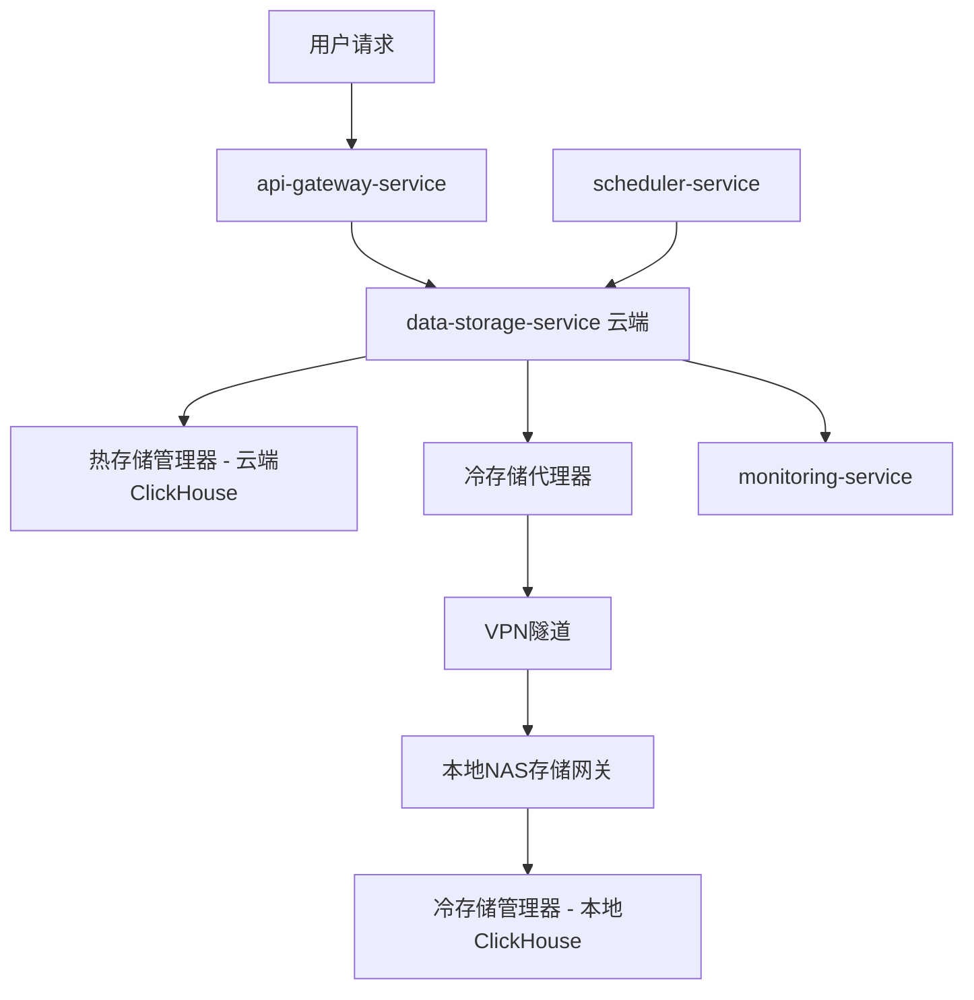

# 混合云存储架构设计

## 🌐 部署需求分析

### 用户需求
```yaml
热数据: 
  位置: 云服务器 (阿里云/AWS/腾讯云)
  原因: 高性能、高可用、低延迟
  
冷数据:
  位置: 本地NAS
  原因: 降低成本、大容量存储
```

### 挑战分析
- **网络延迟**: 云端到本地的数据传输延迟
- **带宽限制**: 家庭/企业网络上行带宽有限  
- **可靠性**: 本地网络故障时的处理
- **安全性**: 跨网络的数据传输安全

## 🏗️ 混合云架构设计

### 1. 总体架构


### 2. 核心组件重新设计

#### A. 云端存储服务 (主服务)
```python
# 部署在云服务器的主存储服务
class CloudDataStorageService:
    def __init__(self):
        # 热存储 - 云端ClickHouse集群
        self.hot_storage = CloudHotStorageManager()
        
        # 冷存储代理 - 连接本地NAS
        self.cold_storage_proxy = LocalNASProxy()
        
        # 混合查询路由器
        self.hybrid_query_router = HybridQueryRouter()
        
        # 网络感知的迁移管理器
        self.network_aware_migrator = NetworkAwareMigrator()

    async def query_data(self, query: DataQuery):
        """混合查询：云端热数据 + 本地冷数据"""
        if query.is_recent_data():
            # 查询云端热存储
            return await self.hot_storage.query(query)
        elif query.is_historical_only():
            # 查询本地冷存储
            return await self.cold_storage_proxy.query(query)
        else:
            # 混合查询：云端 + 本地
            return await self.hybrid_query_router.query_mixed(query)
```

#### B. 本地NAS存储网关
```python
# 部署在本地NAS的轻量级网关服务
class LocalStorageGateway:
    def __init__(self):
        # 本地ClickHouse实例
        self.local_clickhouse = LocalClickHouseManager()
        
        # 云端连接管理器
        self.cloud_connector = CloudConnector()
        
        # 本地存储优化器
        self.storage_optimizer = LocalStorageOptimizer()

    async def receive_archive_data(self, compressed_data):
        """接收云端发送的归档数据"""
        try:
            # 1. 验证数据完整性
            if not await self._verify_data_integrity(compressed_data):
                raise DataIntegrityError("Data verification failed")
            
            # 2. 写入本地存储
            write_result = await self.local_clickhouse.write_compressed(compressed_data)
            
            # 3. 确认写入成功
            await self.cloud_connector.confirm_archive_success(write_result.batch_id)
            
            return write_result
            
        except Exception as e:
            # 通知云端写入失败
            await self.cloud_connector.report_archive_failure(str(e))
            raise
```

## 🔧 关键技术实现

### 1. 网络连接方案

#### A. VPN隧道 (推荐)
```yaml
# 云端配置
cloud_vpn:
  type: "wireguard"  # 或 OpenVPN
  server: "云服务器公网IP"
  port: 51820
  
# 本地配置  
local_vpn:
  type: "wireguard"
  client: "本地NAS"
  connect_to: "云服务器:51820"
  
# 内网IP分配
vpn_network:
  cloud_internal_ip: "10.0.1.1"
  local_internal_ip: "10.0.1.2"
```

#### B. 反向代理方案 (备选)
```yaml
# 本地NAS主动连接云端
local_nas:
  reverse_proxy: "frp/ngrok"
  connect_to: "云服务器反向代理服务"
  
# 云端通过反向代理访问本地
cloud_service:
  proxy_url: "http://localhost:7000"  # 反向代理端口
```

### 2. 数据迁移策略

#### A. 批量迁移 (非高峰期)
```python
class NetworkAwareMigrator:
    def __init__(self):
        self.bandwidth_monitor = BandwidthMonitor()
        self.compression_engine = UltraCompressionEngine()
        
    async def execute_archive_migration(self, data_batch):
        """网络感知的数据迁移"""
        # 1. 检查网络状况
        network_status = await self.bandwidth_monitor.check_connection()
        if not network_status.is_stable:
            # 网络不稳定，延迟迁移
            await self._schedule_retry_migration(data_batch)
            return
        
        # 2. 超高压缩 (减少传输量)
        compressed_data = await self.compression_engine.ultra_compress(
            data_batch, 
            compression_level='maximum'  # 最大压缩比
        )
        
        # 3. 分块传输 (断点续传)
        chunk_size = self._calculate_optimal_chunk_size(network_status.bandwidth)
        
        for chunk in self._split_into_chunks(compressed_data, chunk_size):
            success = await self._transfer_chunk_with_retry(chunk)
            if not success:
                await self._handle_transfer_failure(chunk)
                break
        
        # 4. 验证传输完整性
        await self._verify_remote_data_integrity(data_batch)

    def _calculate_optimal_chunk_size(self, bandwidth_mbps):
        """根据带宽计算最优块大小"""
        if bandwidth_mbps >= 100:
            return 100 * 1024 * 1024  # 100MB chunks
        elif bandwidth_mbps >= 20:
            return 20 * 1024 * 1024   # 20MB chunks  
        else:
            return 5 * 1024 * 1024    # 5MB chunks
```

#### B. 渐进式迁移 (分散负载)
```python
class ProgressiveMigrator:
    async def schedule_migration_windows(self):
        """安排迁移时间窗口"""
        migration_schedule = [
            {"time": "02:00-04:00", "priority": "high_volume"},    # 凌晨大批量
            {"time": "14:00-15:00", "priority": "medium_volume"},  # 下午中等量
            {"time": "22:00-23:00", "priority": "low_volume"}     # 晚上小批量
        ]
        
        for window in migration_schedule:
            await self.scheduler.schedule_migration_task(
                time=window["time"],
                max_data_size=self._get_size_limit(window["priority"])
            )
```

### 3. 混合查询优化

#### A. 智能缓存策略
```python
class HybridQueryRouter:
    def __init__(self):
        # 本地缓存热门冷数据
        self.local_cache = LocalCacheManager()
        
        # 查询预测器
        self.query_predictor = QueryPredictor()
    
    async def query_mixed(self, query: DataQuery):
        """混合数据源查询"""
        # 1. 分析查询模式
        hot_part, cold_part = self._split_query_by_time(query)
        
        # 2. 并行查询
        tasks = []
        
        # 查询云端热数据
        if hot_part:
            tasks.append(self.hot_storage.query(hot_part))
        
        # 查询本地冷数据 (优先检查缓存)
        if cold_part:
            cached_result = await self.local_cache.get(cold_part.cache_key)
            if cached_result:
                tasks.append(asyncio.create_task(self._return_cached(cached_result)))
            else:
                tasks.append(self.cold_storage_proxy.query(cold_part))
        
        # 3. 等待所有查询完成
        results = await asyncio.gather(*tasks, return_exceptions=True)
        
        # 4. 合并结果
        return self._merge_query_results(results)
```

#### B. 预取策略
```python
class ColdDataPrefetcher:
    async def predictive_prefetch(self):
        """预测性预取冷数据"""
        # 分析查询模式
        hot_queries = await self.query_analyzer.get_trending_queries()
        
        for query_pattern in hot_queries:
            if self._should_prefetch(query_pattern):
                # 预取到云端缓存
                cold_data = await self.nas_proxy.query(query_pattern)
                await self.cloud_cache.store(query_pattern.cache_key, cold_data)
```

## ⚙️ 配置和部署

### 1. 云端配置
```yaml
# config/cloud_storage.yaml
service:
  name: "data-storage-service"
  deployment: "cloud"
  
hot_storage:
  type: "clickhouse_cluster"
  nodes:
    - "clickhouse-hot-1.cloud.internal:9000"
    - "clickhouse-hot-2.cloud.internal:9000"
    - "clickhouse-hot-3.cloud.internal:9000"
  retention_days: 7

cold_storage_proxy:
  type: "nas_proxy"
  connection:
    method: "vpn"           # vpn | reverse_proxy
    vpn_endpoint: "10.0.1.2:9000"
    timeout: 30             # 本地网络超时时间
    retry_attempts: 3
  
  fallback:
    enabled: true
    cache_duration: "24h"   # 本地故障时缓存查询结果
    backup_storage: "cloud_backup_bucket"

migration:
  schedule: "0 2 * * *"
  bandwidth_limit: "10MB/s"  # 限制带宽避免影响业务
  compression_level: "ultra"
  chunk_size: "50MB"
  verification_enabled: true
```

### 2. 本地NAS配置
```yaml
# config/local_storage.yaml
service:
  name: "local-storage-gateway"
  deployment: "nas"
  
storage:
  type: "clickhouse_single"
  data_path: "/volume1/marketprism/cold_data"
  compression: "zstd_ultra"
  
connection:
  cloud_endpoint: "10.0.1.1:8002"
  heartbeat_interval: 30
  
  # 网络故障处理
  offline_mode:
    enabled: true
    max_offline_duration: "48h"
    queue_incoming_data: true
```

### 3. Docker部署方案

#### A. 云端部署
```yaml
# docker-compose.cloud.yml
version: '3.8'
services:
  data-storage-service:
    image: marketprism/storage-cloud:v1.0.0
    ports:
      - "8002:8002"
    environment:
      - DEPLOYMENT_TYPE=cloud
      - CONFIG_PATH=/app/config/cloud_storage.yaml
    volumes:
      - ./config:/app/config
      - /etc/wireguard:/etc/wireguard  # VPN配置
    
  clickhouse-hot-cluster:
    image: clickhouse/clickhouse-server:latest
    # ... 云端ClickHouse配置
```

#### B. 本地NAS部署
```yaml
# docker-compose.nas.yml  
version: '3.8'
services:
  local-storage-gateway:
    image: marketprism/storage-gateway:v1.0.0
    ports:
      - "9000:9000"
    environment:
      - DEPLOYMENT_TYPE=nas
      - CONFIG_PATH=/app/config/local_storage.yaml
    volumes:
      - ./config:/app/config
      - /volume1/marketprism:/app/data  # NAS存储路径
      - /etc/wireguard:/etc/wireguard   # VPN配置
    
  clickhouse-local:
    image: clickhouse/clickhouse-server:latest
    volumes:
      - /volume1/marketprism/clickhouse:/var/lib/clickhouse
```

## 🚨 故障处理策略

### 1. 网络故障处理
```python
class NetworkFailureHandler:
    async def handle_nas_offline(self):
        """处理本地NAS离线"""
        # 1. 启用云端缓存模式
        await self.enable_cloud_cache_mode()
        
        # 2. 暂停数据迁移
        await self.pause_data_migration()
        
        # 3. 记录离线期间的查询
        await self.log_offline_queries()
        
        # 4. 发送告警
        await self.send_alert("NAS offline", "Cold data queries degraded")

    async def handle_nas_recovery(self):
        """处理本地NAS恢复"""
        # 1. 同步离线期间的数据
        await self.sync_offline_data()
        
        # 2. 恢复正常迁移
        await self.resume_data_migration()
        
        # 3. 清理临时缓存
        await self.cleanup_temporary_cache()
```

### 2. 数据一致性保障
```python
class HybridConsistencyManager:
    async def verify_data_consistency(self):
        """验证混合存储数据一致性"""
        # 1. 检查迁移记录
        migration_log = await self.get_migration_history()
        
        # 2. 验证数据完整性
        for record in migration_log:
            cloud_hash = await self.cloud_storage.get_data_hash(record.batch_id)
            nas_hash = await self.nas_proxy.get_data_hash(record.batch_id)
            
            if cloud_hash != nas_hash:
                await self._handle_data_inconsistency(record)
```

## 💰 成本效益分析

### 存储成本对比
| 数据类型 | 云端成本/月 | 本地NAS成本/月 | 节省 |
|----------|-------------|----------------|------|
| 热数据(1TB) | ¥300 | - | - |
| 冷数据(10TB) | ¥3000 | ¥500 | 83% |
| **总计** | **¥3300** | **¥800** | **76%** |

### 性能对比
| 指标 | 云端热存储 | 本地冷存储 | 影响 |
|------|------------|------------|------|
| 查询延迟 | 10ms | 200ms | 可接受 |
| 写入速度 | 高 | 中等 | 后台迁移 |
| 可用性 | 99.9% | 95% | 冷数据容忍度高 |

## 🎯 总结

### ✅ 推荐的混合云架构

1. **云端主服务**: 统一的data-storage-service部署在云端
2. **本地存储网关**: 轻量级gateway部署在NAS
3. **VPN隧道**: 安全的云-本地连接
4. **智能路由**: 自动选择最优数据源
5. **网络感知**: 根据网络状况调整策略

### 🔑 关键优势

- **成本优化**: 冷数据成本降低76%
- **性能保障**: 热数据保持云端高性能  
- **架构统一**: 对外仍然是单一服务接口
- **故障容忍**: 网络故障时有降级方案
- **扩展灵活**: 可以根据需要调整热冷分割策略

这个架构完美解决了你的需求：云端性能 + 本地成本优化！🚀