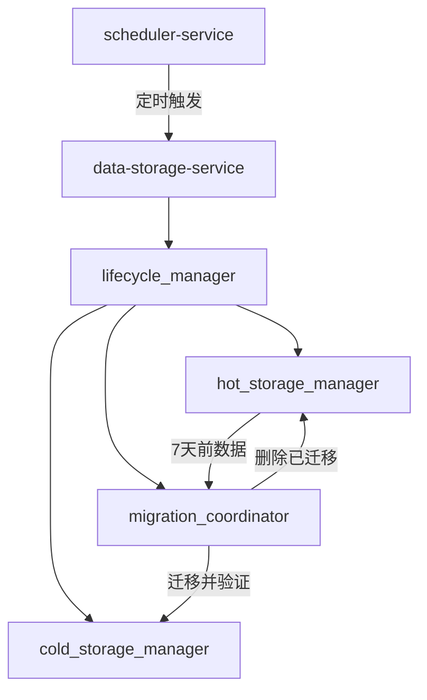

# 热冷存储协调架构详解

## 🎯 架构澄清：统一服务 vs 分离部署

### ❌ 误解的方案（不推荐）
```yaml
# 错误理解：部署两个独立的存储服务
hot-data-storage-service:     # 热数据服务实例
  config: hot_storage_config.yaml
  port: 8001

cold-data-storage-service:    # 冷数据服务实例  
  config: cold_storage_config.yaml
  port: 8002

# 问题：谁来协调数据迁移？如何保证一致性？
```

### ✅ 推荐的方案（统一服务）
```yaml
# 正确方案：单一服务，内部管理热冷存储
data-storage-service:
  config: unified_storage_config.yaml
  port: 8002
  
  # 内部组件
  components:
    - hot_storage_manager    # 热存储管理器
    - cold_storage_manager   # 冷存储管理器
    - lifecycle_manager      # 数据生命周期管理器
    - migration_coordinator  # 迁移协调器
```

## 🔄 数据迁移协调机制

### 1. 架构总览


### 2. 协调者角色分工
```python
# scheduler-service: 时间触发器
@scheduler.cron('0 2 * * *')  # 每天凌晨2点
async def trigger_daily_archive():
    """触发每日数据归档任务"""
    response = await http_client.post(
        "http://data-storage-service:8002/api/internal/archive",
        json={"trigger_time": datetime.utcnow()}
    )
    return response

# data-storage-service: 实际执行者
class DataStorageService:
    async def handle_archive_trigger(self, request):
        """处理归档触发请求"""
        return await self.lifecycle_manager.execute_daily_archive()
```

### 3. 详细迁移流程
```python
class DataLifecycleManager:
    """数据生命周期管理器 - 负责协调迁移"""
    
    def __init__(self):
        self.hot_storage = HotStorageManager()
        self.cold_storage = ColdStorageManager()
        self.migration_coordinator = MigrationCoordinator()
        
    async def execute_daily_archive(self):
        """执行每日归档任务"""
        try:
            # 1. 确定迁移边界
            cutoff_date = datetime.now() - timedelta(days=7)
            
            # 2. 查找待迁移数据
            data_to_migrate = await self.hot_storage.find_data_before_date(cutoff_date)
            
            if not data_to_migrate:
                return {"status": "success", "message": "No data to migrate"}
            
            # 3. 执行迁移
            migration_result = await self.migration_coordinator.migrate_data(
                data_to_migrate, cutoff_date
            )
            
            # 4. 返回结果
            return {
                "status": "success", 
                "migrated_records": migration_result.record_count,
                "freed_space": migration_result.freed_space,
                "duration": migration_result.duration
            }
            
        except Exception as e:
            await self._handle_migration_failure(e)
            return {"status": "failed", "error": str(e)}
```

### 4. 迁移协调器实现
```python
class MigrationCoordinator:
    """迁移协调器 - 确保数据迁移的原子性"""
    
    async def migrate_data(self, data_batch, cutoff_date):
        """原子性数据迁移"""
        migration_id = self._generate_migration_id()
        
        try:
            # 阶段1: 数据压缩和预处理
            compressed_data = await self._compress_and_validate(data_batch)
            
            # 阶段2: 写入冷存储
            cold_write_result = await self.cold_storage.write_compressed_data(
                compressed_data, migration_id
            )
            
            # 阶段3: 验证迁移完整性
            verification_result = await self._verify_migration_integrity(
                data_batch, cold_write_result
            )
            
            if not verification_result.success:
                # 回滚冷存储写入
                await self.cold_storage.rollback_migration(migration_id)
                raise MigrationError("Data integrity verification failed")
            
            # 阶段4: 从热存储删除已迁移数据
            hot_delete_result = await self.hot_storage.delete_migrated_data(
                data_batch, migration_id
            )
            
            # 阶段5: 记录迁移日志
            await self._log_migration_success(migration_id, {
                "cutoff_date": cutoff_date,
                "record_count": len(data_batch),
                "compressed_size": len(compressed_data),
                "duration": verification_result.duration
            })
            
            return MigrationResult(
                success=True,
                migration_id=migration_id,
                record_count=len(data_batch),
                freed_space=hot_delete_result.freed_space,
                duration=verification_result.duration
            )
            
        except Exception as e:
            # 全面回滚
            await self._rollback_migration(migration_id)
            raise MigrationError(f"Migration failed: {e}")
```

## ⚙️ 配置管理方案

### 1. 统一配置文件
```yaml
# config/storage_service.yaml
service:
  name: "data-storage-service"
  port: 8002
  
# 热存储配置
hot_storage:
  type: "clickhouse_cluster"
  cluster_config:
    nodes:
      - host: "clickhouse-hot-1"
        port: 9000
      - host: "clickhouse-hot-2" 
        port: 9000
      - host: "clickhouse-hot-3"
        port: 9000
  retention_policy:
    days: 7                    # 热数据保留7天
    cleanup_hour: 2            # 凌晨2点清理
  performance:
    compression: "lz4"         # 轻量压缩，快速访问
    replica_count: 3
    shard_count: 4

# 冷存储配置  
cold_storage:
  type: "clickhouse_cold_cluster"
  cluster_config:
    nodes:
      - host: "clickhouse-cold-1"
        port: 9000
      - host: "clickhouse-cold-2"
        port: 9000
  retention_policy:
    years: 5                   # 冷数据保留5年
    cleanup_hour: 3            # 凌晨3点清理过期数据
  performance:
    compression: "zstd_ultra"  # 超高压缩比
    replica_count: 2           # 冷数据副本数较少
    
# 迁移策略配置
migration:
  schedule:
    cron: "0 2 * * *"         # 每天凌晨2点触发
    timeout: "2h"             # 迁移超时时间
  batch_size: 100000          # 每批次迁移记录数
  verification_enabled: true   # 启用完整性验证
  rollback_on_failure: true   # 失败时自动回滚
  
# 缓存层配置
cache:
  type: "redis_cluster"
  cluster_config:
    nodes:
      - "redis-1:6379"
      - "redis-2:6379" 
      - "redis-3:6379"
  settings:
    memory_limit: "16GB"
    ttl_hours: 24
```

### 2. 环境特定配置
```yaml
# config/environments/production.yaml
hot_storage:
  cluster_config:
    nodes:
      - host: "prod-clickhouse-hot-1.internal"
      - host: "prod-clickhouse-hot-2.internal"
      - host: "prod-clickhouse-hot-3.internal"

# config/environments/development.yaml  
hot_storage:
  cluster_config:
    nodes:
      - host: "localhost"
        port: 9001            # 开发环境单节点
cold_storage:
  cluster_config:
    nodes:
      - host: "localhost" 
        port: 9002            # 开发环境单节点
```

### 3. 配置加载逻辑
```python
class StorageServiceConfig:
    def __init__(self, environment="production"):
        self.environment = environment
        self.config = self._load_config()
        
    def _load_config(self):
        # 1. 加载基础配置
        base_config = yaml.load(open("config/storage_service.yaml"))
        
        # 2. 加载环境特定配置
        env_config = yaml.load(open(f"config/environments/{self.environment}.yaml"))
        
        # 3. 合并配置
        return self._deep_merge(base_config, env_config)
    
    @property  
    def hot_storage_config(self):
        return self.config['hot_storage']
        
    @property
    def cold_storage_config(self):
        return self.config['cold_storage']
        
    @property
    def migration_config(self):
        return self.config['migration']
```

## 🔧 服务间协调接口

### 1. scheduler-service → data-storage-service
```python
# scheduler-service发起的调用
async def trigger_archive_task():
    """调度服务触发归档任务"""
    response = await http_client.post(
        "http://data-storage-service:8002/api/internal/lifecycle/archive",
        json={
            "task_id": generate_task_id(),
            "trigger_time": datetime.utcnow().isoformat(),
            "parameters": {
                "cutoff_days": 7,
                "batch_size": 100000
            }
        }
    )
    return response.json()

# data-storage-service的内部接口
@app.post("/api/internal/lifecycle/archive")
async def handle_archive_request(request: ArchiveRequest):
    """处理归档请求"""
    result = await storage_service.lifecycle_manager.execute_archive(
        cutoff_days=request.parameters.cutoff_days,
        batch_size=request.parameters.batch_size
    )
    return result
```

### 2. 监控和告警集成
```python
# data-storage-service向monitoring-service报告状态
async def report_migration_metrics(self, migration_result):
    """向监控服务报告迁移指标"""
    metrics = {
        "migration_duration": migration_result.duration,
        "migrated_records": migration_result.record_count,
        "freed_space_gb": migration_result.freed_space / (1024**3),
        "success_rate": 1.0 if migration_result.success else 0.0
    }
    
    await self.monitoring_client.send_metrics("data_migration", metrics)
    
    if not migration_result.success:
        await self.monitoring_client.send_alert({
            "level": "error",
            "message": f"Data migration failed: {migration_result.error}",
            "service": "data-storage-service"
        })
```

## 🚀 部署架构

### 1. 单一服务部署
```yaml
# docker-compose.yml
services:
  data-storage-service:
    image: marketprism/data-storage:v1.0.0
    ports:
      - "8002:8002"
    environment:
      - ENVIRONMENT=production
      - CONFIG_PATH=/app/config
    volumes:
      - ./config:/app/config
      - ./data:/app/data
    depends_on:
      - clickhouse-hot-cluster
      - clickhouse-cold-cluster
      - redis-cluster
      
  # 热存储集群
  clickhouse-hot-1:
    image: clickhouse/clickhouse-server:latest
    environment:
      - CLICKHOUSE_DB=marketprism_hot
    volumes:
      - hot_data_1:/var/lib/clickhouse
      
  # 冷存储集群  
  clickhouse-cold-1:
    image: clickhouse/clickhouse-server:latest
    environment:
      - CLICKHOUSE_DB=marketprism_cold
    volumes:
      - cold_data_1:/var/lib/clickhouse
```

### 2. 服务发现和健康检查
```python
# 健康检查接口
@app.get("/health")
async def health_check():
    """综合健康检查"""
    health_status = {
        "service": "data-storage-service",
        "timestamp": datetime.utcnow(),
        "status": "healthy",
        "components": {}
    }
    
    # 检查热存储
    hot_health = await self.hot_storage.health_check()
    health_status["components"]["hot_storage"] = hot_health
    
    # 检查冷存储
    cold_health = await self.cold_storage.health_check()
    health_status["components"]["cold_storage"] = cold_health
    
    # 检查迁移状态
    migration_health = await self.lifecycle_manager.health_check()
    health_status["components"]["migration"] = migration_health
    
    # 整体状态评估
    if all(comp["status"] == "healthy" for comp in health_status["components"].values()):
        health_status["status"] = "healthy"
    else:
        health_status["status"] = "degraded"
        
    return health_status
```

## 总结

### ✅ 推荐架构的优势

1. **统一协调**：单一服务内部管理，避免分布式一致性问题
2. **scheduler触发**：定时任务由专门的调度服务管理
3. **原子性保证**：迁移过程具备完整的事务语义
4. **配置集中**：统一配置管理，环境隔离
5. **监控集成**：与监控服务无缝集成，全链路可观测

### 🎯 关键协调流程

```
scheduler-service → 定时触发 → data-storage-service
                                      ↓
                                lifecycle_manager 
                                      ↓
                  hot_storage ←→ migration_coordinator ←→ cold_storage
                                      ↓
                              monitoring-service (指标上报)
```

这样的架构确保了热冷数据迁移的可靠性和一致性，同时保持了系统的简洁性！