# MarketPrism 统一API代理架构设计

## 🏗️ 系统架构总览

### **核心设计理念**
- **统一收口**：所有交易所API请求经过统一代理
- **智能路由**：根据IP资源和限制智能选择最佳路径
- **弹性容错**：自动处理429/418错误和IP切换
- **零侵入**：现有代码无需修改即可享受保护

### **整体架构图**

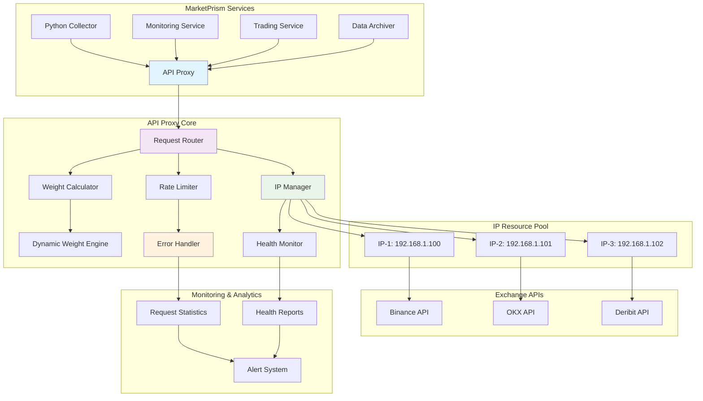

## 📊 核心组件设计

### **1. API代理核心 (ExchangeAPIProxy)**

```python
class ExchangeAPIProxy:
    """统一API代理核心组件"""
    
    # 核心职责
    - 请求路由和分发
    - IP资源管理和选择
    - 权重计算和限制
    - 错误处理和恢复
    - 实时监控和统计
```

**组件关系图：**
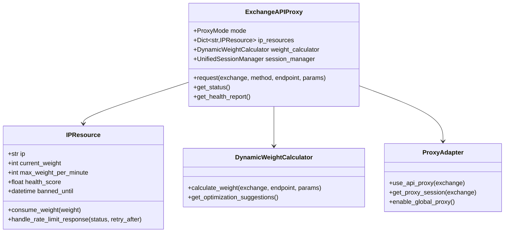

### **2. 请求处理流程**

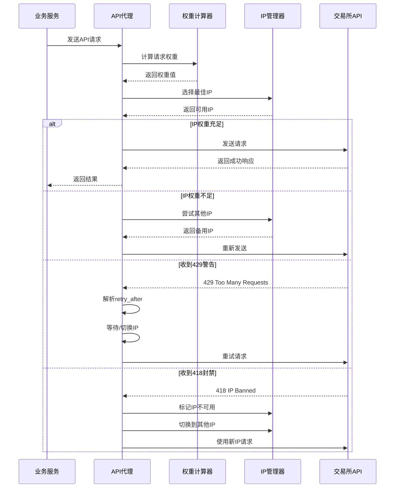

### **3. IP资源管理架构**

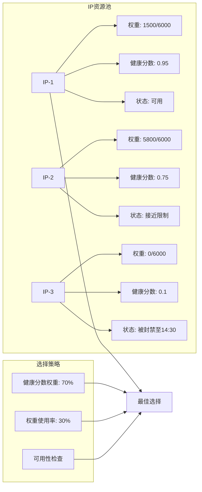

### **4. 权重计算引擎**

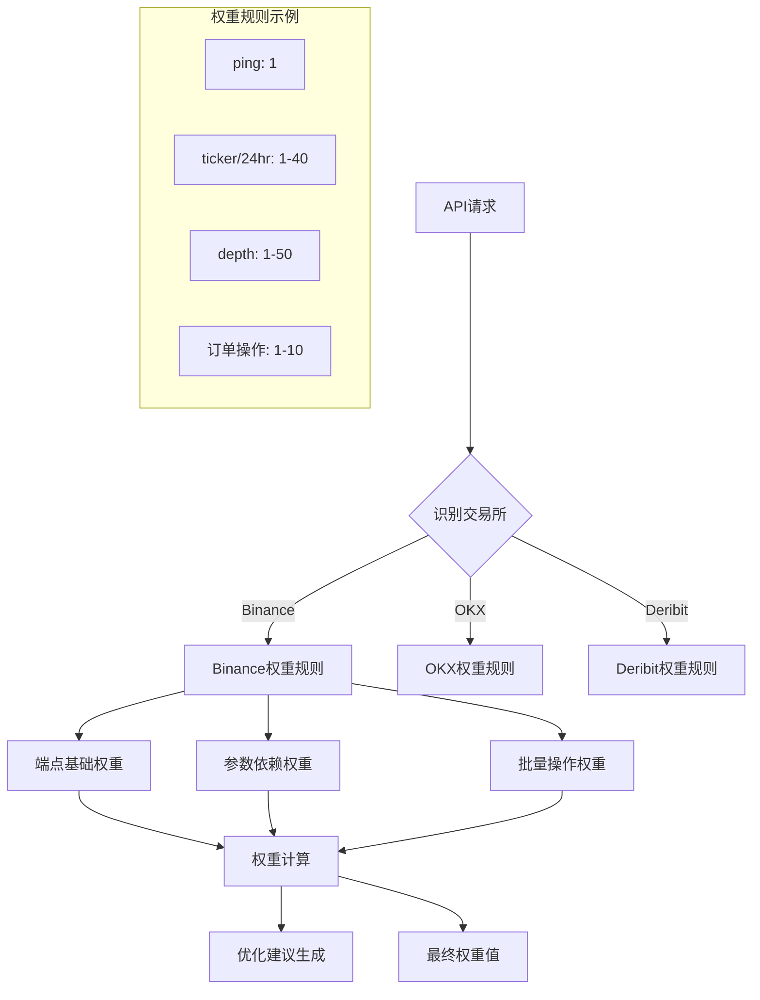

## 🔄 运行模式设计

### **1. 自动模式 (AUTO)**
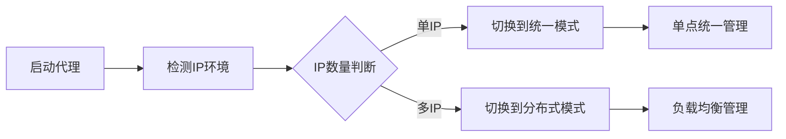

### **2. 统一模式 (UNIFIED)**
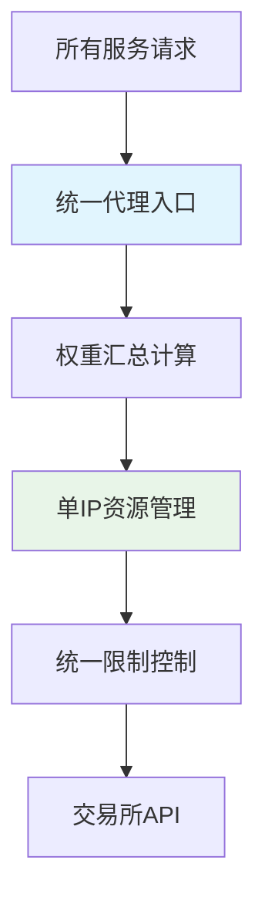

### **3. 分布式模式 (DISTRIBUTED)**
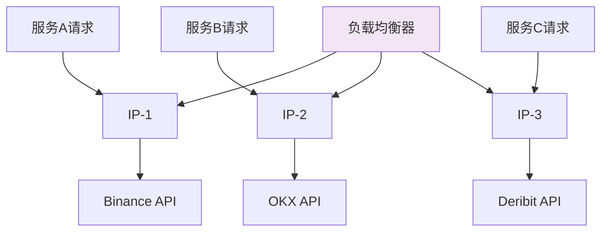

## 🛡️ 错误处理架构

### **错误处理流程图**
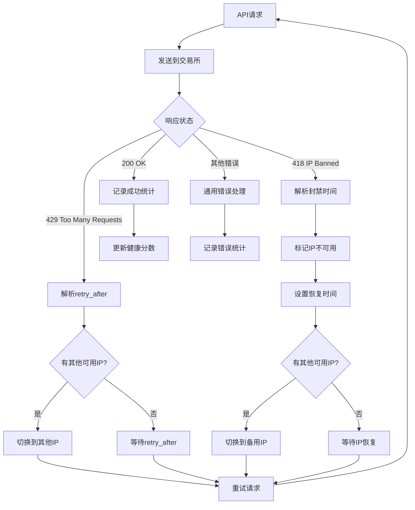

### **IP健康管理**
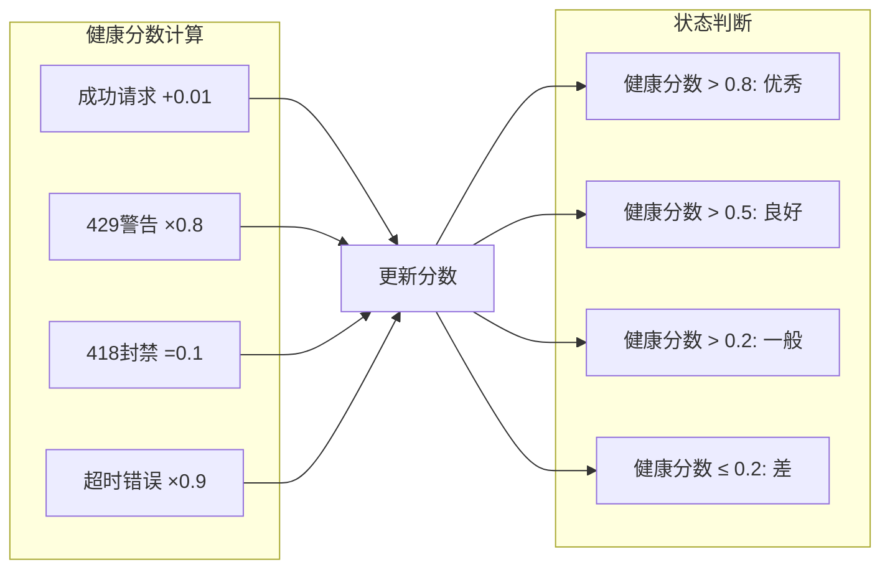

## 📊 监控与观测架构

### **监控数据流**
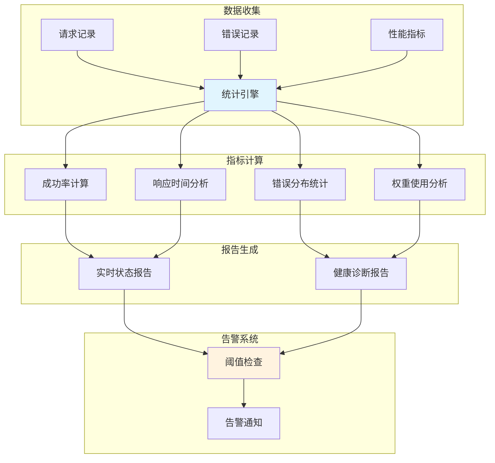

### **关键指标设计**
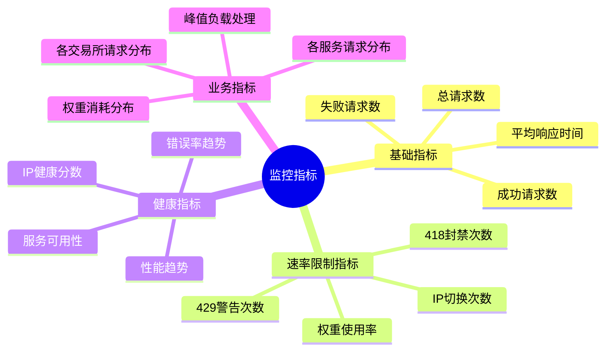

## 🔧 配置架构设计

### **配置层次结构**
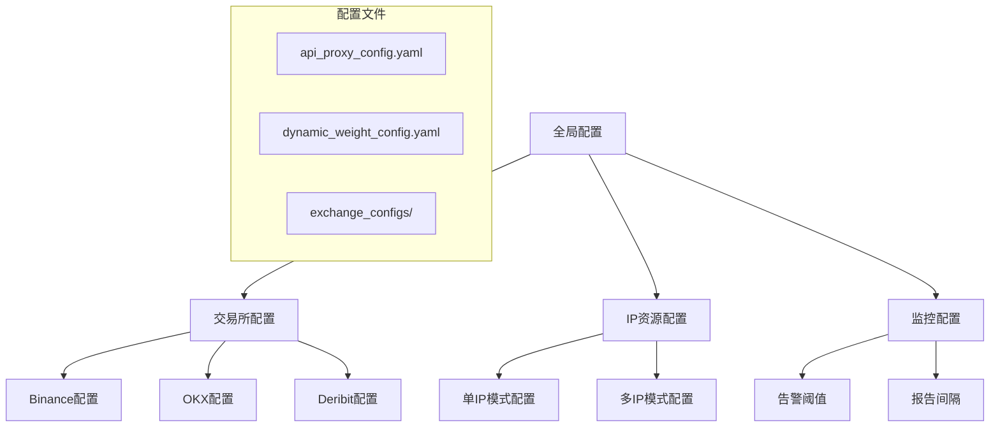

### **配置继承关系**
```yaml
# 配置优先级：运行时参数 > 环境变量 > 配置文件 > 默认值

默认配置:
  mode: "auto"
  max_weight_per_minute: 6000
  health_check_interval: 60

环境配置:
  PROXY_MODE: "distributed"  # 覆盖默认mode
  
运行时配置:
  proxy = ExchangeAPIProxy(mode=ProxyMode.UNIFIED)  # 最高优先级
```

## 🚀 扩展架构设计

### **插件化扩展点**
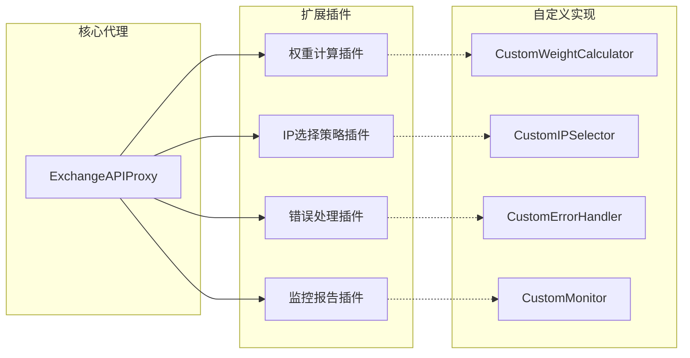

### **水平扩展架构**
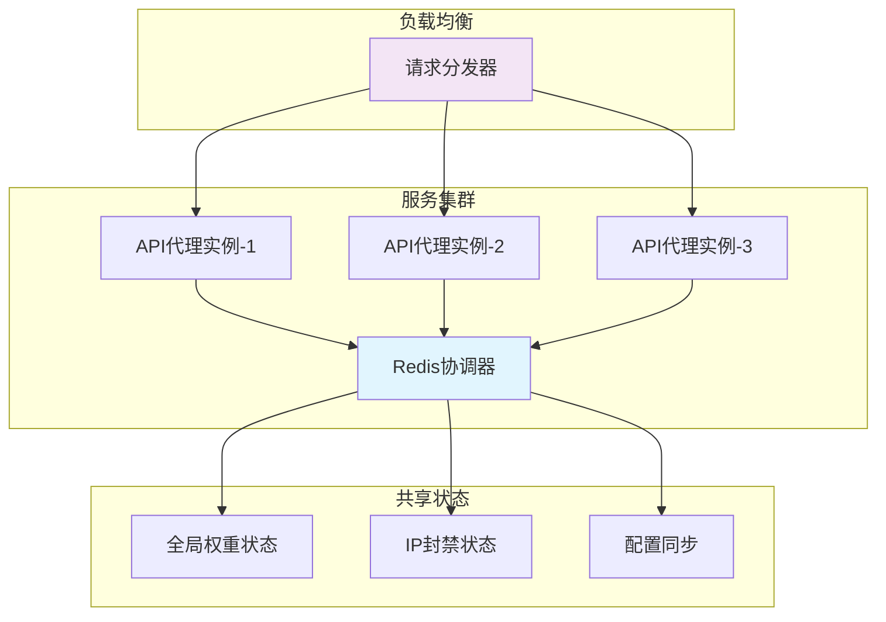

## 💡 设计原则总结

### **核心设计原则**

1. **单一职责**：每个组件只负责一个明确的功能
2. **开放封闭**：对扩展开放，对修改封闭
3. **依赖倒置**：依赖抽象而不是具体实现
4. **最小惊讶**：API设计符合直觉和约定
5. **渐进增强**：从简单开始，逐步增加复杂性

### **架构优势**

✅ **高内聚低耦合**：组件职责清晰，依赖关系简单
✅ **可测试性**：每个组件都可以独立测试
✅ **可扩展性**：支持插件化和水平扩展
✅ **可观测性**：完整的监控和诊断能力
✅ **容错性**：多层次的错误处理和恢复机制

### **性能特征**

- **低延迟**：本地路由决策，无额外网络开销
- **高吞吐**：支持连接复用和并发请求
- **自适应**：根据实际负载动态调整策略
- **可预测**：明确的权重计算和限制机制

这个架构设计确保了MarketPrism统一API代理既**简单优雅**又**功能强大**，为分布式交易所API管理提供了完整的解决方案！