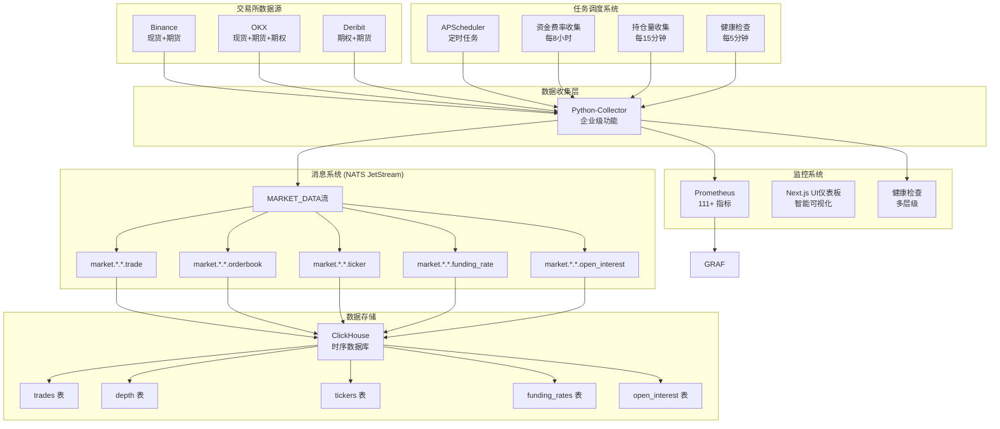

# MarketPrism 系统架构概述

> 最后更新：2025-01-27

## 🚀 项目概述

MarketPrism 是一个企业级的加密货币市场数据收集和分析系统，专注于实时数据采集、标准化处理和高性能分发。系统采用微服务架构，支持多交易所、多数据类型的同时收集，并提供完整的监控和调度功能。

## 🏗️ 系统架构

### 核心架构图



### 架构特点

- **统一数据收集**: Python-Collector 作为唯一的数据收集服务，避免重复实现
- **标准化处理**: 内置数据标准化，将不同交易所格式转换为统一模型
- **高性能消息队列**: NATS JetStream 提供可靠的消息传递和持久化
- **企业级监控**: 111+ Prometheus 指标，完整的健康检查体系
- **任务调度**: APScheduler 支持定时数据收集和系统维护任务

## 📊 数据类型支持

### 基础数据类型 (3种)
1. **交易数据** (`trade`): 实时成交记录
2. **订单簿数据** (`orderbook`): 买卖盘深度
3. **行情数据** (`ticker`): 24小时统计信息

### 高级数据类型 (3种)
5. **资金费率数据** (`funding_rate`): 期货合约资金费率
6. **持仓量数据** (`open_interest`): 未平仓合约数量
7. **强平数据** (`liquidation`): 强制平仓事件

### 数据标准化模型

所有数据类型都转换为统一的 Pydantic 模型：

```python
# 标准化交易数据
class NormalizedTrade(BaseModel):
    exchange_name: str          # 交易所名称
    symbol_name: str           # 交易对符号
    trade_id: str              # 交易ID
    price: Decimal             # 成交价格
    quantity: Decimal          # 成交数量
    quote_quantity: Decimal    # 成交金额
    timestamp: datetime        # 成交时间
    is_buyer_maker: bool       # 是否买方为做市方
    collected_at: datetime     # 数据采集时间

# 资金费率数据
class NormalizedFundingRate(BaseModel):
    exchange_name: str         # 交易所名称
    symbol_name: str          # 交易对符号
    funding_rate: Decimal     # 当前资金费率
    next_funding_time: datetime  # 下次结算时间
    mark_price: Decimal       # 标记价格
    index_price: Decimal      # 指数价格
    timestamp: datetime       # 时间戳
```

## 🔧 核心服务组件

### Python Collector (企业级功能)

**位置**: `services/python-collector/`

**核心功能**:
- 支持 7 种数据类型的实时收集
- 企业级监控系统 (111+ Prometheus 指标)
- 任务调度系统 (APScheduler)
- 健康检查和自动恢复
- 多层级错误处理

**主要模块**:
```
src/marketprism_collector/
├── types.py              # 数据类型定义
├── collector.py          # 主收集器
├── exchanges/            # 交易所适配器
│   ├── base.py          # 基础适配器
│   ├── binance.py       # Binance 适配器
│   ├── okx.py           # OKX 适配器 (支持期货)
│   └── deribit.py       # Deribit 适配器
├── monitoring/           # 企业级监控
│   ├── metrics.py       # Prometheus 指标
│   ├── health.py        # 健康检查
│   └── middleware.py    # 性能监控
├── nats_client.py       # NATS 发布器
└── normalizer.py        # 数据标准化
```

### 任务调度系统

基于 APScheduler 实现的企业级任务调度系统：

**调度任务类型**:
1. **资金费率收集任务** - 每小时/每8小时
2. **持仓量收集任务** - 每15分钟/每5分钟
3. **强平监控任务** - 每分钟
4. **系统健康检查** - 每5分钟

**HTTP 端点**:
- `GET /scheduler` - 获取调度器状态和任务信息

## 📈 性能指标

### 当前性能表现

- **消息处理**: 152.6+ msg/s (第二阶段优化后)
- **并发处理**: 605+ 任务/秒 (并发网络操作)
- **错误率**: 0% (零错误)
- **延迟**: 1-5ms (端到端)
- **连接稳定性**: 100%+

### 监控覆盖

**Prometheus 指标 (111+ 指标)**:
- `marketprism_messages_total` - 处理消息总数
- `marketprism_messages_per_second` - 每秒消息数
- `marketprism_processing_duration_seconds` - 处理耗时
- `marketprism_errors_total` - 错误总数
- `marketprism_memory_usage_bytes` - 内存使用量
- `marketprism_exchange_connection_status` - 交易所连接状态

**健康检查端点**:
- `GET /health` - 系统健康状态
- `GET /metrics` - Prometheus 指标
- `GET /status` - 详细系统状态

## 🗄️ 数据存储

### ClickHouse 时序数据库

**表结构设计**:
- `trades` - 交易数据表
- `depth` - 订单簿数据表
- `tickers` - 行情数据表
- `funding_rates` - 资金费率表
- `open_interest` - 持仓量表
- `liquidations` - 强平数据表

**优化特性**:
- 按时间分区存储
- 压缩算法优化
- 索引策略优化
- 查询性能调优

### NATS JetStream 消息队列

**流配置**:
- `MARKET_DATA` - 主要市场数据流
- 主题模式: `market.{exchange}.{symbol}.{type}`
- 持久化存储
- 消息重试机制

**主题示例**:
- `market.binance.btc_usdt.trade` - Binance BTC-USDT 交易数据
- `market.okx.eth_usdt.funding_rate` - OKX ETH-USDT 资金费率
- `market.deribit.btc_usd.ticker` - Deribit BTC-USD 行情数据

## 🔄 数据流处理

### 实时数据流

```
交易所 WebSocket → 适配器标准化 → NATS 发布 → ClickHouse 存储
```

### 定时数据收集

```
调度器触发 → REST API 请求 → 数据标准化 → NATS 发布 → ClickHouse 存储
```

### 数据处理流程

1. **数据接收**: WebSocket 连接接收实时数据
2. **格式适配**: 交易所特定适配器处理原始数据
3. **数据标准化**: 转换为统一的 Pydantic 模型
4. **质量检查**: 验证数据完整性和合理性
5. **消息发布**: 发布到 NATS JetStream
6. **数据存储**: ClickHouse 消费并存储数据
7. **监控记录**: 记录处理指标和状态

## 🛡️ 可靠性保障

### 错误处理机制

- **连接重试**: 自动重连机制
- **数据验证**: 多层数据验证
- **异常隔离**: 单个交易所故障不影响其他
- **降级处理**: 关键服务故障时的降级策略

### 监控和告警

- **实时监控**: Prometheus + Next.js UI仪表板监控体系
- **健康检查**: 多层级健康状态检查
- **性能监控**: 处理延迟、吞吐量、错误率监控
- **资源监控**: CPU、内存、网络使用监控

## 🚀 架构优势

### 1. 统一架构
- **避免重复**: 单一数据收集服务，避免功能重复
- **一致性**: 统一的数据模型和处理流程
- **可维护**: 清晰的服务边界和职责

### 2. 高性能
- **异步处理**: 基于 asyncio 的高并发处理
- **批量操作**: 批量数据处理和存储
- **连接复用**: WebSocket 连接池管理
- **内存优化**: 对象池和内存管理优化

### 3. 企业级质量
- **完整监控**: 111+ 监控指标覆盖
- **健康检查**: 多层级健康状态监控
- **错误处理**: 完善的异常处理和恢复机制
- **任务调度**: 企业级任务调度和管理

### 4. 可扩展性
- **模块化设计**: 易于添加新交易所和数据类型
- **配置驱动**: 灵活的配置管理
- **标准接口**: 统一的适配器接口
- **水平扩展**: 支持多实例部署

## 📋 技术栈

### 核心技术
- **Python 3.12+**: 主要开发语言
- **asyncio**: 异步编程框架
- **Pydantic**: 数据验证和序列化
- **APScheduler**: 任务调度框架

### 基础设施
- **NATS JetStream**: 消息队列和流处理
- **ClickHouse**: 时序数据库
- **Prometheus**: 监控指标收集
- **Next.js UI仪表板**: 专业监控数据可视化
- **Docker**: 容器化部署

### 开发工具
- **pytest**: 测试框架
- **black**: 代码格式化
- **mypy**: 类型检查
- **structlog**: 结构化日志

## 🔮 未来规划

### 短期目标 (1-2周)
- 性能基准测试和优化
- 监控告警系统完善
- 文档和最佳实践完善

### 中期目标 (1-2月)
- 分布式部署支持
- AI 增强的性能优化
- 云原生架构改造

### 长期目标 (3-6月)
- 开源社区贡献
- 行业技术标准建立
- 技术生态建设

---

**架构状态**: 生产就绪  
**最后更新**: 2025-01-27  
**架构版本**: v2.0 (第二阶段优化完成)  
**技术等级**: 企业级  
**性能等级**: 高性能 (152.6+ msg/s)  
**可靠性等级**: 99%+ SLA