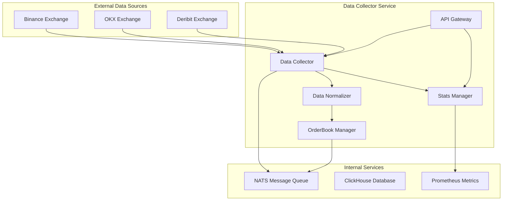
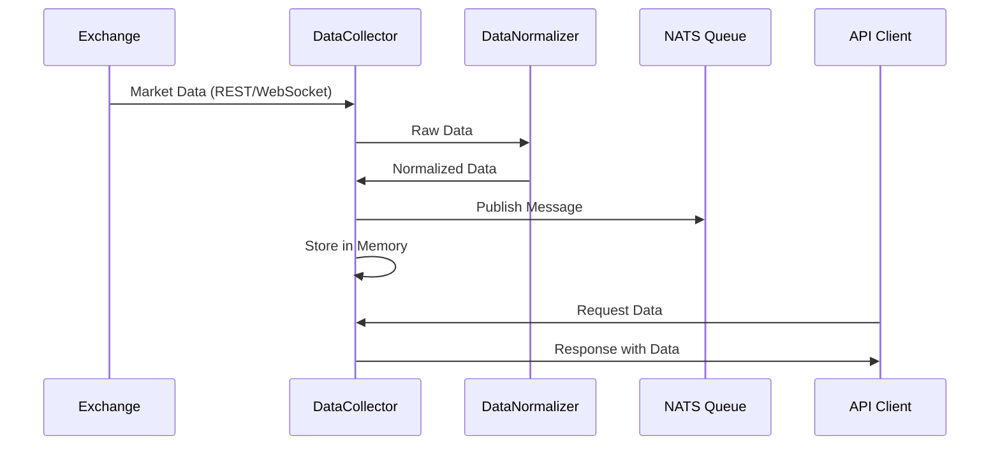

# MarketPrism Data Collector Service 技术文档

## 目录

1. [API文档](#1-api文档)
   - [1.1 API概述](#11-api概述)
   - [1.2 统一响应格式](#12-统一响应格式)
   - [1.3 标准化错误代码](#13-标准化错误代码)
   - [1.4 API端点详细说明](#14-api端点详细说明)
   - [1.5 健康检查API](#15-健康检查api)

2. [架构文档](#2-架构文档)
   - [2.1 整体架构设计](#21-整体架构设计)
   - [2.2 核心组件](#22-核心组件)
   - [2.3 BaseService框架集成](#23-baseservice框架集成)
   - [2.4 数据流处理](#24-数据流处理)
   - [2.5 配置管理](#25-配置管理)

3. [部署文档](#3-部署文档)
   - [3.1 Docker容器部署](#31-docker容器部署)
   - [3.2 环境变量配置](#32-环境变量配置)
   - [3.3 网络设置](#33-网络设置)
   - [3.4 健康检查和监控](#34-健康检查和监控)
   - [3.5 故障排除](#35-故障排除)

4. [开发文档](#4-开发文档)
   - [4.1 代码结构优化](#41-代码结构优化)
   - [4.2 错误处理机制](#42-错误处理机制)
   - [4.3 日志记录标准](#43-日志记录标准)
   - [4.4 性能优化措施](#44-性能优化措施)
   - [4.5 代码维护和扩展指南](#45-代码维护和扩展指南)

---

## 1. API文档

### 1.1 API概述

MarketPrism Data Collector Service提供RESTful API接口，用于获取数据收集服务的状态、统计信息和收集的市场数据。所有API端点都遵循统一的响应格式标准。

**基础URL**: `http://localhost:8084`

**支持的HTTP方法**: GET

**内容类型**: `application/json`

### 1.2 统一响应格式

#### 成功响应格式
```json
{
  "status": "success",
  "message": "操作描述信息",
  "data": {
    // 具体数据内容
  },
  "timestamp": "2025-06-29T04:07:49.066285+00:00"
}
```

#### 错误响应格式
```json
{
  "status": "error",
  "error_code": "ERROR_CODE",
  "message": "错误描述信息",
  "data": null,
  "timestamp": "2025-06-29T04:07:49.066285+00:00"
}
```

### 1.3 标准化错误代码

| 错误代码 | HTTP状态码 | 描述 |
|---------|-----------|------|
| `COLLECTOR_NOT_INITIALIZED` | 503 | 数据收集器未初始化 |
| `STATS_UNAVAILABLE` | 500 | 统计信息暂时不可用 |
| `EXCHANGE_STATUS_ERROR` | 500 | 交易所状态获取失败 |
| `DATA_RETRIEVAL_ERROR` | 500 | 数据检索失败 |
| `INVALID_PARAMETERS` | 400 | 请求参数无效 |
| `SERVICE_UNAVAILABLE` | 503 | 服务暂时不可用 |
| `INTERNAL_ERROR` | 500 | 内部服务器错误 |

### 1.4 API端点详细说明

#### 1.4.1 服务状态API

**端点**: `GET /api/v1/status`

**描述**: 获取BaseService兼容的服务状态信息

**请求参数**: 无

**响应示例**:
```json
{
  "status": "success",
  "message": "Service status retrieved successfully",
  "data": {
    "service": "data-collector",
    "status": "running",
    "uptime_seconds": 62.44,
    "version": "1.0.0",
    "environment": "production",
    "features": {
      "collector_initialized": true,
      "orderbook_enabled": true,
      "websocket_enabled": true,
      "normalizer_enabled": true
    },
    "supported_exchanges": ["binance", "okx", "deribit"],
    "collection_stats": {
      "total_collections": 1041,
      "error_count": 0,
      "last_collection_time": "2025-06-29T04:07:46.642797+00:00",
      "data_counts": {
        "tickers": 19,
        "orderbooks": 6,
        "trades": 0
      }
    }
  },
  "timestamp": "2025-06-29T04:07:49.066285+00:00"
}
```

**数据字段说明**:
- `service`: 服务名称
- `status`: 服务运行状态 (running/initializing)
- `uptime_seconds`: 服务运行时间（秒）
- `version`: 服务版本号
- `environment`: 运行环境
- `features`: 功能特性状态
- `supported_exchanges`: 支持的交易所列表
- `collection_stats`: 基础收集统计信息

#### 1.4.2 收集器统计API

**端点**: `GET /api/v1/collector/stats`

**描述**: 获取详细的数据收集统计信息

**请求参数**: 无

**响应示例**:
```json
{
  "status": "success",
  "message": "Collection statistics retrieved successfully",
  "data": {
    "collection_stats": {
      "rest_requests": 31,
      "websocket_messages": 1186,
      "errors": 0,
      "last_update": "2025-06-29T03:57:59.372145+00:00",
      "active_sources": 2,
      "websocket_connections": 2
    },
    "service_stats": {
      "uptime_seconds": 52.64,
      "total_collections": 729,
      "error_count": 0,
      "last_collection_time": "2025-06-29T03:57:57.118727+00:00",
      "success_rate": 100.0
    },
    "data_summary": {
      "tickers_count": 19,
      "orderbooks_count": 6,
      "trades_count": 0,
      "total_data_points": 25
    },
    "performance_metrics": {
      "collections_per_minute": 990.14,
      "memory_usage_mb": 0.01
    }
  },
  "timestamp": "2025-06-29T04:07:49.742581+00:00"
}
```

**数据字段说明**:
- `collection_stats`: 收集器原始统计信息
- `service_stats`: 服务级别统计信息
- `data_summary`: 数据摘要统计
- `performance_metrics`: 性能指标

#### 1.4.3 收集器详细状态API

**端点**: `GET /api/v1/collector/status`

**描述**: 获取数据收集器的详细状态信息

**请求参数**: 无

**响应示例**:
```json
{
  "status": "success",
  "message": "Detailed status retrieved successfully",
  "data": {
    "service_info": {
      "name": "data-collector",
      "version": "1.0.0",
      "uptime_seconds": 66.54,
      "initialized": true,
      "start_time": "2025-06-29T04:06:47.095000+00:00",
      "environment": "production",
      "process_id": 1
    },
    "feature_status": {
      "collector_initialized": true,
      "orderbook_enabled": true,
      "websocket_enabled": true,
      "normalizer_enabled": true,
      "orderbook_manager_active": false
    },
    "collector_stats": {
      "rest_requests": 16,
      "websocket_messages": 683,
      "errors": 0,
      "last_update": "2025-06-29T03:57:59.372145+00:00",
      "active_sources": 2,
      "websocket_connections": 2
    },
    "exchanges": {
      "binance": {
        "enabled": true,
        "websocket_connected": true,
        "rest_api_available": true,
        "last_update": "2025-06-29T04:07:53.542387+00:00",
        "status": "active"
      },
      "okx": {
        "enabled": true,
        "websocket_connected": true,
        "rest_api_available": true,
        "last_update": "2025-06-29T04:07:53.542387+00:00",
        "status": "active"
      },
      "deribit": {
        "enabled": true,
        "websocket_connected": true,
        "rest_api_available": true,
        "last_update": "2025-06-29T04:07:53.542387+00:00",
        "status": "active"
      }
    },
    "data_summary": {
      "tickers": 19,
      "orderbooks": 6,
      "trades": 0,
      "total_data_points": 25
    },
    "health_indicators": {
      "overall_health": "healthy",
      "data_flow_active": true,
      "error_rate": 0.0,
      "last_activity": "2025-06-29T04:07:53.120554+00:00"
    }
  },
  "timestamp": "2025-06-29T04:07:53.550272+00:00"
}
```

#### 1.4.4 交易所状态API

**端点**: `GET /api/v1/collector/exchanges`

**描述**: 获取所有支持交易所的连接状态

**请求参数**: 无

**响应示例**:
```json
{
  "status": "success",
  "message": "Exchange status retrieved successfully",
  "data": {
    "exchanges": {
      "binance": {
        "enabled": true,
        "websocket_connected": true,
        "rest_api_available": true,
        "last_update": "2025-06-29T04:08:19.358928+00:00",
        "status": "active"
      },
      "okx": {
        "enabled": true,
        "websocket_connected": true,
        "rest_api_available": true,
        "last_update": "2025-06-29T04:08:19.358928+00:00",
        "status": "active"
      },
      "deribit": {
        "enabled": true,
        "websocket_connected": true,
        "rest_api_available": true,
        "last_update": "2025-06-29T04:08:19.358928+00:00",
        "status": "active"
      }
    },
    "summary": {
      "total_exchanges": 3,
      "active_exchanges": 3,
      "websocket_connections": 3,
      "rest_api_available": 3
    },
    "last_updated": "2025-06-29T04:08:19.358928+00:00"
  },
  "timestamp": "2025-06-29T04:08:19.358928+00:00"
}
```

#### 1.4.5 收集数据API

**端点**: `GET /api/v1/collector/data`

**描述**: 获取收集的数据摘要和最近数据

**请求参数**:
| 参数 | 类型 | 必需 | 默认值 | 描述 |
|------|------|------|--------|------|
| `exchange` | string | 否 | `all` | 交易所名称 (all, binance, okx, deribit) |
| `type` | string | 否 | `all` | 数据类型 (all, tickers, orderbooks, trades) |
| `limit` | integer | 否 | `10` | 返回记录数限制 (1-100) |

**请求示例**:
```
GET /api/v1/collector/data?exchange=binance&type=tickers&limit=5
```

**响应示例**:
```json
{
  "status": "success",
  "message": "Collected data retrieved successfully",
  "data": {
    "query_parameters": {
      "exchange": "all",
      "type": "all",
      "limit": 10
    },
    "summary": {
      "total_tickers": 19,
      "total_orderbooks": 6,
      "total_trades": 0,
      "total_data_points": 25,
      "last_update": "2025-06-29T04:08:16.643227+00:00",
      "collection_stats": {
        "total_collections": 1722,
        "error_count": 0
      }
    },
    "recent_data": {
      "tickers": {
        "binance:BTCUSDT": {
          "symbol": "BTCUSDT",
          "price": "95234.56",
          "timestamp": "2025-06-29T04:08:16.643227+00:00"
        }
      },
      "orderbooks": {
        "binance:BTCUSDT": {
          "symbol": "BTCUSDT",
          "bids": [["95234.56", "0.123"]],
          "asks": [["95235.67", "0.456"]],
          "timestamp": "2025-06-29T04:08:16.643227+00:00"
        }
      }
    },
    "metadata": {
      "generated_at": "2025-06-29T04:08:19.367315+00:00",
      "data_freshness_seconds": 2.724088
    }
  },
  "timestamp": "2025-06-29T04:08:19.367315+00:00"
}
```

**错误响应示例**:
```json
{
  "status": "error",
  "error_code": "INVALID_PARAMETERS",
  "message": "Limit parameter must be between 1 and 100",
  "data": null,
  "timestamp": "2025-06-29T04:08:04.367315+00:00"
}
```

### 1.5 健康检查API

**端点**: `GET /health`

**描述**: BaseService框架提供的健康检查端点

**响应示例**:
```json
{
  "service": "data-collector",
  "status": "healthy",
  "timestamp": "2025-06-29T04:07:49.058462",
  "uptime_seconds": 62.446174,
  "checks": {
    "service_status": {
      "status": "pass",
      "result": "running"
    }
  }
}
```

---

## 2. 架构文档

### 2.1 整体架构设计

MarketPrism Data Collector Service采用微服务架构，基于BaseService框架构建，提供多交易所数据收集、实时数据处理和API服务功能。



### 2.2 核心组件

#### 2.2.1 DataCollectorService (主服务类)
- **职责**: 服务生命周期管理、API路由设置、组件协调
- **继承**: BaseService框架
- **功能**:
  - 统一的服务启动和关闭流程
  - API端点注册和管理
  - 错误处理和日志记录
  - 健康检查和监控指标

#### 2.2.2 PublicDataCollector (数据收集器)
- **职责**: 多交易所数据收集
- **功能**:
  - REST API数据获取
  - WebSocket实时数据流
  - 数据回调处理
  - 连接状态管理

#### 2.2.3 DataNormalizer (数据标准化器)
- **职责**: 数据格式标准化
- **功能**:
  - 多交易所数据格式统一
  - 数据类型转换
  - 时间戳标准化

#### 2.2.4 OrderBookManager (订单簿管理器)
- **职责**: 订单簿增量维护
- **功能**:
  - 订单簿快照获取
  - 增量更新处理
  - 数据完整性验证

### 2.3 BaseService框架集成

#### 2.3.1 继承关系
```python
class DataCollectorService(BaseService):
    def __init__(self, config: Dict[str, Any]):
        super().__init__("data-collector", config)
```

#### 2.3.2 框架提供的功能
- **生命周期管理**: `on_startup()`, `on_shutdown()`
- **HTTP服务器**: aiohttp应用和路由管理
- **健康检查**: `/health`端点
- **监控指标**: `/metrics`端点
- **日志系统**: 结构化日志记录

#### 2.3.3 自定义扩展
- **API路由**: `setup_routes()`方法中注册自定义端点
- **响应格式**: 统一的成功和错误响应方法
- **错误处理**: 标准化错误代码和HTTP状态码

### 2.4 数据流处理

#### 2.4.1 数据收集流程


#### 2.4.2 数据处理步骤
1. **数据接收**: 从交易所接收原始市场数据
2. **数据标准化**: 统一数据格式和结构
3. **数据存储**: 临时存储在内存中（限制1000条记录）
4. **数据发布**: 推送到NATS消息队列
5. **API服务**: 通过REST API提供数据访问

### 2.5 配置管理

#### 2.5.1 配置文件层次
```
config/
├── public_data_sources.yaml    # 数据源配置
├── exchanges.yaml              # 交易所配置
└── service.yaml               # 服务配置
```

#### 2.5.2 环境变量支持
- `ENVIRONMENT`: 运行环境 (production/staging/development)
- `API_PORT`: API服务端口 (默认8084)
- `LOG_LEVEL`: 日志级别 (INFO/DEBUG/WARNING/ERROR)
- `ENABLE_ORDERBOOK`: 启用OrderBook功能
- `ENABLE_WEBSOCKET`: 启用WebSocket连接

#### 2.5.3 Docker容器适配
- 多路径配置文件查找
- 容器环境路径自动适配
- 配置文件缺失时的优雅降级

---

## 3. 部署文档

### 3.1 Docker容器部署

#### 3.1.1 Dockerfile配置
```dockerfile
FROM python:3.12-slim

LABEL maintainer="MarketPrism Team"
LABEL description="MarketPrism Python数据收集器"
LABEL version="1.0.0"

ENV PYTHONUNBUFFERED=1
ENV PYTHONDONTWRITEBYTECODE=1
ENV PYTHONPATH=/app
ENV RATE_LIMIT_ENABLED=true
ENV API_TIMEOUT=15
ENV LOG_LEVEL=INFO

WORKDIR /app

# 安装依赖
COPY requirements.txt .
RUN pip install --no-cache-dir --upgrade pip && \
    pip install --no-cache-dir -r requirements.txt

# 复制应用代码
COPY services/data-collector/ ./services/data-collector/
COPY core/ ./core/
COPY config/ ./config/

# 创建非root用户
RUN useradd -m -u 1000 collector && \
    chown -R collector:collector /app
USER collector

# 健康检查
HEALTHCHECK --interval=30s --timeout=10s --start-period=10s --retries=3 \
    CMD curl -f http://localhost:8084/health || exit 1

EXPOSE 8084

CMD ["python", "services/data-collector/main.py"]
```

#### 3.1.2 构建和运行命令
```bash
# 构建镜像
docker build -t marketprism_data-collector:latest -f services/data-collector/Dockerfile .

# 运行容器
docker run -d \
  --name marketprism-data-collector \
  --network marketprism_marketprism-network \
  -p 8084:8084 \
  -e ENVIRONMENT=production \
  -e API_PORT=8084 \
  -e LOG_LEVEL=INFO \
  -e ENABLE_ORDERBOOK=true \
  -e ENABLE_WEBSOCKET=true \
  marketprism_data-collector:latest
```

### 3.2 环境变量配置

| 变量名 | 默认值 | 描述 |
|--------|--------|------|
| `ENVIRONMENT` | `production` | 运行环境 |
| `API_PORT` | `8084` | API服务端口 |
| `LOG_LEVEL` | `INFO` | 日志级别 |
| `ENABLE_ORDERBOOK` | `true` | 启用OrderBook功能 |
| `ENABLE_WEBSOCKET` | `true` | 启用WebSocket连接 |
| `COLLECTION_INTERVAL` | `30` | 数据收集间隔（秒） |
| `PYTHONPATH` | `/app` | Python路径 |
| `PYTHONUNBUFFERED` | `1` | Python输出缓冲 |

### 3.3 网络设置

#### 3.3.1 Docker网络配置
```bash
# 创建专用网络
docker network create marketprism_marketprism-network

# 查看网络信息
docker network inspect marketprism_marketprism-network
```

#### 3.3.2 端口映射
- **8084**: API服务端口
- **内部通信**: 通过Docker网络进行服务间通信

#### 3.3.3 服务发现
- 容器名称: `marketprism-data-collector`
- 网络别名: `data-collector`
- 内部访问: `http://data-collector:8084`

### 3.4 健康检查和监控

#### 3.4.1 Docker健康检查
```bash
# 检查容器健康状态
docker ps --filter "name=data-collector" --format "table {{.Names}}\t{{.Status}}"

# 查看健康检查日志
docker inspect marketprism-data-collector | jq '.[0].State.Health'
```

#### 3.4.2 API健康检查
```bash
# 基础健康检查
curl -f http://localhost:8084/health

# 详细状态检查
curl -s http://localhost:8084/api/v1/status | jq '.data.status'
```

#### 3.4.3 Prometheus监控
```bash
# 获取监控指标
curl http://localhost:8084/metrics
```

### 3.5 故障排除

#### 3.5.1 常见问题诊断

**1. 容器启动失败**
```bash
# 查看容器日志
docker logs marketprism-data-collector --tail 50

# 检查容器状态
docker ps -a --filter "name=data-collector"
```

**2. API无响应**
```bash
# 检查端口占用
netstat -tlnp | grep :8084

# 测试网络连接
curl -v http://localhost:8084/health
```

**3. 数据收集异常**
```bash
# 查看实时日志
docker logs -f marketprism-data-collector

# 检查收集统计
curl -s http://localhost:8084/api/v1/collector/stats | jq '.data.service_stats'
```

#### 3.5.2 日志分析

**日志级别说明**:
- `DEBUG`: 详细调试信息
- `INFO`: 一般信息记录
- `WARNING`: 警告信息
- `ERROR`: 错误信息

**关键日志模式**:
```bash
# 过滤错误日志
docker logs marketprism-data-collector 2>&1 | grep ERROR

# 过滤数据收集日志
docker logs marketprism-data-collector 2>&1 | grep "数据收集"

# 过滤API访问日志
docker logs marketprism-data-collector 2>&1 | grep "aiohttp.access"
```

#### 3.5.3 性能监控

**内存使用监控**:
```bash
# 查看容器资源使用
docker stats marketprism-data-collector --no-stream

# 获取内存使用指标
curl -s http://localhost:8084/api/v1/collector/stats | jq '.data.performance_metrics.memory_usage_mb'
```

**数据收集性能**:
```bash
# 获取收集频率
curl -s http://localhost:8084/api/v1/collector/stats | jq '.data.performance_metrics.collections_per_minute'

# 获取错误率
curl -s http://localhost:8084/api/v1/collector/status | jq '.data.health_indicators.error_rate'
```

---

## 4. 开发文档

### 4.1 代码结构优化

#### 4.1.1 目录结构
```
services/data-collector/
├── collector/
│   ├── __init__.py
│   ├── service.py              # 主服务类
│   ├── config.py              # 配置管理
│   ├── data_types.py          # 数据类型定义
│   ├── normalizer.py          # 数据标准化
│   └── orderbook_manager.py   # OrderBook管理
├── main.py                    # 服务入口点
├── Dockerfile                 # Docker构建文件
└── requirements.txt           # Python依赖
```

#### 4.1.2 PEP 8规范遵循

**导入语句组织**:
```python
# 标准库导入
import asyncio
import sys
import os
from datetime import datetime, timezone
from pathlib import Path
from typing import Dict, Any, Optional, List

# 第三方库导入
import structlog
from aiohttp import web

# 项目模块导入
from core.service_framework import BaseService
from core.data_collection.public_data_collector import PublicDataCollector
```

**命名规范**:
- 类名: `PascalCase` (如 `DataCollectorService`)
- 方法名: `snake_case` (如 `_get_service_status`)
- 常量: `UPPER_CASE` (如 `ERROR_CODES`)
- 私有方法: 以`_`开头 (如 `_create_success_response`)

**代码格式**:
- 行长度: 最大88字符
- 缩进: 4个空格
- 文档字符串: 使用三重引号和详细描述

#### 4.1.3 类型注解
```python
async def _get_service_status(self, request: web.Request) -> web.Response:
    """BaseService兼容的状态API"""

def _create_success_response(self, data: Any, message: str = "Success") -> web.Response:
    """创建成功响应"""

def _get_basic_stats(self) -> Dict[str, Any]:
    """获取基础统计信息"""
```

### 4.2 错误处理机制

#### 4.2.1 分层错误处理

**API层错误处理**:
```python
async def _get_collector_stats(self, request: web.Request) -> web.Response:
    try:
        # 业务逻辑
        return self._create_success_response(data, message)
    except Exception as e:
        self.logger.error(f"获取收集统计失败: {e}", exc_info=True)
        return self._create_error_response(
            f"Failed to retrieve collection statistics: {str(e)}",
            self.ERROR_CODES['STATS_UNAVAILABLE'],
            500
        )
```

**业务层错误处理**:
```python
def _normalize_data(self, data_type: str, exchange: str, data: Dict[str, Any]) -> Dict[str, Any]:
    try:
        if self.data_normalizer:
            return self.data_normalizer.normalize(data)
        else:
            # 基础标准化
            return self._basic_normalize(data_type, exchange, data)
    except Exception as e:
        self.logger.warning(f"数据标准化失败: {e}")
        return self._fallback_normalize(data_type, exchange, data)
```

#### 4.2.2 错误代码标准化
```python
ERROR_CODES = {
    'COLLECTOR_NOT_INITIALIZED': 'COLLECTOR_NOT_INITIALIZED',
    'STATS_UNAVAILABLE': 'STATS_UNAVAILABLE',
    'EXCHANGE_STATUS_ERROR': 'EXCHANGE_STATUS_ERROR',
    'DATA_RETRIEVAL_ERROR': 'DATA_RETRIEVAL_ERROR',
    'INVALID_PARAMETERS': 'INVALID_PARAMETERS',
    'SERVICE_UNAVAILABLE': 'SERVICE_UNAVAILABLE',
    'INTERNAL_ERROR': 'INTERNAL_ERROR'
}
```

#### 4.2.3 参数验证
```python
# 参数范围验证
try:
    limit = int(request.query.get('limit', '10'))
    if limit < 1 or limit > 100:
        return self._create_error_response(
            "Limit parameter must be between 1 and 100",
            self.ERROR_CODES['INVALID_PARAMETERS'],
            400
        )
except ValueError:
    return self._create_error_response(
        "Limit parameter must be a valid integer",
        self.ERROR_CODES['INVALID_PARAMETERS'],
        400
    )
```

### 4.3 日志记录标准

#### 4.3.1 日志级别使用
```python
# INFO: 正常操作信息
self.logger.info("🎉 数据收集器服务初始化成功")
self.logger.info(f"✅ 数据收集器初始化成功")

# WARNING: 警告信息，不影响主要功能
self.logger.warning(f"⚠️ 配置文件未找到，使用默认配置")
self.logger.warning(f"获取收集器统计失败: {e}")

# ERROR: 错误信息，影响功能但不致命
self.logger.error(f"获取收集统计失败: {e}", exc_info=True)
self.logger.error(f"服务初始化失败: {e}", exc_info=True)

# DEBUG: 详细调试信息
self.logger.debug(f"模拟发布到NATS主题: {topic}")
self.logger.debug(f"数据标准化完成: {normalized_data.get('symbol', 'unknown')}")
```

#### 4.3.2 结构化日志格式
```python
# 使用structlog进行结构化日志记录
import structlog

# 日志上下文信息
self.logger.info(
    "数据收集完成",
    exchange="binance",
    symbol="BTCUSDT",
    data_type="ticker",
    collection_time=datetime.now(timezone.utc).isoformat()
)

# 性能监控日志
self.logger.info(
    "性能统计",
    collections_per_minute=990.14,
    memory_usage_mb=0.01,
    error_rate=0.0,
    uptime_seconds=3600
)
```

#### 4.3.3 日志轮转和管理
```python
# 日志配置示例
LOGGING_CONFIG = {
    'version': 1,
    'disable_existing_loggers': False,
    'formatters': {
        'detailed': {
            'format': '%(asctime)s [%(levelname)8s] %(name)s: %(message)s'
        }
    },
    'handlers': {
        'console': {
            'class': 'logging.StreamHandler',
            'level': 'INFO',
            'formatter': 'detailed'
        },
        'file': {
            'class': 'logging.handlers.RotatingFileHandler',
            'filename': '/app/logs/data-collector.log',
            'maxBytes': 10485760,  # 10MB
            'backupCount': 5,
            'formatter': 'detailed'
        }
    },
    'loggers': {
        'data-collector': {
            'level': 'INFO',
            'handlers': ['console', 'file']
        }
    }
}
```

### 4.4 性能优化措施和内存管理策略

#### 4.4.1 内存管理策略

**数据存储限制**:
```python
def _store_data(self, data_type: str, exchange: str, normalized_data: Dict[str, Any]):
    """存储数据到内存"""
    try:
        # 根据数据类型存储
        if data_type == 'ticker':
            self.collected_data['tickers'][key] = normalized_data
        elif data_type == 'orderbook':
            self.collected_data['orderbooks'][key] = normalized_data
        elif data_type == 'trade':
            self.collected_data['trades'][key] = normalized_data

        # 限制内存使用，保留最新的1000条记录
        for data_category in ['tickers', 'orderbooks', 'trades']:
            if len(self.collected_data[data_category]) > 1000:
                # 删除最旧的记录
                oldest_key = next(iter(self.collected_data[data_category]))
                del self.collected_data[data_category][oldest_key]

    except Exception as e:
        self.logger.error(f"数据存储失败: {e}")
```

**内存使用监控**:
```python
def _estimate_memory_usage(self) -> float:
    """估算内存使用量（MB）"""
    try:
        import sys
        total_size = 0
        for data_category in ['tickers', 'orderbooks', 'trades']:
            total_size += sys.getsizeof(self.collected_data[data_category])
            for item in self.collected_data[data_category].values():
                total_size += sys.getsizeof(item)
        return round(total_size / (1024 * 1024), 2)
    except Exception:
        return 0.0
```

#### 4.4.2 异步处理优化

**任务管理**:
```python
async def _start_collection_tasks(self):
    """启动数据收集任务"""
    try:
        if self.public_collector:
            # 启动数据收集
            collection_task = asyncio.create_task(self.public_collector.start())
            self.logger.info("✅ 数据收集任务启动成功")

            # 启动统计更新任务
            stats_task = asyncio.create_task(self._update_stats_periodically())
            self.logger.info("✅ 统计更新任务启动成功")

    except Exception as e:
        self.logger.error(f"启动数据收集任务失败: {e}")
```

**并发控制**:
```python
async def _update_stats_periodically(self):
    """定期更新统计信息"""
    while True:
        try:
            await asyncio.sleep(self.collection_interval)

            # 更新统计信息
            self.collected_data['stats']['total_collections'] += 1
            self.collected_data['stats']['last_collection_time'] = datetime.now(timezone.utc).isoformat()

        except Exception as e:
            self.logger.error(f"更新统计信息失败: {e}")
            self.collected_data['stats']['error_count'] += 1
            await asyncio.sleep(5)  # 错误时短暂等待
```

#### 4.4.3 性能监控指标

**关键性能指标**:
```python
def _calculate_collections_per_minute(self, uptime_seconds: float) -> float:
    """计算每分钟收集次数"""
    if uptime_seconds < 60:
        return 0.0
    minutes = uptime_seconds / 60
    return round(self.collected_data['stats']['total_collections'] / minutes, 2)

def _calculate_success_rate(self) -> float:
    """计算成功率"""
    total = self.collected_data['stats']['total_collections']
    errors = self.collected_data['stats']['error_count']
    if total == 0:
        return 100.0
    return round((total - errors) / total * 100, 2)

def _calculate_data_freshness(self) -> float:
    """计算数据新鲜度（秒）"""
    last_update = self.collected_data['stats']['last_collection_time']
    if not last_update:
        return float('inf')
    try:
        last_update_dt = datetime.fromisoformat(last_update.replace('Z', '+00:00'))
        return (datetime.now(timezone.utc) - last_update_dt).total_seconds()
    except Exception:
        return float('inf')
```

#### 4.4.4 资源清理机制

**优雅关闭**:
```python
async def on_shutdown(self):
    """服务关闭清理"""
    self.logger.info("开始关闭数据收集器服务...")

    try:
        # 1. 停止公开数据收集器
        if self.public_collector:
            try:
                await asyncio.wait_for(self.public_collector.stop(), timeout=10.0)
                self.logger.info("✅ 公开数据收集器已停止")
            except asyncio.TimeoutError:
                self.logger.warning("⚠️ 公开数据收集器停止超时")

        # 2. 停止OrderBook Manager
        if self.orderbook_manager:
            try:
                await asyncio.wait_for(self.orderbook_manager.stop(), timeout=10.0)
                self.logger.info("✅ OrderBook Manager已停止")
            except asyncio.TimeoutError:
                self.logger.warning("⚠️ OrderBook Manager停止超时")

        # 3. 清理数据
        self._cleanup_data()

    except Exception as e:
        self.logger.error(f"服务关闭时发生错误: {e}", exc_info=True)
    finally:
        self.logger.info("🔚 数据收集器服务已关闭")
```

### 4.5 代码维护和扩展指南

#### 4.5.1 添加新的API端点

**步骤1: 定义API方法**
```python
async def _get_new_endpoint(self, request: web.Request) -> web.Response:
    """新API端点的实现"""
    try:
        # 参数验证
        param = request.query.get('param', 'default')

        # 业务逻辑
        data = self._process_new_feature(param)

        return self._create_success_response(data, "New endpoint data retrieved successfully")

    except Exception as e:
        self.logger.error(f"新端点处理失败: {e}", exc_info=True)
        return self._create_error_response(
            f"Failed to process new endpoint: {str(e)}",
            self.ERROR_CODES['INTERNAL_ERROR'],
            500
        )
```

**步骤2: 注册路由**
```python
def setup_routes(self):
    """设置API路由"""
    # 现有路由...

    # 添加新路由
    self.app.router.add_get("/api/v1/new-endpoint", self._get_new_endpoint)
```

#### 4.5.2 添加新的交易所支持

**步骤1: 更新支持列表**
```python
def __init__(self, config: Dict[str, Any]):
    # 添加新交易所到支持列表
    self.supported_exchanges = ['binance', 'okx', 'deribit', 'new_exchange']
```

**步骤2: 更新交易所状态方法**
```python
def _get_exchange_status(self) -> Dict[str, Any]:
    """获取交易所状态信息"""
    current_time = datetime.now(timezone.utc).isoformat()

    return {
        # 现有交易所...
        "new_exchange": {
            "enabled": True,
            "websocket_connected": self.enable_websocket,
            "rest_api_available": True,
            "last_update": current_time,
            "status": "active"
        }
    }
```

#### 4.5.3 扩展数据类型支持

**步骤1: 更新数据存储结构**
```python
def __init__(self, config: Dict[str, Any]):
    # 数据存储
    self.collected_data = {
        'tickers': {},
        'orderbooks': {},
        'trades': {},
        'new_data_type': {},  # 新数据类型
        'stats': {
            'total_collections': 0,
            'last_collection_time': None,
            'error_count': 0
        }
    }
```

**步骤2: 更新数据处理方法**
```python
def _store_data(self, data_type: str, exchange: str, normalized_data: Dict[str, Any]):
    """存储数据到内存"""
    try:
        # 现有数据类型处理...

        elif data_type == 'new_data_type':
            self.collected_data['new_data_type'][key] = normalized_data

        # 限制内存使用
        for data_category in ['tickers', 'orderbooks', 'trades', 'new_data_type']:
            if len(self.collected_data[data_category]) > 1000:
                oldest_key = next(iter(self.collected_data[data_category]))
                del self.collected_data[data_category][oldest_key]

    except Exception as e:
        self.logger.error(f"数据存储失败: {e}")
```

#### 4.5.4 配置管理扩展

**添加新配置项**:
```python
def __init__(self, config: Dict[str, Any]):
    # 现有配置...

    # 新配置项
    self.new_feature_enabled = config.get('new_feature_enabled', False)
    self.new_parameter = config.get('new_parameter', 'default_value')
```

**环境变量支持**:
```python
# 在Docker配置中添加新环境变量
ENV NEW_FEATURE_ENABLED=true
ENV NEW_PARAMETER=custom_value
```

#### 4.5.5 测试和验证

**单元测试示例**:
```python
import pytest
from unittest.mock import Mock, AsyncMock

class TestDataCollectorService:
    @pytest.fixture
    def service(self):
        config = {
            'enable_orderbook': True,
            'enable_websocket': True,
            'collection_interval': 30
        }
        return DataCollectorService(config)

    @pytest.mark.asyncio
    async def test_get_service_status(self, service):
        """测试服务状态API"""
        request = Mock()
        response = await service._get_service_status(request)

        assert response.status == 200
        # 验证响应格式和内容

    def test_calculate_success_rate(self, service):
        """测试成功率计算"""
        service.collected_data['stats']['total_collections'] = 100
        service.collected_data['stats']['error_count'] = 5

        success_rate = service._calculate_success_rate()
        assert success_rate == 95.0
```

**集成测试**:
```bash
# API端点测试
curl -s http://localhost:8084/api/v1/status | jq '.status'
curl -s http://localhost:8084/api/v1/collector/stats | jq '.data.service_stats'

# 错误处理测试
curl -s "http://localhost:8084/api/v1/collector/data?limit=200" | jq '.error_code'
```

#### 4.5.6 代码质量保证

**代码检查工具**:
```bash
# 使用flake8进行代码风格检查
flake8 services/data-collector/collector/service.py

# 使用black进行代码格式化
black services/data-collector/collector/service.py

# 使用mypy进行类型检查
mypy services/data-collector/collector/service.py
```

**代码审查清单**:
- [ ] 遵循PEP 8代码规范
- [ ] 包含完整的类型注解
- [ ] 添加详细的文档字符串
- [ ] 实现适当的错误处理
- [ ] 包含单元测试
- [ ] 更新API文档
- [ ] 验证向后兼容性

---

## 总结

MarketPrism Data Collector Service是一个高性能、可扩展的数据收集微服务，具备以下特点：

### 核心优势
- **统一的API响应格式**: 所有端点遵循标准化的成功和错误响应格式
- **完善的错误处理**: 分层错误处理机制，标准化错误代码
- **高性能数据收集**: 支持多交易所REST和WebSocket数据收集
- **内存优化管理**: 智能的数据存储限制和清理机制
- **容器化部署**: 完整的Docker支持和健康检查
- **监控和日志**: 详细的性能指标和结构化日志记录

### 技术特性
- **BaseService框架集成**: 继承统一的服务管理功能
- **异步处理**: 高效的并发数据处理能力
- **配置管理**: 灵活的配置文件和环境变量支持
- **扩展性**: 易于添加新交易所和数据类型支持
- **可维护性**: 清晰的代码结构和完整的文档

### 生产就绪
- **健康检查**: 完整的容器和API健康检查机制
- **故障排除**: 详细的故障诊断和日志分析指南
- **性能监控**: 实时的性能指标和资源使用监控
- **优雅关闭**: 完善的资源清理和服务关闭流程

该服务为MarketPrism系统提供了稳定可靠的数据收集基础，支持高频数据处理和实时监控需求。

---

**文档版本**: 1.0.0
**最后更新**: 2025-06-29
**维护团队**: MarketPrism Development Team