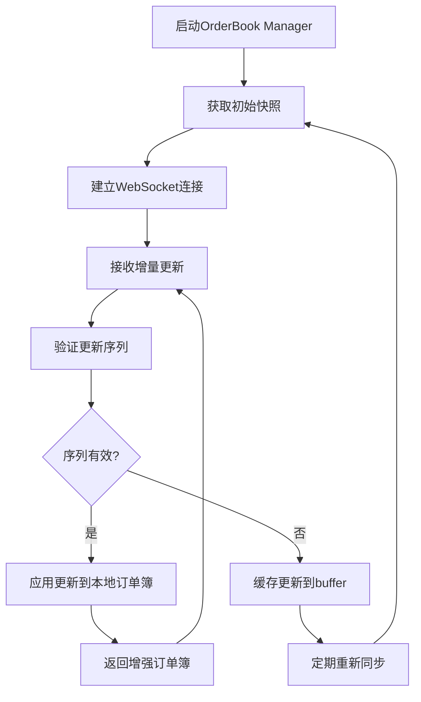

# MarketPrism OrderBook Manager 实时订单簿格式说明

## 概述

MarketPrism的OrderBook Manager是一个高性能的实时订单簿维护系统，支持多交易所的订单簿数据采集、本地维护和实时更新。

## 核心数据结构

### 1. EnhancedOrderBook (增强订单簿)

这是OrderBook Manager维护的主要数据结构，包含完整的订单簿信息：

```python
class EnhancedOrderBook(BaseModel):
    # 基础信息
    exchange_name: str              # 交易所名称 (如: "binance", "okx")
    symbol_name: str                # 交易对名称 (如: "BTCUSDT")
    last_update_id: Optional[int]   # 最后更新ID
    timestamp: datetime             # 数据时间戳
    
    # 订单簿数据
    bids: List[PriceLevel]          # 买单列表 (按价格从高到低排序)
    asks: List[PriceLevel]          # 卖单列表 (按价格从低到高排序)
    
    # 更新信息
    update_type: OrderBookUpdateType    # 更新类型: snapshot/update/delta
    first_update_id: Optional[int]      # 首次更新ID
    prev_update_id: Optional[int]       # 前一个更新ID
    sequence_id: Optional[int]           # 序列ID
    depth_levels: int                    # 深度档位数
    
    # 增量变化 (仅在增量更新时有值)
    bid_changes: Optional[List[PriceLevel]]     # 买单变化
    ask_changes: Optional[List[PriceLevel]]     # 卖单变化
    removed_bids: Optional[List[Decimal]]       # 移除的买单价格
    removed_asks: Optional[List[Decimal]]       # 移除的卖单价格
    
    # 质量控制
    checksum: Optional[int]         # 校验和
    is_valid: bool                  # 数据是否有效
    validation_errors: List[str]    # 验证错误列表
    
    # 时间戳
    collected_at: datetime          # 采集时间
    processed_at: datetime          # 处理时间
```

### 2. PriceLevel (价格档位)

订单簿中每个价格档位的数据结构：

```python
class PriceLevel(BaseModel):
    price: Decimal      # 价格 (使用Decimal确保精度)
    quantity: Decimal   # 数量
```

### 3. OrderBookState (订单簿状态)

内部状态管理结构：

```python
@dataclass
class OrderBookState:
    symbol: str                                 # 交易对
    exchange: str                              # 交易所
    local_orderbook: Optional[OrderBookSnapshot]  # 本地订单簿快照
    update_buffer: deque                       # 更新缓冲区
    last_update_id: int                        # 最后更新ID
    is_synced: bool                           # 是否已同步
    error_count: int                          # 错误计数
    total_updates: int                        # 总更新数
```

## 数据格式示例

### JSON格式输出

```json
{
  "exchange_name": "binance",
  "symbol_name": "BTCUSDT",
  "last_update_id": 12345678,
  "timestamp": "2025-05-28T13:38:24.594563Z",
  "update_type": "snapshot",
  "depth_levels": 40,
  "bids": [
    {
      "price": "45000.00",
      "quantity": "0.1"
    },
    {
      "price": "44999.50", 
      "quantity": "0.15"
    }
  ],
  "asks": [
    {
      "price": "45000.50",
      "quantity": "0.1"
    },
    {
      "price": "45001.00",
      "quantity": "0.15"
    }
  ],
  "is_valid": true,
  "collected_at": "2025-05-28T13:38:24.594590Z"
}
```

### 表格格式显示

```
================================================================================
📊 MarketPrism 实时订单簿格式
================================================================================
🏢 交易所: binance
💱 交易对: BTCUSDT
🔄 更新类型: snapshot
🆔 更新ID: 12345678
📊 深度档位: 40
⏰ 时间戳: 2025-05-28 13:38:24.594563

========================================
📈 买单 (Bids) - 按价格从高到低排序
========================================
档位   价格              数量              总价值            
------------------------------------------------------------
1    45000.00        0.1             4500.000       
2    44999.50        0.15            6749.9250      
3    44999.00        0.2             8999.800       

========================================
📉 卖单 (Asks) - 按价格从低到高排序
========================================
档位   价格              数量              总价值            
------------------------------------------------------------
1    45000.50        0.1             4500.050       
2    45001.00        0.15            6750.1500      
3    45001.50        0.2             9000.300       

========================================
💰 市场信息
========================================
最佳买价: $45000.00
最佳卖价: $45000.50
买卖价差: $0.50
价差百分比: 0.0011%
```

## 工作原理

### 1. 数据同步流程



### 2. 支持的交易所

#### Binance
- **同步算法**: 官方推荐的快照+增量同步
- **深度**: 400档
- **更新频率**: 实时WebSocket推送
- **序列验证**: 通过first_update_id和last_update_id

#### OKX  
- **同步算法**: WebSocket + 定时快照同步
- **深度**: 400档
- **更新频率**: 实时WebSocket推送
- **序列验证**: 通过sequence_id

#### Deribit
- **支持**: 期权和期货订单簿
- **深度**: 可配置
- **更新频率**: 实时WebSocket推送

### 3. 数据特点

- **高精度**: 使用Decimal类型确保价格精度
- **实时性**: 毫秒级延迟的订单簿更新
- **完整性**: 通过序列ID确保无数据丢失
- **容错性**: 自动重连和数据重同步机制
- **统一格式**: 所有交易所数据标准化为统一格式

### 4. 质量控制

- **序列验证**: 检查update_id的连续性
- **数据校验**: 支持checksum验证
- **错误处理**: 自动重试和降级机制
- **缓冲机制**: 处理网络延迟和乱序问题

## API接口

### 获取当前订单簿

```python
orderbook = manager.get_current_orderbook(symbol)
if orderbook:
    print(f"最佳买价: {orderbook.bids[0].price}")
    print(f"最佳卖价: {orderbook.asks[0].price}")
    print(f"深度档位: {orderbook.depth_levels}")
```

### 获取统计信息

```python
stats = manager.get_stats()
print(f"总更新数: {stats['global_stats']['updates_processed']}")
print(f"同步状态: {stats['symbol_stats']['BTCUSDT']['is_synced']}")
```

## 配置参数

```python
config = ExchangeConfig(
    exchange=Exchange.BINANCE,
    market_type=MarketType.SPOT,
    depth_limit=400,                # 深度档位限制
    snapshot_interval=300,          # 快照刷新间隔(秒)
    max_requests_per_minute=1200,   # API请求限制
    ping_interval=30,               # WebSocket心跳间隔
    reconnect_attempts=5,           # 重连尝试次数
)
```

## 性能特性

- **内存优化**: 使用deque缓冲区，限制内存使用
- **网络优化**: 支持代理和连接池
- **并发处理**: 异步处理多个交易对
- **监控集成**: 内置Prometheus指标
- **日志记录**: 结构化日志便于调试

## 使用场景

1. **实时交易**: 为交易算法提供实时订单簿数据
2. **市场分析**: 分析市场深度和流动性
3. **套利检测**: 跨交易所价差监控
4. **风险管理**: 实时监控市场冲击成本
5. **数据存储**: 将订单簿数据存储到ClickHouse

## 注意事项

1. **网络依赖**: 需要稳定的网络连接
2. **API限制**: 遵守交易所API频率限制
3. **内存管理**: 监控缓冲区大小避免内存泄漏
4. **时间同步**: 确保系统时间准确
5. **错误处理**: 实现适当的错误恢复机制