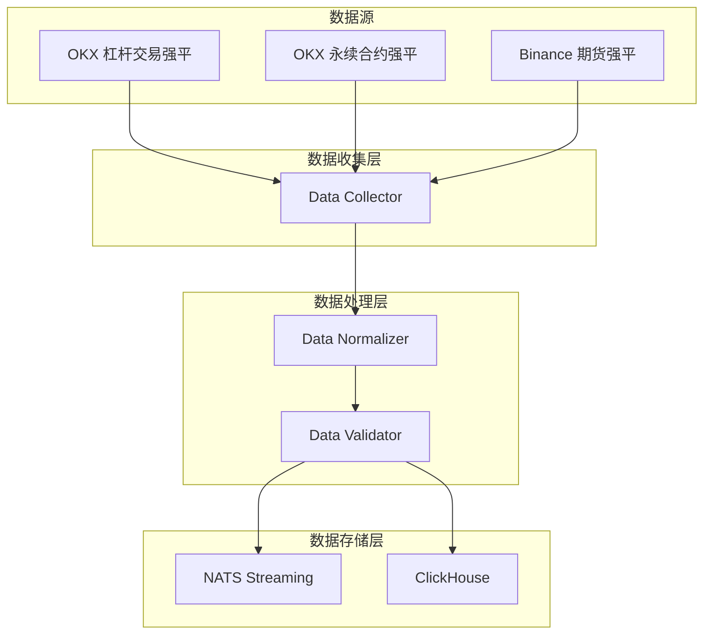

# MarketPrism 强平订单数据处理技术指南

## 📋 概述

本文档详细说明了MarketPrism项目中强平订单数据的收集、标准化、存储和监控流程。强平订单数据是重要的市场风险指标，能够帮助识别市场压力和流动性风险。

## ⚠️ 重要说明：数据源限制

### 杠杆交易强平订单的独特性

| 交易所 | 杠杆交易强平 | 永续合约强平 | 期货合约强平 |
|--------|-------------|-------------|-------------|
| **OKX** | ✅ **支持按symbol订阅** | ✅ 支持 | ✅ 支持 |
| **Binance** | ❌ **不支持按symbol订阅** | ✅ 支持 | ✅ 支持 |

**关键点**：
- **杠杆交易强平订单**：仅OKX提供按symbol订阅功能
- **Binance杠杆风险监控**：需要使用用户数据流的Margin Call事件（账户级别）
- **永续/期货强平**：两个交易所都支持按symbol订阅

## 🏗️ 系统架构



## 📊 数据类型定义

### 强平订单标准化数据结构

```python
class NormalizedLiquidation(BaseModel):
    # 基础信息
    exchange_name: str              # 交易所名称: "okx", "binance"
    symbol_name: str                # 标准交易对格式: "BTC-USDT"
    product_type: ProductType       # 产品类型: MARGIN/SWAP/FUTURES
    instrument_id: str              # 原始产品ID
    
    # 强平订单信息
    liquidation_id: str             # 强平订单ID
    side: LiquidationSide          # 强平方向: BUY/SELL
    status: LiquidationStatus      # 强平状态: FILLED/PARTIALLY_FILLED/etc.
    
    # 价格和数量
    price: Decimal                  # 强平价格
    quantity: Decimal               # 强平数量
    filled_quantity: Decimal        # 已成交数量
    average_price: Optional[Decimal] # 平均成交价格
    notional_value: Decimal         # 名义价值
    
    # 时间信息
    liquidation_time: datetime      # 强平时间
    timestamp: datetime             # 数据时间戳
    collected_at: datetime          # 采集时间
    
    # 扩展信息
    margin_ratio: Optional[Decimal] # 保证金率 (仅OKX)
    bankruptcy_price: Optional[Decimal] # 破产价格
    raw_data: Optional[Dict]        # 原始数据
```

## 🔄 数据标准化流程

### OKX 强平订单标准化

#### 支持的产品类型
- **MARGIN**: 杠杆交易 (OKX独有功能)
- **SWAP**: 永续合约
- **FUTURES**: 期货合约

#### 原始数据格式
```json
{
  "arg": {
    "channel": "liquidation-orders",
    "instType": "MARGIN",
    "instId": "BTC-USDT"
  },
  "data": [{
    "instType": "MARGIN",
    "instId": "BTC-USDT",
    "side": "sell",
    "sz": "0.1",
    "bkPx": "45000.5",
    "state": "filled",
    "fillSz": "0.1",
    "fillPx": "45000.5",
    "mgnRatio": "0.02",
    "ts": "1672531200000"
  }]
}
```

#### 标准化映射规则
| 标准字段 | OKX字段 | 转换规则 |
|----------|---------|----------|
| exchange_name | - | 固定值 "okx" |
| symbol_name | instId | 格式转换为 BTC-USDT |
| product_type | instType | MARGIN/SWAP/FUTURES |
| price | bkPx | 破产价格 |
| quantity | sz | 强平数量 |
| filled_quantity | fillSz | 已成交数量 |
| average_price | fillPx | 平均成交价格 |
| margin_ratio | mgnRatio | 保证金率 (仅OKX提供) |
| timestamp | ts | 毫秒时间戳转UTC |

### Binance 强平订单标准化

#### 支持的产品类型
- **SWAP**: 永续合约 (USDⓈ-M)
- **FUTURES**: 期货合约 (COIN-M)

#### 原始数据格式
```json
{
  "e": "forceOrder",
  "E": 1672531200000,
  "o": {
    "s": "BTCUSDT",
    "S": "SELL",
    "o": "LIMIT",
    "f": "IOC",
    "q": "0.1",
    "p": "45000.5",
    "ap": "45000.5",
    "X": "FILLED",
    "l": "0.1",
    "z": "0.1",
    "T": 1672531200000
  }
}
```

#### 标准化映射规则
| 标准字段 | Binance字段 | 转换规则 |
|----------|-------------|----------|
| exchange_name | - | 固定值 "binance" |
| symbol_name | o.s | 格式转换为 BTC-USDT |
| product_type | - | 根据symbol格式推断 |
| price | o.p | 强平价格 |
| quantity | o.q | 强平数量 |
| filled_quantity | o.z | 已成交数量 |
| average_price | o.ap | 平均成交价格 |
| timestamp | o.T | 毫秒时间戳转UTC |

## 💾 数据存储设计

### ClickHouse 表结构

```sql
CREATE TABLE marketprism.liquidations
(
    exchange_name LowCardinality(String),
    symbol_name String,
    product_type LowCardinality(String),
    instrument_id String,
    liquidation_id String,
    side LowCardinality(String),
    status LowCardinality(String),
    price Decimal64(8),
    quantity Decimal64(8),
    filled_quantity Decimal64(8),
    average_price Nullable(Decimal64(8)),
    notional_value Decimal64(8),
    liquidation_time DateTime64(3, 'UTC'),
    timestamp DateTime64(3, 'UTC'),
    collected_at DateTime64(3, 'UTC'),
    margin_ratio Nullable(Decimal64(8)),
    bankruptcy_price Nullable(Decimal64(8)),
    raw_data String
)
ENGINE = MergeTree()
PARTITION BY (exchange_name, toYYYYMM(liquidation_time))
ORDER BY (exchange_name, symbol_name, liquidation_time, liquidation_id)
TTL liquidation_time + INTERVAL 90 DAY;
```

### 数据分区策略
- **分区键**: `(exchange_name, toYYYYMM(liquidation_time))`
- **排序键**: `(exchange_name, symbol_name, liquidation_time, liquidation_id)`
- **TTL**: 90天自动删除历史数据

### 物化视图
1. **小时聚合统计**: `liquidations_hourly_stats`
2. **大额强平监控**: `large_liquidations` (>$100K)

## 📊 数据监控

### 基础监控指标
- 实时强平数量统计
- 按交易所/产品类型分布
- 强平时间序列数据
- 大额强平订单记录

### 专用数据视图
- **杠杆交易强平视图**: 仅显示OKX杠杆交易强平数据
- **实时监控视图**: 最近1小时强平数据
- **24小时概览**: 强平统计汇总

## 🔧 配置文件

### 数据收集器配置
```yaml
# config/collector/unified_data_collection.yaml
# 🔧 配置文件清理：强平配置已整合到统一配置文件中

data_types:
  # 强平订单数据配置
  liquidation:
    method: "websocket"
    real_time: true
    exchanges: ["binance_derivatives", "okx_derivatives"]
    filters:
      min_value_usd: 1000
      max_value_usd: 10000000
    alerts:
      large_liquidation_threshold: 100000

exchanges:
  # OKX 衍生品（包含永续合约和杠杆交易）
  okx_derivatives:
    exchange: "okx_derivatives"
    market_type: "perpetual"
    symbols: ["BTC-USDT-SWAP", "ETH-USDT-SWAP"]
    data_types: ["orderbook", "trade", "liquidation"]

  # Binance 衍生品（期货）
  binance_derivatives:
    exchange: "binance_derivatives"
    market_type: "perpetual"
    symbols: ["BTCUSDT", "ETHUSDT"]
    data_types: ["orderbook", "trade", "liquidation"]
```

## 🚀 部署和使用

### 1. 启动数据收集
```bash
# 启动强平订单收集器
docker-compose up -d data-collector

# 检查收集状态
curl http://localhost:8080/api/v1/status
```

### 2. 验证数据流
```sql
-- 检查最近收到的强平数据
SELECT 
    exchange_name,
    symbol_name,
    product_type,
    count() as count,
    max(collected_at) as last_update
FROM marketprism.liquidations
WHERE collected_at >= now() - INTERVAL 1 HOUR
GROUP BY exchange_name, symbol_name, product_type;
```

### 3. 数据监控
```bash
# 检查数据收集状态
curl http://localhost:8080/api/v1/liquidations/status

# 查看最近强平数据
curl http://localhost:8080/api/v1/liquidations/recent
```

## 🔍 故障排查

### 常见问题

#### 1. OKX杠杆交易数据缺失
- **检查**: 确认订阅的是 `instType=MARGIN`
- **验证**: 检查WebSocket连接状态
- **解决**: 重启收集器服务

#### 2. Binance杠杆数据无法订阅
- **原因**: Binance不支持杠杆交易强平按symbol订阅
- **解决**: 这是正常现象，仅OKX支持此功能

#### 3. 数据标准化失败
- **检查**: 查看normalizer错误日志
- **验证**: 确认原始数据格式正确
- **解决**: 更新标准化规则

### 日志分析
```bash
# 查看强平数据收集日志
tail -f logs/liquidation.log

# 查看标准化错误日志
tail -f logs/liquidation_errors.log

# 查看数据处理日志
tail -f logs/liquidation_processing.log
```

## 📚 API参考

### 数据标准化API
```python
from collector.normalizer import DataNormalizer

normalizer = DataNormalizer()

# OKX强平订单标准化
okx_liquidation = normalizer.normalize_okx_liquidation(raw_data)

# Binance强平订单标准化
binance_liquidation = normalizer.normalize_binance_liquidation(raw_data)
```

### 查询API示例
```python
# 查询最近大额强平
query = """
SELECT * FROM marketprism.liquidations
WHERE liquidation_time >= now() - INTERVAL 1 HOUR
  AND notional_value >= 100000
ORDER BY notional_value DESC
"""

# 查询杠杆交易强平 (仅OKX)
margin_query = """
SELECT * FROM marketprism.margin_liquidations
WHERE liquidation_time >= now() - INTERVAL 24 HOUR
ORDER BY liquidation_time DESC
"""
```

## 📝 最佳实践

### 1. 数据质量保证
- 实施数据验证规则
- 监控数据完整性
- 定期检查数据一致性

### 2. 性能优化
- 合理设置分区策略
- 优化查询索引
- 控制数据保留期限

### 3. 数据监控
- 定期检查数据完整性
- 监控数据处理延迟
- 验证数据质量指标

### 4. 安全考虑
- 保护敏感数据
- 控制访问权限
- 审计数据访问

---

**注意**: 本文档基于MarketPrism v1.0架构设计，如有更新请参考最新版本文档。
