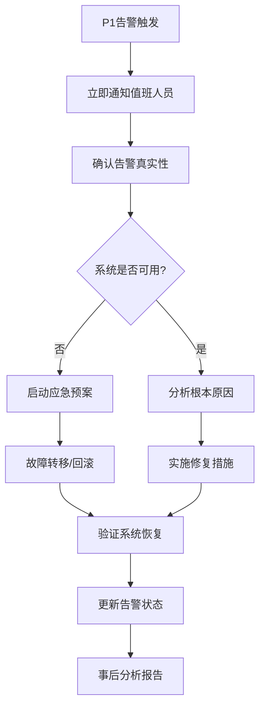

# 🔧 MarketPrism项目维护和支持指南

## 📋 概述

本指南提供了MarketPrism项目的完整维护策略、支持流程和最佳实践，确保系统长期稳定运行和持续改进。

## 🗓️ 维护计划

### 日常维护任务（每日）

#### 🔍 系统健康检查
```bash
#!/bin/bash
# scripts/daily_health_check.sh

echo "📅 $(date): MarketPrism日常健康检查"

# 1. 检查服务状态
echo "🔧 检查Docker服务状态..."
docker-compose ps

# 2. 检查系统资源
echo "💻 检查系统资源使用..."
df -h
free -h
top -bn1 | head -20

# 3. 检查API健康
echo "🌐 检查API健康状态..."
curl -s http://localhost:8080/health | jq '.'

# 4. 检查告警状态
echo "🚨 检查告警系统状态..."
python scripts/test_alerting_system.py

# 5. 检查日志错误
echo "📝 检查错误日志..."
docker-compose logs --since=24h | grep -i error | tail -10

# 6. 生成日报
echo "📊 生成系统状态日报..."
python scripts/monitoring_and_maintenance.py
```

#### 📊 性能监控
- **API响应时间**: 监控各交易所API响应时间
- **系统资源**: CPU、内存、磁盘使用率
- **数据库性能**: 查询时间、连接数、锁等待
- **缓存效率**: Redis命中率、内存使用
- **网络状态**: 带宽使用、连接数、错误率

### 每周维护任务

#### 🧹 系统清理
```bash
#!/bin/bash
# scripts/weekly_maintenance.sh

echo "📅 $(date): MarketPrism每周维护"

# 1. 清理Docker资源
echo "🐳 清理Docker资源..."
docker system prune -f
docker volume prune -f

# 2. 清理日志文件
echo "📝 清理过期日志..."
find /var/log/marketprism -name "*.log.*" -mtime +7 -delete

# 3. 数据库维护
echo "🗄️ 数据库维护..."
docker-compose exec postgres psql -U marketprism_user -d marketprism -c "
VACUUM ANALYZE;
REINDEX DATABASE marketprism;
"

# 4. 备份数据
echo "💾 备份重要数据..."
./scripts/backup_data.sh

# 5. 更新依赖
echo "📦 检查依赖更新..."
docker-compose pull

# 6. 生成周报
echo "📊 生成系统周报..."
python scripts/generate_weekly_report.py
```

#### 📈 性能分析
- **趋势分析**: 一周内性能指标变化趋势
- **容量规划**: 资源使用增长预测
- **瓶颈识别**: 性能瓶颈点分析
- **优化建议**: 基于数据的优化建议

### 每月维护任务

#### 🔄 系统更新
```bash
#!/bin/bash
# scripts/monthly_maintenance.sh

echo "📅 $(date): MarketPrism每月维护"

# 1. 系统更新
echo "🔄 系统更新..."
sudo apt update && sudo apt upgrade -y

# 2. 安全扫描
echo "🔒 安全扫描..."
docker run --rm -v $(pwd):/app clair-scanner:latest /app

# 3. 性能基准测试
echo "⚡ 性能基准测试..."
python scripts/performance_benchmark.py

# 4. 配置审计
echo "⚙️ 配置审计..."
python scripts/config_audit.py

# 5. 灾难恢复测试
echo "🚨 灾难恢复测试..."
./scripts/disaster_recovery_test.sh

# 6. 生成月报
echo "📊 生成系统月报..."
python scripts/generate_monthly_report.py
```

## 🚨 故障处理流程

### 告警响应流程

#### P1级告警（严重 - 5分钟内响应）


#### 应急响应检查清单
- [ ] **立即响应**（0-5分钟）
  - [ ] 确认告警接收
  - [ ] 评估影响范围
  - [ ] 通知相关团队
  - [ ] 启动事故响应

- [ ] **初步诊断**（5-15分钟）
  - [ ] 检查系统状态
  - [ ] 查看错误日志
  - [ ] 确认根本原因
  - [ ] 评估修复方案

- [ ] **修复实施**（15-30分钟）
  - [ ] 实施修复措施
  - [ ] 验证修复效果
  - [ ] 监控系统稳定性
  - [ ] 更新告警状态

- [ ] **事后处理**（30分钟后）
  - [ ] 编写事故报告
  - [ ] 分析根本原因
  - [ ] 制定预防措施
  - [ ] 更新运维文档

### 常见故障处理

#### 🔴 服务不可用
```bash
# 诊断步骤
echo "🔍 诊断服务不可用问题..."

# 1. 检查容器状态
docker-compose ps

# 2. 查看服务日志
docker-compose logs data-collector

# 3. 检查端口占用
netstat -tlnp | grep 8080

# 4. 检查系统资源
free -h && df -h

# 修复措施
echo "🔧 尝试修复..."

# 1. 重启服务
docker-compose restart data-collector

# 2. 如果失败，重新部署
docker-compose down && docker-compose up -d

# 3. 验证恢复
curl http://localhost:8080/health
```

#### 🟡 API响应慢
```bash
# 诊断API性能问题
echo "🔍 诊断API性能问题..."

# 1. 检查API响应时间
curl -w "@curl-format.txt" -o /dev/null -s http://localhost:8080/api/v1/exchanges/binance/ping

# 2. 检查数据库连接
docker-compose exec postgres psql -U marketprism_user -c "SELECT count(*) FROM pg_stat_activity;"

# 3. 检查Redis状态
docker-compose exec redis redis-cli info stats

# 4. 检查网络延迟
ping -c 5 api.binance.com

# 优化措施
echo "⚡ 实施优化..."

# 1. 清理缓存
docker-compose exec redis redis-cli FLUSHDB

# 2. 重启数据库连接池
docker-compose restart data-collector

# 3. 检查代理配置
python scripts/okx_api_integration_optimizer.py
```

## 📊 监控和告警管理

### 监控仪表板配置

#### Grafana仪表板
```json
{
  "dashboard": {
    "title": "MarketPrism System Overview",
    "panels": [
      {
        "title": "API Response Time",
        "type": "graph",
        "targets": [
          {
            "expr": "histogram_quantile(0.95, api_response_time_seconds)",
            "legendFormat": "95th percentile"
          }
        ]
      },
      {
        "title": "System Resources",
        "type": "singlestat",
        "targets": [
          {
            "expr": "cpu_usage_percent",
            "legendFormat": "CPU Usage"
          }
        ]
      },
      {
        "title": "Active Alerts",
        "type": "table",
        "targets": [
          {
            "expr": "ALERTS{alertstate=\"firing\"}",
            "legendFormat": "Active Alerts"
          }
        ]
      }
    ]
  }
}
```

### 告警规则优化

#### 动态阈值调整
```python
# scripts/optimize_alert_thresholds.py
class AlertThresholdOptimizer:
    def __init__(self):
        self.historical_data = self.load_historical_metrics()
        self.current_thresholds = self.load_current_thresholds()
    
    def analyze_false_positive_rate(self, rule_name: str) -> float:
        """分析误报率"""
        alerts = self.get_alert_history(rule_name, days=30)
        false_positives = [a for a in alerts if a.was_false_positive]
        return len(false_positives) / len(alerts) if alerts else 0
    
    def suggest_threshold_adjustment(self, rule_name: str) -> Dict[str, Any]:
        """建议阈值调整"""
        false_positive_rate = self.analyze_false_positive_rate(rule_name)
        
        if false_positive_rate > 0.2:  # 误报率超过20%
            # 建议提高阈值
            current_threshold = self.current_thresholds[rule_name]
            suggested_threshold = current_threshold * 1.2
            
            return {
                'action': 'increase_threshold',
                'current': current_threshold,
                'suggested': suggested_threshold,
                'reason': f'误报率过高: {false_positive_rate:.1%}'
            }
        
        return {'action': 'no_change', 'reason': '阈值合适'}
```

## 🔄 备份和恢复

### 自动备份策略

#### 数据备份脚本
```bash
#!/bin/bash
# scripts/backup_data.sh

BACKUP_DIR="/backup/marketprism"
DATE=$(date +%Y%m%d_%H%M%S)

echo "💾 开始数据备份: $DATE"

# 1. 创建备份目录
mkdir -p $BACKUP_DIR/$DATE

# 2. 备份数据库
echo "🗄️ 备份PostgreSQL数据库..."
docker-compose exec -T postgres pg_dump -U marketprism_user marketprism > $BACKUP_DIR/$DATE/postgres_backup.sql

# 3. 备份Redis数据
echo "📦 备份Redis数据..."
docker-compose exec -T redis redis-cli BGSAVE
docker cp $(docker-compose ps -q redis):/data/dump.rdb $BACKUP_DIR/$DATE/redis_backup.rdb

# 4. 备份配置文件
echo "⚙️ 备份配置文件..."
cp -r config/ $BACKUP_DIR/$DATE/
cp .env $BACKUP_DIR/$DATE/
cp docker-compose.yml $BACKUP_DIR/$DATE/

# 5. 压缩备份
echo "🗜️ 压缩备份文件..."
cd $BACKUP_DIR
tar -czf marketprism_backup_$DATE.tar.gz $DATE/
rm -rf $DATE/

# 6. 清理旧备份（保留30天）
find $BACKUP_DIR -name "marketprism_backup_*.tar.gz" -mtime +30 -delete

echo "✅ 备份完成: marketprism_backup_$DATE.tar.gz"
```

#### 灾难恢复测试
```bash
#!/bin/bash
# scripts/disaster_recovery_test.sh

echo "🚨 灾难恢复测试开始"

# 1. 创建测试环境
echo "🧪 创建测试环境..."
cp docker-compose.yml docker-compose.test.yml
sed -i 's/8080:8080/8081:8080/g' docker-compose.test.yml

# 2. 停止测试服务
docker-compose -f docker-compose.test.yml down

# 3. 恢复最新备份
echo "💾 恢复最新备份..."
LATEST_BACKUP=$(ls -t /backup/marketprism/marketprism_backup_*.tar.gz | head -1)
tar -xzf $LATEST_BACKUP -C /tmp/

# 4. 启动测试环境
echo "🚀 启动测试环境..."
docker-compose -f docker-compose.test.yml up -d

# 5. 验证恢复
echo "✅ 验证恢复结果..."
sleep 30
curl http://localhost:8081/health

# 6. 清理测试环境
echo "🧹 清理测试环境..."
docker-compose -f docker-compose.test.yml down
rm docker-compose.test.yml
rm -rf /tmp/marketprism_backup_*

echo "🎉 灾难恢复测试完成"
```

## 📞 支持和联系

### 技术支持层级

#### L1支持（运维团队）
- **响应时间**: 24/7，5分钟内响应P1告警
- **职责范围**: 
  - 系统监控和告警响应
  - 基础故障排除
  - 日常维护任务执行
  - 用户问题初步处理

#### L2支持（开发团队）
- **响应时间**: 工作时间，30分钟内响应
- **职责范围**:
  - 复杂技术问题诊断
  - 代码级别故障修复
  - 性能优化实施
  - 新功能开发支持

#### L3支持（架构师团队）
- **响应时间**: 2小时内响应重大架构问题
- **职责范围**:
  - 架构级别问题解决
  - 重大技术决策
  - 灾难恢复指导
  - 长期技术规划

### 联系方式

#### 紧急联系
- **P1告警**: 立即电话 +86-xxx-xxxx-xxxx
- **P2告警**: 30分钟内邮件 alerts@marketprism.com
- **一般问题**: 工作时间内 support@marketprism.com

#### 技术资源
- **GitHub仓库**: https://github.com/MNS-Vic/marketprism
- **文档中心**: https://docs.marketprism.com
- **监控面板**: https://monitoring.marketprism.com
- **状态页面**: https://status.marketprism.com

### 知识库和文档

#### 运维手册
- [生产部署指南](../deployment/PRODUCTION_DEPLOYMENT_GUIDE.md)
- [告警系统运维手册](../deployment/ALERTING_SYSTEM_OPERATIONS_GUIDE.md)
- [OKX代理配置指南](../deployment/OKX_PROXY_CONFIGURATION_GUIDE.md)
- [故障排除指南](../deployment/TROUBLESHOOTING_GUIDE.md)

#### 开发文档
- [API文档](../api/README.md)
- [架构设计文档](../architecture/README.md)
- [性能优化路线图](../optimization/PERFORMANCE_OPTIMIZATION_ROADMAP.md)
- [安全最佳实践](../security/SECURITY_BEST_PRACTICES.md)

## 📈 持续改进

### 性能优化循环
1. **监控**: 持续收集性能指标
2. **分析**: 识别性能瓶颈和优化机会
3. **计划**: 制定优化方案和实施计划
4. **实施**: 执行优化措施
5. **验证**: 验证优化效果
6. **文档**: 更新文档和最佳实践

### 技术债务管理
- **定期评估**: 每季度评估技术债务
- **优先级排序**: 基于业务影响和技术风险
- **计划还债**: 在开发计划中分配时间
- **预防措施**: 代码审查和架构评审

### 团队能力建设
- **技术培训**: 定期技术分享和培训
- **最佳实践**: 建立和维护最佳实践库
- **工具改进**: 持续改进开发和运维工具
- **知识传承**: 文档化关键知识和经验

---

**维护指南版本**: v1.0  
**最后更新**: 2025-06-21  
**维护团队**: MarketPrism运维团队
