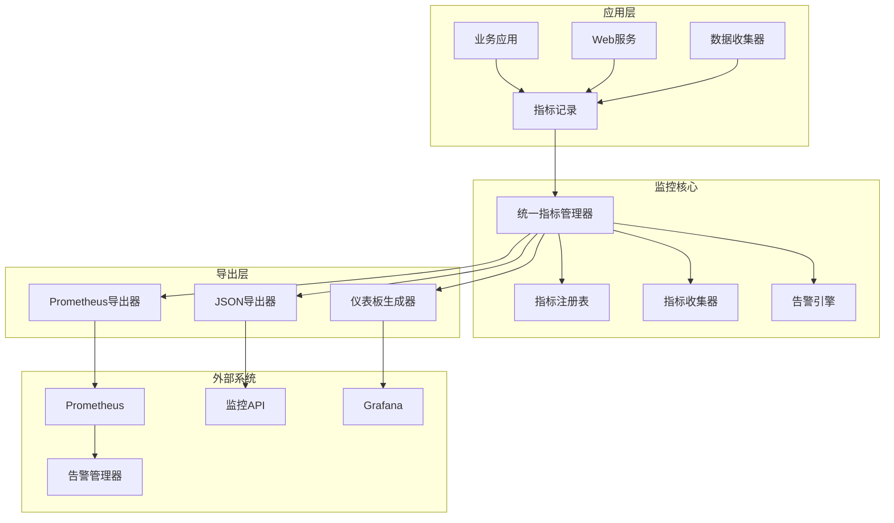

# MarketPrism 统一监控系统

## 概述

MarketPrism统一监控系统（Week 2）提供了一个标准化、可扩展的监控基础设施，用于收集、处理和导出应用程序及系统指标。该系统设计为高性能、线程安全，并支持多种导出格式。

## 核心特性

### 🎯 统一指标管理
- **标准化指标定义**: 支持Counter、Gauge、Histogram、Summary、Timer等指标类型
- **分类管理**: 按业务、系统、性能、网络等维度组织指标
- **自动命名规范**: 符合Prometheus规范的指标命名
- **元数据支持**: 完整的指标描述、标签、单位等信息

### 📊 多格式导出
- **Prometheus格式**: 完全兼容Prometheus采集
- **JSON格式**: 支持RESTful API和自定义集成
- **Grafana仪表板**: 自动生成可视化配置

### 🔍 实时监控
- **自动收集**: 可配置的指标收集器
- **事件驱动**: 实时指标变化通知
- **健康检查**: 系统状态监控
- **性能统计**: 运行时性能分析

### 🚨 智能告警
- **灵活规则**: 支持多种条件和阈值
- **持续时间**: 避免虚假告警
- **分级处理**: 按严重程度分类
- **自定义消息**: 详细的告警描述

### ⚡ 高性能设计
- **线程安全**: 支持高并发环境
- **内存优化**: 高效的数据结构
- **异步处理**: 非阻塞指标收集
- **批量操作**: 优化的批量导出

## 架构设计



## 核心组件

### 1. 指标管理器 (UnifiedMetricsManager)

主要管理类，提供完整的指标管理功能：

```python
from marketprism_collector.core.monitoring import get_global_manager

# 获取全局管理器
manager = get_global_manager()

# 注册指标
manager.registry.register_custom_metric(
    "api_requests_total",
    MetricType.COUNTER,
    MetricCategory.API,
    "API请求总数",
    labels=["method", "endpoint"]
)

# 记录指标值
manager.increment("api_requests_total", 1, {"method": "GET", "endpoint": "/users"})
```

### 2. 指标注册表 (MetricRegistry)

管理所有指标的注册、查找和生命周期：

```python
from marketprism_collector.core.monitoring import MetricRegistry, MetricType, MetricCategory

registry = MetricRegistry()

# 注册自定义指标
registry.register_custom_metric(
    name="custom_gauge",
    metric_type=MetricType.GAUGE,
    category=MetricCategory.BUSINESS,
    description="自定义业务指标"
)

# 获取指标
metric = registry.get_metric("custom_gauge")
metric.set_value(42.0, {"component": "user_service"})
```

### 3. 指标收集器 (MetricCollector)

自动收集系统或应用指标：

```python
from marketprism_collector.core.monitoring import MetricCollector

class CustomCollector(MetricCollector):
    def collect_metrics(self):
        return {
            "queue_size": get_queue_size(),
            "active_workers": get_active_workers(),
            "cpu_usage": get_cpu_usage()
        }
    
    def get_collection_interval(self):
        return 10  # 10秒收集一次

# 注册收集器
manager.register_collector("custom", CustomCollector())
```

### 4. 导出器系统

支持多种格式的指标导出：

#### Prometheus导出器
```python
from marketprism_collector.core.monitoring.exporters import PrometheusExporter

exporter = PrometheusExporter(include_help=True)
prometheus_data = exporter.export_metrics(manager.registry.get_all_metrics())
```

#### JSON导出器
```python
from marketprism_collector.core.monitoring.exporters import JSONExporter

exporter = JSONExporter(pretty_print=True, include_metadata=True)
json_data = exporter.export_metrics(manager.registry.get_all_metrics())
```

#### Grafana仪表板生成器
```python
from marketprism_collector.core.monitoring.exporters import create_grafana_dashboard

dashboard = create_grafana_dashboard(
    manager.registry.get_all_metrics(),
    dashboard_title="系统监控",
    refresh_interval="30s"
)
```

## 指标类型

### Counter (计数器)
累积性指标，只能增加：
```python
manager.increment("requests_total", 1, {"status": "200"})
```

### Gauge (仪表)
瞬时值指标，可增可减：
```python
manager.set_gauge("active_connections", 42)
```

### Histogram (直方图)
观察值分布，如响应时间：
```python
manager.observe_histogram("request_duration", 0.5, {"endpoint": "/api"})
```

### Timer (计时器)
便捷的时间测量：
```python
with manager.timer("operation_duration", {"type": "database"}):
    # 执行数据库操作
    perform_database_operation()
```

## 告警系统

### 创建告警规则
```python
from marketprism_collector.core.monitoring import AlertRule, MetricSeverity

rule = AlertRule(
    metric_name="cpu_usage_percent",
    condition=">",
    threshold=80.0,
    severity=MetricSeverity.HIGH,
    message="CPU使用率过高",
    duration=60  # 持续1分钟触发
)

manager.add_alert_rule(rule)
```

### 检查告警
```python
alerts = manager.check_alerts()
for alert in alerts:
    print(f"告警: {alert['message']}, 当前值: {alert['value']}")
```

## 指标分类

系统支持多种指标分类：

- **BUSINESS**: 业务指标（订单量、用户数等）
- **DATA_QUALITY**: 数据质量指标
- **MARKET_DATA**: 市场数据指标
- **SYSTEM**: 系统指标（进程、线程等）
- **PERFORMANCE**: 性能指标（延迟、吞吐量等）
- **RESOURCE**: 资源指标（CPU、内存等）
- **NETWORK**: 网络指标（连接数、流量等）
- **API**: API指标（请求数、响应时间等）
- **WEBSOCKET**: WebSocket指标
- **RELIABILITY**: 可靠性指标
- **ERROR**: 错误指标
- **SECURITY**: 安全指标

## 最佳实践

### 1. 指标命名
- 使用描述性名称
- 包含单位信息（如 `_bytes`, `_seconds`）
- 遵循 `<namespace>_<component>_<metric>_<unit>` 格式

### 2. 标签使用
- 保持标签数量适中（避免高基数）
- 使用有意义的标签名
- 避免在标签中包含敏感信息

### 3. 性能优化
- 批量记录指标
- 合理设置收集间隔
- 监控系统自身的性能

### 4. 告警配置
- 设置合理的阈值
- 使用持续时间避免虚假告警
- 按严重程度分级处理

## 集成示例

### Web服务集成
```python
from marketprism_collector.core.monitoring import get_global_manager

class WebServiceMonitor:
    def __init__(self):
        self.manager = get_global_manager()
        self.setup_metrics()
    
    def record_request(self, method, endpoint, status_code, duration):
        # 记录请求数
        self.manager.increment(
            "http_requests_total",
            1,
            {"method": method, "endpoint": endpoint, "status": str(status_code)}
        )
        
        # 记录响应时间
        self.manager.observe_histogram(
            "http_request_duration_seconds",
            duration,
            {"method": method, "endpoint": endpoint}
        )
```

### 自动收集系统指标
```python
import psutil
from marketprism_collector.core.monitoring import MetricCollector

class SystemMetricsCollector(MetricCollector):
    def collect_metrics(self):
        return {
            "cpu_usage_percent": psutil.cpu_percent(),
            "memory_usage_bytes": psutil.virtual_memory().used,
            "disk_usage_bytes": psutil.disk_usage('/').used
        }
```

## 部署和配置

### 基本配置
```python
# 启动监控
manager = get_global_manager()
manager.start_collection(interval=30)  # 30秒收集间隔

# 暴露Prometheus端点
from marketprism_collector.core.monitoring.exporters import PrometheusMetricsHandler
handler = PrometheusMetricsHandler(manager)
metrics_content, content_type = handler.get_metrics()
```

### Prometheus集成
在 `prometheus.yml` 中添加采集目标：
```yaml
scrape_configs:
  - job_name: 'marketprism'
    static_configs:
      - targets: ['localhost:8080']
    scrape_interval: 30s
    metrics_path: '/metrics'
```

### Grafana集成
1. 导入自动生成的仪表板配置
2. 配置Prometheus数据源
3. 创建告警规则

## 故障排除

### 常见问题

1. **指标未显示**
   - 检查指标名称是否正确
   - 确认标签匹配
   - 验证收集器是否运行

2. **性能问题**
   - 减少标签基数
   - 优化收集间隔
   - 检查内存使用

3. **告警未触发**
   - 验证阈值设置
   - 检查持续时间配置
   - 确认指标数据存在

### 调试工具
```python
# 查看系统状态
health = manager.get_health_status()
print(f"状态: {health['status']}, 健康: {health['healthy']}")

# 查看统计信息
stats = manager.get_stats()
print(f"指标数: {stats['registry_stats']['total_metrics']}")
print(f"收集器数: {stats['collectors']}")

# 导出调试信息
debug_info = manager.export_metrics("json")
```

## 版本历史

- **v1.1.0** (Week 2): 统一监控系统
  - 统一指标管理器
  - 多格式导出支持
  - 智能告警系统
  - 自动仪表板生成

## 相关文档

- [架构设计文档](./architecture.md)
- [API参考文档](./api_reference.md)
- [部署指南](./deployment.md)
- [示例代码](../../examples/monitoring/)

## 下一步计划

Week 3将实现统一配置管理系统，进一步提升系统的可配置性和运维便利性。