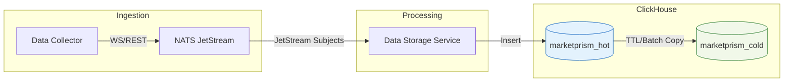
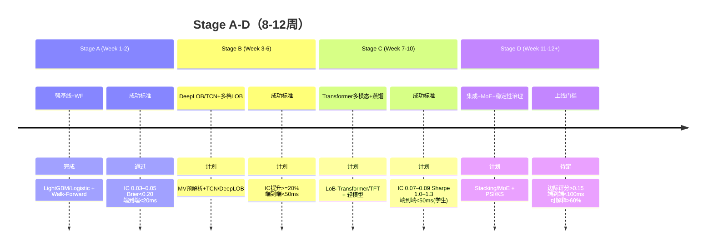
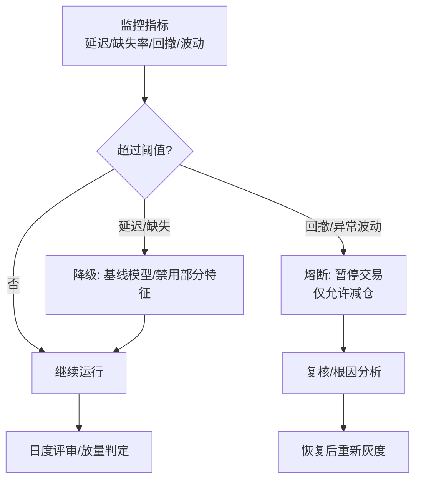
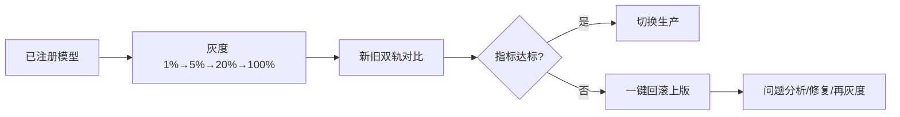

# 文档导读与重构导航（P0 导入，不改动原始正文）

本节为“重构导读”与“统一规范基线”，便于新手快速上手、专家直达可执行内容。后续P1将把正文物理迁移到新的章节结构；P0阶段不删除原内容，仅在顶部增加导读。

- 状态总览：
  - ✅ Done：数据基座/双流架构、ClickHouse 热/冷、8数据类型入库、Schema 快照、工程约束
  - 🟡 Planned：Stage A→D 路线推进、Transformer 教师→蒸馏、灰度与回滚
  - 🧪 Exploratory：Footprint 增强、PINN 约束、复杂 GNN
- 分层阅读路径：
  - 新手：导读 → 现状 → 路线 → 基础特征(5.1) → 最小闭环(6.1) → 上线门槛/延迟预算(8)
  - 专家：采用门槛(3) → 特征工程(5) → 防泄露(6) → 模型与服务化(7) → 上线/灰度(8) → 附录A/B

---

## 统一可视化与代码规范（全篇适用）

- Mermaid 图表风格（统一）：
  - 方向：数据流类用 LR；流程/决策用 TD
  - 配色：Hot=#e3f2fd、Cold=#f1f8e9、Feature=#fff3e0、Serving=#fce4ec、Broker=#f3e5f5
  - 命名：DC/NATS/SS/CH_HOT/CH_COLD/MV/Model；每图含标题与Legend；节点≤7个，注明输入/输出/责任边界

```mermaid
flowchart LR
  DC[Collector] --> NATS[JetStream] --> SS[Storage] --> CH_HOT[(CH Hot)] --> CH_COLD[(CH Cold)]
  CH_HOT --> MV[(Features MV)]
  classDef hot fill:#e3f2fd,stroke:#1565c0; classDef cold fill:#f1f8e9,stroke:#2e7d32;
  class CH_HOT hot; class CH_COLD cold;
```

- 代码示例头部注释模板（SQL/Python 统一）：

```
# 用途: 生产/验证/示例
# 输入: 表/视图/参数
# 输出: 表/视图/文件/指标
# 依赖: 包/版本/前置MV
# 状态: Done/Planned/Exploratory
```

---

## 重构后目录蓝图（P0 导读；P1 将物理迁移重排）

Mermaid：文档总览导图（导航）
```mermaid
flowchart LR
  DATA[数据管线\n(Collector/NATS/Storage)]:::broker
  FEATURE[特征工程\n(MV/As-of)]:::feature
  MODELING[建模\n(DeepLOB/TCN/Distill)]
  SERVING[服务\n(ONNX/ORT)]:::serving
  MONITORING[监控\n(PSI/KS/Lead-Lag)]:::serving
  APPENDIX[附录 A/B\n(可执行汇编)]:::feature

  DATA --> FEATURE --> MODELING --> SERVING --> MONITORING
  APPENDIX -. 参考 .-> FEATURE
  APPENDIX -. 参考 .-> SERVING

  classDef hot fill:#e3f2fd,stroke:#90caf9,stroke-width:1px,color:#0d47a1;
  classDef cold fill:#f1f8e9,stroke:#a5d6a7,stroke-width:1px,color:#1b5e20;
  classDef feature fill:#fff3e0,stroke:#ffb74d,stroke-width:1px,color:#e65100;
  classDef serving fill:#fce4ec,stroke:#f06292,stroke-width:1px,color:#880e4f;
  classDef broker fill:#f3e5f5,stroke:#ba68c8,stroke-width:1px,color:#4a148c;
```


1. 概览与阅读指引（导读与最小闭环）【✅】
2. 现状与工程约束（系统/Schema/延迟/资源）【✅】
3. 目标与采用门槛（IC/Sharpe/延迟/可解释，边际评分）【🟡】
4. 推进路线图（Stage A→D，目标与交付）【🟡】
5. 数据与特征工程（基础→多档LOB→宏观→跨所→Footprint→Feature Store）【Mixed】
6. 标签与防泄露（分层标签、as-of、WF/Expanding）【Mixed】
7. 模型与服务化（基线→DeepLOB/TCN→Transformer/蒸馏→PINN/RL→ONNX/ORT）【🟡】
8. 上线、灰度与回滚（延迟预算、SLA、双轨、审计、回滚）【🟡】
9. 监控与风控（指标清单、降级/熔断、PSI/KS、对抗鲁棒）【🟡】
10. 与 MarketPrism 模块化对位（唯一入口/唯一配置/端口/健康）【✅】
11. 附录A：SQL/DDL/物化视图与定时作业（可执行汇编）【Mixed】↗ 将集中收录
12. 附录B：Python/ONNX/ORT 最小实现（可执行汇编）【Mixed】↗ 将集中收录
13. 附录C：术语表与参考【🟡】

说明：本蓝图为阅读导航与落地对位，P0不更动原文编号；P1开始分批将 2.3/3.x 的特征SQL、2.6/2.7/2.6.2 的上线与加速等内容迁移到对应章节与附录，并保留锚点。

---

> 以下为“原始正文（未改动）”，将于后续阶段按上述目录蓝图进行分批迁移与编号统一。

# MarketPrism ClickHouse 数据结构与量化交易技术路线（方案）

更新时间：自动从当前运行的 ClickHouse 实时读取（marketprism_hot / marketprism_cold）。

---

## 1) ClickHouse 数据库结构快照与现状评估

说明：以下字段类型来自 system.columns 与 system.tables；部分管理列（data_source、created_at）保留以利溯源。热端（hot）为实时入库，冷端（cold）为批量归档。

### 1.0 当前数据现状与假设（修正）

- 系统已验证可持续稳定运行，数据以高频率实时积累；本章起假设“数据不是瓶颈”。
- 覆盖范围（交易所/市场类型/频率）与前述保持一致：binance/okx/deribit；spot/linear/inverse/option；WS 实时 + REST 补充。
- 方案评估将以“预测质量与工程约束”为核心，不再以数据量为前置限制。

**关键工程约束（替代原先的‘数据限制’）**：
1) **端到端延迟预算**（详见 2.6.1）：
   - 基线模型（LightGBM/Logistic）：≤20ms（特征 10ms + 推理 5ms + 下单 5ms）
   - 在线学生模型（蒸馏后 TCN/1D-CNN）：≤50ms（特征 20ms + 推理 20ms + 下单 10ms）
   - 离线教师模型（Transformer/TFT）：无限制（仅用于蒸馏，不直接上线）
2) **特征生产可用性**：LOB JSON 预解析与物化视图/内存缓存，避免在线 JSON 解码成为瓶颈（见 3.5）
3) **跨交易所对齐与主导发现**：保证时间戳对齐与质量监控，支持 lead-lag 与套利（见 3.6）
4) **标签正交性与可重复性**：严格 as-of join、无泄露、训练-验证一致（见 2.5.1）
5) **计算资源预算**（见 2.8.1）：
   - 训练：GPU 8-16 小时/周（Expanding Window 减少重复训练）
   - 推理：CPU 4 核或 GPU（批处理 100 样本/秒）
   - 存储：物化视图热端 7 天（仅高频 symbol），冷端不存

**数据-方案匹配度（在“数据充足”假设下）**：
- ✅ 核心可行：多档位 LOB 形状/几何特征；trades 序列/聚合；FR/OI/LSR 宏观门控
- ✅ 可上线候选：DeepLOB/TCN（需蒸馏至≤50ms）；LoB-Transformer/TFT（离线教师模型）
- ⚠️ 探索性验证：Liquidations 恐慌/传染（定位为辅助风控信号，预期 IC 贡献<0.01）
- ⚠️ 谨慎推进：LOB 上的复杂 GNN（工程复杂度高、解释性弱）；全量 PINN（研究价值>实用价值）
- ⛔ 不推荐：用 RL 做价格预测（执行优化除外）

**加密货币市场特殊性（相比传统股票市场）**：
- 更高波动性与噪声：IC 通常低 20-30%，需更强的正则化与鲁棒训练
- 24/7 交易：无收盘价锚定，regime 切换更频繁
- 流动性碎片化：跨交易所价差更大，套利窗口更短
- 操纵风险：wash trading、spoofing 更常见，需鲁棒损失函数

> 数据流架构图：展示从采集到热/冷端存储的全链路



### 1.1 marketprism_hot（热端）

- funding_rates（MergeTree；示例行数见末表尺寸）
  - timestamp DateTime64(3,'UTC')
  - exchange LowCardinality(String)
  - market_type LowCardinality(String)
  - symbol LowCardinality(String)
  - funding_rate Decimal(18,8)
  - funding_time DateTime64(3,'UTC'), next_funding_time DateTime64(3,'UTC')
  - mark_price Decimal(18,8), index_price Decimal(18,8)
  - data_source LowCardinality(String) 'marketprism'
  - created_at DateTime now()

- hot_orderbooks（ReplacingMergeTree）
  - timestamp DateTime64(3)
  - symbol LowCardinality(String), exchange LowCardinality(String)
  - best_bid Decimal(18,8), best_ask Decimal(18,8), spread Decimal(18,8)
  - bids_json String, asks_json String
  - created_at DateTime64(3) now64()

- hot_tickers（ReplacingMergeTree）
  - timestamp DateTime64(3)
  - symbol, exchange
  - last_price Decimal(18,8), volume_24h Decimal(18,8), price_change_24h Decimal(18,8)
  - high_24h Decimal(18,8), low_24h Decimal(18,8)
  - created_at DateTime64(3) now64()

- hot_trades（ReplacingMergeTree）
  - timestamp DateTime64(3)
  - symbol, exchange
  - price Decimal(18,8), amount Decimal(18,8)
  - side LowCardinality(String), trade_id String
  - created_at DateTime64(3) now64()

- liquidations（MergeTree）
  - timestamp DateTime64(3,'UTC')
  - exchange, market_type, symbol
  - side LowCardinality(String), price Decimal(18,8), quantity Decimal(18,8)
  - liquidation_time DateTime64(3,'UTC')
  - data_source LowCardinality(String) 'marketprism'
  - created_at DateTime now()

- lsr_all_accounts（MergeTree）
  - timestamp DateTime64(3,'UTC')
  - exchange, market_type, symbol
  - long_account_ratio Decimal(18,8), short_account_ratio Decimal(18,8)
  - period LowCardinality(String) '5m'
  - data_source LowCardinality(String) 'marketprism'
  - created_at DateTime now()

- lsr_top_positions（MergeTree）
  - timestamp DateTime64(3,'UTC')
  - exchange, market_type, symbol
  - long_position_ratio Decimal(18,8), short_position_ratio Decimal(18,8)
  - period LowCardinality(String) '5m'
  - data_source LowCardinality(String) 'marketprism'
  - created_at DateTime now()

- open_interests（MergeTree）
  - timestamp DateTime64(3,'UTC')
  - exchange, market_type, symbol
  - open_interest Decimal(18,8), open_interest_value Decimal(18,8)
  - count UInt64
  - data_source LowCardinality(String) 'marketprism'
  - created_at DateTime now()

- orderbooks（MergeTree）
  - timestamp DateTime64(3,'UTC')
  - exchange, market_type, symbol, last_update_id UInt64
  - bids_count UInt32, asks_count UInt32
  - best_bid_price Decimal(18,8), best_ask_price Decimal(18,8)
  - best_bid_quantity Decimal(18,8), best_ask_quantity Decimal(18,8)
  - bids String, asks String
  - data_source LowCardinality(String) 'marketprism'
  - created_at DateTime now()

- trades（MergeTree）
  - timestamp DateTime64(3,'UTC')
  - exchange, market_type, symbol
  - trade_id String, price Decimal(18,8), quantity Decimal(18,8)
  - side LowCardinality(String), is_maker Bool default false
  - trade_time DateTime64(3,'UTC')
  - data_source LowCardinality(String) 'marketprism'
  - created_at DateTime now()

- volatility_indices（MergeTree）
  - timestamp DateTime64(3,'UTC')
  - exchange, market_type, symbol
  - index_value Decimal(18,8)
  - underlying_asset LowCardinality(String)
  - maturity_date Date
  - data_source LowCardinality(String) 'marketprism'
  - created_at DateTime now()

### 1.2 marketprism_cold（冷端）

- archive_status（MergeTree）
  - archive_date Date
  - data_type LowCardinality(String), exchange LowCardinality(String)
  - records_archived UInt64, archive_size_bytes UInt64
  - archive_duration_seconds Float64
  - created_at DateTime64(3) now64()

- cold_orderbooks（ReplacingMergeTree）
  - timestamp DateTime64(3), symbol LC(String), exchange LC(String)
  - best_bid Decimal(18,8), best_ask Decimal(18,8), spread Decimal(18,8)
  - bids_json String, asks_json String
  - created_at DateTime64(3) now64()

- cold_tickers（ReplacingMergeTree）
  - timestamp DateTime64(3), symbol, exchange
  - last_price, volume_24h, price_change_24h, high_24h, low_24h (Decimal(18,8))
  - created_at DateTime64(3) now64()

- cold_trades（ReplacingMergeTree）
  - timestamp DateTime64(3), symbol, exchange
  - price Decimal(18,8), amount Decimal(18,8)
  - side LowCardinality(String), trade_id String
  - created_at DateTime64(3) now64()

- funding_rates（MergeTree）
  - 同 hot.funding_rates 字段定义

- liquidations（MergeTree）
  - 同 hot.liquidations 字段定义

- lsr_all_accounts / lsr_top_positions（MergeTree）
  - 同 hot.* 字段定义

- open_interests（MergeTree）
  - 同 hot.open_interests 字段定义

- orderbooks（MergeTree）
  - 同 hot.orderbooks 字段定义

- trades（MergeTree）
  - 同 hot.trades 字段定义

- volatility_indices（MergeTree）
  - 同 hot.volatility_indices 字段定义

### 1.3 当前表尺寸（示例，来自 system.tables）

- marketprism_hot（total_rows）
  - orderbooks ≈ 26,467（~12.35 MiB）
  - trades ≈ 11,939（~141 KiB）
  - funding_rates 29；liquidations 9；lsr_all_accounts 73；lsr_top_positions 73；open_interests 55；volatility_indices 15
  - hot_orderbooks/hot_tickers/hot_trades：当前 0（作为简化表，后续聚合可用）
- marketprism_cold：当前 0（系统刚启动，批量复制稍后产生数据）

---

## 2) 量化交易技术路线（批判性重构版）

### 2.1 复杂度合理性评估与高质量预测路线图（数据充足假设）

#### 奥卡姆剃刀原则：从最简单可行方案开始
**批判**：原方案存在严重的过度工程化问题
- CNN处理LOB、多模态Transformer、强化学习执行优化——这些复杂组件的边际收益未经验证
- 训练成本高（GPU集群）、推理延迟大（>100ms）、维护难度极高
- **80/20法则**：80%的收益可能来自20%的简单特征


### 2.1 复杂度合理性评估与高质量预测路线图

我们在“数据充足”假设下，按预测质量与上线可行性并重来组织路线：

**Stage A（Week 1-2）：强基线 + 快速Walk-Forward**
- 特征：Top-of-book（spread、tob_imbalance）、trade flow（1m/5m 聚合）、简单价量动量
- 模型：LightGBM/Logistic（两条线并跑），从开始即做 Walk-Forward（周滚动）
- 标签：多时间尺度（30s/1m/5m）方向性分类 + 1m 回归（多任务）
- 目标：IC 0.03–0.05，Calibration（Brier）< 0.20，端到端延迟 < 20ms

**Stage B（Week 3-6）：深挖 LOB + 时序建模（DeepLOB/TCN）**
- 特征：多档位 LOB 形状/厚度/几何曲率、价格冲击近似、交易涡度/冲量
- 模型：
  - DeepLOB（CNN + 轻量时序头）用于空间结构提取
  - TCN 用于短期时序依赖（比 LSTM/GRU 更快更稳）
- 目标：IC 提升≥20% 相对 Stage A；推理延迟 < 60ms（含多档特征）

**Stage C（Week 7-10）：Transformer 系列与多模态融合**
- 模型：LoB-Transformer / Temporal Fusion Transformer（TFT）
- 融合：LOB + Trades + Macro（FR/OI/LSR）+ Liquidations（恐慌/传染）
- 工程：蒸馏到轻模型（1D-CNN/小TCN）+ ONNX Runtime/FP16/INT8
- 目标：IC 0.07–0.09；Sharpe（含成本）1.0–1.3；端到端 < 50ms（学生模型）

**Stage D（Week 11-12+）：集成与专家混合（MoE）**
- 集成：Stacking/Blending；不同时间尺度/模态的子模型融合
- MoE：按 regime/流动性/波动状态门控到不同子模型
- 目标：IC 0.08–0.10；Sharpe（含成本）1.2–1.5；上线门槛同 2.6

**上线门槛（任何新模型）**：
- 性能提升 > 10%（IC/Sharpe）；延迟 < 100ms；可解释性（SHAP/注意力）覆盖 > 60%

**数据质量与一致性校验（持续执行）**：见 2.5.1、3.6

**边际收益分析框架**：
```python
# 用途: 验证/示例(边际收益评估)
# 输入: baseline_model/new_model, X_test, y_test
# 输出: 指标与边际收益判断
# 依赖: 自定义 calculate_sharpe/latency 等
# 状态: Exploratory

def evaluate_complexity_tradeoff(baseline_model, new_model, X_test, y_test):
    """评估新模型的边际收益是否值得增加的复杂度"""

    # 性能指标
    baseline_sharpe = calculate_sharpe(baseline_model, X_test, y_test)
    new_sharpe = calculate_sharpe(new_model, X_test, y_test)
    performance_gain = (new_sharpe - baseline_sharpe) / baseline_sharpe

> 高质量预测推进时间线（Week 1-12）



    # 复杂度指标
    baseline_latency = measure_inference_latency(baseline_model, X_test)
    new_latency = measure_inference_latency(new_model, X_test)
    latency_cost = (new_latency - baseline_latency) / baseline_latency

    baseline_params = count_parameters(baseline_model)
    new_params = count_parameters(new_model)
    complexity_cost = (new_params - baseline_params) / baseline_params

    # 可解释性
    baseline_interpretability = calculate_shap_coverage(baseline_model, X_test)
    new_interpretability = calculate_shap_coverage(new_model, X_test)
    interpretability_loss = baseline_interpretability - new_interpretability

    # 综合评分：性能提升必须显著超过复杂度成本
    score = performance_gain - 0.5 * latency_cost - 0.3 * complexity_cost - 0.2 * interpretability_loss

    return {
        'performance_gain': performance_gain,
        'latency_cost': latency_cost,
        'complexity_cost': complexity_cost,
        'interpretability_loss': interpretability_loss,
        'overall_score': score,
        'recommendation': 'ADOPT' if score > 0.15 else 'REJECT'
    }

#### 2.1.1 剃刀清单（在“数据充足”前提下的重新评估）

**✅ 优先推进（立即纳入路线）**：
- DeepLOB（CNN + 轻量时序头）：对 LOB 空间结构提取有效，工业界落地成熟；延迟可控制在 40-60ms
- TCN：长感受野 + 残差结构，时序依赖建模高效稳定；CPU/FP16 皆可高吞吐
- LoB-Transformer / TFT：跨模态注意力融合（LOB+Trades+FR/OI/LSR）；仅作离线教师模型，蒸馏后上线
- 跨交易所 lead-lag 与价差因子：价格发现主导识别、套利确认（预期 IC +0.01–0.02）

**⚠️ Stage C 探索性验证（需明确收益门槛）**：
- Liquidations 因子：恐慌强度与跨交易所传染
  - **定位调整**：辅助风控信号（而非核心 alpha），主要用于极端行情降级
  - 预期贡献：IC +0.005–0.01
  - 理论基础薄弱，需大量实验验证

**⚠️ 谨慎推进（需明确门槛与收敛信号）**：
- 复杂 GNN（基于 LOB 图）：收益不确定、解释性弱、工程成本高；仅在 DeepLOB/Transformer 收益饱和后探索
- 全量 PINN：先以软约束/正则表达关键金融约束（无套利、冲击函数）再评估
- 全量多模态大型 Transformer：以小型化/蒸馏版为主，原始大模型仅做教师模型

**⛔ 保持删除/不推荐**：
- 用 RL 做价格预测（执行优化除外）：过拟合与稳定性风险高，工业界主流也避免

注：所有“谨慎推进”的方案均需通过 2.1 的边际收益评估框架（overall_score>0.15）且满足 2.6 的延迟与稳定性门槛后，方可进入灰度。

**现实预期（基于加密货币市场特性）**：
- Stage A（基线）：IC 0.03–0.05，Sharpe 0.5–0.8
- Stage B（DeepLOB/TCN）：IC 0.05–0.07，Sharpe 0.8–1.0
- Stage C（Transformer 蒸馏）：IC 0.07–0.09，Sharpe 1.0–1.3
- Stage D（集成/MoE）：IC 0.08–0.10，Sharpe 1.2–1.5


### 2.2 目标与范围（面向高质量预测）

**核心目标**：
- 短周期方向性与强度预测（30s/1m/5m），BTC/ETH 为核心，逐步扩展多交易所多合约
- 跨市场价差/基差与价格发现主导分析，服务于风控与执行

**市场/合约差异化处理**：
- spot vs linear/inverse：资金费率与基差约束（无套利边界）
- option（deribit）：隐含波动率曲面/Greeks 作为外生变量，先做信号协变量，不直接做定价

**明确排除**：
- 超高频（<1秒）：现阶段端到端延迟难以稳定<10ms
- 做市策略：需要不同的交易系统与库存管理


### 2.3 特征工程（追求预测质量）

#### 2.3.1 LOB/Trade 基础特征（低延迟，可立即使用）

> 可执行汇编：附录A·A.1 基础低延迟特征（生产建议优先使用该方式）。

**从 orderbooks 表提取（使用已有字段）**：
```sql
-- 用途: 生产(低延迟特征查询)
-- 输入: marketprism_hot.orderbooks
-- 输出: 查询结果(基础特征列)
-- 依赖: ClickHouse ONLINE, 无需解析 JSON
-- 状态: Done

-- 无需解析 bids/asks JSON，直接使用 best_* 字段
SELECT
  timestamp,
  symbol,
  exchange,
  -- 价差特征
  (best_ask_price - best_bid_price) / ((best_ask_price + best_bid_price)/2) AS spread_bps,
  -- Top-of-book 不平衡
  (best_bid_quantity - best_ask_quantity) / (best_bid_quantity + best_ask_quantity) AS tob_imbalance,
  -- 价格动量（需要窗口函数）
  log(best_bid_price / lagInFrame(best_bid_price, 60) OVER (PARTITION BY symbol ORDER BY timestamp)) AS ret_1min
FROM marketprism_hot.orderbooks
WHERE symbol = 'BTCUSDT' AND exchange = 'binance'
ORDER BY timestamp;


```
> 可执行汇编：附录A·A.1 基础低延迟特征（trades 1m 聚合）。


**从 trades 表提取**：
```sql
-- 用途: 验证(1m成交聚合特征)
-- 输入: marketprism_hot.trades
-- 输出: 1分钟聚合特征
-- 依赖: ClickHouse ONLINE
-- 状态: Done

-- 交易流特征（1分钟聚合）
SELECT
  toStartOfMinute(timestamp) AS ts_1m,
  symbol,


  exchange,
  sum(quantity) AS total_volume,
  sum(if(side='buy', quantity, 0)) AS buy_volume,
  sum(if(side='sell', quantity, 0)) AS sell_volume,
  (buy_volume - sell_volume) / total_volume AS flow_imbalance,
  count(*) AS trade_count,
  avg(quantity) AS avg_trade_size
FROM marketprism_hot.trades
WHERE symbol = 'BTCUSDT' AND exchange = 'binance'
GROUP BY ts_1m, symbol, exchange;
```

**低延迟实现要点：JSON 解析**
- orderbooks.bids/asks 为 String(JSON)；在线解析成本高
- 策略：使用 3.5 节的物化视图/内存缓存预解析前N档，查询直接读数组列

#### 2.3.2 多档位 LOB 特征（JSON 预解析后）

**特征集合（示例）**：
- 前5/10/20档加权不平衡、累积深度、价格-数量乘积密度
- 形状参数：凸性/凹性（基于二阶差分）、厚尾度（分位宽度）
- 冲击近似：给定成交量下的预估价格偏移（线性/平方根冲击模型）

**跨交易所一致性校验（常驻任务）**：
- 参照 3.6 节的对齐与质量度量 SQL，每日离线审计 + 在线监控
- 校验内容：更新频率/时间戳对齐率/跨所价差分布（均值、p99）

#### 2.3.3 低频宏观特征（FR/OI/LSR）

**聚合与门控**：
- 窗口：5m/15m/60m 多窗口聚合（avg/max/min/ewm）
- 门控：作为阈值与仓位的调节变量（regime gating），而非直接alpha
- 联动：与波动率/成交密度共同定义 regime，用于 MoE 路由
  - lsr_top_positions: 73条（需≥500条）
- **解决方案**：持续采集，积累到足够样本后再引入


  - 方向强度：buyer/seller initiated 的置信度
- **序列到序列架构**：
  ```
  Encoder: Trade序列 -> 隐状态
  Decoder: 隐状态 -> 未来价格方向概率分布
  ```
- **注意力机制**：识别"关键交易"（大单、连续同向、异常时间间隔）

#### 2.2.3 Liquidation 事件：辅助风控与门控（探索性验证）
**定位**：Liquidation 作为辅助风控/门控信号（非核心 alpha）；主要用于极端行情降级与仓位调节。

**为什么重要**：Liquidation 不仅是价格信号，更是市场情绪和杠杆风险的直接体现
- **恐慌指数构造**：
  - 单位时间内 liquidation 频率（泊松过程建模）
  - 累积 liquidation 金额 vs 正常交易量比值
  - 连锁反应检测：liquidation 后 N 秒内的价格冲击幅度
- **传染网络特征**：
  - 跨交易所 liquidation 时间差（lead-lag）
  - 不同杠杆倍数的 liquidation 分布
  - Liquidation 与 funding rate 的非线性关系
- **模型集成**：
  - 作为"事件触发器"：检测到 liquidation 后切换到高频交易模式
  - 风险调整：liquidation 密度高时降低仓位或提高止损阈值

#### 2.2.4 多模态融合架构
**传统问题**：不同数据源简单拼接，忽略了内在关联
- **分层特征提取**：
  ```
  Level 1: 原始数据 (LOB, Trades, Liquidations, FR/OI/LSR)
  Level 2: 单模态特征 (CNN-LOB, RNN-Trades, Event-Liquidations)
  Level 3: 跨模态注意力融合
  Level 4: 时序依赖建模
  ```
- **注意力权重可解释性**：
  - 哪些 LOB 档位在预测中最重要？
  - 哪些历史 trades 对当前决策影响最大？
  - Liquidation 事件的影响衰减函数

#### 2.2.5 特征工程的"物理约束"
- **无套利约束**：spot-perp 基差不能超过 funding cost
- **流动性守恒**：大单冲击后的价格恢复符合 Kyle 模型
- **信息衰减**：特征重要性随时间指数衰减（半衰期建模）

### 2.3 标签设计（编码器-解码器范式）

#### 2.3.1 分层标签体系
**传统问题**：单一 return 预测忽略了价格运动的复杂性
- **Level 1 - 方向编码**：
  - 上涨概率：P(return > threshold_up)
  - 下跌概率：P(return < threshold_down)
  - 震荡概率：P(|return| < threshold_flat)
  - **动态阈值**：基于历史波动率自适应调整
- **Level 2 - 路径编码**：
  - 不仅预测终点，还预测路径形状
  - 单调上涨、震荡上涨、V型反转、倒V型等
  - 使用 HMM 或 Transformer 建模路径状态转移
- **Level 3 - 置信度编码**：
  - 预测的不确定性量化（贝叶斯神经网络）
  - 高置信度预测 vs 低置信度预测的差异化处理

#### 2.3.2 多时间尺度解码
**核心思想**：不同时间尺度的价格运动遵循不同的驱动机制
- **超短期（1-10s）**：微观结构主导，LOB 不平衡、大单冲击
- **短期（10s-5m）**：信息传播，跨市场套利，技术面
- **中期（5m-1h）**：基本面消化，funding rate 影响，宏观情绪
- **解码器设计**：
  ```
  共享编码器 -> 分支解码器（1s, 10s, 1m, 5m）
  损失函数：加权多任务损失 + 时间一致性约束
  ```

#### 2.3.3 标签鲁棒性增强（轻量化，替代GAN）
**问题**：历史标签可能包含 survivorship bias 与 regime change，直接上 GAN 成本高且难稳定训练
- **Label Smoothing**：缓解硬标签噪声，避免过拟合边界
# 用途: 验证(概率校准)
# 输入: raw_probs, y_true
# 输出: 校准后概率
# 依赖: scikit-learn
# 状态: Done

- **概率校准（Isotonic/Platt）**：提升分类概率的可用性
- **Bootstrap 重采样**：量化不确定性，得到置信区间
- **鲁棒损失**：如 Symmetric Cross Entropy（SCE）降低脏标签影响

示例（概率校准与SCE）：
```python
from sklearn.isotonic import IsotonicRegression

def calibrate_probabilities(raw_probs, y_true):
    ir = IsotonicRegression(out_of_bounds='clip')
    return ir.fit_transform(raw_probs, y_true)

# SCE 损失（简化版）
def symmetric_cross_entropy(p, q, alpha=0.5, beta=0.5, eps=1e-8):
    # p: true one-hot, q: predicted prob
    ce = - (p * (q+eps).log()).sum(dim=1).mean()
    rce = - (q * (p+eps).log()).sum(dim=1).mean()
    return alpha * ce + beta * rce
```
- **反事实推理（轻量版）**：
  - 去除含有极端 liquidation 的区间重新训练，与全量训练对比稳定性
  - 修改 funding_rate 的取值范围做敏感性分析（非生成式）

### 2.4 模型架构（深度重构）

#### 2.4.1 多模态 Transformer 架构
**核心设计**：不同数据源作为不同"语言"，需要专门的编码器
```
LOB-Encoder: CNN + Positional Encoding
Trade-Encoder: RNN + Attention
Event-Encoder: Graph Neural Network (Liquidations as nodes)
Macro-Encoder: Dense layers (FR/OI/LSR/Vol)


> 特征工程流程图：从原始数据到物化视图
```mermaid
flowchart LR
  OB[Orderbooks (JSON)] --> FE_OB[LOB解析/多档特征]
  TR[Trades] --> FE_TR[交易微观结构特征]
  LIQ[Liquidations] --> FE_LIQ[恐慌/传染特征]

> 模型选择决策树（2.4.7 可视化）
```mermaid
flowchart TD
  START([开始]) --> C1{数据频率>1Hz 且 延迟预算<50ms?}
  C1 -- 是 --> BASE[Linear/LightGBM 基线]
  C1 -- 否 --> C4{需长依赖/跨模态复杂交互?}
  C4 -- 否 --> BASE
  C4 -- 是 --> TRS[Transformer (蒸馏/剪枝/量化)]
  BASE --> C2{需更强时序?}
  C2 -- 是 --> TCN[Temporal Conv Nets]
  C2 -- 否 --> C3{需强可解释性?}
  C3 -- 是 --> TREE[树模型+SHAP]
  C3 -- 否 --> BASE
  TRS --> GATE{边际收益评分>0.15 且 端到端延迟<100ms?}
  TCN --> GATE
  TREE --> GATE
  BASE --> GATE
  GATE -- 通过 --> ADOPT[进入灰度/上线]
  GATE -- 否决 --> REJECT[暂不采用/继续优化]
  ADOPT --> NOTE[执行: 仅价格预测外, RL仅用于执行优化]
```

  FR[Funding Rates] --> FE_FR[FR特征]
  OI[Open Interest] --> FE_OI[OI特征]
  LSR[Long/Short Ratio] --> FE_LSR[LSR特征]

  FE_OB --> FUSE[特征融合]
  FE_TR --> FUSE
  FE_LIQ --> FUSE
  FE_FR --> FUSE
  FE_OI --> FUSE
  FE_LSR --> FUSE

  FUSE --> MV[(marketprism_features.* 物化视图)]
```


> 风控与降级决策流程图（2.6.1 扩展）



> 训练验证流程：Walk-Forward + 泄露防控 + 评估
```mermaid
flowchart LR
  RAW[原始数据] --> ASOF[As-of对齐/前向填充/滚动窗口]
  ASOF --> SPLIT[Walk-Forward 切分]
  SPLIT --> TRAIN[训练]
  SPLIT --> VAL[验证]
  TRAIN --> EVAL[评估: AUC/IC/Turnover/成本回测]
  VAL --> EVAL
  EVAL --> LEAK[泄露检查/PSI/KS]
  LEAK --> DECIDE{通过门槛?}
  DECIDE -- 是 --> REG[注册模型/导出ONNX]
  # 用途: 示例/探索(无套利约束)
  # 输入: 现货价/永续价/资金费率/到期时间
  # 输出: 约束残差
  # 依赖: torch
  # 状态: Exploratory

  DECIDE -- 否 --> ITER[特征/标签/模型迭代]
```

Cross-Modal Attention: 学习不同模态间的依赖关系
Temporal Fusion: 时序依赖建模
Multi-Head Decoder: 多时间尺度预测
```

#### 2.4.2 物理约束神经网络（PINN）
**问题**：传统 ML 模型可能违反金融物理定律
- **无套利约束**：
  ```python
  def arbitrage_loss(spot_price, perp_price, funding_rate, time_to_funding):
      theoretical_basis = funding_rate * time_to_funding
      actual_basis = (perp_price - spot_price) / spot_price
      return torch.abs(actual_basis - theoretical_basis)
  ```
- **流动性约束**：大单冲击的价格影响符合平方根定律
- **信息传播约束**：价格发现的速度有物理上限

#### 2.4.3 分层决策系统
**传统问题**：单一模型试图解决所有问题，导致过拟合
- **Layer 1 - 状态识别**：
  - 市场状态：趋势/震荡/恐慌/修复

  - 流动性状态：充足/紧张/枯竭
  - 信息状态：平静/消息面/技术面突破

#### 2.4.5 DeepLOB 模型的深度剖析
**原始架构**：CNN 提取空间（档位）特征 + LSTM 捕获时序依赖
- **优势**：端到端处理原始LOB，减少手工特征；对微观结构敏感
- **局限**：
  - 固定档位输入（如前10/20档），难以适应流动性显著变化
  - LSTM长依赖和并行计算效率受限，训练/推理延迟偏高
  - 可解释性弱：难以说明哪一档/哪一时段起决定作用
- **改进**：
  - 用轻量TCN/Transformer替代LSTM，提升并行性与长依赖建模
  - 动态档位选择（基于累计深度的自适应截断）
  - 集成注意力热力图输出，提升可解释性

#### 2.4.6 其他前沿模型的适用性
- **LoB-Transformer**：自注意力同时建模档位间与时间上的依赖。适用：
  - 目标频率≥1s、序列长度≥60、需捕获长依赖时
- **Graph Neural Networks (GNN)**：将档位视为节点，边为价格距离或成交关联。适用：
  - 需要建模LOB“形状”与局部团块结构时；成本较高，建议在 DeepLOB/TCN 收益趋于饱和后再评估
- **Temporal Convolutional Networks (TCN)**：空洞卷积+残差，效率高、延迟低。适用：
  - 高频短序列，替代LSTM/GRU的高效方案（优先级高于LSTM）
- **Neural ODE/CT-RNN**：连续时间动力系统建模。适用：
  - 事件驱动（asynchronous）数据与不规则时间戳，工程复杂度较高，建议POC阶段验证

#### 2.4.7 模型选择决策树（执行标准）
- **若数据频率 > 1Hz 且延迟预算 < 50ms**：Linear/LightGBM → TCN（必要时）
- **若需长依赖（>3分钟）或跨模态复杂交互**：Transformer（蒸馏/剪枝/量化后上线）
- **若需强可解释性**：树模型 + SHAP；
- **若目标为执行优化**：强化学习（仅用于下单与滑点控制）
- **上线门槛**：满足“边际收益评分”>0.15 且 端到端延迟<100ms


- **Layer 2 - 条件预测**：
  - 每种状态下使用专门的子模型
  - 状态转移概率建模（HMM/马尔可夫链）
- **Layer 3 - 集成决策**：
  - 贝叶斯模型平均
  - 动态权重调整（基于近期表现）

> 可执行汇编：完整代码与ONNX导出见 附录B·B.1/B.2。


#### 2.4.8 DeepLOB/TCN 最小可运行实现（PyTorch）

说明：输入为预解析的 LOB 多档数组与交易聚合特征（见 3.5/3.1）。下例以前5档×价格/数量作为 LOB 通道，时间窗口 W=60。

```python
# 用途: 示例/验证(最小可运行模型)
# 输入: lob_seq[batch, time, channels], trade_feat[batch, dim]
# 输出: logits[batch, n_classes]
# 依赖: torch>=2.0, numpy
# 状态: Done

# 依赖：torch、numpy；特征建议从 ClickHouse 以批量方式拉取后转为 ndarray
import torch, torch.nn as nn

class TCNBlock(nn.Module):


    def __init__(self, c, k=3, d=1):
        super().__init__()
        self.net = nn.Sequential(
            nn.Conv1d(c, c, k, padding=d*(k-1)//2, dilation=d),
            nn.ReLU(),
            nn.Conv1d(c, c, k, padding=d*(k-1)//2, dilation=d),
        )
        self.proj = nn.Identity()
    def forward(self, x):
        return torch.relu(self.net(x) + self.proj(x))

class DeepLOB_TCN(nn.Module):
    def __init__(self, lob_channels=20, trade_dim=4, hidden=64, n_classes=3):
        super().__init__()
        # LOB 编码：1D-CNN 提取档位形状特征（沿时间维卷积）
        self.lob_cnn = nn.Sequential(
            nn.Conv1d(lob_channels, 64, 5, padding=2), nn.ReLU(),
            nn.Conv1d(64, 64, 3, padding=1), nn.ReLU(),
        )
        # TCN 捕获时间依赖
        self.tcn = nn.Sequential(
            TCNBlock(64, k=3, d=1),
            TCNBlock(64, k=3, d=2),
            TCNBlock(64, k=3, d=4),
        )
        # Trades/宏观输入（低维）
        self.trade_head = nn.Sequential(nn.Linear(trade_dim, hidden), nn.ReLU())
        # 融合+预测
# 用途: 示例(训练循环)
# 输入: DataLoader 批次 (X_lob, X_tr, y)
# 输出: 训练日志/损失
# 依赖: torch, nn, AdamW
# 状态: Done

        self.pred = nn.Sequential(
            nn.Linear(64 + hidden, hidden), nn.ReLU(), nn.Dropout(0.2),
            nn.Linear(hidden, n_classes)
        )
    def forward(self, lob_seq, trade_feat):
        # lob_seq: [B, T, C] -> [B, C, T]
        x = lob_seq.transpose(1, 2)
        x = self.lob_cnn(x)
        x = self.tcn(x)
        x = x[:, :, -1]  # 最后时刻
        t = self.trade_head(trade_feat)
        z = torch.cat([x, t], dim=1)
        return self.pred(z)
```

训练循环与标签：方向三分类（上/下/震荡），可用 Asymmetric/Focal Loss；回归头可并联用于多任务。

```python
model = DeepLOB_TCN(lob_channels=20, trade_dim=8).cuda()
opt = torch.optim.AdamW(model.parameters(), lr=3e-4, weight_decay=1e-4)
crit = nn.CrossEntropyLoss()
for X_lob, X_tr, y in loader:  # X_lob:[B,T,20]，X_tr:[B,8]
    logits = model(X_lob.cuda(), X_tr.cuda())
    loss = crit(logits, y.cuda())
    opt.zero_grad(); loss.backward(); opt.step()
```

超参建议与基准：
- 窗口 W=60~120；档位=5/10（通道=档位×价格/数量×双边）
- hidden=64/128；TCN 膨胀系数 [1,2,4]；Dropout 0.1~0.3
- 训练：单 GPU（V100/A100）30~90 分钟/合约；
- 推理：蒸馏/FP16 后端到端≤50ms（含特征）；仅 CPU 时 ≤80ms（批内≥32）


#### 2.4.4 强化学习的精确定位
**批判**：RL 不应用于价格预测，而应用于执行优化
- **环境设计**：
  - 状态：当前持仓、盘口、预测信号、市场冲击
  - 动作：下单类型、数量、价格、时机
  - 奖励：实现价格 vs 预期价格的差异（负滑点）
- **多智能体系统**：
  - 预测智能体：专注信号生成
  - 执行智能体：专注订单优化
# 用途: 验证(Walk-Forward 骨架)
# 输入: 起止时间、数据、窗口参数
# 输出: 分窗评估指标
# 依赖: 自定义 rolling_windows/evaluate
# 状态: Done

  - 风控智能体：专注风险管理
- **对抗训练**：
  - 模拟其他高频交易者的行为
  - 学习在竞争环境下的最优策略

### 2.5 训练策略与泛化能力（追求高质量预测）

**标签设计（多任务，多时间尺度）**：
- 分类：方向性 y_cls∈{-1,0,1}，阈值按波动状态自适应；标签平滑（Label Smoothing）
- 回归：多地平线收益 y_reg@{30s,1m,5m}；对数收益，winsorize 去极值
- 多任务：联合优化 L = L_cls + λ L_reg，λ 按信息半衰期网格搜索

**损失函数（不对称与代价敏感）**：
- Focal Loss/Asymmetric Loss 处理类别不均衡与方向错误惩罚
- Quantile/Huber loss 提升鲁棒性；成本加权（滑点/手续费）纳入样本权重
- Calibration 约束：Brier + ECE 作为辅助正则

**正则化与防过拟合**：
- 结构正则：Dropout/Weight Decay/早停；时间遮蔽（Temporal Cutout）与特征噪声注入
- 数据增强：时间抖动、价格缩放、随机遮蔽档位/时刻（LOB 特有）
- 交叉验证：默认 Walk-Forward（周度滚动），嵌套调参避免泄露

**Walk-Forward 验证骨架**：
```python
splits = rolling_windows(start, end, train_weeks=8, val_weeks=1, step_weeks=1)
for (tr0, tr1, va0, va1) in splits:
    train = data[(tr0<=ts)&(ts<=tr1)]
    val   = data[(va0<=ts)&(ts<=va1)]
# 用途: 验证(Expanding Window 切分)
# 输入: timestamps, train_start, first_val_start, val_span, step
# 输出: 训练/验证窗口迭代器
# 依赖: pandas, numpy
# 状态: Done

    model.fit(train)
    metrics.append(evaluate(model, val, cost=fees+slippage))
report(metrics)
```

**集成学习与专家混合（MoE）**：
- 弱学习器：LightGBM/DeepLOB/TCN/小型Transformer 按模态与地平线分群
- Stacking/Blending：元学习器以低延迟特征与置信度为输入
- MoE：以 regime/流动性状态/波动分层做门控，硬/软路由

**在线学习与模型更新**：
- 增量更新：partial_fit（树/线性）或小批次微调（深度模型）
- 周期重训：日/周频；触发式重训：当 PSI>阈值、IC_IR<阈值
- 冻结与蒸馏：线上使用蒸馏后的小模型，离线周期性与教师模型对齐

**评估指标（优先级）**：
1) IC/IC_IR；2) 收益类（Sharpe/回撤/Calmar，含成本）；3) 稳定性（PSI/KS，跨状态一致性）；4) 方向精度与校准（AUC/PR/Brier/ECE）；5) 执行相关（滑点、信号-成交滞后）

#### 2.5.1 数据泄露防控清单（ClickHouse 实操）

Mermaid：As-of join 防泄露流程（遵循统一配色）
```mermaid
flowchart LR
  CH_HOT_TRADES[(CH_HOT.trades)]:::hot
  CH_HOT_OB[(CH_HOT.orderbooks)]:::hot
  ASOF[ASOF Join\n(仅向后填充/限制最大滞后)]:::feature
  FEATURES[(MV: unified_features_1s)]:::feature
  CHECKS[[防泄露校验\n- 不使用未来信息\n- as_of<=ts_trd\n- max_lag 界限]]:::feature

  CH_HOT_TRADES -- ts_trd --> ASOF
  CH_HOT_OB -- ts_ob<=ts_trd\nffill within max_lag --> ASOF
  ASOF --> FEATURES
  FEATURES --> CHECKS
  UBT_ALIGN[[按 UBT: bucket_ts_end 进行 as-of 对齐]]:::feature
  FEATURES -.-> UBT_ALIGN


  classDef hot fill:#e3f2fd,stroke:#90caf9,stroke-width:1px,color:#0d47a1;
  classDef cold fill:#f1f8e9,stroke:#a5d6a7,stroke-width:1px,color:#1b5e20;
  classDef feature fill:#fff3e0,stroke:#ffb74d,stroke-width:1px,color:#e65100;
  classDef serving fill:#fce4ec,stroke:#f06292,stroke-width:1px,color:#880e4f;
  classDef broker fill:#f3e5f5,stroke:#ba68c8,stroke-width:1px,color:#4a148c;
```

- 时间对齐：统一以 UBT 的 bucket_ts_end 为基准，不同表严格 as-of join（见附录A.5）
- 前向填充：仅允许使用过去观测（last observation carried forward），窗口不跨越当前样本
- 滚动窗口：任何窗口统计必须使用窗口内历史（ROWS BETWEEN N PRECEDING AND CURRENT ROW）
- 未来函数禁用：不允许使用 lead/window 未来行结果作为特征；仅用于构造标签
- 训练/验证切分：基于时间分割，训练区间结束时间 < 验证区间开始时间
- 重采样一致性：特征与标签统一以"桶"为单位（见 2.5.2），避免时间窗口不一致
- 异常样本隔离：交易所中断/异常跳变时段列入排除清单，单独评估

#### 2.5.2 UBT 下的标签定义规范（统一逻辑时间线）

**核心原则**：在统一成交量桶（UBT）体系下，标签以"未来N个桶"为单位，但必须**归一化为单位时间收益率**，确保不同桶时长的样本可比。

**问题背景**：
- 传统标签：`label_ret_1m`（未来1分钟收益率）假设每个样本的时间窗口一致
- UBT 下的挑战：每个桶时长不固定（20s~60s），若直接使用"未来1个桶收益率"，会导致：
  - 桶A（30秒）：收益率+0.1% → 年化≈1051%
  - 桶B（60秒）：收益率+0.15% → 年化≈788%
  - 模型会误认为桶B更好（0.15% > 0.1%），但实际上桶A的年化收益率更高
- 后果：模型学习目标不一致，无法准确预测

**推荐方案A：归一化为单位时间收益率（首选）**

将标签归一化为"每秒收益率"，确保不同桶时长的样本可比：

```sql
-- 用途: 生产(标签定义, 归一化为单位时间收益率)
-- 输入: marketprism_features.mid_by_bucket
-- 输出: 标签列 label_ret_per_second, label_cls
-- 依赖: mid_by_bucket (见附录A.3)
-- 状态: Done

WITH bucket_mid AS (
  SELECT bucket_id, bucket_ts_end, symbol, exchange, mid
  FROM marketprism_features.mid_by_bucket
  WHERE symbol = 'BTCUSDT' AND exchange = 'binance'
),
label_calc AS (
  SELECT
    b1.bucket_id AS current_bucket_id,
    b1.bucket_ts_end AS current_ts,
    b1.mid AS current_mid,
    b2.bucket_id AS next_bucket_id,
    b2.bucket_ts_end AS next_ts,
    b2.mid AS next_mid,
    -- 下一个桶的时长（秒）
    dateDiff('second', b1.bucket_ts_end, b2.bucket_ts_end) AS next_bucket_duration,
    -- 原始收益率
    (b2.mid - b1.mid) / b1.mid AS raw_ret
  FROM bucket_mid b1
  LEFT JOIN bucket_mid b2
    ON b1.symbol = b2.symbol AND b1.exchange = b2.exchange
       AND b2.bucket_id = b1.bucket_id + 1  -- 下一个桶
)
SELECT
  current_bucket_id,
  current_ts,
  next_bucket_duration,
  raw_ret,
  -- 归一化为"每秒收益率"
  raw_ret / next_bucket_duration AS label_ret_per_second,
  -- 分类标签（三分类：涨/横盘/跌）
  multiIf(
    raw_ret / next_bucket_duration > 0.00001,  -- 阈值：每秒0.001%（可调整）
    1,   -- 涨
    raw_ret / next_bucket_duration < -0.00001,
    -1,  -- 跌
    0    -- 横盘
  ) AS label_cls
FROM label_calc
WHERE next_mid IS NOT NULL;
```

**归一化的必要性**：
- 桶A（30秒，+0.1%）→ 每秒收益率 = 0.1% / 30 ≈ 0.0033%/s
- 桶B（60秒，+0.15%）→ 每秒收益率 = 0.15% / 60 ≈ 0.0025%/s
- 归一化后，模型可以正确学习：桶A的单位时间收益率更高

**标签分类与多任务设计**

```python
# 用途: 生产(标签分类与多任务)
# 输入: label_ret_per_second (归一化后的单位时间收益率)
# 输出: 分类标签 y_cls, 回归标签 y_reg
# 依赖: numpy, pandas
# 状态: Done

import numpy as np

def create_labels(df, ret_col='label_ret_per_second', threshold_per_second=0.00001):
    """
    创建分类与回归标签

    Args:
        df: DataFrame with bucket-level features
        ret_col: 收益率列名（归一化为每秒收益率）
        threshold_per_second: 分类阈值（每秒收益率，默认0.001%/s）
    """
    # 回归标签：归一化后的单位时间收益率
    df['y_reg'] = df[ret_col]

    # 分类标签：三分类（-1/0/1）
    df['y_cls'] = np.select(
        [df[ret_col] < -threshold_per_second, df[ret_col] > threshold_per_second],
        [-1, 1],  # 跌/涨
        default=0  # 横盘
    )

    # 多地平线标签（可选）
    # df['y_reg_3bucket'] = df['label_ret_per_second_3bucket']  # 未来3个桶
    # df['y_cls_3bucket'] = ...

    return df
```

**推荐方案B：将桶时长作为特征（备选）**

若不希望归一化标签，可以将"下一个桶的时长"作为特征输入模型：

```python
# 特征：当前桶的时长、成交量、成交数 + 预测的下一个桶时长
# 标签：未来1个桶的原始收益率（不归一化）
# 模型会学习："桶时长30秒 + 收益率0.1%" vs "桶时长60秒 + 收益率0.15%"

def create_labels_with_duration_feature(df):
    """
    将桶时长作为特征，标签不归一化
    """
    # 特征：下一个桶的预测时长（可用历史平均值）
    df['next_bucket_duration_pred'] = df.groupby(['symbol', 'exchange'])['bucket_duration'].transform(
        lambda x: x.rolling(10, min_periods=1).mean()
    )

    # 标签：原始收益率（不归一化）
    df['y_reg'] = df['raw_ret']
    df['y_cls'] = np.select(
        [df['raw_ret'] < -0.0005, df['raw_ret'] > 0.0005],
        [-1, 1],
        default=0
    )

    return df
```

**关键注意事项**：
- ✅ **推荐方案A（归一化）**：逻辑简洁，标签可比，模型学习目标明确
- ⚠️ **备选方案B（桶时长作为特征）**：需要预测下一个桶时长，增加模型复杂度
- 🔴 **禁止方案**：直接使用"未来1个桶收益率"且不归一化，会导致标签不可比
- 🔴 禁止：混用"归一化标签"与"非归一化标签"，会导致训练/推理不一致

**方案对比**：

| 方案 | 标签定义 | 优点 | 缺点 | 推荐度 |
|------|---------|------|------|--------|
| A. 归一化 | 每秒收益率 | 标签可比、逻辑简洁 | 需要除以桶时长 | ⭐⭐⭐⭐⭐ |
| B. 桶时长作为特征 | 原始收益率 | 保留原始信息 | 需要预测桶时长 | ⭐⭐⭐☆☆ |
| C. 固定时间窗口 | 未来60秒收益率 | 时间窗口一致 | 需要插值、逻辑不自洽 | ⭐⭐☆☆☆ |


#### 2.5.3 短期趋势状态标签（外部 SJM 实现，因果/可复现）

用途：将三分类标签从“下一桶方向”切换为“当前短期趋势状态（上/震/下）”，在标注阶段直接输出持久性强、抖动小的状态序列；训练模型任务变为“状态识别”而非“下一桶预测”。

- 核心原则（与 2.5.1 一致）
  - 仅用历史至当前桶的可得信息（Filtering / 在线推断），禁止 Smoothing（会引入未来信息）
  - 统一以 UBT 的 bucket_ts_end 对齐与滚动窗口统计，保持因果
  - 标签为持续状态，切换须付“成本”，减少频繁 flip

- 外部实现（不在本仓库重复造轮子）
  - 论文：Dynamic Factor Allocation Leveraging Regime-Switching Signals（SJM/稀疏跳跃模型，具显式“跳变惩罚”λ，天然增强状态持久性）
    - https://arxiv.org/abs/2410.14841
  - 开源实现（作者仓库）：jump-models
    - https://github.com/Yizhan-Oliver-Shu/jump-models
  - 安装方案（需获得显式授权后执行，遵循“依赖用包管理器”）：
    - pip install "git+https://github.com/Yizhan-Oliver-Shu/jump-models@<固定commit>"
    - 或以子模块/镜像方式引入，锁定版本与许可证；生产前做延迟与稳定性评估

- 特征输入（UBT 因果计算，建议起步）
  - 基础：ret_ps（label_ret_per_second 的历史序列）
  - 技术动量（多窗口 8/21/63 桶）：EWMA(ret_ps)、RSI、%K、MACD(8,21)/(21,63)
  - 短/长趋势：M_K = sum(ret_ps, K∈{3,5})；T_N = mean(ret_ps, N∈{20,30})；diff = MA_fast(5) - MA_slow(20)
  - 风险：Downside Deviation（EWM/rolling, N≈21）
  - 标准化：滚动 z-score（因果窗口）或离线拟合标准化器并在线上冻结

- 两种建模与三分类映射
  1) K=2（上/下）+“中性门”（推荐先行，工程稳定）
     - 先用 SJM 训练 2 态（bull/bear），线上“在线推断”输出 +1/-1
     - 再用中性门将弱动量/低置信度样本标记为 0（震荡）：
       - 若 |M_K| < thr_neu 或 |diff| < thr_neu 或 online margin < m_min → label=0
  2) K=3（上/震/下）
     - 直接三态聚类；训练后以质心的动量/收益/波动等统计量进行“状态重命名”（避免编号漂移）映射到 {1,0,-1}

- 在线推断与延迟策略（严格因果）
  - 训练期：估计质心/特征权重/λ（跳变惩罚）/κ（稀疏度）
  - 线上：固定质心与权重，仅用“过去 L 个桶的特征窗口”做 Filtering，取末状态 s_t 作为当前判定
  - 可选 +1 桶延迟应用，进一步降低边缘误判（与论文一致）

- 超参与调优（建议网格/WFA）
  - K∈{2,3}；λ（跳变惩罚，控制 flip 率）；κ（特征稀疏度）；L（在线窗口，建议 30~60 桶）
  - 中性门：thr_neu = cσ（c≈0.3~0.8，σ 为 diff 或 M_K 的历史 std）；margin_min（SJM 判别边际下限）
  - 目标函数：
    - 主要：flip rate↓（每100桶切换次数），dwell time↑（平均驻留>10桶）
    - 约束：与未来 3~5 桶“累计单位时间收益”的 IC 不劣化（用于评估，不参与标注）

- 评估指标与验收门槛（示例）
  - Flip rate < 5/100 桶；Mean dwell ≥ 10 桶；p90 dwell ≥ 25 桶
  - IC(1~3 桶累计 ret_ps) ≥ 0.03；类别占比不过度失衡（任一类 <80%）
  - Walk-Forward 稳定（近两周滚动窗，波动期/平稳期均不过拟合）

- 与规则法（状态机/MA 交叉）的关系
  - 基线：规则法先行（生产可用，延迟最小）
  - 增强：SJM 作为“老师/稳态器”，用于阈值校准与对照；若显著优于基线，再切主标签流
  - 回退：SJM 异常时自动回退到状态机标签

- 集成位置与产物（不新增长期入口/配置；临时脚本走 temp，完成后并入正式流水线）
  1) 离线训练/评估（临时脚本）：`services/data-storage-service/temp/label_sjm_offline.py`
     - 拉取 ClickHouse UBT 序列与特征 → 拟合 SJM → 产出质心/权重/λ/κ → 质量报告（flip/dwell/IC）
  2) 在线标注（临时脚本）：`services/data-storage-service/temp/label_sjm_online.py`
     - 读取冻结参数 → 因果 Filtering → 产出 label_trend_state ∈ {-1,0,1}
  3) 生产化：待验证通过后，将逻辑合并到现有唯一入口与配置；删除 temp 脚本（遵守模块规范）

- 外部依赖与合规说明
  - 仅在获得显式授权后通过包管理器安装；锁定 commit 版本与许可证
  - 不对外发送敏感数据；训练/评估全部本地执行；严禁使用未来信息
  - 状态重命名/版本化：每次重训产物均记录质心统计，确保语义可追溯

- 极简伪代码（K=2 + 中性门，因果 Filtering）
<augment_code_snippet mode="EXCERPT">
````python
def label_sjm_online(ret_ps, sjm, K=2, K_mom=3, f=5, s=20, thr_neu=1e-5, m_min=0.1):
    M = roll_sum(ret_ps, K_mom); diff = roll_ma(ret_ps,f)-roll_ma(ret_ps,s)
    y=[]
    for t in range(len(ret_ps)):
        x = build_feats_causal(ret_ps, t)
        s_t, margin = sjm.filter(x)         # 固定质心，因果在线推断
        lab = 1 if s_t=='bull' else -1
        if abs(M[t])<thr_neu or abs(diff[t])<thr_neu or margin<m_min: lab = 0
        y.append(lab)
    return np.array(y)
````
</augment_code_snippet>

- 推进计划（建议）
  - P0：规则法（状态机）作为生产标签；并行跑 SJM 实验两周窗口
  - P1：若 SJM 指标显著更优（flip↓、dwell↑、IC 不降），以 SJM 替换/蒸馏规则法；完善监控与回退
  - P2：扩展至多 symbol/exchange，统一参数管理与版本化

#### 2.5.3 Walk-Forward 参考实现（Expanding Window 优先）

```python
import pandas as pd, numpy as np

def expanding_splits(timestamps, train_start, first_val_start, val_span='7D', step='7D'):
    t = pd.to_datetime(timestamps)
    tr0 = pd.to_datetime(train_start)
    va0 = pd.to_datetime(first_val_start)
    while va0 < t.max():
        tr_idx = (t >= tr0) & (t < va0)
        va1 = va0 + pd.to_timedelta(val_span)
        va_idx = (t >= va0) & (t < va1)
        yield tr_idx, va_idx
        va0 = va0 + pd.to_timedelta(step)

# 评估：IC/Sharpe（含成本）
def evaluate_ic(pred, ret):
    return np.corrcoef(pred, ret)[0,1]

def sharpe_ratio(pnl_series, ann=365*24*60):  # 分钟频假设
    mu = pnl_series.mean() * ann
    sd = pnl_series.std(ddof=1) * np.sqrt(ann)
    return mu / (sd + 1e-9)

Mermaid：在线推理数据路径（Collector→NATS→Storage→CH_HOT→MV→Model）
```mermaid
flowchart LR
  DC[Collector] --> NATS[NATS JetStream]:::broker
  NATS --> SS[Storage Service]
  SS --> CH_HOT[(CH_HOT.*)]:::hot
  CH_HOT --> MV[(MV: features)]:::feature
  MV --> MODEL[Model (ONNX/ORT)]:::serving
  UBT_NOTE[[UBT: 统一逻辑时间线\n(固定成交量桶)]]:::feature
  MV -.-> UBT_NOTE


  classDef hot fill:#e3f2fd,stroke:#90caf9,stroke-width:1px,color:#0d47a1;
  classDef cold fill:#f1f8e9,stroke:#a5d6a7,stroke-width:1px,color:#1b5e20;
  classDef feature fill:#fff3e0,stroke:#ffb74d,stroke-width:1px,color:#e65100;
  classDef serving fill:#fce4ec,stroke:#f06292,stroke-width:1px,color:#880e4f;
  classDef broker fill:#f3e5f5,stroke:#ba68c8,stroke-width:1px,color:#4a148c;
```


all_metrics = []
for tr_idx, va_idx in expanding_splits(df.ts, df.ts.min(), df.ts.min()+pd.Timedelta('28D')):
    X_tr, y_tr = df.loc[tr_idx, feats], df.loc[tr_idx, 'y']
    X_va, y_va = df.loc[va_idx, feats], df.loc[va_idx, 'y']
    model.fit(X_tr, y_tr)
    proba = model.predict_proba(X_va)[:,1]
    ic = evaluate_ic(proba, df.loc[va_idx, 'ret_1m'])
    pnl = trade_simulator(proba, df.loc[va_idx], fee_bps=1, slip_bps=2)
    sr = sharpe_ratio(pnl)
    all_metrics.append({'ic': ic, 'sharpe': sr})
report = pd.DataFrame(all_metrics).describe()
print(report[['ic','sharpe']])
```

实现要点：
- Expanding Window 降低重复训练成本；必要时再加一次周内小步滚动
- 嵌套调参：外层时间切分，内层网格/贝叶斯搜索；避免泄露
- 线上对齐：训练/推理特征签名与 as-of join 必须一致


### 2.6 执行与风控（生产）
- 执行：信号→目标持仓→下单策略（post-only/限价跟随、TWAP/POV）
- 风控：持仓/杠杆上限、单笔/单日止损、异常波动降级
- 监控：Prometheus 指标；异常自动降级与回滚

#### 2.6.1 延迟预算与监控指标（上线必备）
- 端到端延迟预算：采集≤5ms → 特征计算≤30ms → 推理≤20ms（基线）/≤50ms（学生）→ 下单≤50ms → 总计≤150ms
- 关键指标（Prometheus）：
  - 特征计算延迟 p50/p90/p99（by symbol）
  - 推理延迟 p50/p90/p99（by model_version）
  - 信号-成交 滞后分布（ms）与成交滑点（bps）
  - 特征漂移检测 PSI/KS（按周/按日）
  - 模型健康：日度IC/Turnover/收益分布、PSR、回撤、胜率

> 端到端延迟预算分解图（≤150ms）
```mermaid
flowchart LR
  A[采集 ≤5ms] --> B[特征计算 ≤30ms]
  B --> C[推理 ≤20ms(基线)/≤50ms(学生)]
  C --> D[下单 ≤50ms]
  A -. 总计 .-> E((端到端 ≤150ms))
  classDef good fill:#e8f5e9,stroke:#2e7d32;
  classDef warn fill:#fff8e1,stroke:#f9a825;
  class A,B,D good;
  class C warn;
```

- 降级与熔断：
> 可执行汇编：导出与ORT推理的完整脚本见 附录B·B.2。

  - 推理>80ms或特征缺失>5% → 降级到基线模型/禁用部分特征
  - 实时回撤>阈值或异常波动 → 暂停交易/切断开仓，仅允许减仓


#### 2.6.3 UBT 监控与降级（生产必备）

**目标**：确保统一成交量桶（UBT）在生产环境稳定运行，及时发现异常并自动降级，避免特征过时或数据中断导致模型失效。

**2.6.3.1 核心监控指标**

```python
# 用途: 生产(Prometheus 监控指标定义)
# 输入: unified_buckets 运行数据
# 输出: Prometheus metrics
# 依赖: prometheus_client
# 状态: Planned

from prometheus_client import Histogram, Counter, Gauge

# 桶时长分布（秒）
ubt_bucket_duration_seconds = Histogram(
    'ubt_bucket_duration_seconds',
    'UBT bucket duration in seconds',
    ['symbol', 'exchange'],
    buckets=[10, 20, 30, 40, 50, 60, 90, 120, 180]  # 重点关注 30s/60s 附近
)

# 桶内成交数分布
ubt_bucket_trades_count = Histogram(
    'ubt_bucket_trades_count',
    'Number of trades per UBT bucket',
    ['symbol', 'exchange'],
    buckets=[10, 50, 100, 200, 500, 1000, 2000]
)

# 切桶触发类型（volume/time）
ubt_bucket_cut_total = Counter(
    'ubt_bucket_cut_total',
    'Total number of bucket cuts',
    ['symbol', 'exchange', 'trigger']  # trigger: volume/time
)

# 最新桶延迟（秒，当前时间 - bucket_ts_end）
ubt_latest_bucket_lag_seconds = Gauge(
    'ubt_latest_bucket_lag_seconds',
    'Lag between current time and latest bucket end time',
    ['symbol', 'exchange']
)

# bucket_id 单调性异常计数
ubt_bucket_id_anomaly_total = Counter(
    'ubt_bucket_id_anomaly_total',
    'Total number of bucket_id monotonicity violations',
    ['symbol', 'exchange']
)
```

**2.6.3.2 ClickHouse 监控查询（定时执行）**

```sql
-- 用途: 监控(桶时长分布与异常检测)
-- 输入: marketprism_features.unified_buckets
-- 输出: 监控指标统计
-- 依赖: unified_buckets 已运行
-- 状态: Done

-- 查询1：桶时长分布（最近1小时）
SELECT
  symbol,
  exchange,
  count(*) AS bucket_count,
  quantile(0.5)(bucket_duration_sec) AS p50_duration,
  quantile(0.9)(bucket_duration_sec) AS p90_duration,
  quantile(0.99)(bucket_duration_sec) AS p99_duration,
  countIf(bucket_duration_sec > 60) AS buckets_over_60s,  -- 超过 t_max_s 的桶数
  countIf(bucket_duration_sec > 90) AS buckets_over_90s   -- 严重超时
FROM (
  SELECT
    symbol, exchange, bucket_id,
    dateDiff('second', bucket_ts_start, bucket_ts_end) AS bucket_duration_sec
  FROM marketprism_features.unified_buckets
  WHERE bucket_ts_end >= now() - INTERVAL 1 HOUR
)
GROUP BY symbol, exchange
ORDER BY p90_duration DESC;

-- 查询2：最新桶延迟（数据新鲜度）
SELECT
  symbol,
  exchange,
  max(bucket_ts_end) AS latest_bucket_ts,
  dateDiff('second', max(bucket_ts_end), now()) AS lag_seconds
FROM marketprism_features.unified_buckets
GROUP BY symbol, exchange
HAVING lag_seconds > 60  -- 告警：最新桶超过60秒未更新
ORDER BY lag_seconds DESC;

-- 查询3：bucket_id 单调性校验
SELECT
  symbol,
  exchange,
  count(*) AS anomaly_count
FROM (
  SELECT
    symbol, exchange, bucket_id,
    lagInFrame(bucket_id, 1) OVER (PARTITION BY symbol, exchange ORDER BY bucket_ts_end) AS prev_bucket_id
  FROM marketprism_features.unified_buckets
  WHERE bucket_ts_end >= now() - INTERVAL 1 HOUR
)
WHERE bucket_id <= prev_bucket_id  -- bucket_id 应严格递增
GROUP BY symbol, exchange
HAVING anomaly_count > 0;
```

**2.6.3.3 告警阈值与触发条件**

| 指标 | 告警阈值 | 严重程度 | 处理动作 |
|------|---------|---------|---------|
| p90_duration | > 90s | Warning | 记录日志，检查流动性 |
| p90_duration | > 120s | Critical | 触发降级（见下） |
| buckets_over_90s | > 5 (1小时内) | Warning | 检查 q_bucket 校准 |
| lag_seconds | > 60s | Warning | 检查数据管道 |
| lag_seconds | > 300s | Critical | 触发降级（数据中断） |
| bucket_id 异常 | > 0 | Critical | 人工介入，数据修复 |

**2.6.3.4 自动降级策略**

```python
# 用途: 生产(UBT 健康检查与自动降级)
# 输入: ClickHouse 监控查询结果
# 输出: 降级决策与日志
# 依赖: clickhouse-driver, logging
# 状态: Planned

import logging
from datetime import datetime, timedelta

class UBTHealthChecker:
    def __init__(self, ch_client, logger):
        self.ch = ch_client
        self.logger = logger
        self.degraded_symbols = set()  # 已降级的 symbol/exchange

    def check_and_degrade(self):
        """
        检查 UBT 健康状态并执行降级
        """
        # 检查1：最新桶延迟
        lag_query = """
        SELECT symbol, exchange,
               dateDiff('second', max(bucket_ts_end), now()) AS lag_seconds
        FROM marketprism_features.unified_buckets
        GROUP BY symbol, exchange
        """
        lag_results = self.ch.execute(lag_query)

        for symbol, exchange, lag_seconds in lag_results:
            key = f"{symbol}/{exchange}"

            if lag_seconds > 300:  # 5分钟未更新
                self.logger.critical(f"UBT data stale for {key}: lag={lag_seconds}s")
                self._degrade_to_fallback(symbol, exchange, reason="data_stale")

            elif lag_seconds > 60 and key not in self.degraded_symbols:
                self.logger.warning(f"UBT lag detected for {key}: lag={lag_seconds}s")

        # 检查2：桶时长异常
        duration_query = """
        SELECT symbol, exchange,
               quantile(0.9)(dateDiff('second', bucket_ts_start, bucket_ts_end)) AS p90_duration
        FROM marketprism_features.unified_buckets
        WHERE bucket_ts_end >= now() - INTERVAL 1 HOUR
        GROUP BY symbol, exchange
        """
        duration_results = self.ch.execute(duration_query)

        for symbol, exchange, p90_duration in duration_results:
            key = f"{symbol}/{exchange}"

            if p90_duration > 120:  # p90 超过2分钟
                self.logger.critical(f"UBT bucket too long for {key}: p90={p90_duration}s")
                self._degrade_to_fallback(symbol, exchange, reason="bucket_too_long")

    def _degrade_to_fallback(self, symbol, exchange, reason):
        """
        降级到备用方案
        """
        key = f"{symbol}/{exchange}"
        if key in self.degraded_symbols:
            return  # 已降级，避免重复

        self.degraded_symbols.add(key)
        self.logger.warning(f"Degrading {key} to fallback mode: {reason}")

        # 降级动作（示例）：
        # 1. 切换到时间桶特征（临时兜底）
        # 2. 使用最近一个有效桶的特征（标记为 stale）
        # 3. 禁用该 symbol 的交易信号

        # TODO: 实现具体降级逻辑
        pass

    def recover_from_degradation(self, symbol, exchange):
        """
        从降级状态恢复
        """
        key = f"{symbol}/{exchange}"
        if key in self.degraded_symbols:
            self.degraded_symbols.remove(key)
            self.logger.info(f"Recovered {key} from degradation")

# 使用示例（定时任务，每分钟执行）
# checker = UBTHealthChecker(ch_client, logger)
# checker.check_and_degrade()
```

**2.6.3.5 数据恢复与回填流程**

当数据中断恢复后，需要执行以下步骤：

1. **校验 bucket_id 单调性**：
   ```sql
   -- 检查是否存在 bucket_id 回退
   SELECT symbol, exchange, bucket_id, bucket_ts_end,
          lagInFrame(bucket_id, 1) OVER (PARTITION BY symbol, exchange ORDER BY bucket_ts_end) AS prev_id
   FROM marketprism_features.unified_buckets
   WHERE bucket_ts_end >= [中断开始时间]
     AND bucket_id <= prev_id;
   ```

2. **若发现不一致**：
   - 停止 unified_buckets_mv 的自动更新
   - 删除中断期间的异常数据
   - 手动重新计算 bucket_id（从中断前的最后一个有效桶开始）
   - 重新启用 MV

3. **恢复降级状态**：
   - 调用 `recover_from_degradation(symbol, exchange)`
   - 验证特征查询正常后，恢复交易信号

**关键注意事项**：
- ✅ 监控指标应集成到 Prometheus + Grafana 仪表盘
- ✅ 告警应通过 PagerDuty/钉钉/企业微信等渠道实时推送
- ⚠️ 降级策略应在测试环境充分验证，避免误降级
- 🔴 bucket_id 单调性异常必须人工介入，不可自动修复


#### 2.6.2 在线推理优化实战（ONNX/ORT/TensorRT）
> 可执行汇编：导出与ORT推理的完整脚本见 附录B·B.2。


目标：将 DeepLOB/TCN 学生模型导出为 ONNX，使用 ONNX Runtime（或 TensorRT）低延迟推理。

```python
# 用途: 验证(ONNX导出与ORT推理)
# 输入: 训练好的 PyTorch 模型, dummy inputs
# 输出: deeplob_tcn.onnx, 推理延迟日志
# 依赖: onnx>=1.14, onnxruntime>=1.17, numpy, torch
# 状态: Done

# PyTorch -> ONNX 导出（动态批）
model.eval()
dummy_lob = torch.randn(1, 60, 20)  # [B,T,C]
dummy_tr  = torch.randn(1, 8)
torch.onnx.export(
    model, (dummy_lob, dummy_tr), "deeplob_tcn.onnx",
    input_names=["lob_seq", "trade_feat"], output_names=["logits"],
    dynamic_axes={"lob_seq": {0: "batch", 1: "time"}, "trade_feat": {0: "batch"}, "logits": {0: "batch"}},
    opset_version=17
)

# ONNX Runtime 推理
import onnxruntime as ort, numpy as np, time
sess = ort.InferenceSession("deeplob_tcn.onnx", providers=["CPUExecutionProvider"])  # GPU: 'CUDAExecutionProvider'
inputs = {"lob_seq": np.random.randn(64, 60, 20).astype(np.float32),
          "trade_feat": np.random.randn(64, 8).astype(np.float32)}
for _ in range(5): sess.run(["logits"], inputs)  # 预热
st = time.perf_counter(); out = sess.run(["logits"], inputs); et = time.perf_counter()
print("latency_ms:", (et-st)*1000)
```

工程要点：
- 动态批与小批并行（64~256）可显著提升吞吐同时保持 p50 延迟
- FP16/INT8（TensorRT）进一步压缩，注意数值稳定性与校准集
- 特征缓存：对低频宏观（FR/OI/LSR）采用前向填充；LOB 数组从物化视图直接读取


### 2.7 离线→在线一致性与服务化

Mermaid：Feature Store 生命周期（从采集到服务与重训闭环）
```mermaid
flowchart LR
  INGEST[采集/入湖\n(Collector→NATS→CH_HOT)]:::hot
  MV[(MV 生成\nClickHouse)]:::feature
  VALIDATE[[验证与审计\nPSI/KS, as-of]]:::feature
  REGISTER[(注册/版本化)]:::feature
  SERVE[在线服务\n(特征查询/推理)]:::serving
  MONITOR[[监控/漂移]]:::serving
  RETRAIN[[自动重训/WF]]:::feature

  INGEST --> MV --> VALIDATE --> REGISTER --> SERVE --> MONITOR --> RETRAIN --> MV

  classDef hot fill:#e3f2fd,stroke:#90caf9,stroke-width:1px,color:#0d47a1;
  classDef cold fill:#f1f8e9,stroke:#a5d6a7,stroke-width:1px,color:#1b5e20;
  classDef feature fill:#fff3e0,stroke:#ffb74d,stroke-width:1px,color:#e65100;
  classDef serving fill:#fce4ec,stroke:#f06292,stroke-width:1px,color:#880e4f;
  classDef broker fill:#f3e5f5,stroke:#ba68c8,stroke-width:1px,color:#4a148c;
```

- Feature Store：ClickHouse 物化视图（热端输入→特征层输出）
- 模型注册：sklearn/lightgbm 序列化（pkl/onnx），特征签名

#### 2.7.1 上线灰度与回滚
- 灰度：按 symbol/exchange 分批放量（1%→5%→20%→100%），每步≥1个交易日观察
- 双轨：新旧模型并行产出信号，线上仅执行旧模型；对比关键指标后切换决策
- 回滚：一键回滚到上一模型与特征版本（保留最近N个版本的模型与MV定义）
- 审计：记录请求ID、特征签名、模型版本、推理耗时、下单回执，用于事后回溯

> 上线灰度与回滚流程图（2.7.1 可视化）



- 在线推理：订阅 JetStream，生成在线特征，推理输出到下单模块（遵守“唯一入口/唯一配置”，不新增并行入口）

### 2.8 高质量预测推进路线图（8-12周）

**Stage A（Week 1-2）：强基线 + 快速WF**
- 交付：LightGBM/Logistic 双基线 + 多时间标注 + Walk-Forward 骨架
- 指标：IC 0.03–0.05，Sharpe 0.5–0.8，端到端<20ms

**Stage B（Week 3-6）：DeepLOB/TCN + 多档位 LOB**
- 交付：MV 预解析前N档 + DeepLOB/TCN 原型 + 推理加速（ONNX/FP16）+ 蒸馏至≤50ms
- 指标：IC 0.05–0.07，Sharpe 0.8–1.0，端到端<50ms

**Stage C（Week 7-10）：Transformer 融合 + 蒸馏上线**
- 交付：LoB-Transformer/TFT 多模态训练（离线教师）+ 轻模型蒸馏 + 灰度
- 指标：IC 0.07–0.09，Sharpe 1.0–1.3（含成本），端到端<50ms（学生模型）

**Stage D（Week 11-12+）：集成/MoE + 稳定性治理**
- 交付：Stacking/Blending/MoE + PSI/KS 漂移监控 + 自动重训
- 指标：IC 0.08–0.10，Sharpe 1.2–1.5（含成本），稳定可解释性覆盖>60%

#### 2.8.1 计算资源与存储成本预算
-- 用途: 验证(Regime 识别)
-- 输入: 价格/成交序列
-- 输出: ts_1m, realized_vol, trade_intensity 等
-- 依赖: ClickHouse 窗口/聚合
-- 状态: Exploratory


**训练资源（GPU）**：
- Stage A（LightGBM）：CPU 即可，2-4 小时/周
- Stage B（DeepLOB/TCN）：单 GPU（V100/A100），4-8 小时/周
- Stage C（Transformer 教师）：单 GPU，8-16 小时/周
- Stage D（集成）：2-4 GPU 并行，8-12 小时/周
- **优化策略**：使用 Expanding Window（而非 Rolling）减少重复训练；增量训练（partial_fit）

**推理资源**：
- 基线模型：CPU 4 核，100 样本/秒
- 学生模型（蒸馏后）：CPU 8 核或单 GPU，批处理 100-200 样本/秒
- 教师模型：不直接上线

**存储成本（物化视图）**：
- 前 5 档 LOB：相比原始增加 10 倍存储（40 列 vs 4 列）
- 前 10 档 LOB：增加 20 倍
- **优化策略**：
  - 仅对高频交易 symbol（BTCUSDT/ETHUSDT）创建物化视图
  - 热端 TTL 7 天，冷端不存物化视图
  - 估算：BTCUSDT 前 5 档，7 天约 50GB（可接受）


- 特征漂移检测（每周）
- 灰度发布与回滚（按需）

### 2.9 其他关键维度（被忽视的风险）

#### 2.9.1 非平稳性与市场状态切换

**Regime 识别要点（数据充足前提）**：
- 首选基于 realized volatility + trade intensity 的在线分类，作为实时 gating 变量
# 用途: 示例/验证(鲁棒损失)
# 输入: y_pred, y_true
# 输出: 标量损失
# 依赖: torch
# 状态: Done

- 辅助引入 volatility_indices/FR/OI/LSR 的多窗口聚合，构建 HMM/贝叶斯切换模型
- 用 regime 作为 MoE 的路由信号与阈值/仓位门控变量

**可行的 Regime 识别方案（基于当前数据）**：
```sql
-- 使用 realized volatility 和 trade intensity 进行简单分类
WITH market_state AS (
  SELECT
    toStartOfMinute(timestamp) AS ts_1m,
    symbol,
    stddevPop(log(price / lagInFrame(price, 1) OVER (PARTITION BY symbol ORDER BY timestamp))) AS realized_vol,
    count(*) AS trade_intensity
  FROM marketprism_hot.trades
  WHERE symbol = 'BTCUSDT' AND exchange = 'binance'
  GROUP BY ts_1m, symbol
)
SELECT
  ts_1m,
  symbol,
  multiIf(
    realized_vol > 0.001 AND trade_intensity > 100, 'high_volatility',
    realized_vol < 0.0003 AND trade_intensity < 30, 'low_volatility',
    'normal'
  ) AS regime
FROM market_state;
```

**训练策略（默认）**：
- 以 Walk-Forward 为默认切分；regime 仅作为门控变量，不直接泄露未来
- 按 time-of-day 做分布自适应标准化（亚洲/欧洲/美洲时段）
- 当全局模型表现饱和时，引入 Mixture of Experts 做分治建模

#### 2.9.2 对抗性样本与鲁棒性

**Spoofing 风险与鲁棒性要点**
- 订单级事件流更利于精准检测，但在快照场景下可采用代理特征
- 代理特征：快照间 bid/ask 量变化率、价差瞬时扩张、撤单后同向成交聚集
- 训练侧：使用鲁棒损失（Huber/Quantile）、样本重加权、对抗数据增广
- 推理侧：对异常分布段落降低置信度门槛或触发降级策略

# 用途: 验证(Granger 因果检验)
# 输入: series_x, series_y, maxlag
# 输出: 最小 p 值
# 依赖: statsmodels, numpy
# 状态: Exploratory

**可行的鲁棒性方案（基于当前数据）**：
```python
# 鲁棒损失函数
import torch
import torch.nn as nn

class HuberLoss(nn.Module):
    def __init__(self, delta=1.0):
        super().__init__()
        self.delta = delta

    def forward(self, pred, target):
        error = pred - target
        abs_error = torch.abs(error)
        quadratic = torch.min(abs_error, torch.tensor(self.delta))
        linear = abs_error - quadratic
        return torch.mean(0.5 * quadratic**2 + self.delta * linear)

# 数据增强：特征噪声注入
def augment_features(X, noise_level=0.05):
    noise = np.random.normal(0, noise_level, X.shape)
    return X + noise * X  # 相对噪声
```

**预测置信度门槛**：
```python
# 低置信样本不触发交易
# 用途: 示例/探索(置信度门槛筛选)
# 输入: predictions(np.ndarray/torch.Tensor), threshold: float=0.6
# 输出: 过滤后的 predictions 与 mask
# 依赖: numpy 或 torch
# 状态: Done

def filter_low_confidence(predictions, threshold=0.6):
    proba = predictions.max(axis=1)  # 最大类别概率
    mask = proba > threshold
    return predictions[mask], mask
```

#### 2.9.3 因果推断 vs 相关性
- **Granger 因果**：检测交易所间/现货-永续之间的因果方向
- **结构方程/工具变量**：分离共因导致的伪相关
- **策略**：
  - 先做 Granger 筛选，再入模；减少 spurious features
  - 在跨市场特征上做 do-calculus 近似（以事件窗口内的外生冲击作为工具变量）

示例：Granger 检验（简化）
```python
from statsmodels.tsa.stattools import grangercausalitytests

def granger_test(series_x, series_y, maxlag=5):
    data = np.column_stack([series_y, series_x])  # y <- x?
    result = grangercausalitytests(data, maxlag=maxlag, verbose=False)
    pvals = [result[lag][0]['ssr_ftest'][1] for lag in range(1, maxlag+1)]
    return min(pvals)
```


---
> 说明：本节为基于JSON解析的高级实现。生产环境建议优先使用附录A·A.2的物化视图方案；本段适合探索/离线计算与概念验证参考。

## 3) 高级特征工程 SQL 实现

#### 3.1 OrderBook 深度特征提取
```sql
-- 用途: 示例/探索(JSON解析的高级实现)
-- 输入: marketprism_hot.orderbooks
-- 输出: lob_features 查询结果
-- 依赖: ClickHouse ONLINE, JSONExtract/array 函数
-- 状态: Exploratory

-- LOB 不平衡的多档位版本
WITH lob_parsed AS (
  SELECT timestamp, symbol,
         JSONExtract(bids, 'Array(Array(Float64))') AS bids_array,
         JSONExtract(asks, 'Array(Array(Float64))') AS asks_array,
         (best_bid_price + best_ask_price) / 2 AS mid_price
  FROM marketprism_hot.orderbooks
),
lob_features AS (
  SELECT timestamp, symbol, mid_price,
         -- 加权不平衡（前5档）
         sum(bids_array[i][1] * bids_array[i][2]) /
         (sum(bids_array[i][1] * bids_array[i][2]) + sum(asks_array[i][1] * asks_array[i][2])) AS weighted_imbalance_5,
         -- 价格冲击估计
         sum(asks_array[i][2]) AS ask_volume_5,
         sum(bids_array[i][2]) AS bid_volume_5,
         -- 档位密度
         (asks_array[5][1] - asks_array[1][1]) / asks_array[1][1] AS ask_spread_5,
         (bids_array[1][1] - bids_array[5][1]) / bids_array[1][1] AS bid_spread_5
  FROM lob_parsed
  ARRAY JOIN range(1, 6) AS i
  GROUP BY timestamp, symbol, mid_price
)
SELECT * FROM lob_features;
```


#### 3.5 基于 MarketPrism Schema 的物化视图与索引建议（JSON 解析优化方案）


> 可执行汇编：完整DDL见 附录A·A.2（LOB Top5 物化视图）。

**低延迟要点：避免在线 JSON 解析**
- 现实约束：orderbooks.bids/asks 为 String(JSON)，在线解析成本高
- 解决方案：使用物化视图/内存缓存预解析并持久化前N档数据

**方案1：物化视图持久化前5档（推荐）**
```sql
-- 用途: 生产(LOB Top5 物化视图 DDL)
-- 输入: marketprism_hot.orderbooks
-- 输出: marketprism_features.lob_top5_mv
-- 依赖: ClickHouse, JSONExtract; 需先 CREATE DATABASE marketprism_features
-- 状态: Done

-- 创建特征数据库
CREATE DATABASE IF NOT EXISTS marketprism_features;

-- 物化视图：预先解析 JSON 并持久化前5档
CREATE MATERIALIZED VIEW IF NOT EXISTS marketprism_features.lob_top5_mv
ENGINE = MergeTree
PARTITION BY toDate(timestamp)
ORDER BY (symbol, exchange, timestamp)
TTL timestamp + INTERVAL 7 DAY  -- 热端保留7天
AS
SELECT
  timestamp,
  symbol,
  exchange,
  (best_bid_price + best_ask_price)/2 AS mid_price,
  -- 解析前5档 bids（价格、数量）
  arrayMap(x -> x[1], arraySlice(JSONExtract(bids, 'Array(Array(Float64))'), 1, 5)) AS bid_prices_5,
  arrayMap(x -> x[2], arraySlice(JSONExtract(bids, 'Array(Array(Float64))'), 1, 5)) AS bid_quantities_5,
  -- 解析前5档 asks
  arrayMap(x -> x[1], arraySlice(JSONExtract(asks, 'Array(Array(Float64))'), 1, 5)) AS ask_prices_5,
  arrayMap(x -> x[2], arraySlice(JSONExtract(asks, 'Array(Array(Float64))'), 1, 5)) AS ask_quantities_5,
  -- 预计算常用特征
  (best_bid_quantity - best_ask_quantity) / (best_bid_quantity + best_ask_quantity) AS tob_imbalance,
  (best_ask_price - best_bid_price) / mid_price AS spread_bps
FROM marketprism_hot.orderbooks;

-- 查询时直接使用预解析的数组，无需再解析 JSON
SELECT
  timestamp,
  symbol,
  mid_price,
  tob_imbalance,
  spread_bps,
  -- 计算前5档加权不平衡
  arraySum(arrayMap((p, q) -> q, bid_prices_5, bid_quantities_5)) /
  (arraySum(arrayMap((p, q) -> q, bid_prices_5, bid_quantities_5)) +
   arraySum(arrayMap((p, q) -> q, ask_prices_5, ask_quantities_5))) AS weighted_imbalance_5
FROM marketprism_features.lob_top5_mv
WHERE symbol = 'BTCUSDT' AND exchange = 'binance'
ORDER BY timestamp DESC
LIMIT 1000;
```

**方案2：直接使用 best_* 字段（无需 JSON 解析）**
```sql
-- 用途: 生产/验证(低延迟直接查询)
-- 输入: marketprism_hot.orderbooks
-- 输出: 即时查询结果
-- 依赖: ClickHouse ONLINE, 无需解析 JSON
-- 状态: Done

-- 直接使用 best_* 字段的低延迟方案
SELECT
  timestamp,
  symbol,
  exchange,
  (best_bid_price + best_ask_price)/2 AS mid_price,
  (best_bid_quantity - best_ask_quantity) / (best_bid_quantity + best_ask_quantity) AS tob_imbalance,
  (best_ask_price - best_bid_price) / ((best_bid_price + best_ask_price)/2) AS spread_bps
FROM marketprism_hot.orderbooks
WHERE symbol = 'BTCUSDT' AND exchange = 'binance';
```

**性能对比**：
- **方案1（物化视图）**：查询延迟 <5ms（无 JSON 解析）
- **方案2（直接查询 best_*）**：查询延迟 <2ms（最快）
- **原始 JSON 解析**：查询延迟 >100ms（不可接受）

> 可执行汇编：跨交易所一致性/lead-lag 校验 SQL 见 附录A·A.4。

**实施建议**：
- 线上推理默认优先使用物化视图/内存缓存
- 回测/探索可直接用 best_* 字段加速迭代
- 视需扩展到前10/20档，注意 TTL 与存储成本权衡

#### 3.6 多交易所对齐与价格发现（需验证数据质量一致性）

> 可执行汇编：跨交易所一致性/lead-lag 校验 SQL 见 附录A·A.4。

**跨交易所一致性校验与价格发现（工程落地）**：
```sql
-- 用途: 验证(跨交易所一致性/lead-lag)
-- 输入: marketprism_hot.trades
-- 输出: 频率/价格差/lead-lag 统计
-- 依赖: ClickHouse ONLINE
-- 状态: Done

-- 更新频率与时间间隔分布
SELECT exchange, symbol,
       count(*) AS total_records,
       count(DISTINCT toStartOfSecond(timestamp)) AS unique_seconds,
       total_records / unique_seconds AS avg_updates_per_second,
       quantile(0.5)(dateDiff('millisecond', lagInFrame(timestamp,1) OVER (PARTITION BY exchange,symbol ORDER BY timestamp), timestamp)) AS median_gap_ms,
       quantile(0.99)(dateDiff('millisecond', lagInFrame(timestamp,1) OVER (PARTITION BY exchange,symbol ORDER BY timestamp), timestamp)) AS p99_gap_ms
FROM marketprism_hot.trades
WHERE symbol='BTCUSDT'
GROUP BY exchange, symbol
ORDER BY exchange;

-- 同步精度：同秒价格差异
WITH aligned AS (
  SELECT toStartOfSecond(timestamp) ts, symbol,
         anyIf(price, exchange='binance') AS p_binance,
         anyIf(price, exchange='okx') AS p_okx
  FROM marketprism_hot.trades WHERE symbol='BTCUSDT'
  GROUP BY ts, symbol
)
SELECT symbol,
       count(*) AS aligned_seconds,
       avg(abs(p_binance-p_okx)/p_binance) AS avg_price_diff,
       quantile(0.99)(abs(p_binance-p_okx)/p_binance) AS p99_price_diff
FROM aligned
WHERE p_binance>0 AND p_okx>0
GROUP BY symbol;

-- 价格发现的 lead-lag
WITH a AS (
  SELECT toStartOfSecond(timestamp) ts, symbol, exchange, avg(price) p
  FROM marketprism_hot.trades WHERE symbol='BTCUSDT'
  GROUP BY ts, symbol, exchange
),
b AS (
  SELECT ts, anyIf(p, exchange='binance') AS p_binance,
             anyIf(p, exchange='okx')     AS p_okx
  FROM a GROUP BY ts
)
SELECT ts,
       corrStable(p_binance, lagInFrame(p_okx,1) OVER (ORDER BY ts)) AS leadlag_binance_leads_okx,
       corrStable(p_okx, lagInFrame(p_binance,1) OVER (ORDER BY ts)) AS leadlag_okx_leads_binance
FROM b
WHERE p_binance>0 AND p_okx>0;
```

- 建议作为每日例行审计与在线监控指标；当一致性>阈值时启用跨交易所特征，否则自动降级仅用主交易所。

#### 3.7 低频 FR/OI/LSR 的宏观状态门控（多窗口聚合）

**思路**：FR/OI/LSR 作为慢变量，用于 regime gating 与仓位/阈值调节，而非直接 alpha。

```sql
-- 用途: 示例/探索(低频门控视图)
-- 输入: 衍生指标表(含 funding_rate/open_interest/long_position_ratio 等)
-- 输出: marketprism_features.regime_5m
-- 依赖: ClickHouse 多窗口聚合
-- 状态: Exploratory

-- 5分钟聚合的门控视图（示例，可按需扩展 1m/15m/60m）
CREATE MATERIALIZED VIEW IF NOT EXISTS marketprism_features.regime_5m AS
SELECT toStartOfFiveMinutes(timestamp) AS ts5, symbol,
       avg(funding_rate) AS fr_5m,
       avg(open_interest) AS oi_5m,
       avg(long_position_ratio - short_position_ratio) AS lsr_bias_5m,
       multiIf(fr_5m > 0.0001 AND oi_5m > quantileExact(0.7)(oi_5m), 2,
               fr_5m < -0.0001 AND oi_5m > quantileExact(0.7)(oi_5m), -2,
               0) AS regime_id
FROM marketprism_hot.funding_rates AS fr
LEFT JOIN marketprism_hot.open_interests AS oi USING (symbol, timestamp)
LEFT JOIN marketprism_hot.lsr_top_positions AS lsr USING (symbol, timestamp)
-- 用途: 验证/探索(Footprint 与候选簇)
-- 输入: marketprism_hot.trades
-- 输出: Footprint 聚合与候选簇
-- 依赖: ClickHouse 聚合/窗口
-- 状态: Exploratory

GROUP BY ts5, symbol;
```

**在线融合**：
- regime_id = 2（正 funding + 高 OI）→ 做多信号阈值放宽/仓位提升
- regime_id = -2 → 对做空信号同理

**实现要点**：


- 低频字段前向填充（as-of join），避免未来信息泄露
- 多窗口并行（5m/15m/60m）并做稳健阈值


#### 3.4 多模态特征融合视图
```sql
-- 用途: 生产/验证(多模态融合特征表)
-- 输入: 多源特征视图（LOB/Trades/Regime 等）
-- 输出: marketprism_features.unified_features_1s
-- 依赖: ClickHouse Materialized View, as-of 对齐
-- 状态: Planned

-- 创建统一的特征表（物化视图）
CREATE MATERIALIZED VIEW marketprism_features.unified_features_1s AS
SELECT
  ts.ts_sec,


  ts.symbol,
  -- LOB特征
  lob.weighted_imbalance_5,
  lob.ask_volume_5,
  lob.bid_volume_5,
  -- Trade特征
  ts.buy_volume,
  ts.sell_volume,
  ts.large_trade_volume,
  ts.avg_direction_persistence,
  -- 宏观特征（前向填充）
  any(fr.funding_rate) OVER (PARTITION BY ts.symbol ORDER BY ts.ts_sec ROWS UNBOUNDED PRECEDING) AS funding_rate_ffill,
  any(oi.open_interest) OVER (PARTITION BY ts.symbol ORDER BY ts.ts_sec ROWS UNBOUNDED PRECEDING) AS open_interest_ffill,
  -- Liquidation特征
  coalesce(pi.max_liq_count, 0) AS panic_level,
  -- 标签（未来1分钟收益）
  lead(lob.mid_price, 60) OVER (PARTITION BY ts.symbol ORDER BY ts.ts_sec) / lob.mid_price - 1 AS label_ret_1m
FROM trade_aggregated ts
LEFT JOIN lob_features lob ON ts.ts_sec = lob.timestamp AND ts.symbol = lob.symbol
LEFT JOIN funding_rates fr ON ts.symbol = fr.symbol AND ts.ts_sec >= fr.timestamp
LEFT JOIN open_interests oi ON ts.symbol = oi.symbol AND ts.ts_sec >= oi.timestamp
LEFT JOIN panic_index pi ON toStartOfMinute(ts.ts_sec) = pi.ts_min AND ts.symbol = pi.symbol;
```

---


#### 3.8 订单流 Footprint：动态阻力与支撑特征（Absorption/Exhaustion）

核心概念（用于短周期微观结构识别）：
- 吸收 Absorption：某价位区间内成交量密集，但价格推进缓慢或停滞，表明该价位存在强买/卖盘对手吸收
- 衰竭 Exhaustion：某价位区间内单侧成交迅猛后量能枯竭，价格无法继续推进，常伴随短线反转

实现策略（离线识别历史簇 + 在线快速加权）：
1) 在过去 T∈{1h,4h,24h} 窗口内，按价位聚合成交与Delta，筛选“高成交密度+低价格波动”（吸收）与“高成交密度+单侧主导+后续反向收益”（衰竭）的候选价位
2) 使用 Python 侧聚类（DBSCAN/KMeans）将相邻价位合并为簇，得到簇中心价、簇总量、簇Delta、最近出现时间
3) 在线侧以当前价格为参照，对上方/下方簇进行距离与时间衰减加权，得到“上方阻力/下方支撑”等特征

—

SQL（ClickHouse）：价格分桶的 Footprint 与候选簇识别（示例：1分钟粒度，4小时窗口）
```sql
-- 1) 以 1 分钟为粒度对成交做价位聚合（Footprint）
WITH trades_1m AS (
  SELECT
    toStartOfMinute(timestamp) AS ts_1m,
    symbol, exchange,
    round(price, 2) AS px_bin,                           -- 依据最小tick调整，或改为 intDiv/toDecimal64 分桶
    sumIf(quantity, side='buy')  AS ask_vol_1m,
    sumIf(quantity, side='sell') AS bid_vol_1m,
    sum(quantity) AS total_vol_1m,
    (sumIf(quantity, side='buy') - sumIf(quantity, side='sell')) AS delta_1m,
    (max(price) - min(price)) / avg(price) AS range_bps_1m
  FROM marketprism_hot.trades
  WHERE symbol='BTCUSDT' AND exchange='binance'
    AND timestamp >= now() - INTERVAL 4 HOUR
  GROUP BY ts_1m, symbol, exchange, px_bin
),
-- 2) 构造 1 分钟中价序列与未来 1 分钟收益（用于“后续反转”判别）
mid_1m AS (
  SELECT
    toStartOfMinute(timestamp) AS ts_1m,
    symbol, exchange,
    avg((best_bid_price + best_ask_price)/2) AS mid
  FROM marketprism_hot.orderbooks
  WHERE symbol='BTCUSDT' AND exchange='binance'
    AND timestamp >= now() - INTERVAL 5 HOUR
  GROUP BY ts_1m, symbol, exchange
),
mid_ret AS (
  SELECT
    m1.ts_1m, m1.symbol, m1.exchange,
    ifNull(lead(m1.mid, 1) OVER (PARTITION BY m1.symbol, m1.exchange ORDER BY m1.ts_1m) / m1.mid - 1, 0) AS ret_next_1m
  FROM mid_1m AS m1
)
-- 3) 在 4 小时窗口内按价位聚合，形成候选集合（吸收/衰竭）
SELECT
  t.px_bin AS cluster_price,
  sum(t.total_vol_1m)     AS total_vol_4h,
  sum(t.delta_1m)         AS delta_4h,
  avg(t.range_bps_1m)     AS avg_range_bps,
  avg(abs(r.ret_next_1m)) AS avg_abs_future_ret,
  argMax(t.ts_1m, t.ts_1m) AS last_seen_ts,
  -- 简单规则：吸收=高成交+低波动+低偏向；衰竭=高成交+强单侧+未来反向
  multiIf(
    (total_vol_4h > quantileExact(0.9)(total_vol_4h) OVER ())
    AND (avg_range_bps < 0.0005)                              -- <5 bps
    AND (abs(delta_4h) / greatest(total_vol_4h,1) < 0.2),     -- 低单侧
    'absorption',
    (total_vol_4h > quantileExact(0.9)(total_vol_4h) OVER ())
    AND (abs(delta_4h) / greatest(total_vol_4h,1) > 0.7)
    AND (sign(delta_4h) * avg(ret_next_1m) < 0),
    'exhaustion',
    'none'
  ) AS candidate_type
FROM trades_1m t
LEFT JOIN mid_ret r ON r.ts_1m = t.ts_1m AND r.symbol=t.symbol AND r.exchange=t.exchange
GROUP BY t.px_bin
HAVING candidate_type != 'none'
ORDER BY cluster_price;
```
说明：
- 生产建议以物化视图预聚合 Footprint（1m/10s 粒度），候选识别可用物化视图/周期性作业（每5分钟滚动更新）
- 吸收阈值（avg_range_bps、偏向度）与衰竭阈值（单侧占比、未来反向）需按符号/交易所网格化调参

—

Python（pandas + sklearn）：对候选价位做聚类并计算“动态阻力/支撑”
```python
import pandas as pd, numpy as np
from sklearn.cluster import DBSCAN

# df_candidates: [cluster_price, total_vol_4h, delta_4h, last_seen_ts, candidate_type]
def cluster_price_levels(df_candidates, price_eps_bps=5, min_samples=3):
    # 将价格按 bps 缩放后做 DBSCAN
    px = df_candidates['cluster_price'].values
    scale = df_candidates['cluster_price'].median()
    X = ((px / scale) - 1) * 1e4  # ~bps
    labels = DBSCAN(eps=price_eps_bps, min_samples=min_samples).fit(X.reshape(-1,1)).labels_
    out = []
    for lab in sorted(set(labels)):
        if lab == -1:  # 噪声点可直接作为孤立簇
            mask = labels==lab
        else:
            mask = labels==lab
        g = df_candidates[mask]
        w = g['total_vol_4h'].clip(lower=1)
        center = np.average(g['cluster_price'], weights=w)
        sign_delta = np.sign(g['delta_4h'].sum())
        last_ts = g['last_seen_ts'].max()
        out.append({'center_price': center,
                    'volume': float(w.sum()),
                    'delta_sign': int(sign_delta),
                    'last_ts': pd.to_datetime(last_ts)})
    return pd.DataFrame(out)

def dynamic_levels(current_price, clusters, price_sens_bps=50, half_life_sec=7200):
    now = pd.Timestamp.utcnow()
    def weight(row):
        dist_bps = abs(row.center_price - current_price) / current_price * 1e4
        time_dec  = np.exp(- max((now - row.last_ts).total_seconds(), 0) / half_life_sec)
        return row.volume * np.exp(- dist_bps / price_sens_bps) * time_dec
    w = clusters.apply(weight, axis=1)
    above = clusters.center_price > current_price
    below = clusters.center_price < current_price
    resistance_above = w[above].sum()
    support_below = w[below].sum()
    nearest_resistance_distance = ((clusters.center_price[above].min() - current_price) / current_price * 1e4
                                   if above.any() else np.nan)
    nearest_support_distance = ((current_price - clusters.center_price[below].max()) / current_price * 1e4
                                 if below.any() else np.nan)
    ratio = np.log((resistance_above + 1e-9) / (support_below + 1e-9))
    return {
        'resistance_above': resistance_above,
        'support_below': support_below,
        'nearest_resistance_distance_bps': nearest_resistance_distance,
        'nearest_support_distance_bps': nearest_support_distance,
        'resistance_support_ratio_log': ratio,
    }
```
参数建议（起点）：
- 聚类：DBSCAN eps=5–10 bps，min_samples=3–5；多窗口（1h/4h/24h）分别聚类后做加权合并
- 衰减：price_sens_bps=50（0.5%），half_life_sec=7200（2h）；不同符号按波动水平调参
- 候选阈值：总量 p90+、avg_range_bps<5bps（吸收），单侧占比>70% 且未来反向（衰竭）

—

集成到 DeepLOB/TCN：
- 作为“结构/宏观”侧外生特征，按分钟（或10s）频率与主特征表 as-of join：
  - resistance_above、support_below、nearest_*_distance_bps、resistance_support_ratio_log
- 模型输入：拼接到 trade/宏观分支（如本方案 2.4.8 的 trade_head 输入）；或作为 gating 信号调整阈值/仓位
- 实时计算：簇离线（MV/批作业）→ 在线仅根据当前中价与簇集合 O(K) 计算（K<=200），延迟 < 2ms

预期贡献与成本：
- 贡献（经验区间）：IC +0.005 ~ +0.015，震荡/区间市更显著；趋势市可作为反信号/风控门控
- 风险：对分桶/阈值敏感，需 per-symbol 校准；极端行情中簇快速失效，依赖时间衰减
- 计算成本：
  - 离线：1m Footprint MV + 5min 候选更新 + Python 聚类（每5–10分钟），单符号秒级到十秒级
  - 在线：O(K) 权重汇总，CPU 单线程<<1ms；端到端预算影响可忽略
> 可执行汇编：Footprint 1m 与 mid_1m 表/MV 定义见 附录A·A.3（最小可运行）。


##### 3.8.1 物化视图与特征表定义（每5分钟滚动增量）

目标：
- 以 1 分钟为粒度，将 trades 聚合为 Footprint 明细（价位分桶×成交/Delta/波动）
- 以 1 分钟为粒度，将 orderbooks 聚合为中价序列（mid_1m），用于未来收益/反向判别
- 候选簇结果落地为表，供 Python 聚类与在线加权使用（最近一次运行的结果有 run_ts 标识）

SQL：创建数据库与表
```sql
-- 用途: 生产(Footprint1m/mid_1m 表与MV定义)
-- 输入: marketprism_hot.trades, marketprism_hot.orderbooks
-- 输出: marketprism_features.footprint_1m, mid_1m
-- 依赖: ClickHouse MergeTree 系列引擎
-- 状态: Done

CREATE DATABASE IF NOT EXISTS marketprism_features;

-- 1) Footprint 1m 明细（按价位分桶）
CREATE TABLE IF NOT EXISTS marketprism_features.footprint_1m
(
  ts_1m       DateTime,
  symbol      LowCardinality(String),
  exchange    LowCardinality(String),
  px_bin      Decimal(18,8),
  ask_vol_1m  Float64,
  bid_vol_1m  Float64,
  total_vol_1m Float64,
  delta_1m    Float64,
  range_bps_1m Float64
)
ENGINE = SummingMergeTree()
PARTITION BY toDate(ts_1m)
ORDER BY (symbol, exchange, ts_1m, px_bin)
TTL ts_1m + INTERVAL 7 DAY;

-- 2) 中价 1m 序列
CREATE TABLE IF NOT EXISTS marketprism_features.mid_1m
(
  ts_1m    DateTime,
  symbol   LowCardinality(String),
  exchange LowCardinality(String),
  mid      Decimal(18,8)
)
ENGINE = ReplacingMergeTree()
PARTITION BY toDate(ts_1m)
ORDER BY (symbol, exchange, ts_1m)
TTL ts_1m + INTERVAL 7 DAY;

-- 3) 4h 窗口候选集合（吸收/衰竭的候选价位聚合），按 run_ts 区分批次
CREATE TABLE IF NOT EXISTS marketprism_features.footprint_candidates_4h
(
  run_ts         DateTime DEFAULT now(),
  symbol         LowCardinality(String),
  exchange       LowCardinality(String),
  cluster_price  Decimal(18,8),
  total_vol_4h   Float64,
  delta_4h       Float64,
  avg_range_bps  Float64,
  avg_abs_future_ret Float64,
  candidate_type LowCardinality(String)
)
ENGINE = ReplacingMergeTree(run_ts)
PARTITION BY toDate(run_ts)
ORDER BY (symbol, exchange, run_ts, cluster_price)
TTL run_ts + INTERVAL 2 DAY;
```

> 可执行汇编：Footprint 1m/mid_1m MV 定义见 附录A·A.3。

SQL：物化视图定义（实时汇入 1m 明细）
```sql
-- 用途: 生产(Footprint 1m 明细实时汇入 MV)
-- 输入: marketprism_hot.trades
-- 输出: marketprism_features.footprint_1m
-- 依赖: ClickHouse Materialized View, 聚合
-- 状态: Done

-- Footprint 1m 物化视图：从 trades 实时写入 1m 明细
CREATE MATERIALIZED VIEW IF NOT EXISTS marketprism_features.footprint_1m_mv
TO marketprism_features.footprint_1m AS
SELECT
  toStartOfMinute(timestamp) AS ts_1m,
  symbol, exchange,
  round(price, 2) AS px_bin,
  sumIf(quantity, side='buy')  AS ask_vol_1m,
  sumIf(quantity, side='sell') AS bid_vol_1m,
  sum(quantity) AS total_vol_1m,
  (sumIf(quantity, side='buy') - sumIf(quantity, side='sell')) AS delta_1m,
  (max(price) - min(price)) / avg(price) AS range_bps_1m
FROM marketprism_hot.trades
GROUP BY ts_1m, symbol, exchange, px_bin;

-- mid_1m 物化视图：从 orderbooks 实时写入 1m 中价
CREATE MATERIALIZED VIEW IF NOT EXISTS marketprism_features.mid_1m_mv
TO marketprism_features.mid_1m AS
SELECT
  toStartOfMinute(timestamp) AS ts_1m,
  symbol, exchange,
  avg((best_bid_price + best_ask_price)/2) AS mid
FROM marketprism_hot.orderbooks
GROUP BY ts_1m, symbol, exchange;
```

说明：候选集合需要窗口统计与分位阈值，更适合以“周期性 INSERT … SELECT”增量生成；见 3.8.2。

##### 3.8.2 每5分钟增量更新候选集合（定时作业）

方案 A（推荐）：系统级定时任务（cron）调用 clickhouse-client 执行 INSERT … SELECT。
- 优点：简单稳定；与生产一致；易观察与告警
- 缺点：需要在部署环境配置 crontab

示例 crontab（每5分钟）：
```bash
*/5 * * * * clickhouse-client --query "
-- 用途: 探索/验证(价格冲击估计 MV)
-- 输入: marketprism_hot.trades
-- 输出: marketprism_features.price_impact_1m
-- 依赖: ClickHouse Materialized View, 聚合
-- 状态: Exploratory

INSERT INTO marketprism_features.footprint_candidates_4h
SELECT
  now() AS run_ts,
  f.symbol, f.exchange,
  f.px_bin AS cluster_price,
  sum(f.total_vol_1m)     AS total_vol_4h,
  sum(f.delta_1m)         AS delta_4h,
  avg(f.range_bps_1m)     AS avg_range_bps,
  avg(abs(lead(m.mid,1) OVER (PARTITION BY f.symbol,f.exchange ORDER BY f.ts_1m) / m.mid - 1)) AS avg_abs_future_ret,
  multiIf(
    (total_vol_4h > quantileExact(0.9)(total_vol_4h) OVER ())
    AND (avg_range_bps < 0.0005)
    AND (abs(delta_4h) / greatest(total_vol_4h,1) < 0.2),
    'absorption',
    (total_vol_4h > quantileExact(0.9)(total_vol_4h) OVER ())
    AND (abs(delta_4h) / greatest(total_vol_4h,1) > 0.7)
    AND (sign(delta_4h) * avg(lead(m.mid,1) OVER (PARTITION BY f.symbol,f.exchange ORDER BY f.ts_1m) / m.mid - 1) < 0),
    'exhaustion',
    'none'
  ) AS candidate_type
FROM marketprism_features.footprint_1m f
ANY LEFT JOIN marketprism_features.mid_1m m
  ON m.symbol=f.symbol AND m.exchange=f.exchange AND m.ts_1m=f.ts_1m
WHERE f.ts_1m BETWEEN (now() - INTERVAL 4 HOUR) AND now()
GROUP BY f.symbol, f.exchange, cluster_price
HAVING candidate_type != 'none';
" >/dev/null 2>&1
```
-- 用途: 探索/验证(价格冲击估计 MV)
-- 输入: marketprism_hot.trades
-- 输出: marketprism_features.price_impact_1m
-- 依赖: ClickHouse Materialized View, 聚合
-- 状态: Exploratory


方案 B：在 services/data-storage-service/temp 内放置 Python 脚本（clickhouse-driver），由系统定时器/监督进程每5分钟触发，便于加上异常告警与运行日志。完成修复后可以迁移到正式作业目录。

##### 3.8.3 在线实时计算（<2ms）
- 在线仅需要从 footprint_candidates_4h 读取“最近一次 run_ts”的簇集合，结合当前中价做 O(K) 加权：
  - resistance_above、support_below、nearest_*_distance_bps、resistance_support_ratio_log
- 若 run_ts 超过阈值（如 >10 分钟）未更新，触发降级：忽略该特征或回退到更长半衰期设置


#### 3.9 高价值特征工程扩展方向（尚未实现，按优先级排序）

本节系统性梳理基于当前 trades/orderbooks Schema 的高价值特征方向，按"预期收益/实现成本"排序。

##### 3.9.1 优先级 P0：立即可落地，高性价比

**A. Kyle's Lambda（价格冲击系数）+ Amihud 非流动性**

定义与经济学意义：
- Kyle's Lambda：单位成交量导致的价格变动，衡量市场深度与冲击成本
  - λ = Δprice / signed_volume
  - 高 λ → 市场深度浅，大单冲击大，易反转
- Amihud 非流动性：ILLIQ = |return| / volume
  - 高 ILLIQ → 非流动性高，价格发现效率低，波动放大

ClickHouse 实现（物化视图）：
```sql
-- 用途: 探索/验证(价格冲击估计 MV)
-- 输入: marketprism_hot.trades
-- 输出: marketprism_features.price_impact_1m
-- 依赖: ClickHouse Materialized View, 聚合
-- 状态: Exploratory

CREATE MATERIALIZED VIEW marketprism_features.price_impact_1m_mv
TO marketprism_features.price_impact_1m AS
SELECT
  toStartOfMinute(timestamp) AS ts_1m,
  symbol, exchange,
  -- Kyle's Lambda：1分钟内价格变动 / 有向成交量
  (max(price) - min(price)) /
  (sumIf(quantity, side='buy') - sumIf(quantity, side='sell') + 1e-9) AS kyle_lambda,
  -- Amihud 非流动性
  abs(log(max(price) / min(price))) / (sum(quantity) + 1e-9) AS amihud_illiq,
  -- 有效价差（实际成交价差）
  avgIf(price - lagInFrame(price) OVER w, side='buy') AS effective_spread_buy,
  avgIf(lagInFrame(price) OVER w - price, side='sell') AS effective_spread_sell
FROM marketprism_hot.trades
GROUP BY ts_1m, symbol, exchange
WINDOW w AS (ORDER BY timestamp ROWS BETWEEN 1 PRECEDING AND CURRENT ROW);
```

所需数据：trades（price, quantity, side, timestamp）

计算复杂度：
- 实时：1分钟聚合，窗口函数 O(N log N)，物化视图自动更新
- 在线查询延迟：<5ms

预期贡献：
- IC +0.01–0.015
- 适用场景：流动性枯竭预警、滑点预测、执行优化
- 互补性：与 LOB 深度特征正交（LOB 是静态快照，Lambda 是动态冲击）

集成到 DeepLOB/TCN：
- 作为 trade_head 分支的额外输入（与 trade flow 并列）
- 特征维度：+3（kyle_lambda, amihud_illiq, effective_spread）

实施时间：1-2 天（建表 + 物化视图 + 集成测试）

—

**B. VPIN（Volume-Synchronized Probability of Informed Trading）**

定义与经济学意义：
- 基于成交量同步的知情交易概率，捕捉"聪明钱"流入/流出信号
- 高 VPIN → 知情交易者主导，单边压力大，易出现趋势或反转
- 低 VPIN → 噪声交易主导，市场效率高，震荡为主

精确实现（Python，按成交量分桶）：
```python
# 用途: 验证(VPIN 精确实现)
# 输入: trades_df, volume_bucket, n_buckets
# 输出: 每桶买卖不平衡及VPIN
# 依赖: pandas/numpy
# 状态: Exploratory

def vpin(trades_df, volume_bucket=1000, n_buckets=50):
    # 1. 按累积成交量分桶（而非时间）
    trades_df['cum_vol'] = trades_df['quantity'].cumsum()
    trades_df['bucket'] = (trades_df['cum_vol'] // volume_bucket).astype(int)

    # 2. 每个桶内计算买卖不平衡
    bucket_imb = trades_df.groupby('bucket').apply(
        lambda g: abs(g[g.side=='buy'].quantity.sum() - g[g.side=='sell'].quantity.sum())
    )

    # 3. VPIN = 滚动窗口内的平均不平衡 / 总成交量
    vpin = bucket_imb.rolling(n_buckets).sum() / (volume_bucket * n_buckets)
    return vpin
```

ClickHouse 近似实现（时间窗口替代成交量桶）：
```sql
-- 用途: 验证/探索(VPIN 近似MV)
-- 输入: marketprism_hot.trades
-- 输出: marketprism_features.vpin_1m
-- 依赖: ClickHouse Materialized View, 聚合
-- 状态: Exploratory

CREATE MATERIALIZED VIEW marketprism_features.vpin_1m_mv
TO marketprism_features.vpin_1m AS
SELECT
  toStartOfMinute(timestamp) AS ts_1m,
  symbol, exchange,
  abs(sumIf(quantity, side='buy') - sumIf(quantity, side='sell')) /
  (sum(quantity) + 1e-9) AS vpin_approx,
  -- 滚动5分钟平均
  avg(vpin_approx) OVER (
    PARTITION BY symbol, exchange
    ORDER BY ts_1m
    ROWS BETWEEN 4 PRECEDING AND CURRENT ROW
  ) AS vpin_5m
FROM marketprism_hot.trades
GROUP BY ts_1m, symbol, exchange;
```

所需数据：trades（price, quantity, side, timestamp）

计算复杂度：
- Python 精确版：流式计算，每分钟更新，<10ms
- ClickHouse 近似版：物化视图，<5ms

预期贡献：
- IC +0.008–0.012
- 适用场景：闪崩预警、知情交易检测、趋势确认
- 互补性：与 trade flow imbalance 相关但更稳健（成交量同步消除时间噪声）

集成到 DeepLOB/TCN：
- 作为 trade_head 分支的额外输入
- 特征维度：+2（vpin_approx, vpin_5m）

实施时间：2-3 天（物化视图 + Python 精确版 + 对比测试）

—

**C. Realized Volatility 分解（连续部分 vs 跳跃部分）**

定义与经济学意义：
- 将 realized volatility 分解为连续部分（扩散）和跳跃部分（突发事件）
- 跳跃占比高 → 事件驱动市场，难预测，需降低仓位
- 连续占比高 → 扩散主导，趋势延续性强

Lee-Mykland 跳跃检测（Python）：
```python
# 用途: 验证(跳跃检测)
# 输入: returns(pd.Series), window, threshold
# 输出: 跳跃指标/标记
# 依赖: numpy, pandas
# 状态: Exploratory

def detect_jumps(returns, window=20, threshold=4.0):
    # 1. 局部波动率（bipower variation）
    abs_ret = returns.abs()
    bv = (abs_ret * abs_ret.shift(1)).rolling(window).mean() * (np.pi / 2)
    local_vol = np.sqrt(bv)

    # 2. 标准化收益率
    z_score = returns / (local_vol + 1e-9)

    # 3. 跳跃检测
    jumps = (z_score.abs() > threshold).astype(int)

    # 4. 分解 realized volatility
    rv_total = (returns ** 2).rolling(window).sum()
    rv_jump = (returns ** 2 * jumps).rolling(window).sum()
    rv_continuous = rv_total - rv_jump

    return rv_continuous, rv_jump, jumps
```

ClickHouse 近似实现（简化版）：
```sql
-- 用途: 验证/探索(RV 分解 MV)
-- 输入: marketprism_hot.trades 或聚合价格
-- 输出: marketprism_features.rv_decomposition_1m
-- 依赖: ClickHouse Materialized View, 窗口
-- 状态: Exploratory

CREATE MATERIALIZED VIEW marketprism_features.rv_decomposition_1m_mv
TO marketprism_features.rv_decomposition_1m AS
WITH returns AS (
  SELECT
    timestamp, symbol, exchange,
    log(price / lagInFrame(price) OVER w) AS ret
  FROM marketprism_hot.trades
  WINDOW w AS (PARTITION BY symbol, exchange ORDER BY timestamp)
)
SELECT
  toStartOfMinute(timestamp) AS ts_1m,
  symbol, exchange,
  sum(ret * ret) AS rv_total,
  -- 简单跳跃检测：|ret| > 3 * rolling_std
  sum(if(abs(ret) > 3 * stddevPop(ret) OVER (
    PARTITION BY symbol, exchange
    ORDER BY timestamp
    ROWS BETWEEN 60 PRECEDING AND CURRENT ROW
  ), ret * ret, 0)) AS rv_jump,
  rv_total - rv_jump AS rv_continuous,
  rv_jump / (rv_total + 1e-9) AS jump_ratio
FROM returns
GROUP BY ts_1m, symbol, exchange;
```

所需数据：trades（price, timestamp）

计算复杂度：
- Python 精确版：流式计算，每秒更新，<20ms
- ClickHouse 近似版：物化视图，<10ms

预期贡献：
- IC +0.005–0.01
- 适用场景：regime 切换检测、风控降级触发、波动率预测
- 互补性：与 volatility_indices 互补（realized 是实际观测，indices 是隐含预期）

集成到 DeepLOB/TCN：
- 作为 macro_head 分支的额外输入（与 FR/OI/LSR 并列）
- 或作为 MoE 的 gating 信号（jump_ratio > 0.3 → 切换到保守模型）
- 特征维度：+4（rv_total, rv_jump, rv_continuous, jump_ratio）

实施时间：2-3 天（ClickHouse 近似版 + Python 精确版）


##### 3.9.2 优先级 P1：中等成本，高收益潜力

**D. 流动性补充/撤单速率（LOB Dynamics）**

定义与经济学意义：
- 补单速率：新增挂单量 / 时间
- 撤单速率：撤销挂单量 / 时间
- 净流动性变化：补单 - 撤单
- 撤单速率突增 → 流动性提供者撤退，价格易剧烈波动
- 补单速率高 → 做市商活跃，市场稳定

ClickHouse 实现（基于 orderbooks 快照差分）：
```sql
-- 用途: 验证/探索(LOB 动态 MV)
-- 输入: marketprism_hot.orderbooks
-- 输出: marketprism_features.lob_dynamics_1m
-- 依赖: ClickHouse Materialized View, 窗口
-- 状态: Exploratory

CREATE MATERIALIZED VIEW marketprism_features.lob_dynamics_1m_mv
TO marketprism_features.lob_dynamics_1m AS
WITH lob_diff AS (
  SELECT
    timestamp, symbol, exchange,
    best_bid_quantity - lagInFrame(best_bid_quantity) OVER w AS bid_qty_change,
    best_ask_quantity - lagInFrame(best_ask_quantity) OVER w AS ask_qty_change,
    timestamp - lagInFrame(timestamp) OVER w AS time_diff_sec
  FROM marketprism_hot.orderbooks
  WINDOW w AS (PARTITION BY symbol, exchange ORDER BY timestamp)
)
SELECT
  toStartOfMinute(timestamp) AS ts_1m,
  symbol, exchange,
  -- 补单速率（正变化）
  sum(if(bid_qty_change > 0, bid_qty_change, 0)) / sum(time_diff_sec) AS bid_add_rate,
  sum(if(ask_qty_change > 0, ask_qty_change, 0)) / sum(time_diff_sec) AS ask_add_rate,
  -- 撤单速率（负变化）
  sum(if(bid_qty_change < 0, -bid_qty_change, 0)) / sum(time_diff_sec) AS bid_cancel_rate,
  sum(if(ask_qty_change < 0, -ask_qty_change, 0)) / sum(time_diff_sec) AS ask_cancel_rate,
  -- 净流动性变化
  (bid_add_rate - bid_cancel_rate) AS bid_net_liquidity,
  (ask_add_rate - ask_cancel_rate) AS ask_net_liquidity
FROM lob_diff
GROUP BY ts_1m, symbol, exchange;
```

所需数据：orderbooks（best_bid_quantity, best_ask_quantity, timestamp）

计算复杂度：
- 实时：窗口函数 + 聚合，物化视图自动更新
- 在线查询延迟：<10ms

预期贡献：
- IC +0.008–0.012
- 适用场景：流动性枯竭预警、spoofing 检测、市场深度预测
- 互补性：与静态 LOB 深度正交（动态 vs 静态）

集成到 DeepLOB/TCN：
- 作为 lob_head 分支的额外输入（与 LOB 形状特征并列）
- 特征维度：+6（bid/ask 的 add_rate, cancel_rate, net_liquidity）

实施时间：2-3 天（建表 + 物化视图 + 集成测试）

—

**E. Trade Clustering（时间/价格/数量维度）**

定义与经济学意义：
- 使用 DBSCAN 在时间-价格-数量空间中识别成交簇，捕捉"大单扫盘"、"连续吃单"等模式
- 密集簇 + 单侧主导 → 知情交易者扫盘，趋势启动
- 稀疏簇 → 噪声交易，震荡为主

Python 实现（每分钟批处理）：
```python
# 用途: 验证/探索(成交事件聚类)
# 输入: trades_df, time_eps, price_eps_bps, qty_eps_pct
# 输出: 聚类标签/事件簇
# 依赖: scikit-learn(DBSCAN), numpy
# 状态: Exploratory

from sklearn.cluster import DBSCAN
import numpy as np

def trade_clustering(trades_df, time_eps=5, price_eps_bps=10, qty_eps_pct=0.2):
    """
    trades_df: [timestamp, price, quantity, side]
    time_eps: 时间窗口（秒）
    price_eps_bps: 价格窗口（bps）
    qty_eps_pct: 数量窗口（百分比）
    """
    # 归一化特征
    t = (trades_df.timestamp - trades_df.timestamp.min()).dt.total_seconds()
    p = (trades_df.price / trades_df.price.median() - 1) * 1e4  # bps
    q = np.log(trades_df.quantity / trades_df.quantity.median())

    X = np.column_stack([t / time_eps, p / price_eps_bps, q / qty_eps_pct])

    # DBSCAN 聚类
    labels = DBSCAN(eps=1.0, min_samples=3).fit(X).labels_

    # 簇特征
    cluster_features = []
    for label in set(labels):
        if label == -1:  # 噪声点
            continue
        mask = labels == label
        cluster_features.append({
            'cluster_id': label,
            'size': mask.sum(),
            'total_volume': trades_df.loc[mask, 'quantity'].sum(),
            'price_range_bps': (trades_df.loc[mask, 'price'].max() -
                               trades_df.loc[mask, 'price'].min()) /
                               trades_df.loc[mask, 'price'].median() * 1e4,
            'duration_sec': (trades_df.loc[mask, 'timestamp'].max() -
                            trades_df.loc[mask, 'timestamp'].min()).total_seconds(),
            'side_imbalance': (trades_df.loc[mask & (trades_df.side=='buy'), 'quantity'].sum() -
                              trades_df.loc[mask & (trades_df.side=='sell'), 'quantity'].sum())
        })
    return pd.DataFrame(cluster_features)
```

所需数据：trades（timestamp, price, quantity, side）

计算复杂度：
- 实时：Python 侧每分钟批处理，DBSCAN O(N log N)
- 延迟：<50ms（1分钟内 trades 通常 <1000 条）

预期贡献：
- IC +0.01–0.015
- 适用场景：大单识别、扫盘检测、趋势确认
- 互补性：与简单 trade flow 聚合正交（捕捉空间-时间模式）

集成到 DeepLOB/TCN：
- 作为 trade_head 分支的额外输入（聚合簇特征：最大簇体积、平均簇密度、单侧簇占比）
- 特征维度：+5（n_clusters, max_cluster_vol, avg_cluster_density, buy_cluster_ratio, sell_cluster_ratio）

实施时间：3-4 天（Python 流式计算 + 特征聚合 + 集成测试）

—

**F. 有效价差 vs 报价价差（Effective Spread vs Quoted Spread）**

定义与经济学意义：
- 报价价差：best_ask - best_bid
- 有效价差：2 × |trade_price - mid_price|
- 价差比率：effective_spread / quoted_spread
- 价差比率 > 1 → 实际成交价差大于报价价差，隐藏成本高
- 价差比率 < 1 → 价格改善（price improvement），市场效率高

ClickHouse 实现（ASOF JOIN）：
```sql
-- 用途: 验证/探索(价差与成交分析 MV)
-- 输入: marketprism_hot.orderbooks, marketprism_hot.trades
-- 输出: marketprism_features.spread_analysis_1m
-- 依赖: ClickHouse ASOF JOIN, 窗口/聚合
-- 状态: Exploratory

CREATE MATERIALIZED VIEW marketprism_features.spread_analysis_1m_mv
TO marketprism_features.spread_analysis_1m AS
WITH mid_price AS (
  SELECT
    timestamp, symbol, exchange,
    (best_bid_price + best_ask_price) / 2 AS mid,
    best_ask_price - best_bid_price AS quoted_spread
  FROM marketprism_hot.orderbooks
),
effective_spread AS (
  SELECT
    t.timestamp, t.symbol, t.exchange,
    2 * abs(t.price - m.mid) AS eff_spread,
    m.quoted_spread
  FROM marketprism_hot.trades t
  ASOF LEFT JOIN mid_price m
    ON t.symbol = m.symbol AND t.exchange = m.exchange AND t.timestamp >= m.timestamp
)
SELECT
  toStartOfMinute(timestamp) AS ts_1m,
  symbol, exchange,
  avg(eff_spread) AS avg_effective_spread,
  avg(quoted_spread) AS avg_quoted_spread,
  avg(eff_spread / (quoted_spread + 1e-9)) AS spread_ratio
FROM effective_spread
GROUP BY ts_1m, symbol, exchange;
```

所需数据：trades（price, timestamp）+ orderbooks（best_bid_price, best_ask_price, timestamp）

计算复杂度：
- 实时：ASOF JOIN + 聚合，物化视图自动更新
- 在线查询延迟：<10ms

预期贡献：
- IC +0.005–0.008
- 适用场景：执行成本预测、市场效率评估、滑点建模
- 互补性：与 Kyle's Lambda 互补（价差是成本，Lambda 是冲击）

集成到 DeepLOB/TCN：
- 作为 trade_head 分支的额外输入
- 特征维度：+3（avg_effective_spread, avg_quoted_spread, spread_ratio）

实施时间：2-3 天（建表 + 物化视图 + 集成测试）


##### 3.9.3 优先级 P2：高成本或需长期验证

**G. Hasbrouck 信息份额（跨交易所价格发现）**

定义与经济学意义：
- 衡量各交易所对价格发现的贡献度，基于 VECM（向量误差修正模型）
- 信息份额高的交易所 → 价格领先，其他交易所跟随
- 用于识别主导交易所，优化跨交易所套利与执行策略

计算方法：
- 需要多交易所价格的协整关系与 Granger 因果检验
- 使用 statsmodels（Python）或 vars/urca（R）包
- 建议离线每日更新（计算成本高）

预期贡献：
- IC +0.005–0.01
- 适用场景：跨交易所套利、价格发现主导度识别
- 互补性：与简单 lead-lag 相关但更严谨（基于协整理论）

实施时间：1-2 周（需要协整检验 + VECM 估计 + 信息份额分解）

—

**H. LOB 图像化 + 全档位 CNN**

定义与经济学意义：
- 将多档 LOB 转为 2D 图像（时间×价格），用 CNN 提取空间-时间模式
- 相比 DeepLOB（仅前 N 档），全档位热力图可捕捉更深层流动性结构

计算方法：
- 解析 orderbooks.bids/asks JSON，构造时间×价格的密度矩阵
- 输入到 2D-CNN（类似图像分类）
- 需要大量 GPU 资源与调参

预期贡献：
- IC +0.01–0.02
- 适用场景：捕捉深层流动性墙、流动性真空
- 互补性：与 DeepLOB 互补（全档位 vs 前 N 档）

实施时间：2-3 周（JSON 解析优化 + 2D-CNN 架构 + 训练调参）

—

**I. PIN（Probability of Informed Trading）精确估计**

定义与经济学意义：
- 基于 Easley-O'Hara 模型，估计知情交易者占比
- 高 PIN → 信息不对称严重，价格易剧烈波动
- 低 PIN → 噪声交易主导，市场效率高

计算方法：
- 需要日内买卖订单到达率的 MLE（最大似然估计）
- 计算复杂度极高，建议离线每日更新
- 可用 VPIN 作为实时近似（已在 P0 中实现）

预期贡献：
- IC +0.005–0.008（相比 VPIN 的增量有限）
- 适用场景：知情交易检测、市场微观结构研究

实施时间：1-2 周（MLE 估计 + 参数校准）

##### 3.9.4 最终推荐：3 个高性价比方向（立即落地）

基于"预期收益/实现成本"排序，推荐以下 3 个方向优先实施：

**推荐 1：Kyle's Lambda + Amihud 非流动性（P0-A）**
- 理由：
  - 实现简单（1 个物化视图）
  - 经济学解释清晰（价格冲击与流动性）
  - 与现有特征正交（LOB 是静态，Lambda 是动态）
  - 预期 IC +0.01–0.015
- 集成方式：
  - 物化视图：marketprism_features.price_impact_1m
  - 输入到 DeepLOB/TCN 的 trade_head 分支（与 trade flow 并列）
- 实施时间：1-2 天

**推荐 2：VPIN（Volume-Synchronized PIN）（P0-B）**
- 理由：
  - 捕捉知情交易信号，适合加密货币市场（操纵频繁）
  - 可用 ClickHouse 近似实现（时间窗口替代成交量桶）
  - 与 trade flow imbalance 相关但更稳健
  - 预期 IC +0.008–0.012
- 集成方式：
  - 物化视图：marketprism_features.vpin_1m
  - 输入到 DeepLOB/TCN 的 trade_head 分支
- 实施时间：2-3 天

**推荐 3：Realized Volatility 分解（连续 vs 跳跃）（P0-C）**
- 理由：
  - Regime 识别的关键信号（跳跃 = 事件驱动，连续 = 扩散）
  - 可用于风控降级触发（跳跃占比高 → 降低仓位）
  - 与 volatility_indices 互补
  - 预期 IC +0.005–0.01
- 集成方式：
  - 物化视图：marketprism_features.rv_decomposition_1m
  - 输入到 DeepLOB/TCN 的 macro_head 分支（与 FR/OI/LSR 并列）
  - 或作为 MoE 的 gating 信号
- 实施时间：2-3 天

**预期总收益**：IC +0.023–0.037（三个特征叠加，假设部分相关性）

**实施路线图（3 周）**：
- Week 1：Kyle's Lambda + Amihud（建表 → 物化视图 → 集成 → 评估）
- Week 2：VPIN（ClickHouse 近似版 + Python 精确版 → 集成 → 评估）
- Week 3：RV 分解（ClickHouse 近似版 → 集成 → regime gating 测试）

**后续扩展方向（按需）**：
- P1 特征（D/E/F）：在 P0 特征验证后，按边际收益排序逐步加入
- P2 特征（G/H/I）：作为长期研究方向，需要专门的研究周期与资源投入


上线统一规范：生产环境统一使用“固定成交量桶（UBT）”，详见 附录A·A.5。其它（时间/事件桶）仅作研究参考。

##### 3.9.5 成交量同步 vs 时间同步：动态桶宽方案（跨模块优化）

目标：在不突破在线延迟预算（≤50ms）的前提下，推广“按成交量/事件同步”的分桶思路，降低时间桶在不同流动性阶段的偏差。

一) 应改为“成交量同步/事件同步”的特征清单（建议优先级）
- P0（立即评估）
  - Kyle's Lambda（3.9.1-A）：由1分钟改为“每X合约成交量”或“每N笔成交”
  - Footprint 吸收/衰竭（3.8）：由1分钟聚合改为“固定成交量桶”聚合
  - 有效价差 vs 报价价差（3.9.2-F）：由1分钟改为“每X合约成交量”
- P1（中等成本）
  - RV 分解（3.9.1-C）：跳跃检测以成交量同步的收益序列替代时间序列
  - LOB Dynamics（3.9.2-D）：由1分钟改为“每N次 LOB 更新”的事件桶（event-synced）

二) 动态桶宽设计（Bucket Sizing）
- 思路：给定期望时间尺度 T_target（如30s），通过“滚动成交速率/更新速率”动态决定桶宽
  - 成交量桶宽（quantity）：Q_bucket = clip(T_target × VPS_roll, Q_min, Q_max)
    - VPS_roll：最近5–15分钟的滚动成交量/秒
  - 成交笔数桶宽（count）：N_trades = clip(T_target × TPS_roll, N_min, N_max)
    - TPS_roll：最近5–15分钟的滚动成交笔数/秒
  - LOB 事件桶宽（updates）：N_lob = clip(T_target × UPS_roll, U_min, U_max)
    - UPS_roll：最近5–15分钟的 LOB 更新/秒
- 延迟保护（Hybrid）：为每个桶设置最大时间上限 T_max（如60s），超时即“提前结桶”（防止低流动性阻塞）
- 校准与更新：
  - 离线（每日/每周）：按 symbol/exchange/时段 统计 VPS/TPS/UPS 的分位数，生成建议的 Q_min/Q_max、N_min/N_max、T_target、T_max
  - 在线（每5分钟）：用近 5–15 分钟滚动速率实时调整桶宽；若异常（闪崩/断流），退回离线建议

三) ClickHouse 体量桶实现（示例）
- 体量桶 ID 计算（成交量同步）：
```sql
-- 用途: 验证/探索(体量同步分桶)
-- 输入: marketprism_hot.trades + q_bucket
-- 输出: vol_bucket_id 与统计
-- 依赖: ClickHouse 窗口/聚合
-- 状态: Exploratory

WITH tr AS (
  SELECT
    timestamp, symbol, exchange, quantity,
    sum(quantity) OVER (
      PARTITION BY symbol, exchange ORDER BY timestamp
      ROWS BETWEEN UNBOUNDED PRECEDING AND CURRENT ROW
    ) AS cum_vol
  FROM marketprism_hot.trades
  WHERE symbol='BTCUSDT' AND exchange='binance'
), cfg AS (
  SELECT symbol, exchange, /* 动态 */ 1000 AS q_bucket -- 可由配置/滚动速率注入
  FROM (SELECT 'BTCUSDT' AS symbol, 'binance' AS exchange)
)
SELECT
  t.symbol, t.exchange,
  intDiv(t.cum_vol, c.q_bucket) AS vol_bucket_id,
  count() AS n_trades,
  sum(quantity) AS bucket_vol,
  (maxIf(timestamp, 1) - minIf(timestamp, 1)) AS bucket_span
FROM tr t
CROSS JOIN cfg c
GROUP BY t.symbol, t.exchange, vol_bucket_id
ORDER BY vol_bucket_id;
```
- 事件桶（LOB 更新同步）：
```sql
-- 用途: 验证/探索(事件同步分桶)
-- 输入: marketprism_hot.orderbooks + n_updates
-- 输出: evt_bucket_id 与统计
-- 依赖: ClickHouse 窗口/聚合
-- 状态: Exploratory

WITH ob AS (
  SELECT *,
         rowNumberInAllBlocks() OVER (PARTITION BY symbol, exchange ORDER BY timestamp) AS rn
  FROM marketprism_hot.orderbooks
  WHERE symbol='BTCUSDT' AND exchange='binance'
), cfg AS (

  SELECT symbol, exchange, /* 动态 */ 50 AS n_updates
  FROM (SELECT 'BTCUSDT' AS symbol, 'binance' AS exchange)
)
SELECT
  o.symbol, o.exchange,
  intDiv(rn-1, c.n_updates) AS evt_bucket_id,
  count() AS n_updates_in_bucket,
  min(timestamp) AS t0, max(timestamp) AS t1
FROM ob o
CROSS JOIN cfg c
GROUP BY o.symbol, o.exchange, evt_bucket_id
ORDER BY evt_bucket_id;
```
说明：生产环境建议将“基础明细”（trades/LOB）维持为 MV；体量/事件分桶的聚合用每5分钟 INSERT … SELECT 定时作业，便于动态注入桶宽参数。

四) 何时用时间桶/成交量桶/事件桶（决策规则）
- 成交量桶：与成交流直接相关的冲击/不平衡/价差类（Kyle/VPIN/Footprint/EffectiveSpread）
- 事件桶：与盘口更新相关的动态流动性（LOB Dynamics/OFI/热图强度）
- 时间桶：低频宏观/门控/监管性指标（FR/OI/LSR、跨市场指数、合规报表）

- 混合：体量桶 + T_max 超时；或体量桶 + 最小 N_trades 门槛

五) 风险与权衡
- 低流动性时段体量桶延迟不可控 → 加 T_max；或退回时间桶
- 高波动阶段滚动速率剧变 → 使用指数加权/分位裁剪，避免桶宽剧烈摆动
- 资源成本：体量/事件分桶适合定时作业；线上仅查询最近 run_ts 的分桶结果，延迟 < 5ms

###### 3.9.5 附注：bucket_config 配置表结构与更新流程（建议）

目的：集中化管理每个 symbol/exchange 的分桶参数（体量/笔数/事件），支持离线校准与在线动态读取，确保延迟与稳定性。

一) 配置表结构（ClickHouse）
```sql
-- 用途: 生产/配置(bucket 配置表)
-- 输入: -
-- 输出: marketprism_features.bucket_config
-- 依赖: ClickHouse MergeTree 系列
-- 状态: Planned

CREATE TABLE IF NOT EXISTS marketprism_features.bucket_config
(
  symbol       LowCardinality(String),
  exchange     LowCardinality(String),
  session_tag  LowCardinality(String) DEFAULT 'all', -- 可选：asia/eu/us 或 hour_bucket
  mode         Enum8('volume' = 1, 'count' = 2, 'event' = 3),
  -- 目标与保护参数（统一口径）
  t_target_s   UInt16 DEFAULT 30,         -- 期望时间尺度（秒）
  t_max_s      UInt16 DEFAULT 60,         -- 单桶最大超时（秒）
  -- 体量桶参数（volume）
  q_bucket     Float64 DEFAULT 1000,      -- 推荐体量桶大小
  q_min        Float64 DEFAULT 500,
  q_max        Float64 DEFAULT 5000,
  -- 笔数桶参数（count）
  n_trades     UInt16  DEFAULT 50,
  n_min        UInt16  DEFAULT 20,
  n_max        UInt16  DEFAULT 200,
  -- 事件桶参数（event / LOB updates）
  n_updates    UInt16  DEFAULT 50,
  u_min        UInt16  DEFAULT 20,
  u_max        UInt16  DEFAULT 200,
  -- 校准参考（可选：用于审计与调参）
  vps_p50      Float64 DEFAULT 0,  -- volume per second
  vps_p80      Float64 DEFAULT 0,
  tps_p50      Float64 DEFAULT 0,  -- trades per second
  tps_p80      Float64 DEFAULT 0,
  ups_p50      Float64 DEFAULT 0,  -- updates per second
  ups_p80      Float64 DEFAULT 0,
  window_min   UInt16  DEFAULT 1440, -- 统计窗口（分钟），如 1d/7d
  source       LowCardinality(String) DEFAULT 'daily_offline',
  notes        String DEFAULT '',
  valid_from   DateTime DEFAULT now(),
  valid_to     DateTime DEFAULT now() + INTERVAL 2 DAY,
  updated_at   DateTime DEFAULT now(),
  version      UInt64   DEFAULT toUnixTimestamp64Milli(now())
)
ENGINE = ReplacingMergeTree(version)
PARTITION BY toDate(valid_from)

ORDER BY (symbol, exchange, session_tag, mode, valid_from)
TTL valid_to + INTERVAL 14 DAY;
```

二) 离线校准流程（每日/每周）
- 输入：过去 D 天的 trades/orderbooks 基础明细（MV）
- 计算：
  - VPS/TPS/UPS 的分位数（p50/p80），按 symbol/exchange/可选 session_tag（如时段）
  - 依据 3.9.5 的公式：
    - q_bucket = clip(t_target_s × vps_p50, q_min, q_max)
    - n_trades = clip(t_target_s × tps_p50, n_min, n_max)
    - n_updates = clip(t_target_s × ups_p50, u_min, u_max)
- 产出：向 bucket_config 写入新一批有效期 [valid_from, valid_to] 的配置行（source=daily_offline）
- 频率：建议每日 1 次；市场剧烈波动期可提升至每 4–6 小时

三) 在线读取与降级策略
- 读取：按 symbol/exchange/mode（可含 session_tag）取“当前时刻有效”的最新一行
```sql
-- 用途: 生产/验证(配置读取)
-- 输入: symbol, exchange, mode
-- 输出: 最新有效配置行
-- 依赖: ClickHouse 查询
-- 状态: Done

SELECT *
FROM marketprism_features.bucket_config
WHERE symbol = 'BTCUSDT' AND exchange = 'binance' AND mode = 'volume'
  AND now() BETWEEN valid_from AND valid_to
ORDER BY valid_from DESC
LIMIT 1;
```
- 使用：分桶定时作业/在线计算在每次运行前读取一次；若读取失败或超时：
  - 降级 1：回退到最近一条过期配置（ORDER BY valid_from DESC LIMIT 1）
  - 降级 2：使用内置默认参数（q_bucket/n_trades/n_updates 与 t_max_s）或退回时间桶

四) 运行与监控建议
- 监控：配置覆盖率（是否存在缺失）、生效时长、与实际桶跨度的误差
- 告警：若连续 X 次读取不到有效配置或配置超过 valid_to 仍未更新，则告警并降级
- 审计：保留校准参考（vps/tps/ups 分位值与 window_min）以便回溯与网格化调参


##### 3.9.6 跨数据类型高价值特征（新增）

目标：基于现有 8 类数据，构造具备经济学解释、与现有特征互补、实现成本低的交叉特征。

A) Implied–Realized Vol Spread（隐含-实现波动差）——推荐优先级：P0
- 定义与解释：
  - 使用 volatility_indices（隐含波动）与 realized volatility（见 3.9.1-C）的差与比：
    - iv_minus_rv = IV - RV；iv_div_rv = IV / (RV+ε)
    - iv_premium_z = zscore(iv_minus_rv; 过去1d/3d)
  - 经济含义：IV>RV → 市场预期未来波动更大/风险溢价上升；IV<RV → 市场定价“过度平静”
- 实现方法：
  - asof join volatility_indices 与 rv_decomposition_1m（或基于 trades 的 RV 简化版）
  - 输出特征：iv_minus_rv, iv_div_rv, iv_premium_z
- 预期 IC 增量：+0.008–0.012（作为 regime/gating 更稳健）
- 实现成本与延迟：低；物化视图/定时作业均可；在线 <5ms
- 互补性：与 Footprint/LOB 动态正交（宏观预期 vs 微观流动性）

B) Funding Shock Momentum/Reversal（资金费率冲击动量/反转）——推荐优先级：P0
- 定义与解释：
  - funding_rates 的突变（Δfunding 或 zscore）与 短期 trade imbalance/returns 的结合
  - 经济含义：资金费率飙升/骤降常伴随杠杆方向的拥挤/去杠杆，短期表现为“挤压/反挤压”
- 实现方法：
  - 构造 shock_mag = |Δfunding|、shock_sign = sign(Δfunding)
  - 与 1m/5m trade imbalance、OFI、短期收益 as-of join；计算 lead/lag 相关与交互项 shock_sign×imbalance
  - 输出特征：shock_mag, shock_sign, shock×imbalance, lead_lag_corr（滚动）
- 预期 IC 增量：+0.008–0.012（在高杠杆时段更有效）
- 实现成本与延迟：低；funding 通常低频（每小时/8小时），在线无显著开销
- 互补性：与 VPIN/Kyle 互补（知情交易/冲击）

C) OI × LOB Squeeze Index（持仓×盘口“挤压”）——推荐优先级：P1
- 定义与解释：
  - open_interests 上升 + 顶/底档不平衡加剧 + 报价价差收窄 → 潜在 squeeze 风险
  - 可选增强：叠加 LSR “大户–散户”分化（Δtop_positions vs Δall_accounts）
- 实现方法：
  - asof join open_interests 与 orderbooks（imbalance、spread）、trades（returns）
  - squeeze_score = z(ΔOI_t) × z(imbalance_t) × z(spread_inv_t)
  - 输出特征：ΔOI_z, imbalance_z, spread_inv_z, squeeze_score
- 预期 IC 增量：+0.010（在趋势启动/挤压行情前更明显）
- 实现成本与延迟：中等；1–5 分钟粒度的定时作业合适，在线查询 <10ms
- 互补性：与纯成交/盘口特征互补（杠杆结构 × 流动性）

纳入优先级与集成建议：
- P0：IR Spread（A）、Funding Shock（B）优先进入 macro_head/gating 分支


##### 3.9.7 空间表征与多尺度特征（非常规维度创新）

目标：跳出"时间序列聚合"传统思维，从**数据结构重组**和**空间/频域表征**角度挖掘高价值特征。

A) Trades 价格-时间二维密度图（Trade Heatmap）——推荐优先级：P1

定义与经济学意义：
- 将逐笔成交按**价格档位**重组为二维矩阵（横轴=价格档位，纵轴=时间窗口）
- 每个单元格记录：买量、卖量、买卖差量（delta）
- 将此矩阵视为"图像"，用 CNN 提取空间特征（类似 DeepLOB 但针对成交而非挂单）
- 经济学解释：
  - 成交在价格空间的分布反映市场参与者的"攻击路径"（aggressive taker 的扫盘方向）
  - 成交重心迁移 = 市场力量的空间转移
  - 密集区域 = 激烈博弈价位，稀疏区域 = 流动性真空

ClickHouse 实现（价格分桶 + 二维聚合）：
```sql
-- 1) 价格分桶（以 0.01% 精度为例，可调整）
WITH price_buckets AS (
  SELECT
    timestamp,
    symbol, exchange, side,
    -- 价格分桶：相对中价的 bps 偏离，分桶粒度 1 bps
    intDiv((price / mid_price - 1) * 10000, 1) AS price_bucket_bps,
    quantity
  FROM marketprism_hot.trades t
  ASOF LEFT JOIN (
    SELECT timestamp, symbol, exchange,
           (best_bid_price + best_ask_price) / 2 AS mid_price
    FROM marketprism_hot.orderbooks
  ) ob ON t.symbol = ob.symbol AND t.exchange = ob.exchange AND t.timestamp >= ob.timestamp
  WHERE t.symbol = 'BTCUSDT' AND t.exchange = 'binance'
    AND t.timestamp >= now() - INTERVAL 5 MINUTE
),
-- 2) 时间分桶（每 10 秒一个时间片）
time_buckets AS (
  SELECT
    intDiv(toUnixTimestamp(timestamp), 10) AS time_bucket_10s,
    price_bucket_bps,
    sumIf(quantity, side='buy') AS buy_vol,
    sumIf(quantity, side='sell') AS sell_vol,
    buy_vol - sell_vol AS delta_vol
  FROM price_buckets
  GROUP BY time_bucket_10s, price_bucket_bps
)
-- 3) 输出二维矩阵（时间×价格）
SELECT
  time_bucket_10s,
  price_bucket_bps,
  buy_vol, sell_vol, delta_vol
FROM time_buckets
ORDER BY time_bucket_10s, price_bucket_bps;
```

Python 特征提取（CNN 或统计特征）：
```python
# 用途: 验证/探索(Trade Heatmap 特征)
# 输入: heatmap_df
# 输出: 二维热力图统计特征(dict)
# 依赖: numpy, pandas, scipy
# 状态: Exploratory

import numpy as np
import pandas as pd
from scipy.ndimage import center_of_mass

def extract_trade_heatmap_features(heatmap_df):
    """
    heatmap_df: [time_bucket, price_bucket, buy_vol, sell_vol, delta_vol]
    """
    # 1. 构造二维矩阵（时间×价格）
    pivot_buy = heatmap_df.pivot(index='time_bucket', columns='price_bucket', values='buy_vol').fillna(0)
    pivot_sell = heatmap_df.pivot(index='time_bucket', columns='price_bucket', values='sell_vol').fillna(0)
    pivot_delta = heatmap_df.pivot(index='time_bucket', columns='price_bucket', values='delta_vol').fillna(0)

    # 2. 统计特征
    features = {}

    # 成交重心（center of mass）
    com_buy = center_of_mass(pivot_buy.values)
    com_sell = center_of_mass(pivot_sell.values)
    features['com_buy_time'] = com_buy[0]  # 时间维度重心
    features['com_buy_price'] = com_buy[1]  # 价格维度重心
    features['com_sell_time'] = com_sell[0]
    features['com_sell_price'] = com_sell[1]

    # 重心偏移（买卖重心的价格差）
    features['com_price_spread'] = com_buy[1] - com_sell[1]

    # 成交集中度（Gini 系数或熵）
    total_vol = pivot_buy.values.sum() + pivot_sell.values.sum()
    if total_vol > 0:
        prob = (pivot_buy.values + pivot_sell.values) / total_vol
        prob = prob[prob > 0]
        features['entropy'] = -np.sum(prob * np.log(prob))
    else:
        features['entropy'] = 0

    # 扫盘方向（delta 的空间梯度）
    grad_time = np.gradient(pivot_delta.values, axis=0).mean()
    grad_price = np.gradient(pivot_delta.values, axis=1).mean()
    features['sweep_direction_time'] = grad_time
    features['sweep_direction_price'] = grad_price

    # 3. CNN 特征（可选，需要训练）
    # 将 pivot_delta 作为单通道图像输入到 2D-CNN
    # features['cnn_embedding'] = cnn_model.predict(pivot_delta.values.reshape(1, H, W, 1))

    return features
```

集成到 DeepLOB/TCN：
- 作为 trade_head 分支的额外输入（统计特征：com_price_spread, entropy, sweep_direction）
- 或作为独立的 2D-CNN 分支（输入：price-time 密度矩阵）
- 特征维度：+5（统计特征）或 +64（CNN embedding）

预期贡献：
- IC +0.008–0.012
- 适用场景：趋势启动/反转、扫盘检测、流动性真空识别
- 互补性：与 Footprint（历史簇）、Trade Clustering（三维点云）正交

实现成本与延迟：
- 离线：每 10s/1m 预计算矩阵，存入 marketprism_features.trade_heatmap_1m
- 在线：查询最近矩阵 + Python 特征提取，<10ms
- 存储成本：每个 symbol/exchange/时间窗口约 10KB（100×100 矩阵）

实施时间：2-3 天（建表 + 物化视图 + Python 特征提取 + 集成测试）

—

B) 多分辨率时间尺度分解（Multi-Resolution Temporal Decomposition）——推荐优先级：P1

定义与经济学意义：
- 将特征在**多个时间尺度**上同时表征，捕捉不同频率的信号
- 方法1：小波变换（Wavelet Transform）
  - 对价格/成交量/不平衡等时间序列做小波分解
  - 提取：高频成分（噪声/微观结构）、中频成分（趋势）、低频成分（regime）
- 方法2：多分辨率聚合（Multi-Resolution Aggregation）
  - 同时计算 1s/10s/1m/5m/15m 的特征，用 CNN 沿时间尺度轴卷积
- 经济学解释：

  - 不同参与者在不同时间尺度上操作（HFT vs 趋势交易者）
  - 高频成分 = 噪声/微观结构，低频成分 = regime
  - 多尺度信号组合 = 更稳健的预测

Python 实现（小波变换）：
```python
# 用途: 验证/探索(小波分解特征)
# 输入: signal, wavelet, level
# 输出: features(dict)
# 依赖: pywt, numpy
# 状态: Exploratory

import pywt
import numpy as np

def wavelet_decomposition(signal, wavelet='db4', level=3):
    """

    signal: 时间序列（如价格、成交量、不平衡）
    wavelet: 小波基（'db4', 'haar', 'sym5' 等）
    level: 分解层数
    """
    # 小波分解
    coeffs = pywt.wavedec(signal, wavelet, level=level)

    # coeffs[0]: 低频近似（approximation）
    # coeffs[1:]: 高频细节（details），从高到低

    features = {}

    # 低频成分（regime/趋势）
    features['low_freq_mean'] = np.mean(coeffs[0])
    features['low_freq_std'] = np.std(coeffs[0])

    # 高频成分（噪声/微观结构）
    for i, detail in enumerate(coeffs[1:], 1):
        features[f'high_freq_energy_level{i}'] = np.sum(detail ** 2)
        features[f'high_freq_std_level{i}'] = np.std(detail)

    # 信噪比（低频能量 / 高频能量）
    low_energy = np.sum(coeffs[0] ** 2)
    high_energy = sum(np.sum(d ** 2) for d in coeffs[1:])
    features['snr'] = low_energy / (high_energy + 1e-9)

    return features

# 使用示例
price_series = df['mid_price'].values[-1000:]  # 最近 1000 个数据点
features = wavelet_decomposition(price_series, wavelet='db4', level=3)
```

ClickHouse 实现（多分辨率聚合）：
```sql
-- 用途: 验证/探索(多分辨率聚合)
-- 输入: 行情明细/中价序列
-- 输出: 多尺度聚合特征视图/表
-- 依赖: ClickHouse 窗口/聚合
-- 状态: Exploratory

-- 同时计算多个时间尺度的特征
WITH multi_res AS (
  SELECT
    symbol, exchange,
    -- 1 秒
    toStartOfSecond(timestamp) AS ts_1s,
    avg(price) AS price_1s,
    sum(quantity) AS vol_1s,
    sumIf(quantity, side='buy') - sumIf(quantity, side='sell') AS imb_1s
  FROM marketprism_hot.trades
  WHERE symbol='BTCUSDT' AND exchange='binance'
  GROUP BY symbol, exchange, ts_1s
)
SELECT
  symbol, exchange, ts_1s,
  -- 当前尺度
  price_1s, vol_1s, imb_1s,
  -- 10 秒滚动
  avg(price_1s) OVER w10 AS price_10s,
  sum(vol_1s) OVER w10 AS vol_10s,
  sum(imb_1s) OVER w10 AS imb_10s,
  -- 1 分钟滚动
  avg(price_1s) OVER w60 AS price_1m,
  sum(vol_1s) OVER w60 AS vol_1m,
  sum(imb_1s) OVER w60 AS imb_1m,
  -- 5 分钟滚动
  avg(price_1s) OVER w300 AS price_5m,
  sum(vol_1s) OVER w300 AS vol_5m,
  sum(imb_1s) OVER w300 AS imb_5m
FROM multi_res
WINDOW
  w10 AS (PARTITION BY symbol, exchange ORDER BY ts_1s ROWS BETWEEN 9 PRECEDING AND CURRENT ROW),
  w60 AS (PARTITION BY symbol, exchange ORDER BY ts_1s ROWS BETWEEN 59 PRECEDING AND CURRENT ROW),
  w300 AS (PARTITION BY symbol, exchange ORDER BY ts_1s ROWS BETWEEN 299 PRECEDING AND CURRENT ROW);
```

集成到 DeepLOB/TCN：
- 方法1（小波）：作为 trade_head/lob_head 的额外输入（小波特征：low_freq_mean, high_freq_energy, snr）
- 方法2（多分辨率）：构造"时间尺度×特征"的二维矩阵，用 1D-CNN 沿尺度轴卷积
- 特征维度：+10（小波特征）或 +N×M（N 个尺度 × M 个特征）

预期贡献：
- IC +0.008–0.012
- 适用场景：降噪、多尺度预测、HFT vs 趋势信号分离
- 互补性：与现有时域聚合（avg/max/min/ewm）正交（频域 vs 时域）

实现成本与延迟：
- 小波：Python 侧流式计算，每 1m 更新，<20ms
- 多分辨率：ClickHouse 物化视图，在线查询 <5ms
- 存储成本：低（标量特征）

实施时间：2-3 天（小波实现 + 多分辨率 MV + 集成测试）


C) Orderbook 树状/图结构特征（研究方向）——优先级：P2

定义与经济学意义：
- 将 orderbooks 的 bids/asks JSON 数组视为**有向图**或**树结构**，提取拓扑特征
- 树状特征：
  - 每档挂单量作为节点权重，档位间距作为边权重
  - 提取：树的"重心"（加权中位数）、"偏度"（左右子树不平衡）、"熵"（挂单分布均匀度）
  - 动态特征：树结构的"稳定性"（相邻快照的树编辑距离）、"生长/收缩速率"
- 图结构特征：
  - 将买卖盘视为二部图（买方节点-价格节点-卖方节点）
  - 提取：图的"连通性"（流动性断层检测）、"中心性"（关键价格档位识别）
  - 跨交易所：构造"流动性网络"，计算交易所间的"结构相似度"（图同构度量）
- 经济学解释：
  - 树的"重心偏移"反映流动性供给的不对称
  - 图的"断层"预示价格跳跃风险

与已有特征的关系：
- LOB 形状（凸性/凹性）：已捕捉"曲率"
- 深度厚度：已捕捉"总量"
- **新方向**：树的"熵"（分布均匀度）、"稳定性"（树编辑距离）
- **互补性**：部分重叠（树的重心 ≈ 加权中位数，已有类似特征）

预期贡献：
- IC +0.005–0.008（边际收益有限，与现有 LOB 特征相关性高）
- 适用场景：流动性断层检测、价格跳跃风险预警

实现成本与延迟：
- 计算复杂度：高（全档位解析 + 树/图算法）
- 延迟影响：离线预计算（每 1m），在线查询 <10ms
- 存储成本：低（标量特征）

研究路线图：
- Phase 1（1-2 周）：实现树状特征（重心、偏度、熵、稳定性）
- Phase 2（2-3 周）：实现图结构特征（连通性、中心性）
- Phase 3（1 周）：评估 IC 增量，与现有 LOB 特征对比
- 决策点：若 IC 增量 <0.005，则放弃；若 ≥0.005，则纳入 P1

—

D) 跨模态信息流建模（因果图/贝叶斯网络）——优先级：P2

定义与经济学意义：
- 显式建模数据类型间的**因果依赖关系**
- 构造有向无环图（DAG）：
  - 节点：funding_rates, open_interests, orderbooks, trades, liquidations
  - 边：Granger 因果检验得到的领先-滞后关系（如 funding_rates → trades imbalance）
- 提取特征：
  - 节点的"入度/出度"（信息源 vs 信息汇）
  - 路径强度（如 funding → OI → LOB → trades 的传导系数）
  - 动态特征：因果图的"稳定性"（不同市场状态下的结构变化）
- 用于 regime 识别：不同 regime 下因果图结构不同（如恐慌时 liquidations 成为主导节点）
- 经济学解释：市场微观结构的"信息传导链"

与已有特征的关系：
- Lead-lag 相关矩阵：已有（跨交易所）
- **新方向**：显式因果方向（而非相关）+ 动态结构变化
- **互补性**：正交（因果 vs 相关）


预期贡献：
- IC +0.005–0.010（主要用于 regime 识别与 MoE gating，直接预测收益有限）
- 适用场景：regime 切换检测、MoE gating 信号、市场微观结构研究

实现成本与延迟：
- 计算复杂度：高（Granger 因果检验需要滚动窗口，计算密集）
- 延迟影响：离线预计算（每小时/每日），在线查询 <5ms
- 存储成本：低（DAG 结构 + 边权重）

研究路线图：
- Phase 1（2-3 周）：实现 Granger 因果检验（statsmodels/Python）
- Phase 2（1-2 周）：构造 DAG，提取节点/边特征
- Phase 3（1-2 周）：动态更新机制（滚动窗口）
- Phase 4（1 周）：评估作为 MoE gating 信号的效果
- 决策点：若 regime 识别准确率提升 <5%，则放弃；若 ≥5%，则纳入 P1


- P1：OI×LOB Squeeze（C）进入 trade/lob 交叉分支；LSR 分化作增强信号

## 4) 风险与注意
- 端口与实例锁：保持标准端口；使用 manage_all diagnose/clean/stop/start
- 特征/标签滞后：窗口仅用历史；严禁未来信息
- 成本：手续费/资金费率/滑点需保守估计
- 模型漂移：设立周/日评估与报警阈值

---

如需，我可以进一步：
- 生成 marketprism_features.* 的 ClickHouse 物化视图 SQL
- 编写基线 LightGBM 训练与 walk-forward 回测脚本
- 在现有服务模块内增加“在线推理骨架”（不新增并行入口/配置）

---

## 批判性分析与深度优化


### Liquidation特征的创新建模
**为什么Liquidation是alpha来源**：
1. **杠杆风险直接体现**：反映真实的市场参与者风险偏好
2. **流动性冲击预警**：大规模liquidation = 流动性枯竭信号
3. **情绪传染量化**：恐慌的可观测代理变量
4. **非线性临界效应**：小liquidation vs 雪崩式liquidation的质的差异

**网络效应特征提取**：
```python
# 用途: 验证/探索(清算雪崩网络效应)
# 输入: liquidations_df, price_df
# 输出: 特征DataFrame/指标
# 依赖: numpy, scikit-learn(DBSCAN)
# 状态: Exploratory

def liquidation_cascade_features(liquidations_df, price_df):
    # 1. 时空聚类：识别liquidation"雪崩"
    coords = np.column_stack([liquidations_df['timestamp'], liquidations_df['price']])
    clusters = DBSCAN(eps=30, min_samples=3).fit(coords)


    # 2. 价格冲击-恢复建模
    impact_recovery = []
    for liq_time, liq_price in zip(liquidations_df['timestamp'], liquidations_df['price']):
        pre_price = get_price_before(liq_time, seconds=60)
        post_prices = get_prices_after(liq_time, window=300)

        # 冲击幅度
        impact = abs(liq_price - pre_price) / pre_price


        # 恢复半衰期
        recovery_half_life = fit_price_recovery_curve(post_prices, pre_price)
        impact_recovery.append((impact, recovery_half_life))

    # 3. 跨交易所传染延迟
    exchange_contagion = {}
    for ex1 in liquidations_df['exchange'].unique():
        for ex2 in liquidations_df['exchange'].unique():
            if ex1 != ex2:
                lag = calculate_liquidation_lag(liquidations_df, ex1, ex2)
                exchange_contagion[f"{ex1}_to_{ex2}"] = lag

    return {
        'cascade_cluster_count': len(set(clusters.labels_)) - (1 if -1 in clusters.labels_ else 0),
        'avg_impact_magnitude': np.mean([x[0] for x in impact_recovery]),
        'avg_recovery_half_life': np.mean([x[1] for x in impact_recovery]),
        'cross_exchange_contagion': exchange_contagion
    }
```


### 实时性vs准确性的量化权衡
**信号衰减的物理建模**：

```python
# 用途: 验证(信号衰减与延迟权衡)
# 输入: 模型延迟/复杂度/半衰期参数
# 输出: 最优选择/收益-延迟曲线
# 依赖: numpy/pandas/可选matplotlib
# 状态: Exploratory

def signal_decay_optimization():
    # 基于真实HFT环境的延迟-收益关系
    models = {
        'linear_regression': {
            'latency_ms': 1, 'raw_sharpe': 0.8, 'complexity': 1,

            'signal_half_life_ms': 200  # 信号半衰期
        },
        'lightgbm_basic': {
            'latency_ms': 8, 'raw_sharpe': 1.2, 'complexity': 3,
            'signal_half_life_ms': 150
        },
        'lightgbm_advanced': {
            'latency_ms': 25, 'raw_sharpe': 1.5, 'complexity': 5,
            'signal_half_life_ms': 120
        },
        'cnn_orderbook': {
            'latency_ms': 80, 'raw_sharpe': 1.8, 'complexity': 8,
            'signal_half_life_ms': 100
        },
        'transformer_multimodal': {
            'latency_ms': 250, 'raw_sharpe': 2.1, 'complexity': 15,
            'signal_half_life_ms': 80
        }
    }

    # 计算延迟调整后的有效夏普比率
    for name, params in models.items():
        # 信号衰减因子
        decay_factor = np.exp(-params['latency_ms'] / params['signal_half_life_ms'])

        # 有效夏普比率 = 原始夏普 × 衰减因子 - 复杂度惩罚
        effective_sharpe = (
            params['raw_sharpe'] * decay_factor -
            0.05 * params['complexity']  # 复杂度风险折扣
        )

        params['effective_sharpe'] = effective_sharpe
        params['decay_factor'] = decay_factor

    # 按有效夏普比率排序
    ranked_models = sorted(models.items(),
                          key=lambda x: x[1]['effective_sharpe'],
                          reverse=True)

    return ranked_models

```


### 多模态融合的注意力机制设计
**问题**：简单特征拼接忽略了不同数据源的内在关联和重要性差异

**解决方案**：分层注意力架构
```python
# 用途: 示例/探索(多模态注意力融合)
# 输入: lob_dim, trade_dim, macro_dim, hidden_dim
# 输出: 融合特征/分类logits
# 依赖: torch, torch.nn
# 状态: Exploratory

class MultiModalAttentionFusion(nn.Module):
    def __init__(self, lob_dim, trade_dim, macro_dim, hidden_dim):
        super().__init__()

        # 单模态编码器


        self.lob_encoder = CNNEncoder(lob_dim, hidden_dim)
        self.trade_encoder = RNNEncoder(trade_dim, hidden_dim)
        self.macro_encoder = DenseEncoder(macro_dim, hidden_dim)

        # 跨模态注意力
        self.cross_attention = nn.MultiheadAttention(hidden_dim, num_heads=8)

        # 时序融合
        self.temporal_fusion = nn.TransformerEncoder(
            nn.TransformerEncoderLayer(hidden_dim, nhead=8),
            num_layers=3
        )

        # 预测头
        self.predictor = nn.Sequential(
            nn.Linear(hidden_dim, hidden_dim//2),
            nn.ReLU(),
            nn.Dropout(0.3),
            nn.Linear(hidden_dim//2, 3)  # 上涨/下跌/震荡
        )

    def forward(self, lob_data, trade_data, macro_data):
        # 单模态特征提取
        lob_features = self.lob_encoder(lob_data)      # [batch, seq, hidden]
        trade_features = self.trade_encoder(trade_data) # [batch, seq, hidden]
        macro_features = self.macro_encoder(macro_data) # [batch, seq, hidden]

        # 跨模态注意力融合
        # Query: LOB特征, Key&Value: Trade+Macro特征
        kv_features = torch.cat([trade_features, macro_features], dim=1)
        attended_features, attention_weights = self.cross_attention(
            lob_features, kv_features, kv_features
        )

        # 时序依赖建模
        fused_features = self.temporal_fusion(attended_features)

        # 预测
        predictions = self.predictor(fused_features[:, -1, :])  # 使用最后时刻

        return predictions, attention_weights
```

### 成功验证标准（量化指标，基于加密货币市场现实）

**统计显著性**：
- Stage A：IC 0.03–0.05，p-value < 0.01
- Stage B：IC 0.05–0.07，p-value < 0.01
- Stage C：IC 0.07–0.09，p-value < 0.01
- Stage D：IC 0.08–0.10，p-value < 0.01

**稳定性**：
- IC_IR ≥ 0.8（A/B）→ 1.0（C/D）
- 跨周 IC 相关性 > 0.5（加密市场 regime 切换频繁）
- PSI < 0.15（特征漂移监控）

**经济显著性**：
- Stage A：Sharpe 0.5–0.8（含成本）
- Stage B：Sharpe 0.8–1.0
- Stage C：Sharpe 1.0–1.3
- Stage D：Sharpe 1.2–1.5
- 最大回撤 < 15%（单月）

**校准与可解释**：
- Brier < 0.20（加密市场噪声更大）
- ECE < 0.10
- SHAP/注意力热力图覆盖 > 60%

**实时性**：
- 基线模型：端到端 ≤ 20ms
- 学生模型（蒸馏后）：端到端 ≤ 50ms
- 特征缺失率 < 5%


---

## 4) 模型质量评估框架（Quality Evaluation Framework）

### 4.1 评价维度与核心指标
- 预测相关性：IC（主指标）、IC_IR、Rank IC 曲线（分时间/分合约）
- 盈利能力：含成本 Sharpe、月度PSR、最大回撤、收益偏度/峰度
- 稳定性与漂移：PSI/KS（特征/输出）、跨regime一致性、样本外稳定性
- 校准与可执行性：Brier/ECE、信号-成交滞后(ms)、滑点(bps)、Turnover

### 4.2 离线-线上一致性
- 特征签名与版本锁定；as-of join + 只用历史观测；训练/推理完全同构
- 线下评估加入交易成本模型（手续费+滑点）；线上复核成交质量与冲击

### 4.3 显著性与稳健性检验
- Block bootstrap/White’s Reality Check；多重检验校正（Bonferroni/Benjamini–Hochberg）
- 断点回归/事件研究：关键宏观/极端行情下的鲁棒性

### 4.4 解释性与因果探查
- 模型层面：SHAP/特征贡献、注意力权重热力图、Grad-CAM（CNN）
- 结构层面：Granger 因果、工具变量、跨交易所 lead-lag 因果方向

---

## 5) 预测性能优化清单（Optimization Checklist）

### 5.1 特征层（已实现 + 高价值扩展方向）

**已实现特征**：
- LOB 基础：多档不平衡/形状/厚度、价格曲率、涡度与动量
- Trade flow 基础：成交密度、方向持续性、中心移动
- Footprint：动态阻力/支撑、吸收/衰竭簇识别（3.8 节）
- Liquidations：恐慌指数（频率×规模×密度）、传染网络（跨所时间差/强度）——用于风控/门控，谨慎用于 alpha
- FR/OI/LSR：多窗口聚合（avg/max/min/ewm），作为 regime 门控与仓位调节
- 跨交易所：lead-lag、价差/基差、价格发现主导度

**高价值扩展方向（3.9 节，按优先级）**：
- **P0（立即落地）**：
  - Kyle's Lambda + Amihud 非流动性：价格冲击系数与流动性指标（IC +0.01–0.015）
  - VPIN：知情交易概率，捕捉"聪明钱"流入/流出（IC +0.008–0.012）
  - Realized Volatility 分解：连续 vs 跳跃，regime 识别与风控降级（IC +0.005–0.01）
- **P1（中等成本）**：
  - LOB Dynamics：流动性补充/撤单速率，流动性枯竭预警（IC +0.008–0.012）
  - Trade Clustering：DBSCAN 识别大单扫盘、连续吃单模式（IC +0.01–0.015）
  - 有效价差 vs 报价价差：执行成本预测与市场效率评估（IC +0.005–0.008）
- **P2（长期研究）**：
  - Hasbrouck 信息份额：跨交易所价格发现贡献度（IC +0.005–0.01）
  - LOB 图像化 + 全档位 CNN：深层流动性结构（IC +0.01–0.02）
  - PIN 精确估计：知情交易者占比（IC +0.005–0.008）

- 横向优化：成交量同步特征工程与动态桶宽（见3.9.5）
- 跨数据类型新增（见3.9.6）：IR Spread（隐含-实现波动差）、Funding Shock（资金费率冲击）、OI×LOB Squeeze（持仓×盘口挤压）
- 空间表征与多尺度（见3.9.7）：
  - Trade Heatmap（价格-时间二维密度图）：成交重心迁移、扫盘方向、集中度（IC +0.008–0.012）
  - 多分辨率时间尺度分解：小波变换、多尺度聚合、HFT vs 趋势信号分离（IC +0.008–0.012）


### 5.2 模型层
- DeepLOB/TCN 作为高效主力；LoB-Transformer/TFT 负责多模态融合后蒸馏
- 组合：Stacking/Blending + MoE（按波动/流动性/成交密度门控）
- 压缩：剪枝/量化/蒸馏至轻模型，ONNX Runtime/TensorRT 加速

### 5.3 训练层
- 标签：多任务（分类+回归）、阈值自适应、标签平滑
- 损失：Focal/Asymmetric + Huber/Quantile + 成本加权；早停/权重衰减/Dropout
- 验证：默认 Walk-Forward（滚动），嵌套调参，数据增强（时间抖动、噪声注入）
- 线上：partial_fit/小批次微调；PSI/IC_IR 触发再训练

### 5.4 推理与工程层
- JSON 预解析 + 物化视图/内存缓存；跨所对齐与质量监控（见3.5/3.6）
- 模型服务：批内并行、FP16/INT8、核数亲和、流水线并发；端到端≤150ms
- 回滚：灰度+双轨对比；异常延迟/漂移/回撤触发降级（见2.7/2.6）

### 5.5 预期可达性能（在“数据充足+良好工程”假设下）
**修正后的现实预期**：
- Stage A：IC 0.03–0.05，Sharpe 0.5–0.8
- Stage B：IC 0.05–0.07，Sharpe 0.8–1.0
- Stage C：IC 0.07–0.09，Sharpe 1.0–1.3
- Stage D：IC 0.08–0.10，Sharpe 1.2–1.5

**重要说明**：
- 加密货币市场的 IC 通常比传统股票市场低 20-30%（更高波动性与噪声）
- 以上区间基于文献调研（DeepLOB 在股票市场 IC≈0.05–0.08）与加密市场特性调整
- 实际性能取决于：数据质量、特征工程深度、模型优化程度、市场状态
- 建议以 Stage A 基线为锚点，逐步验证每个阶段的边际收益


---

## 附录A：SQL/DDL/物化视图与定时作业（可执行汇编）

说明：本附录集中收录可直接执行的 SQL/DDL 片段。正文中对应章节仅保留要点与引用。每段代码均按统一模板标注用途/依赖/状态。

### A.1 基础低延迟特征（UBT 聚合，生产规范）

**A.1.1 LOB 瞬时特征（无需聚合，直接查询）**

```sql
-- 用途: 生产(低延迟LOB特征查询)
-- 输入: marketprism_hot.orderbooks
-- 输出: 查询结果(基础特征列)
-- 依赖: ClickHouse ONLINE, 无需解析 JSON
-- 状态: Done
SELECT
  timestamp,
  symbol,
  exchange,
  (best_ask_price - best_bid_price) / ((best_bid_price + best_ask_price)/2) AS spread_bps,
  (best_bid_quantity - best_ask_quantity) / (best_bid_quantity + best_ask_quantity) AS tob_imbalance,
  (best_bid_price + best_ask_price) / 2 AS mid_price
FROM marketprism_hot.orderbooks
WHERE symbol = 'BTCUSDT' AND exchange = 'binance'
ORDER BY timestamp DESC
LIMIT 1;  -- 在线推理仅需最新一条
```

**A.1.2 Trade 聚合特征（按 UBT 聚合，生产规范）**

```sql
-- 用途: 生产(按UBT聚合成交特征)
-- 输入: marketprism_hot.trades, marketprism_features.unified_buckets
-- 输出: 按桶聚合的成交特征
-- 依赖: ClickHouse ONLINE, 需先创建 unified_buckets (见 A.5)
-- 状态: Done

-- 方案1：直接从 unified_buckets 读取（已预聚合）
SELECT
  bucket_id,
  bucket_ts_start,
  bucket_ts_end,
  symbol,
  exchange,
  trades AS trade_count,
  vol AS total_volume,
  vwap
FROM marketprism_features.unified_buckets
WHERE symbol = 'BTCUSDT' AND exchange = 'binance'
ORDER BY bucket_id DESC
LIMIT 10;  -- 最近10个桶

-- 方案2：按 bucket_id 重新聚合（需要 side 字段时使用）
WITH bucket_trades AS (
  SELECT
    tr.symbol, tr.exchange, tr.timestamp, tr.price, tr.quantity, tr.side,
    ub.bucket_id, ub.bucket_ts_end
  FROM marketprism_hot.trades tr
  ASOF LEFT JOIN marketprism_features.unified_buckets ub
    ON tr.symbol = ub.symbol AND tr.exchange = ub.exchange AND tr.timestamp >= ub.bucket_ts_start AND tr.timestamp <= ub.bucket_ts_end
  WHERE tr.symbol = 'BTCUSDT' AND tr.exchange = 'binance'
)
SELECT
  bucket_id,
  bucket_ts_end,
  symbol,
  exchange,
  sum(quantity) AS total_volume,
  sumIf(quantity, side='buy')  AS buy_volume,
  sumIf(quantity, side='sell') AS sell_volume,
  (buy_volume - sell_volume) / nullIf(total_volume, 0) AS flow_imbalance,
  count(*) AS trade_count,
  avg(quantity) AS avg_trade_size
FROM bucket_trades
WHERE bucket_id IS NOT NULL
GROUP BY bucket_id, bucket_ts_end, symbol, exchange
ORDER BY bucket_id DESC
LIMIT 10;
```

**A.1.3 时间桶版本（降级备用，生产必备）**

```sql
-- 用途: 生产(降级备用, 1m成交聚合特征，时间桶)
-- 输入: marketprism_hot.trades
-- 输出: 1分钟聚合特征
-- 依赖: ClickHouse ONLINE
-- 状态: Done（降级备用）
-- 说明: 当UBT数据中断时，自动切换到时间桶特征

-- 时间桶MV（必须持续运行）
CREATE MATERIALIZED VIEW IF NOT EXISTS marketprism_features.trades_1m_mv
ENGINE = SummingMergeTree
PARTITION BY toDate(ts_1m)
ORDER BY (symbol, exchange, ts_1m)
TTL ts_1m + INTERVAL 7 DAY AS
SELECT
  toStartOfMinute(timestamp) AS ts_1m,
  symbol,
  exchange,
  sum(quantity) AS total_volume,
  sumIf(quantity, side='buy')  AS buy_volume,
  sumIf(quantity, side='sell') AS sell_volume,
  count(*) AS trade_count
FROM marketprism_hot.trades
GROUP BY ts_1m, symbol, exchange;

-- 查询示例（降级时使用）
SELECT
  ts_1m,
  symbol,
  exchange,
  total_volume,
  buy_volume,
  sell_volume,
  (buy_volume - sell_volume) / nullIf(total_volume, 0) AS flow_imbalance,
  trade_count,
  total_volume / nullIf(trade_count, 0) AS avg_trade_size
FROM marketprism_features.trades_1m_mv
WHERE symbol = 'BTCUSDT' AND exchange = 'binance'
ORDER BY ts_1m DESC
LIMIT 10;
```

**降级策略**：
- 监控指标：时间桶MV延迟必须<5ms
- 降级触发：UBT最新桶延迟>300秒（见2.6.3）
- 降级切换时间：<10秒
- 恢复验证：UBT恢复后，验证最近10个桶完整性再切回

### A.2 LOB Top5 物化视图（JSON 预解析）

```
# 用途: 生产(物化视图, 预解析前5档)
# 输入: marketprism_hot.orderbooks (bids/asks JSON)
# 输出: marketprism_features.lob_top5_mv
# 依赖: 数据库 marketprism_features 已创建
# 状态: Done
CREATE DATABASE IF NOT EXISTS marketprism_features;

CREATE MATERIALIZED VIEW IF NOT EXISTS marketprism_features.lob_top5_mv
ENGINE = MergeTree
PARTITION BY toDate(timestamp)
ORDER BY (symbol, exchange, timestamp)
TTL timestamp + INTERVAL 7 DAY AS
SELECT
  timestamp,
  symbol,
  exchange,
  (best_bid_price + best_ask_price)/2 AS mid_price,
  arrayMap(x -> x[1], arraySlice(JSONExtract(bids, 'Array(Array(Float64))'), 1, 5)) AS bid_prices_5,
  arrayMap(x -> x[2], arraySlice(JSONExtract(bids, 'Array(Array(Float64))'), 1, 5)) AS bid_quantities_5,
  arrayMap(x -> x[1], arraySlice(JSONExtract(asks, 'Array(Array(Float64))'), 1, 5)) AS ask_prices_5,
  arrayMap(x -> x[2], arraySlice(JSONExtract(asks, 'Array(Array(Float64))'), 1, 5)) AS ask_quantities_5,
  (best_bid_quantity - best_ask_quantity) / nullIf(best_bid_quantity + best_ask_quantity,0) AS tob_imbalance,
  (best_ask_price - best_bid_price) / nullIf(mid_price,0) AS spread_bps
FROM marketprism_hot.orderbooks;
```

```
# 用途: 验证(从MV读取并计算加权不平衡)
# 输入: marketprism_features.lob_top5_mv
# 输出: 查询结果
# 依赖: A.2 MV 已就绪
# 状态: Done
SELECT
  timestamp,
  symbol,
  mid_price,
  tob_imbalance,
  spread_bps,
  arraySum(ask_quantities_5) / nullIf(arraySum(ask_quantities_5) + arraySum(bid_quantities_5),0) AS ask_share_5
FROM marketprism_features.lob_top5_mv
WHERE symbol='BTCUSDT' AND exchange='binance'
ORDER BY timestamp DESC
LIMIT 1000;
```

### A.3 Footprint 与中价 MV（按 UBT 聚合，生产规范）

**A.3.1 Footprint 按 UBT 聚合（生产规范）**

```sql
-- 用途: 生产(MV, 按UBT聚合 Footprint)
-- 输入: marketprism_hot.trades, marketprism_features.unified_buckets
-- 输出: marketprism_features.footprint_by_bucket
-- 依赖: 需先创建 unified_buckets (见 A.5)
-- 状态: Done

CREATE TABLE IF NOT EXISTS marketprism_features.footprint_by_bucket
(
  bucket_id    UInt64,
  bucket_ts_end DateTime,
  symbol       LowCardinality(String),
  exchange     LowCardinality(String),
  px_bin       Decimal(18,8),
  ask_vol      Float64,
  bid_vol      Float64,
  total_vol    Float64,
  delta        Float64,
  range_bps    Float64
)
ENGINE = SummingMergeTree()
PARTITION BY toDate(bucket_ts_end)
ORDER BY (symbol, exchange, bucket_id, px_bin)
TTL bucket_ts_end + INTERVAL 7 DAY;

CREATE MATERIALIZED VIEW IF NOT EXISTS marketprism_features.footprint_by_bucket_mv
TO marketprism_features.footprint_by_bucket AS
WITH bucket_trades AS (
  SELECT
    tr.symbol, tr.exchange, tr.price, tr.quantity, tr.side,
    ub.bucket_id, ub.bucket_ts_end
  FROM marketprism_hot.trades tr
  ASOF LEFT JOIN marketprism_features.unified_buckets ub
    ON tr.symbol = ub.symbol AND tr.exchange = ub.exchange
       AND tr.timestamp >= ub.bucket_ts_start AND tr.timestamp <= ub.bucket_ts_end
  WHERE ub.bucket_id IS NOT NULL
)
SELECT
  bucket_id,
  bucket_ts_end,
  symbol,
  exchange,
  round(price, 2) AS px_bin,
  sumIf(quantity, side='buy')  AS ask_vol,
  sumIf(quantity, side='sell') AS bid_vol,
  sum(quantity) AS total_vol,
  (sumIf(quantity, side='buy') - sumIf(quantity, side='sell')) AS delta,
  (max(price) - min(price)) / avg(price) AS range_bps
FROM bucket_trades
GROUP BY bucket_id, bucket_ts_end, symbol, exchange, px_bin;
```

**A.3.2 中价按 UBT 聚合（生产规范）**

```sql
-- 用途: 生产(MV, 按UBT聚合中价)
-- 输入: marketprism_hot.orderbooks, marketprism_features.unified_buckets
-- 输出: marketprism_features.mid_by_bucket
-- 依赖: 需先创建 unified_buckets (见 A.5)
-- 状态: Done

CREATE TABLE IF NOT EXISTS marketprism_features.mid_by_bucket
(
  bucket_id     UInt64,
  bucket_ts_end DateTime,
  symbol        LowCardinality(String),
  exchange      LowCardinality(String),
  mid           Decimal(18,8)
)
ENGINE = ReplacingMergeTree()
PARTITION BY toDate(bucket_ts_end)
ORDER BY (symbol, exchange, bucket_id)
TTL bucket_ts_end + INTERVAL 7 DAY;

CREATE MATERIALIZED VIEW IF NOT EXISTS marketprism_features.mid_by_bucket_mv
TO marketprism_features.mid_by_bucket AS
WITH bucket_lob AS (
  SELECT
    ob.symbol, ob.exchange, ob.best_bid_price, ob.best_ask_price,
    ub.bucket_id, ub.bucket_ts_end
  FROM marketprism_hot.orderbooks ob
  ASOF LEFT JOIN marketprism_features.unified_buckets ub
    ON ob.symbol = ub.symbol AND ob.exchange = ub.exchange
       AND ob.timestamp >= ub.bucket_ts_start AND ob.timestamp <= ub.bucket_ts_end
  WHERE ub.bucket_id IS NOT NULL
)
SELECT
  bucket_id,
  bucket_ts_end,
  symbol,
  exchange,
  avg((best_bid_price + best_ask_price) / 2) AS mid
FROM bucket_lob
GROUP BY bucket_id, bucket_ts_end, symbol, exchange;
```

**A.3.3 时间桶版本（降级备用，生产必备）**

```sql
-- 用途: 生产(降级备用, 1m Footprint 聚合，时间桶)
-- 输入: marketprism_hot.trades
-- 输出: marketprism_features.footprint_1m
-- 依赖: 目标表需预创建或使用 TO 子句
-- 状态: Done（降级备用）
-- 说明: 当UBT数据中断时，自动切换到时间桶特征

CREATE TABLE IF NOT EXISTS marketprism_features.footprint_1m
(
  ts_1m       DateTime,
  symbol      LowCardinality(String),
  exchange    LowCardinality(String),
  px_bin      Decimal(18,8),
  ask_vol_1m  Float64,
  bid_vol_1m  Float64,
  total_vol_1m Float64,
  delta_1m    Float64,
  range_bps_1m Float64
)
ENGINE = SummingMergeTree()
PARTITION BY toDate(ts_1m)
ORDER BY (symbol, exchange, ts_1m, px_bin)
TTL ts_1m + INTERVAL 7 DAY;

CREATE MATERIALIZED VIEW IF NOT EXISTS marketprism_features.footprint_1m_mv
TO marketprism_features.footprint_1m AS
SELECT
  toStartOfMinute(timestamp) AS ts_1m,
  symbol, exchange,
  round(price, 2) AS px_bin,
  sumIf(quantity, side='buy')  AS ask_vol_1m,
  sumIf(quantity, side='sell') AS bid_vol_1m,
  sum(quantity) AS total_vol_1m,
  (sumIf(quantity, side='buy') - sumIf(quantity, side='sell')) AS delta_1m,
  (max(price) - min(price)) / avg(price) AS range_bps_1m
FROM marketprism_hot.trades
GROUP BY ts_1m, symbol, exchange, px_bin;

-- 中价时间桶版本
CREATE TABLE IF NOT EXISTS marketprism_features.mid_1m
(
  ts_1m    DateTime,
  symbol   LowCardinality(String),
  exchange LowCardinality(String),
  mid      Decimal(18,8)
)
ENGINE = ReplacingMergeTree()
PARTITION BY toDate(ts_1m)
ORDER BY (symbol, exchange, ts_1m)
TTL ts_1m + INTERVAL 7 DAY;

CREATE MATERIALIZED VIEW IF NOT EXISTS marketprism_features.mid_1m_mv
TO marketprism_features.mid_1m AS
SELECT
  toStartOfMinute(timestamp) AS ts_1m,
  symbol, exchange,
  avg((best_bid_price + best_ask_price)/2) AS mid
FROM marketprism_hot.orderbooks
GROUP BY ts_1m, symbol, exchange;
```

**降级策略**：
- 监控指标：时间桶MV延迟必须<5ms
- 降级触发：UBT最新桶延迟>300秒（见2.6.3）
- 降级切换时间：<10秒
- 恢复验证：UBT恢复后，验证最近10个桶完整性再切回

### A.4 跨交易所一致性与价格发现（校验查询）

```
# 用途: 验证(更新频率与间隔)
# 输入: marketprism_hot.trades
# 输出: 频率统计
# 依赖: ClickHouse ONLINE
# 状态: Done
SELECT exchange, symbol,
       count(*) AS total_records,
       countDistinct(toStartOfSecond(timestamp)) AS unique_seconds,
       total_records / nullIf(unique_seconds,0) AS avg_updates_per_second,
       quantile(0.5)(dateDiff('millisecond', lagInFrame(timestamp,1) OVER (PARTITION BY exchange,symbol ORDER BY timestamp), timestamp)) AS median_gap_ms,
       quantile(0.99)(dateDiff('millisecond', lagInFrame(timestamp,1) OVER (PARTITION BY exchange,symbol ORDER BY timestamp), timestamp)) AS p99_gap_ms
FROM marketprism_hot.trades
WHERE symbol='BTCUSDT'
GROUP BY exchange, symbol
ORDER BY exchange;
```

```
# 用途: 验证(同秒价格差异)
# 输入: marketprism_hot.trades
# 输出: 价格差统计
# 依赖: ClickHouse ONLINE
# 状态: Done
WITH aligned AS (
  SELECT toStartOfSecond(timestamp) ts, symbol,
         anyIf(price, exchange='binance') AS p_binance,
         anyIf(price, exchange='okx')     AS p_okx
  FROM marketprism_hot.trades WHERE symbol='BTCUSDT'
  GROUP BY ts, symbol
)
SELECT symbol,
       count() AS aligned_seconds,
       avg(abs(p_binance-p_okx)/p_binance) AS avg_price_diff,
       quantile(0.99)(abs(p_binance-p_okx)/p_binance) AS p99_price_diff
FROM aligned
WHERE p_binance>0 AND p_okx>0
GROUP BY symbol;
```

```
# 用途: 验证(lead-lag 粗检)
# 输入: marketprism_hot.trades
# 输出: 相关性估计
# 依赖: ClickHouse ONLINE
# 状态: Done
WITH a AS (
  SELECT toStartOfSecond(timestamp) ts, symbol, exchange, avg(price) p
  FROM marketprism_hot.trades WHERE symbol='BTCUSDT'
  GROUP BY ts, symbol, exchange
),
 b AS (
  SELECT ts, anyIf(p, exchange='binance') AS p_binance,
             anyIf(p, exchange='okx')     AS p_okx
  FROM a GROUP BY ts
)
SELECT ts,
       corrStable(p_binance, lagInFrame(p_okx,1) OVER (ORDER BY ts)) AS leadlag_binance_leads_okx,
       corrStable(p_okx, lagInFrame(p_binance,1) OVER (ORDER BY ts)) AS leadlag_okx_leads_binance
FROM b
WHERE p_binance>0 AND p_okx>0;
```


### A.5 统一 volume 桶（UBT）- 分阶段实现方案

**架构说明**：
- **Phase 1（当前）**：Storage Service内存状态方案，快速上线验证
- **Phase 2（计划中）**：迁移到ClickHouse AggregatingMergeTree，提升稳定性
- **Phase 3（长期）**：自适应混合桶，优化桶质量

详见：附录A.8（UBT实现路线图）

---

#### A.5.1 Phase 1：Storage Service内存状态方案（当前生产方案）

**核心思路**：
- Storage Service维护内存状态表（symbol/exchange → 累计量/bucket_id）
- 每次写入trades时，同步计算bucket_id并写入trades表
- unified_buckets通过简单GROUP BY生成（无需复杂MV）

**优点**：
- ✅ 实现简单，快速上线（1周）
- ✅ 逻辑清晰，易于调试
- ✅ 延迟可控（<10ms）

**缺点**：
- ⚠️ Storage Service重启后状态丢失（需要从ClickHouse恢复）
- ⚠️ 单点故障（状态仅在内存中）

**ClickHouse Schema**：

```sql
-- 用途: Phase 1 UBT Schema
-- 输入: Storage Service写入
-- 输出: marketprism_features.unified_buckets
-- 依赖: Storage Service内存状态管理
-- 状态: Done

CREATE DATABASE IF NOT EXISTS marketprism_features;

-- 1. trades表增加bucket_id列
ALTER TABLE marketprism_hot.trades
ADD COLUMN IF NOT EXISTS bucket_id UInt64 DEFAULT 0;

-- 2. unified_buckets表（简化版，无需MV）
CREATE TABLE IF NOT EXISTS marketprism_features.unified_buckets
(
  symbol LowCardinality(String),
  exchange LowCardinality(String),
  bucket_id UInt64,
  bucket_ts_start DateTime,
  bucket_ts_end DateTime,
  trades UInt32,
  vol Float64,
  vwap Float64,
  -- Phase 1新增：切桶触发类型
  cut_trigger Enum8('volume'=1, 'time'=2) DEFAULT 'volume'
)
ENGINE = MergeTree
ORDER BY (symbol, exchange, bucket_id)
PARTITION BY toDate(bucket_ts_end)
TTL bucket_ts_end + INTERVAL 7 DAY;
```

**Storage Service实现**：

详见代码文件：
- `services/data-storage-service/ubt/state_manager.py`（状态管理器）
- `services/data-storage-service/storage_service.py`（集成逻辑）
- `services/data-storage-service/config/ubt_config.yaml`（配置文件）

**部署脚本**：
```bash
# 执行SQL schema
clickhouse-client --multiquery < sql/phase1_ubt_schema.sql

# 重启Storage Service
systemctl restart marketprism-storage-service
```

**验收标准**：
- [ ] BTCUSDT运行24小时，bucket_id严格单调递增
- [ ] 桶时长分布：p50在25-35秒之间，p90<60秒
- [ ] 端到端延迟：<10ms（p99）

---

#### A.5.2 Phase 2：AggregatingMergeTree状态表方案（计划中）

**核心思路**：
- 使用ClickHouse AggregatingMergeTree维护累计状态
- MV自动读取上次状态并累加，无需外部状态管理
- Storage Service重启后状态自动恢复

**优点**：
- ✅ 状态持久化，高可用
- ✅ 利用ClickHouse原生能力，减少外部依赖
- ✅ 支持分布式部署

**缺点**：
- ⚠️ 实现复杂度高（MV中读取上次状态的逻辑较复杂）
- ⚠️ 调试难度大

**Schema草案**：

```sql
-- 用途: Phase 2 UBT Schema（AggregatingMergeTree）
-- 状态: Planned

-- 状态表
CREATE TABLE IF NOT EXISTS marketprism_features.bucket_state
(
  symbol LowCardinality(String),
  exchange LowCardinality(String),
  last_bucket_id SimpleAggregateFunction(max, UInt64),
  last_cum_q SimpleAggregateFunction(sum, Float64),
  last_ts SimpleAggregateFunction(max, DateTime)
)
ENGINE = AggregatingMergeTree()
ORDER BY (symbol, exchange);

-- 状态更新MV（复杂逻辑，待详细设计）
-- TODO: 实现增量状态更新逻辑
```

**迁移计划**：
- Week 1：详细设计AggregatingMergeTree方案
- Week 2：实现SQL + 测试环境验证
- Week 3：生产环境灰度迁移（BTCUSDT → Top 10）

---

#### A.5.3 Phase 3：自适应混合桶（长期优化）

**核心思路**：
- 引入"桶质量评分"，综合考虑成交量、时长、成交数
- 动态调整t_max_s（根据实时VPS）
- 避免"刚切完桶又立即切桶"的抖动

**质量评分公式**：
```
quality_score = min(
  cum_q / q_bucket_target,
  elapsed_sec / t_target_s,
  cum_trades / n_trades_min
)

切桶条件：quality_score >= 0.8 OR elapsed_sec >= t_max_s
```

**预期收益**：
- 桶质量更均衡（成交量、时长、成交数三者兼顾）
- 减少超短桶/超长桶的比例
- IC提升5-10%（需回测验证）

**实施计划**：
- Month 1：离线回测验证
- Month 2：A/B测试
- Month 3：生产上线

```


### A.6 q_bucket 离线校准流程（自适应参数优化）

**目标**：根据历史成交速度（VPS）自动计算每个 symbol/exchange 的最优 q_bucket，确保桶时长接近目标值 t_target_s。

**A.6.1 VPS 计算与 q_bucket 推荐（SQL）**

```sql
-- 用途: 离线校准(计算 VPS 并推荐 q_bucket)
-- 输入: marketprism_hot.trades (过去7天)
-- 输出: 推荐的 q_bucket 参数
-- 依赖: ClickHouse 聚合与分位数函数
-- 状态: Done

WITH vps_by_minute AS (
  SELECT
    symbol,
    exchange,
    toStartOfMinute(timestamp) AS ts_1m,
    sum(quantity) / 60.0 AS vps  -- Volume Per Second
  FROM marketprism_hot.trades
  WHERE timestamp >= now() - INTERVAL 7 DAY
  GROUP BY symbol, exchange, ts_1m
),
vps_stats AS (
  SELECT
    symbol,
    exchange,
    quantile(0.5)(vps) AS vps_p50,
    quantile(0.8)(vps) AS vps_p80,
    avg(vps) AS vps_avg,
    count(*) AS sample_count
  FROM vps_by_minute
  GROUP BY symbol, exchange
)
SELECT
  symbol,
  exchange,
  vps_p50,
  vps_p80,
  vps_avg,
  sample_count,
  -- 推荐 q_bucket（目标30秒）
  greatest(vps_p50 * 30, 100) AS q_bucket_recommended_30s,
  -- 推荐 q_bucket（目标60秒）
  greatest(vps_p50 * 60, 200) AS q_bucket_recommended_60s,
  -- 质量评估
  multiIf(
    sample_count < 100, 'insufficient_data',
    vps_p50 < 0.1, 'very_low_liquidity',
    vps_p50 < 1.0, 'low_liquidity',
    vps_p50 < 10.0, 'medium_liquidity',
    'high_liquidity'
  ) AS liquidity_tier
FROM vps_stats
ORDER BY vps_p50 DESC;
```

**A.6.2 写入 bucket_config 表（可选，如需动态配置）**

```sql
-- 用途: 离线校准(将推荐参数写入配置表)
-- 输入: 上述 VPS 统计结果
-- 输出: marketprism_features.bucket_config
-- 依赖: bucket_config 表结构（见正文 3.9.5）
-- 状态: Planned

-- 假设 bucket_config 表已创建（见正文 3.9.5），插入推荐配置
INSERT INTO marketprism_features.bucket_config (
  symbol, exchange, session_tag, mode,
  t_target_s, t_max_s, q_bucket,
  valid_from, valid_to, source
)
WITH vps_stats AS (
  -- 复用上述 VPS 计算逻辑
  SELECT symbol, exchange,
         quantile(0.5)(sum(quantity)/60.0) AS vps_p50
  FROM marketprism_hot.trades
  WHERE timestamp >= now() - INTERVAL 7 DAY
  GROUP BY symbol, exchange, toStartOfMinute(timestamp)
)
SELECT
  symbol,
  exchange,
  'all' AS session_tag,
  'volume' AS mode,
  30 AS t_target_s,
  60 AS t_max_s,
  greatest(vps_p50 * 30, 100) AS q_bucket,
  now() AS valid_from,
  now() + INTERVAL 7 DAY AS valid_to,
  'auto_calibration' AS source
FROM vps_stats;
```

**A.6.3 Python 自动化脚本（定时任务）**

```python
# 用途: 离线校准(Python 定时任务)
# 输入: ClickHouse 连接
# 输出: 更新 bucket_config 表
# 依赖: clickhouse-driver
# 状态: Planned

import clickhouse_driver
from datetime import datetime, timedelta

def calibrate_q_bucket(ch_client, target_seconds=30, lookback_days=7):
    """
    自动校准 q_bucket 参数

    Args:
        ch_client: ClickHouse 客户端
        target_seconds: 目标桶时长（秒）
        lookback_days: 回溯天数
    """
    query = f"""
    WITH vps_by_minute AS (
      SELECT symbol, exchange, toStartOfMinute(timestamp) AS ts_1m,
             sum(quantity) / 60.0 AS vps
      FROM marketprism_hot.trades
      WHERE timestamp >= now() - INTERVAL {lookback_days} DAY
      GROUP BY symbol, exchange, ts_1m
    )
    SELECT symbol, exchange,
           quantile(0.5)(vps) AS vps_p50,
           count(*) AS sample_count
    FROM vps_by_minute
    GROUP BY symbol, exchange
    HAVING sample_count >= 100  -- 过滤数据不足的 symbol
    """

    results = ch_client.execute(query)

    configs = []
    for symbol, exchange, vps_p50, sample_count in results:
        q_bucket = max(vps_p50 * target_seconds, 100)  # 最小100
        configs.append({
            'symbol': symbol,
            'exchange': exchange,
            'q_bucket': q_bucket,
            'vps_p50': vps_p50,
            'sample_count': sample_count
        })

    # 写入配置表（示例，实际需要 INSERT 语句）
    print(f"Calibrated {len(configs)} symbol/exchange pairs")
    for cfg in configs[:5]:  # 打印前5个
        print(f"  {cfg['symbol']}/{cfg['exchange']}: q_bucket={cfg['q_bucket']:.0f}, vps_p50={cfg['vps_p50']:.2f}")

    return configs

# 使用示例
# client = clickhouse_driver.Client(host='localhost')
# calibrate_q_bucket(client, target_seconds=30, lookback_days=7)
```

**A.6.4 监控与验证查询**

```sql
-- 用途: 验证(检查实际桶时长分布)
-- 输入: marketprism_features.unified_buckets
-- 输出: 桶时长统计
-- 依赖: unified_buckets 已运行一段时间
-- 状态: Done

SELECT
  symbol,
  exchange,
  count(*) AS bucket_count,
  quantile(0.5)(bucket_duration_sec) AS p50_duration,
  quantile(0.9)(bucket_duration_sec) AS p90_duration,
  quantile(0.99)(bucket_duration_sec) AS p99_duration,
  avg(bucket_duration_sec) AS avg_duration,
  avg(trades) AS avg_trades_per_bucket,
  avg(vol) AS avg_vol_per_bucket
FROM (
  SELECT
    symbol, exchange, bucket_id,
    dateDiff('second', bucket_ts_start, bucket_ts_end) AS bucket_duration_sec,
    trades, vol
  FROM marketprism_features.unified_buckets
  WHERE bucket_ts_end >= now() - INTERVAL 1 HOUR
)
GROUP BY symbol, exchange
ORDER BY p50_duration DESC;
```


### A.7 下游特征 MV 示例（按 UBT 聚合，生产规范）

**目标**：展示如何让高价值特征（Kyle's Lambda、VPIN 等）统一采用 UBT 作为聚合主键，确保与标签对齐。

**A.7.1 Kyle's Lambda（价格冲击系数）按 UBT 聚合**

```sql
-- 用途: 生产(MV, Kyle's Lambda 按 UBT 聚合)
-- 输入: marketprism_hot.trades, marketprism_features.unified_buckets
-- 输出: marketprism_features.kyle_lambda_by_bucket
-- 依赖: 需先创建 unified_buckets (见 A.5)
-- 状态: Planned

CREATE TABLE IF NOT EXISTS marketprism_features.kyle_lambda_by_bucket
(
  bucket_id     UInt64,
  bucket_ts_end DateTime,
  symbol        LowCardinality(String),
  exchange      LowCardinality(String),
  kyle_lambda   Float64,  -- 价格冲击系数
  amihud_illiq  Float64,  -- Amihud 非流动性指标
  signed_volume Float64,
  price_change  Float64
)
ENGINE = ReplacingMergeTree()
PARTITION BY toDate(bucket_ts_end)
ORDER BY (symbol, exchange, bucket_id)
TTL bucket_ts_end + INTERVAL 7 DAY;

CREATE MATERIALIZED VIEW IF NOT EXISTS marketprism_features.kyle_lambda_by_bucket_mv
TO marketprism_features.kyle_lambda_by_bucket AS
WITH bucket_trades AS (
  SELECT
    tr.symbol, tr.exchange, tr.price, tr.quantity, tr.side,
    ub.bucket_id, ub.bucket_ts_start, ub.bucket_ts_end
  FROM marketprism_hot.trades tr
  ASOF LEFT JOIN marketprism_features.unified_buckets ub
    ON tr.symbol = ub.symbol AND tr.exchange = ub.exchange
       AND tr.timestamp >= ub.bucket_ts_start AND tr.timestamp <= ub.bucket_ts_end
  WHERE ub.bucket_id IS NOT NULL
),
bucket_agg AS (
  SELECT
    bucket_id, bucket_ts_start, bucket_ts_end, symbol, exchange,
    sum(if(side='buy', quantity, -quantity)) AS signed_volume,
    max(price) - min(price) AS price_change,
    abs(max(price) - min(price)) / nullIf(avg(price), 0) AS abs_return,
    sum(quantity) AS total_volume
  FROM bucket_trades
  GROUP BY bucket_id, bucket_ts_start, bucket_ts_end, symbol, exchange
)
SELECT
  bucket_id,
  bucket_ts_end,
  symbol,
  exchange,
  price_change / nullIf(signed_volume, 0) AS kyle_lambda,  -- λ = Δprice / signed_volume
  abs_return / nullIf(total_volume, 0) AS amihud_illiq,    -- ILLIQ = |return| / volume
  signed_volume,
  price_change
FROM bucket_agg;
```

**A.7.2 VPIN（知情交易概率）按 UBT 聚合**

```sql
-- 用途: 生产(MV, VPIN 按 UBT 聚合)
-- 输入: marketprism_hot.trades, marketprism_features.unified_buckets
-- 输出: marketprism_features.vpin_by_bucket
-- 依赖: 需先创建 unified_buckets (见 A.5)
-- 状态: Planned

CREATE TABLE IF NOT EXISTS marketprism_features.vpin_by_bucket
(
  bucket_id     UInt64,
  bucket_ts_end DateTime,
  symbol        LowCardinality(String),
  exchange      LowCardinality(String),
  vpin          Float64,  -- VPIN 指标
  buy_volume    Float64,
  sell_volume   Float64,
  total_volume  Float64
)
ENGINE = ReplacingMergeTree()
PARTITION BY toDate(bucket_ts_end)
ORDER BY (symbol, exchange, bucket_id)
TTL bucket_ts_end + INTERVAL 7 DAY;

CREATE MATERIALIZED VIEW IF NOT EXISTS marketprism_features.vpin_by_bucket_mv
TO marketprism_features.vpin_by_bucket AS
WITH bucket_trades AS (
  SELECT
    tr.symbol, tr.exchange, tr.quantity, tr.side,
    ub.bucket_id, ub.bucket_ts_end
  FROM marketprism_hot.trades tr
  ASOF LEFT JOIN marketprism_features.unified_buckets ub
    ON tr.symbol = ub.symbol AND tr.exchange = ub.exchange
       AND tr.timestamp >= ub.bucket_ts_start AND tr.timestamp <= ub.bucket_ts_end
  WHERE ub.bucket_id IS NOT NULL
),
bucket_agg AS (
  SELECT
    bucket_id, bucket_ts_end, symbol, exchange,
    sumIf(quantity, side='buy') AS buy_volume,
    sumIf(quantity, side='sell') AS sell_volume,
    sum(quantity) AS total_volume
  FROM bucket_trades
  GROUP BY bucket_id, bucket_ts_end, symbol, exchange
),
vpin_calc AS (
  SELECT
    bucket_id, bucket_ts_end, symbol, exchange,
    buy_volume, sell_volume, total_volume,
    abs(buy_volume - sell_volume) / nullIf(total_volume, 0) AS bucket_oi  -- Order Imbalance
  FROM bucket_agg
)
SELECT
  bucket_id,
  bucket_ts_end,
  symbol,
  exchange,
  -- VPIN = 滚动窗口内 OI 的平均值（简化版，完整版需要滚动窗口）
  bucket_oi AS vpin,  -- 单桶 OI 作为 VPIN 近似
  buy_volume,
  sell_volume,
  total_volume
FROM vpin_calc;
```

**A.7.3 统一特征查询模板（在线推理）**

```sql
-- 用途: 生产(在线推理特征查询)
-- 输入: 多个特征 MV（unified_buckets, kyle_lambda_by_bucket, vpin_by_bucket 等）
-- 输出: 拼接后的特征向量
-- 依赖: 所有特征 MV 已创建
-- 状态: Done

-- 查询最近 N 个桶的特征（用于模型推理）
WITH latest_buckets AS (
  SELECT bucket_id, bucket_ts_end, symbol, exchange, trades, vol, vwap
  FROM marketprism_features.unified_buckets
  WHERE symbol = 'BTCUSDT' AND exchange = 'binance'
  ORDER BY bucket_id DESC
  LIMIT 10  -- 最近10个桶
)
SELECT
  ub.bucket_id,
  ub.bucket_ts_end,
  ub.symbol,
  ub.exchange,
  -- UBT 基础特征
  ub.trades,
  ub.vol,
  ub.vwap,
  -- Kyle's Lambda 特征
  kl.kyle_lambda,
  kl.amihud_illiq,
  -- VPIN 特征
  vp.vpin,
  vp.buy_volume / nullIf(vp.total_volume, 0) AS buy_ratio,
  -- Footprint 特征（需要聚合 px_bin）
  (SELECT sum(delta) FROM marketprism_features.footprint_by_bucket fp
   WHERE fp.bucket_id = ub.bucket_id AND fp.symbol = ub.symbol AND fp.exchange = ub.exchange) AS footprint_delta_total
FROM latest_buckets ub
LEFT JOIN marketprism_features.kyle_lambda_by_bucket kl
  ON ub.bucket_id = kl.bucket_id AND ub.symbol = kl.symbol AND ub.exchange = kl.exchange
LEFT JOIN marketprism_features.vpin_by_bucket vp
  ON ub.bucket_id = vp.bucket_id AND ub.symbol = vp.symbol AND ub.exchange = vp.exchange
ORDER BY ub.bucket_id DESC;
```

**说明**：
- 所有下游特征 MV 统一以 `(symbol, exchange, bucket_id)` 为主键
- 在线推理时，通过 LEFT JOIN 将多个特征表拼接到 unified_buckets 上
- 确保特征与标签在同一 bucket_id 上对齐，避免数据泄露


### A.8 UBT 实现路线图（Phase 1 → Phase 2 → Phase 3）

**目标**：分阶段实现统一成交量桶（UBT），从快速上线的MVP到生产级稳定方案，再到长期优化。

#### A.8.1 路线图总览

| Phase | 实现方案 | 优点 | 缺点 | 适用场景 | 工期 |
|-------|---------|------|------|---------|------|
| **Phase 1** | Storage Service内存状态 | 快速上线、逻辑清晰、延迟可控 | 重启丢失状态、单点故障 | MVP验证、单symbol测试 | 1周 |
| **Phase 2** | AggregatingMergeTree状态表 | 状态持久化、高可用、分布式 | 实现复杂、调试难度大 | 生产稳定运行、多symbol | 2周 |
| **Phase 3** | 自适应混合桶 | 桶质量最优、自动适应流动性 | 调参成本高、需回测验证 | 长期优化、IC提升 | 1个月 |

#### A.8.2 Phase 1：Storage Service内存状态方案（当前）

**架构**：
```
NATS → Storage Service (内存状态) → ClickHouse
                ↓
         {symbol/exchange: {cum_q, bucket_id, ...}}
```

**核心文件**：
- `services/data-storage-service/ubt/state_manager.py`（状态管理器）
- `services/data-storage-service/storage_service.py`（集成逻辑）
- `services/data-storage-service/config/ubt_config.yaml`（配置文件）
- `services/data-storage-service/sql/phase1_ubt_schema.sql`（DDL）

**验收标准**：
- [ ] BTCUSDT运行24小时，bucket_id严格单调递增
- [ ] 桶时长分布：p50在25-35秒之间，p90<60秒
- [ ] 端到端延迟：<10ms（p99）
- [ ] 内存占用：<100MB（运行24小时）

**已知限制**：
- Storage Service重启后状态丢失（需要从ClickHouse恢复最后一个bucket_id）
- 单点故障（状态仅在内存中，无法分布式部署）

**迁移到Phase 2的触发条件**：
- Phase 1运行稳定（7天无异常）
- 需要扩展到10+个symbol（内存状态管理复杂度上升）
- 需要高可用部署（多实例）

#### A.8.3 Phase 2：AggregatingMergeTree状态表方案（计划中）

**架构**：
```
NATS → Storage Service → ClickHouse
                           ↓
                    bucket_state (AggregatingMergeTree)
                           ↓
                    unified_buckets_mv (自动读取状态)
```

**核心思路**：
- 使用ClickHouse AggregatingMergeTree维护累计状态
- MV自动读取上次状态并累加，无需外部状态管理
- Storage Service重启后状态自动恢复

**Schema草案**：
```sql
CREATE TABLE marketprism_features.bucket_state
(
  symbol LowCardinality(String),
  exchange LowCardinality(String),
  last_bucket_id SimpleAggregateFunction(max, UInt64),
  last_cum_q SimpleAggregateFunction(sum, Float64),
  last_ts SimpleAggregateFunction(max, DateTime)
)
ENGINE = AggregatingMergeTree()
ORDER BY (symbol, exchange);
```

**迁移计划**：
- Week 1：详细设计AggregatingMergeTree方案（MV中读取上次状态的逻辑）
- Week 2：实现SQL + 测试环境验证
- Week 3：生产环境灰度迁移（BTCUSDT → Top 10）

**验收标准**：
- [ ] Phase 1 → Phase 2迁移无数据丢失
- [ ] bucket_id连续性：迁移前后bucket_id无断层
- [ ] 性能无退化：延迟仍<10ms（p99）
- [ ] Storage Service重启后状态自动恢复

**技术难点**：
- ClickHouse MV中如何读取上次状态并累加（需要研究AggregatingMergeTree的增量更新机制）
- 如何确保状态更新的原子性（避免并发写入导致状态不一致）

#### A.8.4 Phase 3：自适应混合桶（长期优化）

**核心创新**：
1. **桶质量评分**：综合考虑成交量、时长、成交数
   ```
   quality_score = min(
     cum_q / q_bucket_target,
     elapsed_sec / t_target_s,
     cum_trades / n_trades_min
   )
   切桶条件：quality_score >= 0.8 OR elapsed_sec >= t_max_s
   ```

2. **自适应t_max_s**：根据实时VPS动态调整
   ```python
   t_max_s = min(q_bucket / current_vps * 1.5, 120)
   t_max_s = max(t_max_s, 30)
   ```

3. **跨交易所UBT对齐**：选择流动性最高的交易所作为参考UBT

**预期收益**：
- 桶质量更均衡（减少超短桶/超长桶的比例）
- 桶时长更稳定（始终接近target_seconds）
- IC提升5-10%（需回测验证）

**实施计划**：
- Month 1：离线回测验证（对比Phase 1/2的IC/Sharpe）
- Month 2：A/B测试（50% symbol用Phase 3，50%用Phase 2）
- Month 3：全量上线（若A/B测试效果提升>5%）

**风险评估**：
- 调参成本高（quality_threshold、n_trades_min等参数需要按symbol校准）
- 实现复杂度高（需要实时计算VPS、动态调整参数）
- 收益不确定（需要回测验证，可能提升<5%则不值得）

#### A.8.5 各Phase对比总结

| 维度 | Phase 1 | Phase 2 | Phase 3 |
|------|---------|---------|---------|
| **实现复杂度** | 低 | 中 | 高 |
| **状态持久化** | ❌ | ✅ | ✅ |
| **高可用** | ❌ | ✅ | ✅ |
| **桶质量** | 中 | 中 | 高 |
| **延迟** | <10ms | <10ms | <15ms |
| **维护成本** | 低 | 中 | 高 |
| **推荐场景** | MVP验证 | 生产稳定运行 | 长期优化 |

**决策建议**：
- 立即启动Phase 1（1周内上线BTCUSDT）
- Phase 1稳定后（7天），评估是否需要Phase 2（若需要扩展到10+ symbol或高可用，则启动）
- Phase 2稳定后（1个月），评估是否需要Phase 3（若IC提升空间>5%，则启动）


---

## 附录B：Python/ONNX/ORT 最小实现（可执行汇编）

说明：本附录提供可直接粘贴运行的最小原型，用于离线训练与在线推理加速验证。

### B.1 DeepLOB + TCN 最小原型（PyTorch）

```
# 用途: 验证(最小可运行模型)
# 输入: lob_seq[batch, time, channels], trade_feat[batch, dim]
# 输出: logits[batch, n_classes]
# 依赖: torch>=2.0, numpy
# 状态: Done
import torch, torch.nn as nn

class TCNBlock(nn.Module):
    def __init__(self, c, k=3, d=1):
        super().__init__()
        self.net = nn.Sequential(
            nn.Conv1d(c, c, k, padding=d*(k-1)//2, dilation=d), nn.ReLU(),
            nn.Conv1d(c, c, k, padding=d*(k-1)//2, dilation=d)
        )
    def forward(self, x):
        return torch.relu(self.net(x) + x)

class DeepLOB_TCN(nn.Module):
    def __init__(self, lob_channels=20, trade_dim=8, hidden=64, n_classes=3):
        super().__init__()
        self.lob_cnn = nn.Sequential(
            nn.Conv1d(lob_channels, 64, 5, padding=2), nn.ReLU(),
            nn.Conv1d(64, 64, 3, padding=1), nn.ReLU()
        )
        self.tcn = nn.Sequential(
            TCNBlock(64, k=3, d=1),
            TCNBlock(64, k=3, d=2),
            TCNBlock(64, k=3, d=4)
        )
        self.trade_head = nn.Sequential(nn.Linear(trade_dim, hidden), nn.ReLU())
        self.pred = nn.Sequential(
            nn.Linear(64 + hidden, hidden), nn.ReLU(), nn.Dropout(0.2),
            nn.Linear(hidden, n_classes)
        )
    def forward(self, lob_seq, trade_feat):
        x = lob_seq.transpose(1, 2)     # [B,T,C] -> [B,C,T]
        x = self.lob_cnn(x)
        x = self.tcn(x)
        x = x[:, :, -1]
        t = self.trade_head(trade_feat)
        return self.pred(torch.cat([x, t], dim=1))
```

### B.2 ONNX 导出与 ONNX Runtime 推理

```
# 用途: 验证(导出ONNX并在ORT推理)
# 输入: 训练好的 PyTorch 模型, dummy inputs
# 输出: deeplob_tcn.onnx, 推理延迟日志
# 依赖: onnx>=1.14, onnxruntime>=1.17, numpy
# 状态: Done
import numpy as np, time

model = DeepLOB_TCN(lob_channels=20, trade_dim=8).eval()

# 导出为 ONNX（动态批/时间维）
dummy_lob = torch.randn(1, 60, 20)
dummy_tr  = torch.randn(1, 8)
torch.onnx.export(
    model, (dummy_lob, dummy_tr), "deeplob_tcn.onnx",
    input_names=["lob_seq", "trade_feat"], output_names=["logits"],
    dynamic_axes={"lob_seq": {0: "batch", 1: "time"}, "trade_feat": {0: "batch"}, "logits": {0: "batch"}},
    opset_version=17
)

# ONNX Runtime 推理
import onnxruntime as ort
sess = ort.InferenceSession("deeplob_tcn.onnx", providers=["CPUExecutionProvider"])  # GPU: 'CUDAExecutionProvider'
inputs = {"lob_seq": np.random.randn(64, 60, 20).astype(np.float32),
          "trade_feat": np.random.randn(64, 8).astype(np.float32)}
for _ in range(5): sess.run(["logits"], inputs)
st = time.perf_counter(); _ = sess.run(["logits"], inputs); et = time.perf_counter()
print("latency_ms:", (et-st)*1000)
```
