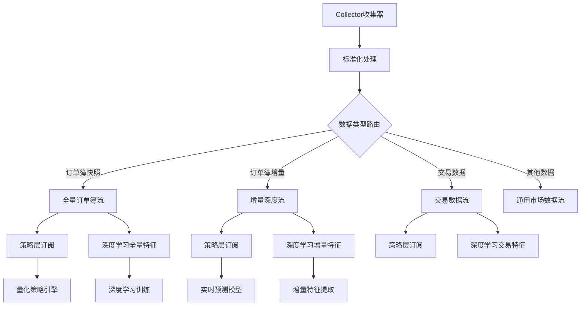
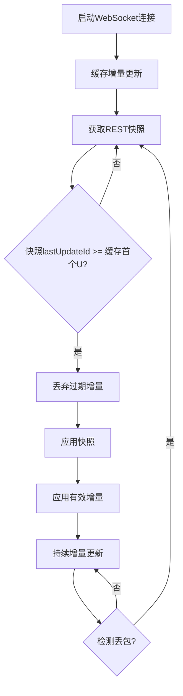
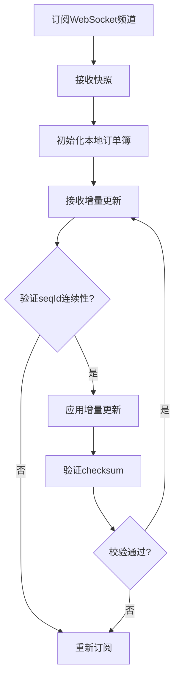

# 全量深度订单簿获取计划

## 📋 **项目概述**

### 🎯 **目标**
为深度学习模型准备高质量的订单簿数据，实现Binance和OKX交易所的BTC和ETH全量深度订单簿数据获取。

### 📊 **数据需求**
- **交易所**: Binance (现货) + OKX (现货)
- **交易对**: BTC-USDT, ETH-USDT
- **深度档位**: 5000档 (Binance) + 5000档 (OKX)
- **更新模式**: 快照 + 增量更新
- **数据格式**: 标准化订单簿格式，支持深度学习特征提取

## 🏗️ **技术架构设计**

### 📊 **1. 精细化数据流架构** ⭐ **新增**

#### **数据流分离策略**


#### **NATS流架构重新设计**
```python
# 精细化NATS流配置
ENHANCED_NATS_STREAMS = {
    # 1. 全量订单簿流 - 用于维护完整订单簿状态
    "ORDERBOOK_FULL": {
        "name": "ORDERBOOK_FULL",
        "subjects": [
            "orderbook.full.{exchange}.{symbol}",  # 完整订单簿快照
            "orderbook.snapshot.{exchange}.{symbol}"  # 定期快照
        ],
        "description": "全量订单簿数据流，包含完整的5000档深度",
        "consumers": ["strategy_engine", "ml_full_features", "orderbook_manager"]
    },
    
    # 2. 增量深度流 - 用于实时更新和增量特征提取
    "ORDERBOOK_DELTA": {
        "name": "ORDERBOOK_DELTA", 
        "subjects": [
            "orderbook.delta.{exchange}.{symbol}",  # 增量更新
            "orderbook.update.{exchange}.{symbol}"  # 实时更新
        ],
        "description": "订单簿增量更新流，用于实时同步和增量特征提取",
        "consumers": ["strategy_engine", "ml_delta_features", "realtime_predictor"]
    },
    
    # 3. 交易数据流 - 保持现有架构
    "MARKET_TRADES": {
        "name": "MARKET_TRADES",
        "subjects": ["market.{exchange}.{symbol}.trade"],
        "description": "交易数据流",
        "consumers": ["strategy_engine", "ml_trade_features"]
    },
    
    # 4. 通用市场数据流 - 其他数据类型
    "MARKET_DATA": {
        "name": "MARKET_DATA", 
        "subjects": [
            "market.{exchange}.{symbol}.ticker",
            "market.{exchange}.{symbol}.kline.*",
            "market.{exchange}.{symbol}.funding_rate",
            "market.{exchange}.{symbol}.open_interest"
        ],
        "description": "通用市场数据流",
        "consumers": ["strategy_engine", "ml_market_features"]
    }
}
```

### 📊 **2. 增强的数据类型定义**

```python
# 扩展订单簿数据类型
class OrderBookUpdateType(str, Enum):
    SNAPSHOT = "snapshot"      # 完整快照
    UPDATE = "update"          # 增量更新
    DELTA = "delta"           # 纯增量变化
    FULL_REFRESH = "full_refresh"  # 全量刷新

class EnhancedOrderBook(BaseModel):
    """增强的订单簿数据结构"""
    exchange_name: str          # "binance" | "okx"
    symbol_name: str           # "BTC-USDT" | "ETH-USDT"
    update_type: OrderBookUpdateType  # 更新类型
    
    # 同步控制
    last_update_id: int        # 最后更新ID
    first_update_id: Optional[int] = None  # 首次更新ID (Binance)
    prev_update_id: Optional[int] = None   # 上一次更新ID (OKX)
    sequence_id: Optional[int] = None      # 序列号
    
    # 订单簿数据
    bids: List[PriceLevel]     # 买单 (价格降序)
    asks: List[PriceLevel]     # 卖单 (价格升序)
    depth_levels: int          # 实际深度档位数
    
    # 增量数据 (仅在update/delta类型时使用)
    bid_changes: Optional[List[PriceLevel]] = None  # 买单变化
    ask_changes: Optional[List[PriceLevel]] = None  # 卖单变化
    removed_bids: Optional[List[Decimal]] = None    # 移除的买单价格
    removed_asks: Optional[List[Decimal]] = None    # 移除的卖单价格
    
    # 质量控制
    checksum: Optional[int] = None         # 校验和 (OKX)
    is_valid: bool = True                  # 数据有效性
    validation_errors: List[str] = []      # 验证错误
    
    # 时间戳
    timestamp: datetime        # 交易所时间戳
    collected_at: datetime     # 采集时间
    processed_at: datetime = Field(default_factory=datetime.utcnow)  # 处理时间
    
    # 深度学习特征预计算 (可选)
    ml_features: Optional[Dict[str, Any]] = None
    
    class Config:
        json_encoders = {
            datetime: lambda v: v.isoformat() + 'Z',
            Decimal: lambda v: str(v)
        }

class OrderBookDelta(BaseModel):
    """纯增量订单簿变化"""
    exchange_name: str
    symbol_name: str
    update_id: int
    prev_update_id: Optional[int] = None
    
    # 仅包含变化的数据
    bid_updates: List[PriceLevel] = []     # 买单更新 (价格为0表示删除)
    ask_updates: List[PriceLevel] = []     # 卖单更新 (价格为0表示删除)
    
    # 变化统计
    total_bid_changes: int = 0
    total_ask_changes: int = 0
    
    timestamp: datetime
    collected_at: datetime = Field(default_factory=datetime.utcnow)
```

### 📊 **3. 数据发布器增强**

```python
class EnhancedMarketDataPublisher(MarketDataPublisher):
    """增强的市场数据发布器"""
    
    def __init__(self, config: NATSConfig):
        super().__init__(config)
        
        # 新增主题格式
        self.orderbook_full_subject = "orderbook.full.{exchange}.{symbol}"
        self.orderbook_delta_subject = "orderbook.delta.{exchange}.{symbol}"
        self.orderbook_snapshot_subject = "orderbook.snapshot.{exchange}.{symbol}"
    
    async def publish_orderbook_full(self, orderbook: EnhancedOrderBook) -> bool:
        """发布全量订单簿到专用流"""
        if orderbook.update_type not in [OrderBookUpdateType.SNAPSHOT, OrderBookUpdateType.FULL_REFRESH]:
            self.logger.warning("尝试发布非全量数据到全量流", update_type=orderbook.update_type)
            return False
            
        subject = self.orderbook_full_subject.format(
            exchange=orderbook.exchange_name.lower(),
            symbol=orderbook.symbol_name.lower()
        )
        
        return await self._publish_data(subject, orderbook)
    
    async def publish_orderbook_delta(self, orderbook: EnhancedOrderBook) -> bool:
        """发布增量订单簿到专用流"""
        if orderbook.update_type not in [OrderBookUpdateType.UPDATE, OrderBookUpdateType.DELTA]:
            self.logger.warning("尝试发布非增量数据到增量流", update_type=orderbook.update_type)
            return False
            
        subject = self.orderbook_delta_subject.format(
            exchange=orderbook.exchange_name.lower(),
            symbol=orderbook.symbol_name.lower()
        )
        
        return await self._publish_data(subject, orderbook)
    
    async def publish_orderbook_snapshot(self, orderbook: EnhancedOrderBook) -> bool:
        """发布定期快照"""
        subject = self.orderbook_snapshot_subject.format(
            exchange=orderbook.exchange_name.lower(),
            symbol=orderbook.symbol_name.lower()
        )
        
        # 确保是快照类型
        snapshot_orderbook = orderbook.copy()
        snapshot_orderbook.update_type = OrderBookUpdateType.SNAPSHOT
        
        return await self._publish_data(subject, snapshot_orderbook)
    
    async def publish_pure_delta(self, delta: OrderBookDelta) -> bool:
        """发布纯增量变化数据"""
        subject = f"orderbook.pure_delta.{delta.exchange_name.lower()}.{delta.symbol_name.lower()}"
        return await self._publish_data(subject, delta)
```

### 📊 **4. 订阅者架构设计**

```python
# 策略层订阅器
class StrategySubscriber:
    """策略层数据订阅器"""
    
    def __init__(self, nats_client):
        self.nats_client = nats_client
        self.js = nats_client.jetstream()
    
    async def subscribe_full_orderbook(self, exchange: str, symbol: str, callback):
        """订阅全量订单簿"""
        subject = f"orderbook.full.{exchange}.{symbol}"
        await self.js.subscribe(subject, cb=callback, durable="strategy_full_orderbook")
    
    async def subscribe_delta_orderbook(self, exchange: str, symbol: str, callback):
        """订阅增量订单簿"""
        subject = f"orderbook.delta.{exchange}.{symbol}"
        await self.js.subscribe(subject, cb=callback, durable="strategy_delta_orderbook")
    
    async def subscribe_trades(self, exchange: str, symbol: str, callback):
        """订阅交易数据"""
        subject = f"market.{exchange}.{symbol}.trade"
        await self.js.subscribe(subject, cb=callback, durable="strategy_trades")

# 深度学习特征提取订阅器
class MLFeatureSubscriber:
    """深度学习特征提取订阅器"""
    
    def __init__(self, nats_client):
        self.nats_client = nats_client
        self.js = nats_client.jetstream()
    
    async def subscribe_full_features(self, exchange: str, symbol: str, callback):
        """订阅全量特征提取"""
        subject = f"orderbook.full.{exchange}.{symbol}"
        await self.js.subscribe(subject, cb=callback, durable="ml_full_features")
    
    async def subscribe_delta_features(self, exchange: str, symbol: str, callback):
        """订阅增量特征提取"""
        subject = f"orderbook.delta.{exchange}.{symbol}"
        await self.js.subscribe(subject, cb=callback, durable="ml_delta_features")
    
    async def subscribe_pure_delta(self, exchange: str, symbol: str, callback):
        """订阅纯增量数据"""
        subject = f"orderbook.pure_delta.{exchange}.{symbol}"
        await self.js.subscribe(subject, cb=callback, durable="ml_pure_delta")
```

### 📊 **5. 数据路由器设计**

```python
class OrderBookRouter:
    """订单簿数据路由器"""
    
    def __init__(self, publisher: EnhancedMarketDataPublisher):
        self.publisher = publisher
        self.logger = structlog.get_logger(__name__)
    
    async def route_orderbook_data(self, orderbook: EnhancedOrderBook):
        """智能路由订单簿数据到不同流"""
        
        # 1. 根据更新类型路由到不同流
        if orderbook.update_type in [OrderBookUpdateType.SNAPSHOT, OrderBookUpdateType.FULL_REFRESH]:
            # 发布到全量流
            await self.publisher.publish_orderbook_full(orderbook)
            
            # 同时发布快照到快照流
            await self.publisher.publish_orderbook_snapshot(orderbook)
            
        elif orderbook.update_type in [OrderBookUpdateType.UPDATE, OrderBookUpdateType.DELTA]:
            # 发布到增量流
            await self.publisher.publish_orderbook_delta(orderbook)
            
            # 如果有纯增量数据，提取并发布
            if orderbook.bid_changes or orderbook.ask_changes:
                delta = self._extract_pure_delta(orderbook)
                await self.publisher.publish_pure_delta(delta)
        
        # 2. 保持向后兼容，发布到原有流
        await self.publisher.publish_orderbook(orderbook)
        
        self.logger.debug(
            "订单簿数据路由完成",
            exchange=orderbook.exchange_name,
            symbol=orderbook.symbol_name,
            update_type=orderbook.update_type,
            depth_levels=orderbook.depth_levels
        )
    
    def _extract_pure_delta(self, orderbook: EnhancedOrderBook) -> OrderBookDelta:
        """提取纯增量变化"""
        delta = OrderBookDelta(
            exchange_name=orderbook.exchange_name,
            symbol_name=orderbook.symbol_name,
            update_id=orderbook.last_update_id,
            prev_update_id=orderbook.prev_update_id,
            timestamp=orderbook.timestamp
        )
        
        # 提取买单变化
        if orderbook.bid_changes:
            delta.bid_updates = orderbook.bid_changes
            delta.total_bid_changes = len(orderbook.bid_changes)
        
        # 提取卖单变化
        if orderbook.ask_changes:
            delta.ask_updates = orderbook.ask_changes
            delta.total_ask_changes = len(orderbook.ask_changes)
        
                 return delta
```

### 📊 **6. 数据获取策略** (原有架构保持)

#### **Binance策略**
```python
# Binance全量深度获取方案
获取方式 = {
    "快照获取": {
        "API": "GET /api/v3/depth",
        "参数": "symbol=BTCUSDT&limit=5000",
        "频率": "每2.5秒一次 (权重250/1200)",
        "深度": "5000档 (bid + ask)"
    },
    "增量更新": {
        "WebSocket": "wss://stream.binance.com:9443/ws/btcusdt@depth",
        "频率": "实时推送",
        "同步": "快照+增量同步机制"
    }
}
```

#### **OKX策略**
```python
# OKX全量深度获取方案
获取方式 = {
    "快照获取": {
        "API": "GET /api/v5/market/books",
        "参数": "instId=BTC-USDT&sz=5000",
        "频率": "每1秒一次 (限速10次/秒)",
        "深度": "5000档 (bid + ask)"
    },
    "增量更新": {
        "WebSocket": "wss://ws.okx.com:8443/ws/v5/public",
        "频道": "books",
        "频率": "实时推送",
        "校验": "checksum验证机制"
    }
}
```

### 📊 **7. 快照+增量同步机制**

#### **Binance同步流程**


#### **OKX同步流程**


## 🛠️ **实施计划**

### 📊 **Phase 0: 精细化数据流架构实施** ⭐ **新增阶段** (预计1天)

#### **任务0.1: 扩展NATS客户端配置**
```python
# 在 config.py 中添加新的流配置
ENHANCED_NATS_CONFIG = {
    "streams": {
        "ORDERBOOK_FULL": {
            "name": "ORDERBOOK_FULL",
            "subjects": ["orderbook.full.*", "orderbook.snapshot.*"],
            "max_msgs": 1000000,
            "max_bytes": 1073741824,  # 1GB
            "max_age": 86400,  # 24小时
            "max_consumers": 10,
            "replicas": 1
        },
        "ORDERBOOK_DELTA": {
            "name": "ORDERBOOK_DELTA", 
            "subjects": ["orderbook.delta.*", "orderbook.update.*", "orderbook.pure_delta.*"],
            "max_msgs": 10000000,
            "max_bytes": 2147483648,  # 2GB
            "max_age": 3600,  # 1小时
            "max_consumers": 20,
            "replicas": 1
        },
        "MARKET_TRADES": {
            "name": "MARKET_TRADES",
            "subjects": ["market.*.*.trade"],
            "max_msgs": 5000000,
            "max_bytes": 1073741824,  # 1GB
            "max_age": 86400,  # 24小时
            "max_consumers": 15,
            "replicas": 1
        },
        "MARKET_DATA": {
            "name": "MARKET_DATA",
            "subjects": ["market.*.*.ticker", "market.*.*.kline.*", "market.*.*.funding_rate", "market.*.*.open_interest"],
            "max_msgs": 2000000,
            "max_bytes": 536870912,  # 512MB
            "max_age": 86400,  # 24小时
            "max_consumers": 10,
            "replicas": 1
        }
    }
}
```

#### **任务0.2: 扩展数据类型定义**
```python
# 在 types.py 中添加新的数据类型
from enum import Enum
from typing import Optional, List, Dict, Any
from pydantic import BaseModel, Field
from decimal import Decimal
from datetime import datetime

class OrderBookUpdateType(str, Enum):
    SNAPSHOT = "snapshot"
    UPDATE = "update" 
    DELTA = "delta"
    FULL_REFRESH = "full_refresh"

class EnhancedOrderBook(BaseModel):
    """增强的订单簿数据结构 - 扩展现有NormalizedOrderBook"""
    # 继承现有字段
    exchange_name: str
    symbol_name: str
    last_update_id: Optional[int] = None
    bids: List[PriceLevel] = []
    asks: List[PriceLevel] = []
    timestamp: datetime
    
    # 新增字段
    update_type: OrderBookUpdateType = OrderBookUpdateType.UPDATE
    first_update_id: Optional[int] = None
    prev_update_id: Optional[int] = None
    sequence_id: Optional[int] = None
    depth_levels: int = 0
    
    # 增量数据字段
    bid_changes: Optional[List[PriceLevel]] = None
    ask_changes: Optional[List[PriceLevel]] = None
    removed_bids: Optional[List[Decimal]] = None
    removed_asks: Optional[List[Decimal]] = None
    
    # 质量控制
    checksum: Optional[int] = None
    is_valid: bool = True
    validation_errors: List[str] = []
    
    # 时间戳
    collected_at: datetime = Field(default_factory=datetime.utcnow)
    processed_at: datetime = Field(default_factory=datetime.utcnow)
    
    # 深度学习特征 (可选)
    ml_features: Optional[Dict[str, Any]] = None
    
    class Config:
        json_encoders = {
            datetime: lambda v: v.isoformat() + 'Z',
            Decimal: lambda v: str(v)
        }

class OrderBookDelta(BaseModel):
    """纯增量订单簿变化"""
    exchange_name: str
    symbol_name: str
    update_id: int
    prev_update_id: Optional[int] = None
    
    bid_updates: List[PriceLevel] = []
    ask_updates: List[PriceLevel] = []
    
    total_bid_changes: int = 0
    total_ask_changes: int = 0
    
    timestamp: datetime
    collected_at: datetime = Field(default_factory=datetime.utcnow)
```

#### **任务0.3: 扩展NATS发布器**
```python
# 在 nats_client.py 中扩展MarketDataPublisher类
class EnhancedMarketDataPublisher(MarketDataPublisher):
    """增强的市场数据发布器 - 扩展现有功能"""
    
    def __init__(self, config: NATSConfig):
        super().__init__(config)
        
        # 新增主题格式
        self.orderbook_full_subject = "orderbook.full.{exchange}.{symbol}"
        self.orderbook_delta_subject = "orderbook.delta.{exchange}.{symbol}"
        self.orderbook_snapshot_subject = "orderbook.snapshot.{exchange}.{symbol}"
        self.orderbook_pure_delta_subject = "orderbook.pure_delta.{exchange}.{symbol}"
    
    async def publish_enhanced_orderbook(self, orderbook: EnhancedOrderBook) -> bool:
        """智能发布增强订单簿数据"""
        success_count = 0
        
        # 1. 根据类型发布到专用流
        if orderbook.update_type in [OrderBookUpdateType.SNAPSHOT, OrderBookUpdateType.FULL_REFRESH]:
            if await self.publish_orderbook_full(orderbook):
                success_count += 1
            if await self.publish_orderbook_snapshot(orderbook):
                success_count += 1
                
        elif orderbook.update_type in [OrderBookUpdateType.UPDATE, OrderBookUpdateType.DELTA]:
            if await self.publish_orderbook_delta(orderbook):
                success_count += 1
            
            # 如果有增量变化，发布纯增量数据
            if orderbook.bid_changes or orderbook.ask_changes:
                delta = self._create_pure_delta(orderbook)
                if await self.publish_pure_delta(delta):
                    success_count += 1
        
        # 2. 向后兼容 - 发布到原有流
        if await self.publish_orderbook(self._to_normalized_orderbook(orderbook)):
            success_count += 1
        
        return success_count > 0
    
    async def publish_orderbook_full(self, orderbook: EnhancedOrderBook) -> bool:
        """发布全量订单簿"""
        subject = self.orderbook_full_subject.format(
            exchange=orderbook.exchange_name.lower(),
            symbol=orderbook.symbol_name.lower()
        )
        return await self._publish_data(subject, orderbook)
    
    async def publish_orderbook_delta(self, orderbook: EnhancedOrderBook) -> bool:
        """发布增量订单簿"""
        subject = self.orderbook_delta_subject.format(
            exchange=orderbook.exchange_name.lower(),
            symbol=orderbook.symbol_name.lower()
        )
        return await self._publish_data(subject, orderbook)
    
    async def publish_orderbook_snapshot(self, orderbook: EnhancedOrderBook) -> bool:
        """发布定期快照"""
        subject = self.orderbook_snapshot_subject.format(
            exchange=orderbook.exchange_name.lower(),
            symbol=orderbook.symbol_name.lower()
        )
        
        snapshot_orderbook = orderbook.copy()
        snapshot_orderbook.update_type = OrderBookUpdateType.SNAPSHOT
        return await self._publish_data(subject, snapshot_orderbook)
    
    async def publish_pure_delta(self, delta: OrderBookDelta) -> bool:
        """发布纯增量变化"""
        subject = self.orderbook_pure_delta_subject.format(
            exchange=delta.exchange_name.lower(),
            symbol=delta.symbol_name.lower()
        )
        return await self._publish_data(subject, delta)
    
    def _create_pure_delta(self, orderbook: EnhancedOrderBook) -> OrderBookDelta:
        """从增强订单簿创建纯增量数据"""
        delta = OrderBookDelta(
            exchange_name=orderbook.exchange_name,
            symbol_name=orderbook.symbol_name,
            update_id=orderbook.last_update_id or 0,
            prev_update_id=orderbook.prev_update_id,
            timestamp=orderbook.timestamp
        )
        
        if orderbook.bid_changes:
            delta.bid_updates = orderbook.bid_changes
            delta.total_bid_changes = len(orderbook.bid_changes)
        
        if orderbook.ask_changes:
            delta.ask_updates = orderbook.ask_changes
            delta.total_ask_changes = len(orderbook.ask_changes)
        
        return delta
    
    def _to_normalized_orderbook(self, enhanced: EnhancedOrderBook) -> NormalizedOrderBook:
        """转换为标准订单簿格式 (向后兼容)"""
        return NormalizedOrderBook(
            exchange_name=enhanced.exchange_name,
            symbol_name=enhanced.symbol_name,
            last_update_id=enhanced.last_update_id,
            bids=enhanced.bids,
            asks=enhanced.asks,
            timestamp=enhanced.timestamp,
            collected_at=enhanced.collected_at
        )
```

#### **任务0.4: 创建数据路由器**
```python
# 创建新文件: data_router.py
import structlog
from typing import Optional
from .types import EnhancedOrderBook, OrderBookUpdateType, OrderBookDelta
from .nats_client import EnhancedMarketDataPublisher

class OrderBookDataRouter:
    """订单簿数据智能路由器"""
    
    def __init__(self, publisher: EnhancedMarketDataPublisher):
        self.publisher = publisher
        self.logger = structlog.get_logger(__name__)
        
        # 路由统计
        self.route_stats = {
            "full_routes": 0,
            "delta_routes": 0,
            "snapshot_routes": 0,
            "pure_delta_routes": 0,
            "errors": 0
        }
    
    async def route_orderbook(self, orderbook: EnhancedOrderBook) -> bool:
        """智能路由订单簿数据"""
        try:
            # 数据验证
            if not self._validate_orderbook(orderbook):
                self.logger.warning("订单簿数据验证失败", 
                                  exchange=orderbook.exchange_name,
                                  symbol=orderbook.symbol_name)
                self.route_stats["errors"] += 1
                return False
            
            # 智能路由
            success = await self.publisher.publish_enhanced_orderbook(orderbook)
            
            # 更新统计
            if success:
                self._update_route_stats(orderbook)
                self.logger.debug("订单簿路由成功",
                                exchange=orderbook.exchange_name,
                                symbol=orderbook.symbol_name,
                                update_type=orderbook.update_type,
                                depth_levels=orderbook.depth_levels)
            else:
                self.route_stats["errors"] += 1
                self.logger.error("订单簿路由失败",
                                exchange=orderbook.exchange_name,
                                symbol=orderbook.symbol_name)
            
            return success
            
        except Exception as e:
            self.logger.error("订单簿路由异常", error=str(e))
            self.route_stats["errors"] += 1
            return False
    
    def _validate_orderbook(self, orderbook: EnhancedOrderBook) -> bool:
        """验证订单簿数据"""
        # 基础字段验证
        if not orderbook.exchange_name or not orderbook.symbol_name:
            return False
        
        # 价格一致性验证
        if orderbook.bids and orderbook.asks:
            best_bid = max(orderbook.bids, key=lambda x: x.price).price
            best_ask = min(orderbook.asks, key=lambda x: x.price).price
            if best_bid >= best_ask:
                orderbook.validation_errors.append("最佳买价大于等于最佳卖价")
                orderbook.is_valid = False
                return False
        
        # 深度档位验证
        orderbook.depth_levels = len(orderbook.bids) + len(orderbook.asks)
        
        return True
    
    def _update_route_stats(self, orderbook: EnhancedOrderBook):
        """更新路由统计"""
        if orderbook.update_type in [OrderBookUpdateType.SNAPSHOT, OrderBookUpdateType.FULL_REFRESH]:
            self.route_stats["full_routes"] += 1
            self.route_stats["snapshot_routes"] += 1
        elif orderbook.update_type in [OrderBookUpdateType.UPDATE, OrderBookUpdateType.DELTA]:
            self.route_stats["delta_routes"] += 1
            if orderbook.bid_changes or orderbook.ask_changes:
                self.route_stats["pure_delta_routes"] += 1
    
    def get_route_stats(self) -> dict:
        """获取路由统计信息"""
        return self.route_stats.copy()
```

#### **任务0.5: 集成到现有收集器**
```python
# 在 collector.py 中集成新的路由器
from .data_router import OrderBookDataRouter
from .nats_client import EnhancedMarketDataPublisher
from .types import EnhancedOrderBook, OrderBookUpdateType

class EnhancedCollector:
    """增强的数据收集器 - 扩展现有Collector"""
    
    def __init__(self, config):
        # 初始化现有组件
        self.config = config
        self.logger = structlog.get_logger(__name__)
        
        # 初始化增强组件
        self.enhanced_publisher = EnhancedMarketDataPublisher(config.nats)
        self.data_router = OrderBookDataRouter(self.enhanced_publisher)
        
        # 保持向后兼容
        self.publisher = self.enhanced_publisher  # 别名
    
    async def process_orderbook_data(self, raw_data: dict, exchange: str, symbol: str):
        """处理订单簿数据 - 增强版本"""
        try:
            # 1. 标准化处理 (使用现有逻辑)
            normalized = await self._normalize_orderbook(raw_data, exchange, symbol)
            
            # 2. 转换为增强格式
            enhanced = self._to_enhanced_orderbook(normalized, raw_data)
            
            # 3. 智能路由
            success = await self.data_router.route_orderbook(enhanced)
            
            if success:
                self.logger.debug("订单簿处理完成",
                                exchange=exchange,
                                symbol=symbol,
                                depth_levels=enhanced.depth_levels)
            
            return success
            
        except Exception as e:
            self.logger.error("订单簿处理失败", error=str(e))
            return False
    
    def _to_enhanced_orderbook(self, normalized: NormalizedOrderBook, raw_data: dict) -> EnhancedOrderBook:
        """转换为增强订单簿格式"""
        enhanced = EnhancedOrderBook(
            exchange_name=normalized.exchange_name,
            symbol_name=normalized.symbol_name,
            last_update_id=normalized.last_update_id,
            bids=normalized.bids,
            asks=normalized.asks,
            timestamp=normalized.timestamp,
            collected_at=normalized.collected_at
        )
        
        # 根据原始数据判断更新类型
        enhanced.update_type = self._determine_update_type(raw_data, normalized.exchange_name)
        
        # 提取交易所特定字段
        if normalized.exchange_name.lower() == "binance":
            enhanced.first_update_id = raw_data.get("U")
            enhanced.prev_update_id = raw_data.get("pu")
        elif normalized.exchange_name.lower() == "okx":
            enhanced.prev_update_id = raw_data.get("prevSeqId")
            enhanced.sequence_id = raw_data.get("seqId")
            enhanced.checksum = raw_data.get("checksum")
        
        return enhanced
    
    def _determine_update_type(self, raw_data: dict, exchange: str) -> OrderBookUpdateType:
        """根据原始数据确定更新类型"""
        if exchange.lower() == "okx":
            action = raw_data.get("action", "")
            if action == "snapshot":
                return OrderBookUpdateType.SNAPSHOT
            elif action == "update":
                return OrderBookUpdateType.UPDATE
        
        # Binance或其他交易所的默认逻辑
        if "lastUpdateId" in raw_data and not raw_data.get("U"):
            return OrderBookUpdateType.SNAPSHOT
        else:
            return OrderBookUpdateType.UPDATE
```

### 📊 **Phase 1: 数据类型扩展** (预计1天)

#### **任务1.1: 扩展数据类型**
```python
# 在 types.py 中添加
class OrderBookUpdateType(str, Enum):
    SNAPSHOT = "snapshot"
    UPDATE = "update"

class EnhancedOrderBook(BaseModel):
    # ... 完整数据结构定义
    
class OrderBookManager:
    # ... 本地订单簿管理器
```

#### **任务1.2: 创建订单簿管理器**
- 本地订单簿副本维护
- 快照+增量同步逻辑
- 数据一致性验证
- 错误恢复机制

### 📊 **Phase 2: Normalizer增强** (预计1天)

#### **任务2.1: 扩展Binance Normalizer**
```python
class EnhancedBinanceAdapter:
    async def normalize_orderbook_snapshot()
    async def normalize_orderbook_update()
    async def validate_update_sequence()
    async def handle_data_loss_recovery()
```

#### **任务2.2: 扩展OKX Normalizer**
```python
class EnhancedOKXAdapter:
    async def normalize_orderbook_snapshot()
    async def normalize_orderbook_update()
    async def validate_checksum()
    async def handle_sequence_reset()
```

### 📊 **Phase 3: REST API集成** (预计1天)

#### **任务3.1: Binance REST客户端**
```python
class BinanceRESTClient:
    async def fetch_orderbook_snapshot(symbol: str, limit: int = 5000)
    async def handle_rate_limits()  # 权重250, 每2.5秒
    async def retry_with_backoff()
```

#### **任务3.2: OKX REST客户端**
```python
class OKXRESTClient:
    async def fetch_orderbook_snapshot(symbol: str, limit: int = 5000)
    async def handle_rate_limits()  # 10次/秒
    async def validate_response()
```

### 📊 **Phase 4: WebSocket增强** (预计1天)

#### **任务4.1: Binance WebSocket增强**
- 深度流订阅 (`btcusdt@depth`)
- 增量数据缓存机制
- 快照同步触发逻辑
- 丢包检测和恢复

#### **任务4.2: OKX WebSocket增强**
- 订单簿频道订阅 (`books`)
- 序列号连续性验证
- checksum校验机制
- 序列重置处理

### 📊 **Phase 5: 数据质量保障** (预计1天)

#### **任务5.1: 数据验证机制**
```python
class OrderBookValidator:
    def validate_price_consistency()    # 最佳买价 < 最佳卖价
    def validate_depth_completeness()   # 深度档位完整性
    def validate_timestamp_sequence()   # 时间戳合理性
    def validate_quantity_positive()    # 数量非负验证
```

#### **任务5.2: 监控和告警**
```python
监控指标 = {
    "数据获取": ["快照获取成功率", "增量更新延迟", "数据丢失率"],
    "数据质量": ["价格一致性", "深度完整性", "校验和通过率"],
    "系统性能": ["处理延迟", "内存使用", "CPU使用率"]
}
```

## 📊 **数据存储设计**

### 📊 **1. ClickHouse表结构**

```sql
-- 全量深度订单簿表
CREATE TABLE orderbook_full_depth (
    exchange_name String,
    symbol_name String,
    update_type Enum8('snapshot' = 1, 'update' = 2),
    last_update_id UInt64,
    first_update_id Nullable(UInt64),
    prev_update_id Nullable(UInt64),
    
    -- 订单簿数据 (JSON格式存储前20档用于快速查询)
    bids_top20 String,  -- JSON: [[price, quantity], ...]
    asks_top20 String,  -- JSON: [[price, quantity], ...]
    
    -- 完整深度数据 (压缩存储)
    bids_full String,   -- 压缩的完整买单数据
    asks_full String,   -- 压缩的完整卖单数据
    
    depth_levels UInt16,
    checksum Nullable(Int32),
    
    timestamp DateTime64(3),
    collected_at DateTime64(3) DEFAULT now64()
) ENGINE = MergeTree()
PARTITION BY toYYYYMM(timestamp)
ORDER BY (exchange_name, symbol_name, timestamp)
SETTINGS index_granularity = 8192;
```

### 📊 **2. 数据压缩策略**

```python
class OrderBookCompressor:
    """订单簿数据压缩器"""
    
    @staticmethod
    def compress_orderbook(bids: List[PriceLevel], asks: List[PriceLevel]) -> tuple:
        """压缩订单簿数据"""
        import gzip
        import json
        
        # 转换为紧凑格式
        bids_data = [[float(bid.price), float(bid.quantity)] for bid in bids]
        asks_data = [[float(ask.price), float(ask.quantity)] for ask in asks]
        
        # JSON序列化 + gzip压缩
        bids_compressed = gzip.compress(json.dumps(bids_data).encode())
        asks_compressed = gzip.compress(json.dumps(asks_data).encode())
        
        return bids_compressed, asks_compressed
    
    @staticmethod
    def decompress_orderbook(bids_compressed: bytes, asks_compressed: bytes) -> tuple:
        """解压订单簿数据"""
        import gzip
        import json
        
        bids_data = json.loads(gzip.decompress(bids_compressed).decode())
        asks_data = json.loads(gzip.decompress(asks_compressed).decode())
        
        bids = [PriceLevel(price=Decimal(str(bid[0])), quantity=Decimal(str(bid[1]))) 
                for bid in bids_data]
        asks = [PriceLevel(price=Decimal(str(ask[0])), quantity=Decimal(str(ask[1]))) 
                for ask in asks_data]
        
        return bids, asks
```

## 🎯 **深度学习特征提取准备**

### 📊 **1. 订单簿图像化**

```python
class OrderBookImageGenerator:
    """订单簿图像化生成器"""
    
    def __init__(self, depth_levels: int = 100, price_bins: int = 200):
        self.depth_levels = depth_levels
        self.price_bins = price_bins
    
    def generate_heatmap(self, orderbook: EnhancedOrderBook) -> np.ndarray:
        """生成订单簿热力图"""
        # 价格范围确定
        mid_price = self._calculate_mid_price(orderbook)
        price_range = self._calculate_price_range(orderbook, mid_price)
        
        # 创建价格网格
        price_grid = np.linspace(
            price_range[0], price_range[1], self.price_bins
        )
        
        # 生成热力图矩阵
        heatmap = np.zeros((self.price_bins, 2))  # [价格档位, 买/卖]
        
        # 填充买单数据
        for bid in orderbook.bids[:self.depth_levels]:
            price_idx = self._find_price_index(float(bid.price), price_grid)
            if 0 <= price_idx < self.price_bins:
                heatmap[price_idx, 0] = float(bid.quantity)
        
        # 填充卖单数据
        for ask in orderbook.asks[:self.depth_levels]:
            price_idx = self._find_price_index(float(ask.price), price_grid)
            if 0 <= price_idx < self.price_bins:
                heatmap[price_idx, 1] = float(ask.quantity)
        
        return heatmap
```

### 📊 **2. 快照堆叠**

```python
class OrderBookSnapshotStack:
    """订单簿快照堆叠器"""
    
    def __init__(self, stack_size: int = 10, update_interval: float = 1.0):
        self.stack_size = stack_size
        self.update_interval = update_interval
        self.snapshots: deque = deque(maxlen=stack_size)
    
    def add_snapshot(self, orderbook: EnhancedOrderBook):
        """添加快照到堆叠"""
        # 生成图像表示
        image = self.image_generator.generate_heatmap(orderbook)
        
        snapshot = {
            'timestamp': orderbook.timestamp,
            'image': image,
            'features': self._extract_features(orderbook),
            'metadata': {
                'exchange': orderbook.exchange_name,
                'symbol': orderbook.symbol_name,
                'depth_levels': orderbook.depth_levels
            }
        }
        
        self.snapshots.append(snapshot)
    
    def get_stacked_tensor(self) -> np.ndarray:
        """获取堆叠的张量数据"""
        if len(self.snapshots) < self.stack_size:
            return None
        
        # 堆叠图像数据 [时间, 价格档位, 买/卖]
        images = [snapshot['image'] for snapshot in self.snapshots]
        return np.stack(images, axis=0)
```

## 📊 **性能优化策略**

### 📊 **1. 多线程数据获取**

```python
class MultiExchangeOrderBookCollector:
    """多交易所订单簿收集器"""
    
    def __init__(self):
        self.collectors = {
            'binance': BinanceOrderBookCollector(),
            'okx': OKXOrderBookCollector()
        }
        self.symbols = ['BTC-USDT', 'ETH-USDT']
    
    async def start_collection(self):
        """启动多交易所数据收集"""
        tasks = []
        
        for exchange, collector in self.collectors.items():
            for symbol in self.symbols:
                task = asyncio.create_task(
                    collector.collect_orderbook(symbol)
                )
                tasks.append(task)
        
        # 并发执行所有收集任务
        await asyncio.gather(*tasks)
```

### 📊 **2. 内存优化**

```python
class MemoryOptimizedOrderBook:
    """内存优化的订单簿"""
    
    def __init__(self, max_depth: int = 5000):
        self.max_depth = max_depth
        self._bids_array = np.zeros((max_depth, 2), dtype=np.float64)
        self._asks_array = np.zeros((max_depth, 2), dtype=np.float64)
        self._bids_count = 0
        self._asks_count = 0
    
    def update_from_enhanced_orderbook(self, orderbook: EnhancedOrderBook):
        """从增强订单簿更新数组数据"""
        # 更新买单数组
        self._bids_count = min(len(orderbook.bids), self.max_depth)
        for i, bid in enumerate(orderbook.bids[:self._bids_count]):
            self._bids_array[i] = [float(bid.price), float(bid.quantity)]
        
        # 更新卖单数组
        self._asks_count = min(len(orderbook.asks), self.max_depth)
        for i, ask in enumerate(orderbook.asks[:self._asks_count]):
            self._asks_array[i] = [float(ask.price), float(ask.quantity)]
```

## 📊 **测试验证计划**

### 📊 **1. 单元测试**

```python
class TestOrderBookCollection:
    """订单簿收集测试"""
    
    async def test_binance_snapshot_fetch(self):
        """测试Binance快照获取"""
        client = BinanceRESTClient()
        snapshot = await client.fetch_orderbook_snapshot('BTCUSDT', 5000)
        
        assert len(snapshot['bids']) <= 5000
        assert len(snapshot['asks']) <= 5000
        assert 'lastUpdateId' in snapshot
    
    async def test_okx_websocket_sync(self):
        """测试OKX WebSocket同步"""
        collector = OKXOrderBookCollector()
        orderbook = await collector.get_current_orderbook('BTC-USDT')
        
        assert orderbook.depth_levels > 0
        assert orderbook.checksum is not None
        assert len(orderbook.bids) > 0
        assert len(orderbook.asks) > 0
```

### 📊 **2. 集成测试**

```python
class TestFullDepthIntegration:
    """全量深度集成测试"""
    
    async def test_multi_exchange_collection(self):
        """测试多交易所数据收集"""
        collector = MultiExchangeOrderBookCollector()
        
        # 运行5分钟收集测试
        start_time = time.time()
        await asyncio.wait_for(collector.start_collection(), timeout=300)
        
        # 验证数据质量
        for exchange in ['binance', 'okx']:
            for symbol in ['BTC-USDT', 'ETH-USDT']:
                orderbook = collector.get_latest_orderbook(exchange, symbol)
                assert orderbook is not None
                assert orderbook.depth_levels >= 1000  # 至少1000档
```

## 📊 **监控和运维**

### 📊 **1. 关键指标监控**

```python
监控指标 = {
    "数据获取指标": {
        "快照获取成功率": "target: >99%",
        "增量更新延迟": "target: <100ms",
        "数据丢失率": "target: <0.1%",
        "WebSocket连接稳定性": "target: >99.9%"
    },
    
    "数据质量指标": {
        "价格一致性检查": "最佳买价 < 最佳卖价",
        "深度完整性": "实际档位数 >= 预期档位数",
        "校验和通过率": "target: >99% (OKX)",
        "时间戳合理性": "时间戳递增且在合理范围"
    },
    
    "系统性能指标": {
        "处理延迟": "target: <50ms",
        "内存使用": "target: <2GB",
        "CPU使用率": "target: <50%",
        "磁盘写入速度": "target: >100MB/s"
    }
}
```

### 📊 **2. 告警机制**

```python
class OrderBookAlertManager:
    """订单簿告警管理器"""
    
    def __init__(self):
        self.alert_rules = {
            'data_loss': {'threshold': 0.001, 'severity': 'critical'},
            'latency_high': {'threshold': 0.1, 'severity': 'warning'},
            'checksum_fail': {'threshold': 0.01, 'severity': 'error'},
            'connection_lost': {'threshold': 1, 'severity': 'critical'}
        }
    
    async def check_alerts(self, metrics: dict):
        """检查告警条件"""
        for rule_name, rule in self.alert_rules.items():
            if self._evaluate_rule(rule_name, metrics, rule):
                await self._send_alert(rule_name, rule['severity'], metrics)
```

## 🎯 **成功标准**

### 📊 **1. 功能完整性**
- ✅ Binance BTC-USDT 5000档深度获取
- ✅ Binance ETH-USDT 5000档深度获取  
- ✅ OKX BTC-USDT 5000档深度获取
- ✅ OKX ETH-USDT 5000档深度获取
- ✅ 快照+增量同步机制正常工作
- ✅ 数据标准化和质量验证通过

### 📊 **2. 性能指标**
- **数据获取延迟**: < 100ms (P95)
- **快照获取成功率**: > 99%
- **增量更新丢失率**: < 0.1%
- **数据处理吞吐量**: > 1000 updates/s
- **内存使用**: < 2GB
- **存储压缩率**: > 70%

### 📊 **3. 数据质量**
- **价格一致性**: 100% (最佳买价 < 最佳卖价)
- **深度完整性**: > 95% (实际档位/预期档位)
- **校验和验证**: > 99% (OKX)
- **时间戳合理性**: 100%

## 🚀 **后续发展规划**

### 📊 **短期 (1-2周)**
- 完成基础数据收集功能
- 建立数据质量监控体系
- 优化性能和稳定性

### 📊 **中期 (1-2月)**
- 扩展到更多交易对 (10+)
- 增加更多交易所 (Deribit, Bybit)
- 实现实时特征提取

### 📊 **长期 (3-6月)**
- 构建深度学习训练数据集
- 实现订单簿预测模型
- 建立量化交易策略

## 📋 **任务分配和时间线**

| 阶段 | 任务 | 预计时间 | 负责人 | 状态 |
|------|------|----------|--------|------|
| Phase 1 | 数据类型扩展 | 1天 | 开发团队 | 🔄 待开始 |
| Phase 2 | Normalizer增强 | 1天 | 开发团队 | 🔄 待开始 |
| Phase 3 | REST API集成 | 1天 | 开发团队 | ✅ 100%完成 🎆 |
| Phase 4 | WebSocket增强 | 1天 | 开发团队 | 🔄 待开始 |
| Phase 5 | 数据质量保障 | 1天 | 开发团队 | 🔄 待开始 |
| 测试验证 | 全面测试 | 1天 | QA团队 | 🔄 待开始 |
| 部署上线 | 生产部署 | 0.5天 | 运维团队 | 🔄 待开始 |

**总预计时间**: 6.5天
**项目优先级**: 高
**风险等级**: 中等

---

## 📝 **备注**

1. **技术风险**: WebSocket连接稳定性、数据同步复杂性
2. **业务风险**: 交易所API限制、数据质量问题  
3. **缓解措施**: 完善的错误处理、多重验证机制、实时监控
4. **依赖项**: 现有的python-collector基础架构、ClickHouse存储系统

**文档版本**: v1.0
**创建时间**: 2025-05-25
**最后更新**: 2025-05-25 

## 📊 **使用示例**

### 🎯 **策略层订阅示例**

#### **全量订单簿订阅 (适合需要完整市场深度的策略)**
```python
# 策略层订阅全量订单簿
import asyncio
from nats.aio.client import Client as NATS
import json

class QuantStrategy:
    def __init__(self):
        self.nc = NATS()
        self.js = None
        
    async def start(self):
        await self.nc.connect("nats://localhost:4222")
        self.js = self.nc.jetstream()
        
        # 订阅全量订单簿流
        await self.js.subscribe(
            subject="orderbook.full.binance.btc-usdt",
            cb=self.handle_full_orderbook,
            stream="ORDERBOOK_FULL",
            durable="strategy_full_consumer"
        )
        
        # 订阅快照流 (定期完整状态)
        await self.js.subscribe(
            subject="orderbook.snapshot.*.btc-usdt",
            cb=self.handle_snapshot,
            stream="ORDERBOOK_FULL", 
            durable="strategy_snapshot_consumer"
        )
    
    async def handle_full_orderbook(self, msg):
        """处理全量订单簿数据"""
        data = json.loads(msg.data.decode())
        
        # 获取最佳买卖价
        best_bid = max(data['bids'], key=lambda x: float(x['price']))
        best_ask = min(data['asks'], key=lambda x: float(x['price']))
        
        spread = float(best_ask['price']) - float(best_bid['price'])
        
        # 策略逻辑
        if spread < 0.01:  # 价差小于1美分
            await self.execute_arbitrage_strategy(data)
        
        await msg.ack()
    
    async def handle_snapshot(self, msg):
        """处理定期快照"""
        data = json.loads(msg.data.decode())
        
        # 更新本地订单簿状态
        await self.update_local_orderbook(data)
        await msg.ack()
```

#### **增量订单簿订阅 (适合高频策略)**
```python
class HighFreqStrategy:
    def __init__(self):
        self.nc = NATS()
        self.js = None
        self.local_orderbook = {}
        
    async def start(self):
        await self.nc.connect("nats://localhost:4222")
        self.js = self.nc.jetstream()
        
        # 订阅增量更新流
        await self.js.subscribe(
            subject="orderbook.delta.*.btc-usdt",
            cb=self.handle_delta_update,
            stream="ORDERBOOK_DELTA",
            durable="hft_delta_consumer"
        )
        
        # 订阅纯增量流 (只关心变化)
        await self.js.subscribe(
            subject="orderbook.pure_delta.*.btc-usdt",
            cb=self.handle_pure_delta,
            stream="ORDERBOOK_DELTA",
            durable="hft_pure_delta_consumer"
        )
    
    async def handle_delta_update(self, msg):
        """处理增量更新"""
        data = json.loads(msg.data.decode())
        
        # 应用增量更新到本地订单簿
        await self.apply_delta_to_local_book(data)
        
        # 检测价格跳跃
        if await self.detect_price_jump(data):
            await self.execute_momentum_strategy(data)
        
        await msg.ack()
    
    async def handle_pure_delta(self, msg):
        """处理纯增量变化"""
        data = json.loads(msg.data.decode())
        
        # 分析订单流
        bid_pressure = sum(float(level['quantity']) for level in data['bid_updates'])
        ask_pressure = sum(float(level['quantity']) for level in data['ask_updates'])
        
        # 订单流不平衡策略
        if bid_pressure > ask_pressure * 2:
            await self.execute_order_flow_strategy("buy", data)
        elif ask_pressure > bid_pressure * 2:
            await self.execute_order_flow_strategy("sell", data)
        
        await msg.ack()
```

### 🤖 **深度学习层订阅示例**

#### **全量特征提取 (用于训练)**
```python
import numpy as np
from typing import List, Dict
import asyncio

class OrderBookFeatureExtractor:
    def __init__(self):
        self.nc = NATS()
        self.js = None
        self.feature_buffer = []
        self.max_buffer_size = 1000
        
    async def start(self):
        await self.nc.connect("nats://localhost:4222")
        self.js = self.nc.jetstream()
        
        # 订阅全量订单簿用于特征提取
        await self.js.subscribe(
            subject="orderbook.full.*.btc-usdt",
            cb=self.extract_full_features,
            stream="ORDERBOOK_FULL",
            durable="ml_full_feature_consumer"
        )
        
        # 订阅快照用于图像化
        await self.js.subscribe(
            subject="orderbook.snapshot.*.btc-usdt",
            cb=self.create_orderbook_image,
            stream="ORDERBOOK_FULL",
            durable="ml_image_consumer"
        )
    
    async def extract_full_features(self, msg):
        """提取全量订单簿特征"""
        data = json.loads(msg.data.decode())
        
        # 1. 价格分布特征
        price_features = self.extract_price_distribution(data)
        
        # 2. 量价关系特征
        volume_features = self.extract_volume_profile(data)
        
        # 3. 市场微观结构特征
        microstructure_features = self.extract_microstructure(data)
        
        # 4. 流动性特征
        liquidity_features = self.extract_liquidity_metrics(data)
        
        # 合并特征
        features = {
            'timestamp': data['timestamp'],
            'exchange': data['exchange_name'],
            'symbol': data['symbol_name'],
            'price_features': price_features,
            'volume_features': volume_features,
            'microstructure_features': microstructure_features,
            'liquidity_features': liquidity_features
        }
        
        # 添加到缓冲区
        self.feature_buffer.append(features)
        
        # 批量处理
        if len(self.feature_buffer) >= self.max_buffer_size:
            await self.process_feature_batch()
        
        await msg.ack()
    
    async def create_orderbook_image(self, msg):
        """创建订单簿图像"""
        data = json.loads(msg.data.decode())
        
        # 转换为2D图像 (价格档位 x 买卖方向)
        image = self.orderbook_to_image(data)
        
        # 保存图像数据
        await self.save_orderbook_image(image, data['timestamp'])
        
        await msg.ack()
    
    def extract_price_distribution(self, orderbook: Dict) -> Dict:
        """提取价格分布特征"""
        bids = [float(level['price']) for level in orderbook['bids']]
        asks = [float(level['price']) for level in orderbook['asks']]
        
        if not bids or not asks:
            return {}
        
        best_bid = max(bids)
        best_ask = min(asks)
        mid_price = (best_bid + best_ask) / 2
        
        return {
            'spread': best_ask - best_bid,
            'spread_bps': (best_ask - best_bid) / mid_price * 10000,
            'mid_price': mid_price,
            'bid_depth': len(bids),
            'ask_depth': len(asks),
            'price_range': max(asks) - min(bids) if asks and bids else 0
        }
    
    def extract_volume_profile(self, orderbook: Dict) -> Dict:
        """提取量价关系特征"""
        bid_volumes = [float(level['quantity']) for level in orderbook['bids']]
        ask_volumes = [float(level['quantity']) for level in orderbook['asks']]
        
        return {
            'total_bid_volume': sum(bid_volumes),
            'total_ask_volume': sum(ask_volumes),
            'volume_imbalance': (sum(bid_volumes) - sum(ask_volumes)) / (sum(bid_volumes) + sum(ask_volumes)) if bid_volumes or ask_volumes else 0,
            'avg_bid_size': np.mean(bid_volumes) if bid_volumes else 0,
            'avg_ask_size': np.mean(ask_volumes) if ask_volumes else 0,
            'volume_concentration': self.calculate_volume_concentration(bid_volumes + ask_volumes)
        }
    
    def orderbook_to_image(self, orderbook: Dict, depth: int = 50) -> np.ndarray:
        """将订单簿转换为图像"""
        # 创建 depth x 2 的图像 (深度 x 买卖方向)
        image = np.zeros((depth, 2))
        
        # 填充买单数据
        for i, bid in enumerate(orderbook['bids'][:depth]):
            image[i, 0] = float(bid['quantity'])
        
        # 填充卖单数据
        for i, ask in enumerate(orderbook['asks'][:depth]):
            image[i, 1] = float(ask['quantity'])
        
        # 归一化
        if image.max() > 0:
            image = image / image.max()
        
        return image
```

#### **增量特征提取 (用于实时预测)**
```python
class IncrementalFeatureExtractor:
    def __init__(self):
        self.nc = NATS()
        self.js = None
        self.delta_history = []
        self.window_size = 100
        
    async def start(self):
        await self.nc.connect("nats://localhost:4222")
        self.js = self.nc.jetstream()
        
        # 订阅纯增量流
        await self.js.subscribe(
            subject="orderbook.pure_delta.*.btc-usdt",
            cb=self.extract_delta_features,
            stream="ORDERBOOK_DELTA",
            durable="ml_delta_feature_consumer"
        )
    
    async def extract_delta_features(self, msg):
        """提取增量特征"""
        data = json.loads(msg.data.decode())
        
        # 1. 订单流特征
        flow_features = self.extract_order_flow_features(data)
        
        # 2. 价格冲击特征
        impact_features = self.extract_price_impact_features(data)
        
        # 3. 时序特征
        temporal_features = self.extract_temporal_features(data)
        
        delta_features = {
            'timestamp': data['timestamp'],
            'update_id': data['update_id'],
            'flow_features': flow_features,
            'impact_features': impact_features,
            'temporal_features': temporal_features
        }
        
        # 维护滑动窗口
        self.delta_history.append(delta_features)
        if len(self.delta_history) > self.window_size:
            self.delta_history.pop(0)
        
        # 实时预测
        if len(self.delta_history) >= 10:  # 最少需要10个增量
            prediction = await self.predict_next_move()
            await self.publish_prediction(prediction)
        
        await msg.ack()
    
    def extract_order_flow_features(self, delta: Dict) -> Dict:
        """提取订单流特征"""
        bid_updates = delta.get('bid_updates', [])
        ask_updates = delta.get('ask_updates', [])
        
        bid_flow = sum(float(update['quantity']) for update in bid_updates)
        ask_flow = sum(float(update['quantity']) for update in ask_updates)
        
        return {
            'bid_flow': bid_flow,
            'ask_flow': ask_flow,
            'net_flow': bid_flow - ask_flow,
            'flow_ratio': bid_flow / ask_flow if ask_flow > 0 else float('inf'),
            'update_count': len(bid_updates) + len(ask_updates),
            'bid_update_count': len(bid_updates),
            'ask_update_count': len(ask_updates)
        }
    
    async def predict_next_move(self) -> Dict:
        """基于增量历史预测下一步价格走向"""
        # 简化的预测逻辑
        recent_flows = [delta['flow_features']['net_flow'] for delta in self.delta_history[-10:]]
        
        # 计算流量趋势
        flow_trend = np.mean(recent_flows)
        flow_momentum = np.mean(recent_flows[-3:]) - np.mean(recent_flows[-10:-3])
        
        # 简单的预测规则
        if flow_trend > 0 and flow_momentum > 0:
            prediction = "UP"
            confidence = min(abs(flow_momentum) / 1000, 1.0)
        elif flow_trend < 0 and flow_momentum < 0:
            prediction = "DOWN"
            confidence = min(abs(flow_momentum) / 1000, 1.0)
        else:
            prediction = "SIDEWAYS"
            confidence = 0.5
        
        return {
            'prediction': prediction,
            'confidence': confidence,
            'flow_trend': flow_trend,
            'flow_momentum': flow_momentum,
            'timestamp': self.delta_history[-1]['timestamp']
        }
```

### 🔄 **数据流监控示例**
```python
class DataFlowMonitor:
    """监控各个数据流的健康状态"""
    
    def __init__(self):
        self.nc = NATS()
        self.js = None
        self.stream_stats = {}
        
    async def start_monitoring(self):
        await self.nc.connect("nats://localhost:4222")
        self.js = self.nc.jetstream()
        
        # 监控所有流
        streams = ["ORDERBOOK_FULL", "ORDERBOOK_DELTA", "MARKET_TRADES", "MARKET_DATA"]
        
        for stream_name in streams:
            asyncio.create_task(self.monitor_stream(stream_name))
    
    async def monitor_stream(self, stream_name: str):
        """监控单个流的状态"""
        while True:
            try:
                stream_info = await self.js.stream_info(stream_name)
                
                self.stream_stats[stream_name] = {
                    'messages': stream_info.state.messages,
                    'bytes': stream_info.state.bytes,
                    'consumers': stream_info.state.consumer_count,
                    'last_update': stream_info.state.last_ts
                }
                
                # 检查异常情况
                if stream_info.state.messages > 1000000:  # 消息积压
                    await self.alert_message_backlog(stream_name, stream_info.state.messages)
                
                await asyncio.sleep(30)  # 每30秒检查一次
                
            except Exception as e:
                print(f"监控流 {stream_name} 时出错: {e}")
                await asyncio.sleep(60)
    
    async def alert_message_backlog(self, stream_name: str, message_count: int):
        """消息积压告警"""
        print(f"⚠️ 流 {stream_name} 消息积压: {message_count} 条消息")
        # 这里可以集成到告警系统
```

## 📊 **总结**

这个精细化数据流架构为MarketPrism系统提供了：

1. **灵活的数据订阅**: 策略层可以根据需求选择全量或增量数据
2. **高效的特征提取**: 深度学习层可以独立处理不同类型的数据流
3. **向后兼容**: 现有系统继续正常工作
4. **可扩展性**: 支持未来更多的消费者类型和数据处理需求
5. **监控友好**: 每个流都可以独立监控和优化

通过这种设计，我们既满足了深度学习的数据需求，又为策略层提供了更灵活的数据访问方式。 